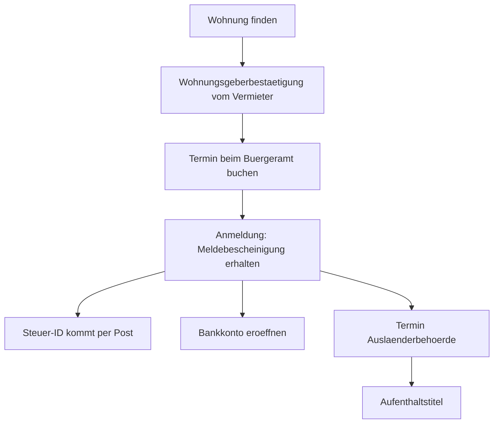

# Alltag · Anmeldung & Ausländerbehörde

> **Level:** B2 · **Focus:** booking a Termin, the registration appointment, asking again when you don't understand · **Time:** ~1.5 h
> _After this module you can get through a German government office in German — including the part where you don't understand and have to say so._

Two offices decide whether your life in Germany works: the **Bürgeramt** (where you register your
address) and the **Ausländerbehörde** (immigration office). Both run on appointments, documents and
a very specific register of German — polite, formal *Sie*, full of nouns. The single most useful
skill is not vocabulary: it's being able to say **"I didn't understand that, could you repeat it"**
without embarrassment, ten times if necessary. That's what this module drills.

## Objectives / Lernziele

- Book a **Termin** by phone and online.
- Get through an **Anmeldung** appointment and know the documents.
- Ask for clarification repeatedly, politely, in formal German.
- Understand the **Aufenthaltstitel** vocabulary you'll meet at the Ausländerbehörde.

## 1. Der Dialog A — Termin am Telefon

**Sachbearbeiterin:** Bürgeramt Friedrichshain-Kreuzberg, Schmidt, guten Tag.

**Huy:** Guten Tag, Frau Schmidt. Mein Name ist Huy Nguyen. **Ich hätte gern einen Termin zur Anmeldung.**

**Sachbearbeiterin:** Zur Wohnungsanmeldung, richtig? Sind Sie neu zugezogen?

**Huy:** Ja, ich bin letzte Woche nach Berlin gezogen.

**Sachbearbeiterin:** Dann müssen Sie sich innerhalb von vierzehn Tagen anmelden. Moment … der nächste freie Termin wäre am dreiundzwanzigsten, um zehn Uhr fünfundvierzig.

**Huy:** **Entschuldigung, könnten Sie das bitte wiederholen?** Am wievielten?

**Sachbearbeiterin:** Am dreiundzwanzigsten Oktober, um 10:45 Uhr.

**Huy:** Der dreiundzwanzigste, 10:45. Das passt. **Was muss ich mitbringen?**

**Sachbearbeiterin:** Ihren Pass, das ausgefüllte Anmeldeformular und die Wohnungsgeberbestätigung.

**Huy:** **Wie bitte? Die … Wohnungsgeber-…?**

**Sachbearbeiterin:** Die Wohnungsgeberbestätigung. Das ist eine Bestätigung von Ihrem Vermieter, dass Sie dort wohnen. Das Formular finden Sie auf unserer Webseite.

**Huy:** Ah, verstanden. **Habe ich das richtig verstanden:** Pass, Anmeldeformular und die Bestätigung vom Vermieter?

**Sachbearbeiterin:** Genau richtig.

**Huy:** Vielen Dank. Auf Wiederhören.

## 2. Der Dialog B — beim Termin

**Sachbearbeiter:** Nummer vierundsiebzig, Schalter drei. — Guten Tag, nehmen Sie Platz.

**Huy:** Guten Tag. Ich möchte mich anmelden. Hier sind meine Unterlagen.

**Sachbearbeiter:** Danke. … Sie ziehen von Vietnam zu, ist das korrekt?

**Huy:** Ja, genau. Ich bin am fünfzehnten Oktober eingezogen.

**Sachbearbeiter:** Alleinstehend? Konfession?

**Huy:** **Entschuldigung, was bedeutet „Konfession"?**

**Sachbearbeiter:** Ihre Religionszugehörigkeit. Das ist wegen der Kirchensteuer. Sie können auch „keine" angeben.

**Huy:** Ah — dann keine, bitte.

**Sachbearbeiter:** Gut. … So, hier ist Ihre **Meldebescheinigung**. Die brauchen Sie für die Bank und den Arbeitgeber. Ihre **Steuer-ID** kommt in zwei bis drei Wochen per Post.

**Huy:** **Könnten Sie das bitte etwas langsamer sagen?** Was kommt per Post?

**Sachbearbeiter:** Die Steuer-Identifikationsnummer. Die brauchen Sie für Ihr Gehalt. Sie kommt automatisch, Sie müssen nichts tun.

**Huy:** Verstanden, danke. Und **an wen wende ich mich** wegen des Aufenthaltstitels?

**Sachbearbeiter:** Das ist die Ausländerbehörde, nicht wir. Termin online buchen — und rechnen Sie mit Wartezeit.

**Huy:** Alles klar. Vielen Dank für Ihre Hilfe!

🔊 **Schlüsselsätze zum Nachsprechen** — the rescue phrases matter more than the rest:

```audio
Entschuldigung, könnten Sie das bitte wiederholen? Habe ich das richtig verstanden: Pass, Formular und die Bestätigung vom Vermieter?
```

```audio
Entschuldigung, was bedeutet das genau? Könnten Sie das bitte etwas langsamer sagen? An wen wende ich mich damit?
```

## 3. English translation (key lines)

- **Clerk:** Citizens' office Friedrichshain-Kreuzberg, Schmidt speaking, good day.
- **Huy:** Good day, Ms Schmidt. My name is Huy Nguyen. I'd like an appointment to register my address.
- **Clerk:** For residence registration, correct? Have you just moved here?
- **Huy:** Yes, I moved to Berlin last week.
- **Clerk:** Then you have to register within fourteen days. One moment … the next free appointment would be on the twenty-third at 10:45.
- **Huy:** Sorry, could you repeat that please? On the what?
- **Clerk:** On the twenty-third of October, at 10:45.
- **Huy:** The twenty-third, 10:45. That works. What do I need to bring?
- **Clerk:** Your passport, the completed registration form, and the landlord's confirmation.
- **Huy:** Sorry? The … landlord's …?
- **Clerk:** The Wohnungsgeberbestätigung. It's a confirmation from your landlord that you live there. You'll find the form on our website.
- **Huy:** Ah, understood. Did I get that right: passport, registration form, and the confirmation from the landlord?
- **Clerk:** Exactly right.
- **Clerk (B):** Number 74, counter three. — Good day, have a seat.
- **Huy:** Good day. I'd like to register. Here are my documents.
- **Clerk:** Thank you. … You're moving here from Vietnam, is that correct?
- **Huy:** Yes, exactly. I moved in on the fifteenth of October.
- **Clerk:** Single? Denomination?
- **Huy:** Sorry, what does "Konfession" mean?
- **Clerk:** Your religious affiliation. It's for church tax. You can also state "none".
- **Huy:** Ah — none then, please.
- **Clerk:** Good. … Here is your registration certificate. You'll need it for the bank and your employer. Your tax ID will come by post in two to three weeks.
- **Huy:** Could you say that a bit more slowly, please? What comes by post?
- **Clerk:** The tax identification number. You need it for your salary. It comes automatically, you don't have to do anything.
- **Huy:** Understood, thank you. And who do I turn to about the residence permit?
- **Clerk:** That's the immigration office, not us. Book an appointment online — and expect a wait.

## 4. Vietnamese notes (nur für die harten Stellen)

- **die Anmeldung** — `VI:` đăng ký địa chỉ cư trú. **Bắt buộc trong 14 ngày** sau khi chuyển đến.
  Không có nó thì không mở được tài khoản ngân hàng, không nhận được Steuer-ID.
- **die Wohnungsgeberbestätigung** — `VI:` giấy xác nhận của chủ nhà là bạn ở đó. Tách:
  Wohnung + Geber + Bestätigung → *die* (Bestätigung).
- **die Meldebescheinigung** — `VI:` giấy xác nhận đã đăng ký cư trú — bạn nhận ngay tại chỗ.
- **die Steuer-ID (Steuer-Identifikationsnummer)** — `VI:` mã số thuế cá nhân, gửi qua bưu điện
  2–3 tuần sau. **Không có nó, lương bị trừ thuế ở mức cao nhất.**
- **die Konfession** — `VI:` tôn giáo. Hỏi vì **Kirchensteuer** (thuế nhà thờ, 8–9% thuế thu nhập).
  Khai "keine" nếu bạn không muốn đóng.
- **der Aufenthaltstitel** — `VI:` giấy phép cư trú. Do **Ausländerbehörde** cấp, không phải Bürgeramt.
- **der Sachbearbeiter / die Sachbearbeiterin** — `VI:` cán bộ xử lý hồ sơ.
- **zuziehen** — `VI:` chuyển đến (một thành phố).

## 5. Important grammar

1. **Konjunktiv II als Standardhöflichkeit** — *"Ich **hätte** gern einen Termin"*, *"**Könnten**
   Sie das bitte wiederholen?"*, *"Der nächste Termin **wäre** am …"*. In an office, Konjunktiv II
   is not optional politeness — it's the expected register.
2. **Ordinalzahlen mit Datum** — *"am dreiundzwanzig**sten**"*, *"am fünfzehn**ten** Oktober"*.
   Dates take **-ten/-sten** endings after *am*. This is the single hardest listening point in the
   dialogue — drill it separately.
3. **Reflexive Verben** — *"Ich möchte **mich** anmelden"*, *"Sie müssen **sich** anmelden"*,
   *"An wen **wende ich mich**?"* Bureaucratic German is full of them.
4. **Passiv-Ersatz / Unpersönlichkeit** — *"Termin online buchen"*, *"Das Formular finden Sie auf
   unserer Webseite."* Officials speak in instructions, not requests.
5. **Nominalstil** — offices prefer nouns to verbs: *Wohnungsanmeldung*, *Religionszugehörigkeit*,
   *Aufenthaltstitel*. Decoding compounds right-to-left (see
   [Phase 1 · Vocabulary](#/phase-1/vocabulary)) is the survival skill here.

## 6. Important vocabulary

| Deutsch | Artikel | Plural | English | VI (if hard) |
|---|---|---|---|---|
| Bürgeramt | das | Bürgerämter | citizens' office | phòng hành chính dân cư |
| Ausländerbehörde | die | -behörden | immigration office | sở ngoại kiều |
| Anmeldung | die | Anmeldungen | registration | đăng ký cư trú |
| Meldebescheinigung | die | -bescheinigungen | registration certificate | giấy xác nhận cư trú |
| Wohnungsgeberbestätigung | die | -bestätigungen | landlord's confirmation | xác nhận của chủ nhà |
| Aufenthaltstitel | der | Aufenthaltstitel | residence permit | giấy phép cư trú |
| Steuer-ID | die | Steuer-IDs | tax ID | mã số thuế |
| Kirchensteuer | die | -steuern | church tax | thuế nhà thờ |
| Sachbearbeiter | der | Sachbearbeiter | case worker | cán bộ xử lý |
| Schalter | der | Schalter | counter | quầy |
| Termin | der | Termine | appointment | lịch hẹn |
| Wartezeit | die | Wartezeiten | waiting time | thời gian chờ |
| Formular | das | Formulare | form | biểu mẫu |
| Unterlagen | die | (nur Plural) | documents | giấy tờ |

→ Add these to your deck in [Flashcards](#/@flashcards).

## 7. Native expressions · Redemittel

**Termin machen**

| Redemittel | English |
|---|---|
| **Ich hätte gern einen Termin zur Anmeldung.** | I'd like an appointment to register. |
| **Wann ist der nächste freie Termin?** | When's the next free appointment? |
| **Passt Ihnen der …?** — **Ja, das passt.** | Does the … suit you? — Yes, that works. |
| **Was muss ich mitbringen?** | What do I need to bring? |
| **Muss ich das Formular vorher ausfüllen?** | Do I need to fill in the form beforehand? |

**Nachfragen — der wichtigste Block** ⭐

| Redemittel | English | Wann? |
|---|---|---|
| **Entschuldigung, könnten Sie das bitte wiederholen?** | Could you repeat that, please? | didn't catch it |
| **Könnten Sie bitte etwas langsamer sprechen?** | Could you speak a bit more slowly? | too fast |
| **Wie bitte?** | Sorry? | short, always acceptable |
| **Was bedeutet …?** | What does … mean? | unknown word |
| **Können Sie mir das bitte buchstabieren?** | Could you spell that for me? | names, forms |
| **Habe ich das richtig verstanden: …?** | Did I understand correctly: …? | confirm before leaving |
| **Könnten Sie mir das bitte aufschreiben?** | Could you write that down for me? | ⭐ the secret weapon |
| **An wen wende ich mich damit?** | Who do I turn to about this? | wrong office |
| **Ist das alles, oder brauche ich noch etwas?** | Is that everything, or do I need anything else? | closing |

> **Der wichtigste Satz des Moduls:** *„Könnten Sie mir das bitte aufschreiben?"* — Beamte schreiben
> es dir auf. Damit hast du den Begriff schwarz auf weiß und kannst ihn zu Hause nachschlagen.
> Peinlich ist es nicht; unvorbereitet zurückkommen zu müssen ist teurer.

## 8. Praxis — die Reihenfolge, die funktioniert



**Reihenfolge ist alles.** Ohne Wohnung keine Anmeldung; ohne Anmeldung kein Konto, keine Steuer-ID
und kein Aufenthaltstitel. Jeder Schritt blockiert den nächsten.

| Fakt | Was du wissen musst |
|---|---|
| **Frist** | 14 Tage nach Einzug (je nach Stadt bis zu 2 Wochen Toleranz) |
| **Termine** | oft Wochen im Voraus ausgebucht — **sofort** buchen, nicht warten |
| **Trick** | früh morgens online nachsehen; abgesagte Termine werden dann frei |
| **Kosten** | Anmeldung ist **kostenlos**; Aufenthaltstitel kostet Gebühren |
| **Sprache** | kein Anspruch auf Englisch — Begleitung mitbringen ist erlaubt |
| **Pünktlichkeit** | 5 Minuten zu spät = Termin verfallen. Sei 15 Minuten früher da. |

> **Kulturhinweis:** Der Ton ist **sachlich, nicht unfreundlich**. Beamte sind knapp, weil sie 40
> Termine am Tag haben — das ist keine Ablehnung. Höflich, vorbereitet und mit vollständigen
> Unterlagen zu erscheinen bringt dich weiter als perfektes Deutsch.

---

## 🧾 Zusammenfassung · Summary

German offices run on **Termin, Unterlagen und förmliches Sie**. The order is fixed: flat →
**Wohnungsgeberbestätigung** → **Anmeldung** at the Bürgeramt → **Meldebescheinigung** → bank
account, **Steuer-ID** by post, and the **Aufenthaltstitel** from the separate **Ausländerbehörde**.
Register within **14 days**, book appointments immediately, and arrive early. The skill that
actually carries you is asking again: *Könnten Sie das bitte wiederholen? · Was bedeutet …? ·
**Könnten Sie mir das bitte aufschreiben?*** Politeness runs on Konjunktiv II throughout.

## 📇 Vokabel-Checkliste · Vocabulary checklist

| Deutsch | Artikel | Plural | English | VI (if hard) |
|---|---|---|---|---|
| Frist | die | Fristen | deadline | thời hạn |
| Gebühr | die | Gebühren | fee | lệ phí |
| Nachweis | der | Nachweise | proof, evidence | giấy chứng minh |
| Bescheinigung | die | Bescheinigungen | certificate | giấy xác nhận |
| Antrag | der | Anträge | application | đơn xin |
| zuziehen | — | — | to move to (a town) | chuyển đến |
| ausfüllen | — | — | to fill in | điền |
| buchstabieren | — | — | to spell | đánh vần |
| sich wenden an | — | — | to turn to (+ Akk) | liên hệ với |

→ Drill these in [Flashcards](#/@flashcards).

## 🗣️ Sprechübung · Speaking practice

1. **Book a Termin** out loud, from *Guten Tag* to *Auf Wiederhören*.
2. **Rescue drill.** Someone says something too fast. Produce **five different** clarification
   phrases without repeating one.
3. **Dates.** Say these aloud: *am 1., am 3., am 7., am 20., am 23., am 31.* — the ordinal endings
   are the hard part.
4. **Confirm before leaving:** *"Habe ich das richtig verstanden: …?"* with three documents.

```audio
Guten Tag, ich hätte gern einen Termin zur Anmeldung. Am dreiundzwanzigsten um zehn Uhr fünfundvierzig? Ja, das passt. Was muss ich mitbringen?
```

## ❓ Mini-Quiz

1. Within how many days must you register after moving in?
2. Which document do you need **from your landlord**, and what gender is it?
3. Which office issues the **Aufenthaltstitel** — Bürgeramt or Ausländerbehörde?
4. What is *die Konfession* asked for, and what may you answer?
5. Give the phrase that gets an official to write a word down for you.

> **Lösungen:** 1) **14 Tage** · 2) die **Wohnungsgeberbestätigung** — *die*, weil der Kopf
> *Bestätigung* ist · 3) die **Ausländerbehörde** · 4) wegen der **Kirchensteuer**; du darfst
> **„keine"** angeben · 5) *„Könnten Sie mir das bitte aufschreiben?"* More at [Quizzes](#/@quiz).

## 📝 Hausaufgabe · Homework

- [ ] Memorize the **nine clarification Redemittel** — these carry every official appointment.
- [ ] Practise the **ordinal dates** 1.–31. aloud until they're automatic.
- [ ] Download your city's **Anmeldeformular** and fill it in as practice.
- [ ] Write your own document checklist for the Anmeldung.
- [ ] Shadow both 🔊 clips **5× each**.

## 📚 Empfohlene Ressourcen · Recommended resources

- **Official:** your city's Bürgeramt site (Berlin: service.berlin.de) for forms and appointments.
- **Video:** *Easy German* has episodes on Behörden and bureaucracy vocabulary.
- **Related:** [Alltag · Wohnungsbesichtigung](#/alltag/wohnungsbesichtigung) — the
  Wohnungsgeberbestätigung comes from there.
- **Next:** [Alltag · Beim Arzt](#/alltag/beim-arzt).
