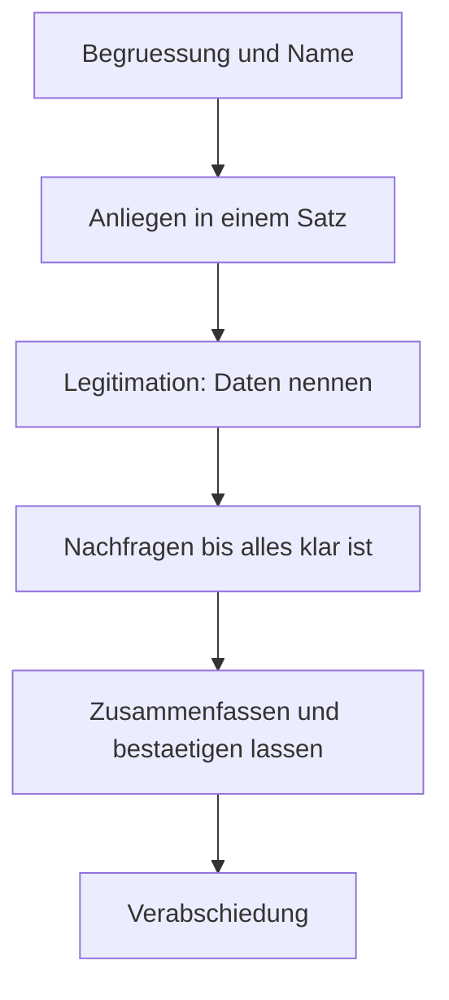

# Alltag · Telefon: Bank & Handyvertrag

> **Level:** B2 · **Focus:** phone German, hotline menus, opening an account, signing and cancelling contracts · **Time:** ~1.5 h
> _After this module you can handle a German service hotline — the hardest everyday listening there is — and cancel a contract correctly._

Phone calls are the hardest everyday German: no lips to read, no gestures, compressed audio, and
often a hotline menu before a human. On top of that, contracts in Germany **renew automatically**
unless you cancel in writing and on time — a rule that costs newcomers real money every year. This
module covers the call, the account opening and the **Kündigung**.

## Objectives / Lernziele

- Survive a **hotline menu** and a call with a service agent.
- Open a bank account and understand **IBAN, Dispo, Lastschrift**.
- Sign up for a mobile contract and know what you're agreeing to.
- **Cancel a contract** properly — in writing, on time, with proof.

## 1. Der Dialog A — Hotline

> 🔊 **Das Menü** — hör es dir an, bevor du liest:

```hoertext
Herzlich willkommen bei Ihrer Bank. Bitte beachten Sie: Dieses Gespräch kann zu Qualitätszwecken aufgezeichnet werden. Für Fragen zu Ihrem Konto drücken Sie die Eins. Für Karten und Sperrungen drücken Sie die Zwei. Für Kredite und Finanzierungen drücken Sie die Drei. Um einen Mitarbeiter zu sprechen, bleiben Sie einfach in der Leitung. Die voraussichtliche Wartezeit beträgt vier Minuten.
```

**Mitarbeiter:** Bank Nord, mein Name ist Krüger, was kann ich für Sie tun?

**Huy:** Guten Tag, Herr Krüger. Mein Name ist Huy Nguyen. **Es geht um** mein Girokonto.

**Mitarbeiter:** Gerne. Zur Legitimation: **Nennen Sie mir bitte** Ihr Geburtsdatum und Ihre Kundennummer.

**Huy:** Geburtsdatum ist der zwölfte Dritte neunzehnhundertdreiundneunzig. Die Kundennummer habe ich hier: vier-sieben-zwei-neun …

**Mitarbeiter:** **Könnten Sie das bitte etwas langsamer?**

**Huy:** Natürlich. Vier — sieben — zwei — neun — null — eins.

**Mitarbeiter:** Danke, ich habe Sie im System. Worum geht es?

**Huy:** Ich habe eine Abbuchung auf dem Konto, die ich nicht zuordnen kann. Achtundzwanzig Euro neunzig, vom fünften.

**Mitarbeiter:** Einen Moment … Das ist eine Lastschrift von einem Mobilfunkanbieter.

**Huy:** Ah, das ist mein Handyvertrag. **Entschuldigung, was genau bedeutet „Lastschrift"?**

**Mitarbeiter:** Das heißt, der Anbieter zieht den Betrag automatisch von Ihrem Konto ein — Sie haben ihm dafür eine Erlaubnis erteilt, ein SEPA-Mandat.

**Huy:** Verstanden. Dann passt das. **Vielen Dank für Ihre Geduld.**

**Mitarbeiter:** Gerne. Kann ich sonst noch etwas für Sie tun?

**Huy:** Nein, das war's. Schönen Tag noch!

## 2. Der Dialog B — Konto eröffnen

**Beraterin:** Sie möchten ein Girokonto eröffnen — richtig?

**Huy:** Genau. **Was brauche ich dafür?**

**Beraterin:** Ihren Pass, die **Meldebescheinigung** und einen Nachweis über Ihr Einkommen — der Arbeitsvertrag reicht.

**Huy:** Habe ich dabei. **Fallen Kontoführungsgebühren an?**

**Beraterin:** Bei Gehaltseingang ab tausend Euro monatlich ist das Konto kostenlos, sonst vier Euro neunzig im Monat.

**Huy:** Und **die Girocard ist inklusive?**

**Beraterin:** Ja. Eine Kreditkarte kostet extra, dreißig Euro im Jahr.

**Huy:** **Was ist ein Dispo?**

**Beraterin:** Der Dispositionskredit — Sie dürfen Ihr Konto bis zu einem Limit überziehen. Die Zinsen sind allerdings hoch, um die elf Prozent.

**Huy:** Dann lieber ohne, danke. **Wie lange dauert es, bis ich die IBAN bekomme?**

**Beraterin:** Die bekommen Sie heute schon, die Karte kommt in etwa einer Woche per Post — die PIN separat.

## 3. Der Dialog C — Vertrag kündigen

**Mitarbeiterin:** Kundenservice, Sie sprechen mit Frau Aydin.

**Huy:** Guten Tag. **Ich möchte meinen Vertrag kündigen.**

**Mitarbeiterin:** Das tut mir leid zu hören. Darf ich fragen, warum?

**Huy:** Ich habe ein besseres Angebot gefunden.

**Mitarbeiterin:** Ich könnte Ihnen ein Treueangebot machen — zwei Euro günstiger im Monat …

**Huy:** **Danke, aber ich möchte trotzdem kündigen.**

**Mitarbeiterin:** Verstehe. Ihr Vertrag läuft noch bis zum dreißigsten November, die Kündigungsfrist beträgt einen Monat.

**Huy:** **Muss ich schriftlich kündigen?**

**Mitarbeiterin:** Seit der Gesetzesänderung geht es auch online über den Kündigungsbutton. Telefonisch kann ich es aufnehmen, aber Sie sollten es sich **schriftlich bestätigen lassen**.

**Huy:** Dann mache ich es online. **Könnten Sie mir eine Bestätigung per E-Mail schicken?**

**Mitarbeiterin:** Die kommt automatisch, sobald Sie den Vorgang abgeschlossen haben.

🔊 **Schlüsselsätze zum Nachsprechen:**

```audio
Guten Tag, mein Name ist Huy Nguyen. Es geht um mein Girokonto. Könnten Sie das bitte etwas langsamer sagen?
```

```audio
Ich möchte meinen Vertrag kündigen. Wie lange ist die Kündigungsfrist? Könnten Sie mir das bitte schriftlich bestätigen?
```

## 4. Vietnamese notes (nur für die harten Stellen)

- **das Girokonto** — `VI:` tài khoản thanh toán hàng ngày (khác *Sparkonto* = tài khoản tiết kiệm).
- **die Lastschrift** — `VI:` ủy nhiệm thu — công ty **tự trừ tiền** từ tài khoản bạn. Rất phổ biến ở Đức.
- **das SEPA-Mandat** — `VI:` giấy cho phép trừ tiền tự động.
- **der Dispo (Dispositionskredit)** — `VI:` hạn mức thấu chi. Lãi **rất cao** (~11%) — tránh dùng.
- **die Kontoführungsgebühr** — `VI:` phí duy trì tài khoản.
- **die Girocard (EC-Karte)** — `VI:` thẻ ghi nợ nội địa Đức. **Không phải** thẻ tín dụng, và nhiều
  nơi chỉ nhận thẻ này.
- **die Kündigungsfrist** — `VI:` thời hạn báo trước khi hủy hợp đồng. **Cực kỳ quan trọng.**
- **die Mindestvertragslaufzeit** — `VI:` thời hạn hợp đồng tối thiểu (thường 12–24 tháng).
- **sich verlängern** — `VI:` "tự động gia hạn" — hợp đồng tự kéo dài nếu bạn không hủy.
- **die Legitimation** — `VI:` xác minh danh tính qua điện thoại.

## 5. Telefonieren — die Struktur, die immer funktioniert



**Der wichtigste Schritt ist E.** Bevor du auflegst, fasse zusammen: *„Habe ich das richtig
verstanden: Sie kündigen zum 30. November und schicken mir eine Bestätigung per E-Mail?"* Damit
fängst du Missverständnisse ab, solange du die Person noch am Telefon hast.

## 6. Important grammar

1. **Zahlen am Telefon** — always in **pairs or single digits**, slowly: *vier — sieben — zwei*.
   Dates: *der zwölfte Dritte* (12.3.). Practise saying your own numbers aloud; this is where most
   calls break down.
2. **Konjunktiv II durchgehend** — *"**Könnten** Sie …?"*, *"Ich **könnte** Ihnen ein Angebot
   machen"*, *"Das **wäre** …"*. Hotline German is Konjunktiv-heavy.
3. **lassen + Infinitiv** — *"Sie sollten es sich schriftlich **bestätigen lassen**"* = have it
   confirmed. A very useful causative pattern.
4. **Nominalstil** — *Kündigungsfrist, Mindestvertragslaufzeit, Kontoführungsgebühr,
   Dispositionskredit*. Decode right-to-left as always.
5. **es geht um + Akkusativ** — *"**Es geht um** mein Girokonto"* is the standard way to state your
   business in one phrase.

## 7. Important vocabulary

| Deutsch | Artikel | Plural | English | VI (if hard) |
|---|---|---|---|---|
| Girokonto | das | Girokonten | current account | tài khoản thanh toán |
| Lastschrift | die | Lastschriften | direct debit | ủy nhiệm thu |
| Überweisung | die | Überweisungen | bank transfer | chuyển khoản |
| Dispo(kredit) | der | Dispokredite | overdraft | thấu chi |
| Kontoführungsgebühr | die | -gebühren | account fee | phí tài khoản |
| Gehaltseingang | der | -eingänge | salary deposit | lương vào tài khoản |
| Kündigung | die | Kündigungen | cancellation, notice | hủy hợp đồng |
| Kündigungsfrist | die | -fristen | notice period | thời hạn báo hủy |
| Mindestvertragslaufzeit | die | -laufzeiten | minimum contract term | thời hạn tối thiểu |
| Anbieter | der | Anbieter | provider | nhà cung cấp |
| Vertrag | der | Verträge | contract | hợp đồng |
| Bestätigung | die | Bestätigungen | confirmation | xác nhận |
| Wartezeit | die | Wartezeiten | waiting time | thời gian chờ |
| kündigen | — | — | to cancel (a contract) | hủy hợp đồng |
| abbuchen / einziehen | — | — | to debit | trừ tiền |
| überziehen | — | — | to overdraw | rút quá số dư |

→ Add these to your deck in [Flashcards](#/@flashcards).

## 8. Native expressions · Redemittel

**Anruf beginnen**

| Redemittel | English |
|---|---|
| **Guten Tag, mein Name ist …** | Hello, my name is … |
| **Es geht um …** | It's about … |
| **Ich rufe an wegen …** | I'm calling about … |
| **Ich hätte eine Frage zu …** | I have a question about … |
| **Bin ich bei Ihnen richtig?** | Am I through to the right place? |

**Am Telefon nicht verstehen** ⭐ — the block that saves the call

| Redemittel | English |
|---|---|
| **Könnten Sie das bitte etwas langsamer sagen?** | Could you say that a bit more slowly? |
| **Die Verbindung ist schlecht — könnten Sie das wiederholen?** | The line is bad — could you repeat? |
| **Könnten Sie das bitte buchstabieren?** | Could you spell that, please? |
| **Wie schreibt man das?** | How do you spell that? |
| **Einen Moment bitte, ich schreibe mit.** | One moment, I'm writing it down. |
| **Habe ich das richtig verstanden: …?** | Did I understand correctly: …? |
| **Könnten Sie mir das schriftlich schicken?** | Could you send me that in writing? |

**Kündigen**

| Redemittel | English |
|---|---|
| **Ich möchte meinen Vertrag kündigen.** | I'd like to cancel my contract. |
| **Zum nächstmöglichen Termin, bitte.** | At the earliest possible date, please. |
| **Wie lange ist die Kündigungsfrist?** | How long is the notice period? |
| **Danke, aber ich möchte trotzdem kündigen.** | Thanks, but I'd still like to cancel. |
| **Ich brauche eine schriftliche Bestätigung.** | I need written confirmation. |
| **Bitte bestätigen Sie mir das Kündigungsdatum.** | Please confirm the cancellation date. |

**Anruf beenden**

| Redemittel | English |
|---|---|
| **Das war's, vielen Dank.** | That's all, thank you. |
| **Vielen Dank für Ihre Geduld/Hilfe.** | Thanks for your patience/help. |
| **Schönen Tag noch, auf Wiederhören.** | Have a good day, goodbye. |

## 9. Praxis — Verträge in Deutschland

**Die Regel, die Geld kostet:** Verträge **verlängern sich automatisch**, wenn du nicht rechtzeitig
kündigst.

| Begriff | Typisch | Was es bedeutet |
|---|---|---|
| **Mindestvertragslaufzeit** | 12–24 Monate | vorher kommst du nicht raus |
| **Kündigungsfrist** | 1–3 Monate | so früh musst du kündigen |
| **Automatische Verlängerung** | seit 2022 nur noch **monatlich** kündbar nach Ablauf | früher: ein ganzes Jahr! |
| **Kündigungsbutton** | Pflicht bei Online-Verträgen | einfachster und sicherster Weg |

**So kündigst du sicher:**

1. **Schriftlich** — E-Mail oder Kündigungsbutton, nie nur telefonisch.
2. **Datum nennen** — *„zum nächstmöglichen Termin"* ist die sicherste Formulierung.
3. **Bestätigung verlangen** — ohne Bestätigung hast du nichts in der Hand.
4. **Beweis aufheben** — Screenshot, E-Mail, Sendebestätigung.

> **Kontoeröffnung braucht die Anmeldung.** Ohne **Meldebescheinigung** aus
> [Alltag · Anmeldung](#/alltag/anmeldung) bekommst du bei den meisten Banken kein Konto. Und ohne
> Konto zahlt dein Arbeitgeber kein Gehalt — die Reihenfolge ist nicht verhandelbar.

> **Girocard ≠ Kreditkarte.** Viele deutsche Läden, Ärzte und Restaurants nehmen **nur** die
> Girocard, keine Visa/Mastercard. Halte beide bereit.

---

## 🧾 Zusammenfassung · Summary

Phone German follows a fixed shape: **greeting + name → *Es geht um …* → Legitimation → ask until
clear → summarize and get confirmation → goodbye**. The block that carries every call is the
clarification set — *langsamer, buchstabieren, ich schreibe mit, habe ich das richtig verstanden*.
For contracts, three words decide whether you lose money: **Mindestvertragslaufzeit**,
**Kündigungsfrist** and **automatische Verlängerung**. Always cancel **in writing**, ask for
**schriftliche Bestätigung**, and keep the proof. Banking essentials: **Lastschrift** is automatic
debiting, the **Dispo** is expensive, and the **Girocard** is not a credit card.

## 📇 Vokabel-Checkliste · Vocabulary checklist

| Deutsch | Artikel | Plural | English | VI (if hard) |
|---|---|---|---|---|
| Legitimation | die | Legitimationen | identity verification | xác minh danh tính |
| Kundennummer | die | -nummern | customer number | mã khách hàng |
| Abbuchung | die | Abbuchungen | debit (transaction) | khoản bị trừ |
| Treueangebot | das | -angebote | loyalty offer | ưu đãi giữ chân |
| Zinsen | die | (nur Plural) | interest | lãi suất |
| Nachweis | der | Nachweise | proof | giấy chứng minh |
| Vorgang | der | Vorgänge | process, transaction | thao tác |
| buchstabieren | — | — | to spell | đánh vần |
| aufzeichnen | — | — | to record | ghi âm |
| zuordnen | — | — | to attribute, identify | xác định nguồn |

→ Drill these in [Flashcards](#/@flashcards).

## 🗣️ Sprechübung · Speaking practice

1. **Your own numbers.** Say your phone number, birth date and IBAN aloud, digit by digit, slowly.
   Record and check you're intelligible.
2. **Opening move.** Practise *"Guten Tag, mein Name ist … Es geht um …"* for five different reasons.
3. **Clarification drill.** Someone speaks too fast on a bad line. Produce **five** different
   reactions.
4. **Cancel a contract**, including refusing the retention offer politely.

```audio
Guten Tag, mein Name ist Huy Nguyen, es geht um meinen Handyvertrag. Ich möchte kündigen, zum nächstmöglichen Termin. Wie lange ist die Kündigungsfrist?
```

## ❓ Mini-Quiz

1. What is a *Lastschrift*, and what have you given the company?
2. Your contract has a 24-month term and a 1-month notice period. When must you cancel?
3. Why should you never cancel only by phone?
4. What do you need from the Bürgeramt before you can open an account?
5. Give the phrase for "could you spell that, please?"

> **Lösungen:** 1) automatischer Einzug vom Konto; du hast ein **SEPA-Mandat** erteilt ·
> 2) spätestens **einen Monat vor Ablauf** der 24 Monate · 3) ohne **schriftliche Bestätigung**
> hast du keinen Beweis · 4) die **Meldebescheinigung** · 5) *„Könnten Sie das bitte
> buchstabieren?"* More at [Quizzes](#/@quiz).

## 📝 Hausaufgabe · Homework

- [ ] Say your **IBAN and phone number** aloud until fluent — record yourself.
- [ ] Memorize the **seven clarification phrases** for phone calls.
- [ ] Check one real contract of yours: Laufzeit, Kündigungsfrist, next cancellation date.
- [ ] Write a **Kündigung** email in German (4 sentences, with *zum nächstmöglichen Termin*).
- [ ] Listen to the 🔊 hotline menu five times without the transcript.

## 📚 Empfohlene Ressourcen · Recommended resources

- **Consumer advice:** verbraucherzentrale.de — free Kündigung templates in German.
- **Writing:** [Phase 1 · Writing](#/phase-1/writing) for the formal email frame.
- **Related:** [Alltag · Anmeldung](#/alltag/anmeldung) — you need the Meldebescheinigung first.
- **Next:** back to [Alltag · Café & Bäckerei](#/alltag/cafe-baeckerei) or on to
  [Phase 2 · Overview](#/phase-2/overview).
