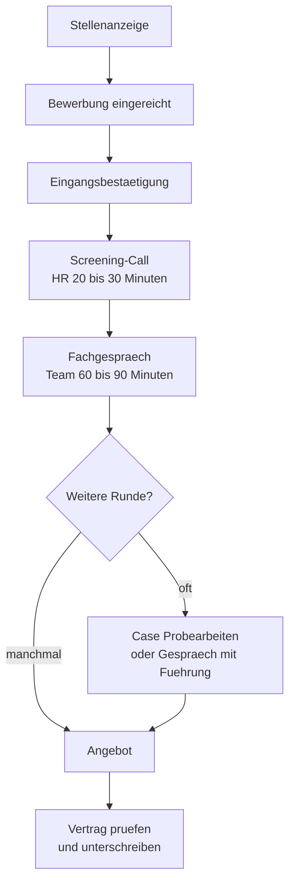

# Bewerbung · Der Bewerbungsprozess in Deutschland

> **Level:** B2 → C1 · **Focus:** die Stationen, realistische Zeiten, Sprachanforderungen, Aufenthalt & Arbeitserlaubnis · **Time:** ~2 h
> _After this module you know what happens between "Bewerbung abgeschickt" and "Vertrag unterschrieben" — and roughly how long each step really takes._

Der deutsche Bewerbungsprozess ist **strukturierter und langsamer**, als es sich anfühlt. Beteiligt
sind meist mehrere Personen, häufig ein Bewerbermanagementsystem und manchmal der Betriebsrat. Wer
das weiß, deutet Stille richtig: Zwei Wochen ohne Antwort sind in Deutschland kein Signal, sondern
Kalender.

Dieses Modul beschreibt den **Ablauf** und die **Rahmenbedingungen**. Wie du die Anzeige liest,
steht im [Phase 5 · Reading · Übungsteil](#/phase-5/reading-uebungen); die Texte selbst schreibst du
mit den anderen vier Modulen dieses Pakets.

## Objectives / Lernziele

- Die **Stationen** des Prozesses und ihre typische Dauer kennen.
- Anzeigenkürzel und Sprachanforderungen richtig deuten.
- Verstehen, was ein **Bewerbermanagementsystem** mit deiner Bewerbung macht.
- Wissen, wo du die Regeln zu **Aufenthalt und Arbeitserlaubnis** verlässlich nachliest.

## 1. Die Stationen



| Station | Was passiert | Realistische Dauer |
|---|---|---|
| Eingangsbestätigung | automatisch, oft sofort | Minuten bis Tage |
| Sichtung | HR und Fachbereich lesen | 1–3 Wochen |
| Screening-Call | Verfügbarkeit, Gehaltsrahmen, Motivation | 20–30 Min |
| Fachgespräch | Technik, Projekte, Team | 60–90 Min |
| Weitere Runde | Case, Probearbeiten, Führungskraft | je nach Firma |
| Angebot | mündlich, dann schriftlich | Tage |
| Vertrag | Prüfung und Unterschrift | 2–5 Tage Bedenkzeit üblich |

**Gesamtdauer:** vier bis zehn Wochen sind normal. Konzerne und der öffentliche Dienst brauchen
länger — dort sind Gremien und feste Sitzungstermine beteiligt.

```uebung
? Wie lange dauert ein deutscher Bewerbungsprozess typischerweise?
* vier bis zehn Wochen
x zwei bis drei Tage
x eine Woche
x sechs Monate
! Mehrere Beteiligte, Urlaubszeiten, feste Termine. Zwei Wochen Stille sind Kalender, kein Signal.

? Was passiert im Screening-Call?
* Verfügbarkeit, Gehaltsrahmen und Motivation werden geklärt
x die technische Tiefe wird geprüft
x der Vertrag wird verhandelt
x du lernst das Team kennen
! Zwanzig bis dreißig Minuten mit HR, oft unangekündigt am Telefon. Vorbereitung: [Phase 5 · Listening · Übungsteil](#/phase-5/listening-uebungen).

? Wann wird das Gehalt zum ersten Mal Thema?
* meist schon im Screening-Call
x erst beim Angebot
x nie, das steht im Vertrag
x im Fachgespräch
! Deshalb musst du deine Zahl **vor** dem ersten Anruf kennen — sie wird oft in Minute fünf abgefragt.

? Wie viel Bedenkzeit ist nach einem Angebot üblich?
* zwei bis fünf Tage
x eine Stunde
x vier Wochen
x gar keine
! Zwei bis fünf Tage werden ohne Nachfrage gewährt. Nutze sie — eine Zusage gilt in Deutschland als verbindlich.
```

## 2. Die Anzeige — Kürzel und Signale

Das Lesen der Anzeige übst du im [Phase 5 · Reading · Übungsteil](#/phase-5/reading-uebungen). Hier
die Kürzel, die dort vorkommen:

| Kürzel / Formel | Bedeutung |
|---|---|
| **(m/w/d)** | männlich / weiblich / divers — geschlechtsneutral ausgeschrieben |
| **(all genders)** | dasselbe, englische Variante |
| **Entwickler:in**, **Entwickler*in** | Doppelform mit Doppelpunkt oder Stern |
| **Kennziffer / Ref.-Nr.** | interne Kennung der Stelle — gehört in deinen Betreff |
| **Vollzeit / Teilzeit** | Wochenstunden; Vollzeit meist 38–40 h |
| **unbefristet / befristet** | mit oder ohne Enddatum |
| **hybrid / mobil möglich** | Anteil Homeoffice — im Gespräch konkretisieren |
| **Tarifvertrag / AT** | tariflich eingruppiert oder außertariflich verhandelbar |

**Sprachanforderungen** sind der Punkt, an dem sich Bewerbungen am häufigsten selbst aussortieren:

| Formulierung | Praktische Bedeutung |
|---|---|
| *Deutsch mind. B2* | eine überprüfbare Stufe — wenn du sie hast, nenne sie |
| *sehr gute Deutschkenntnisse* | ungefähr B2–C1, unscharf formuliert |
| *verhandlungssicher* | in der Regel C1 — Verhandlungen, Konflikte, Nuancen |
| *fließend* | unscharf; meist gemeint: du arbeitest ohne Rückfragen |
| *Deutsch auf Muttersprachniveau* | selten sinnvoll gefordert; im Zweifel nachfragen |
| *Englisch als Arbeitssprache* | Deutsch ist nice-to-have — trotzdem ein Vorteil |

🇩🇪 **Faustregel:** Steht eine **GER-Stufe** da, ist es eine Muss-Anforderung, die du belegen kannst.
Steht ein Adjektiv da, ist es Verhandlungssache — und dein Anschreiben ist der Beleg.

```uebung
? Was bedeutet „(m/w/d)“ in einer Anzeige?
* männlich / weiblich / divers — die Stelle ist geschlechtsneutral ausgeschrieben
x eine Erfahrungsstufe
x mit / ohne Diplom
x Vollzeit / Teilzeit / Werkstudent
! Seit der Einführung der dritten Geschlechtsoption ist die neutrale Ausschreibung Standard. Auch üblich: *(all genders)* oder Doppelformen wie *Entwickler:in*.

? „Verhandlungssicheres Deutsch“ entspricht ungefähr …
* C1
x A2
x B1
x C2
! Gemeint ist: Du kannst verhandeln, widersprechen und Nuancen treffen — genau das, was Phase 5 und 6 trainieren.

? In der Anzeige steht „Deutsch mind. B2“ und du hast C1. Was tust du?
* die Stufe im Anschreiben und Lebenslauf ausdrücklich nennen
x nichts, das ist selbstverständlich
x untertreiben, um nicht überqualifiziert zu wirken
x das Zertifikat mitschicken, aber nicht erwähnen
! Eine geforderte Anforderung, die du übererfüllst, gehört sichtbar in die Bewerbung. Wer sie nicht nennt, lässt eine offene Frage im Kopf der lesenden Person.

? Was ist ein „AT-Vertrag“?
* außertariflich — das Gehalt ist frei verhandelbar statt tariflich eingruppiert
x ein Arbeitsvertrag auf Zeit
x ein Ausbildungsvertrag
x ein Vertrag mit Arbeitnehmerüberlassung
! In tarifgebundenen Firmen liegt das Gehalt in einer Entgeltgruppe fest; AT-Verträge liegen darüber und werden verhandelt.
```

## 3. Was mit deiner Bewerbung intern passiert

Die meisten mittleren und größeren Firmen nutzen ein **Bewerbermanagementsystem** (Applicant
Tracking System). Praktische Folgen für dich:

- **Struktur schlägt Gestaltung.** Klare Überschriften, normale Schriften, PDF. Grafiklastige
  Lebensläufe mit Spalten und Icons werden von manchen Systemen schlecht ausgelesen.
- **Begriffe zählen.** Wenn die Anzeige *Spring Boot* sagt und dein Lebenslauf nur *Spring*, ist das
  für eine Suche ein anderer Begriff. Spiegle die Wortwahl — wahrheitsgemäß.
- **Kennziffer nicht vergessen.** Sie ordnet deine Bewerbung der richtigen Stelle zu.
- **Mehrere Beteiligte lesen.** HR prüft Formales und Rahmenbedingungen, der Fachbereich die
  Substanz. Dein Anschreiben muss für beide funktionieren.

**Datenschutz:** Nach Abschluss eines Verfahrens werden Bewerbungsunterlagen in Deutschland
üblicherweise gelöscht, sofern du keiner längeren Speicherung zustimmst. Viele Firmen fragen dich
ausdrücklich, ob sie deine Unterlagen für künftige Stellen behalten dürfen — ein Ja ist oft
sinnvoll.

```uebung
? Warum ist ein grafisch aufwendiger Lebenslauf riskant?
* Bewerbermanagementsysteme lesen Spalten, Icons und Grafiken oft schlecht aus.
x weil er unprofessionell wirkt
x weil er zu lang ist
x weil Farben verboten sind
! Struktur schlägt Gestaltung. Ein klar gegliedertes PDF mit normalen Überschriften ist die sichere Wahl.

? Die Anzeige sagt „Spring Boot“, dein Lebenslauf sagt „Spring“. Was tust du?
* den Begriff der Anzeige übernehmen, sofern er stimmt
x nichts, das ist dasselbe
x beides weglassen
x nur „Java“ schreiben
! Für eine Suchmaske sind das zwei Begriffe. Spiegeln ist Präzision — erfinden wäre etwas anderes.

? Wer liest deine Bewerbung?
* HR und der Fachbereich, mit unterschiedlichem Blick
x nur HR
x nur die Führungskraft
x nur das System
! Deshalb braucht dein Anschreiben beides: die formalen Eckdaten für HR und die fachlichen Belege für das Team.
```

## 4. Aufenthalt und Arbeitserlaubnis — wo du nachliest

Für Bewerberinnen und Bewerber aus Nicht-EU-Staaten hängt vieles am Aufenthaltstitel. Die
**Struktur** ist stabil, die **Details ändern sich regelmäßig** — Gehaltsschwellen etwa werden
jährlich angepasst.

| Weg | Grundgedanke |
|---|---|
| **EU-Blaue Karte** | Aufenthaltstitel für Hochqualifizierte: anerkannter Hochschulabschluss plus konkretes Stellenangebot ab einer festgelegten Mindestgehaltsschwelle |
| **Fachkräfte mit Berufsausbildung** | anerkannte Berufsqualifikation plus Stellenangebot |
| **Chancenkarte** | punktebasierter Aufenthalt zur Arbeitsplatzsuche |
| **Anerkennung** | Bewertung ausländischer Abschlüsse, für Hochschulabschlüsse über die ZAB-Datenbank **anabin** |

> ⚠️ **Zahlen bitte immer aktuell prüfen.** Mindestgehaltsschwellen, Punktesysteme und
> Verfahrenswege werden regelmäßig geändert. Verlässliche Quellen sind das offizielle Portal
> **Make it in Germany**, das **BAMF**, die **Bundesagentur für Arbeit** und die für dich
> zuständige Ausländerbehörde. Nimm keine Zahl aus einem Forum — und auch keine aus einem
> Lernmaterial wie diesem.

Sprachlich hilfreich: Diese Portale sind gut geschriebenes Verwaltungsdeutsch und damit exzellentes
Lesetraining für genau die Register aus dem [Phase 6 · Reading · Übungsteil](#/phase-6/reading-uebungen).

```uebung
? Wo prüfst du die aktuellen Voraussetzungen für die EU-Blaue Karte?
* auf offiziellen Portalen wie Make it in Germany, BAMF oder der Bundesagentur für Arbeit
x in Foren und Facebook-Gruppen
x beim künftigen Arbeitgeber
x in Lernmaterialien
! Gehaltsschwellen und Verfahren ändern sich regelmäßig. Nur amtliche Quellen sind aktuell — auch dieses Modul nennt bewusst keine Zahl.

? Was verbindet fast alle Wege für Fachkräfte aus Nicht-EU-Staaten?
* eine anerkannte Qualifikation plus ein konkretes Stellenangebot
x ein Sprachzertifikat C2
x ein Wohnsitz in Deutschland
x eine Einladung eines Verwandten
! Qualifikation und Angebot sind der Kern. Die Chancenkarte ist die Ausnahme — sie dient gerade der Suche.

? Wo lässt du einen ausländischen Hochschulabschluss einstufen?
= anabin | in der anabin-Datenbank | ZAB | bei der ZAB
! anabin ist die Datenbank der Zentralstelle für ausländisches Bildungswesen. Arbeitgeber und Behörden schauen dort nach.
```

## 5. Stille deuten und dranbleiben

| Situation | Bedeutung | Deine Reaktion |
|---|---|---|
| Eingangsbestätigung, dann nichts | Sichtung läuft | zwei Wochen warten |
| Nach zwei Wochen nichts | völlig normal | **einmal** nachfassen |
| Nach dem Gespräch nichts, Termin verstrichen | Prozess hakt oder Runde läuft noch | einmal höflich fragen |
| Standardabsage ohne Begründung | Normalfall bei vielen Bewerbungen | danken, Tür offen halten |
| Gar keine Antwort, auch nach Nachfassen | Prozess ist für dich beendet | weitergehen |

**Und die wichtigste Regel:** Bewirb dich **parallel**. Ein Prozess, an dem alles hängt, macht dich
in der Gehaltsverhandlung schwach und in der Wartezeit nervös. Fünf bis zehn laufende Bewerbungen
sind eine gesunde Zahl.

```audio
Ich habe mich am zwölften September beworben und die Eingangsbestätigung sofort bekommen. Nach zwei Wochen habe ich einmal höflich nachgefragt. Der Screening-Call kam dann in der dritten Woche, das Fachgespräch eine Woche später.
```

## 🏋️ Kurzübung · Deinen Prozess planen

**Ü1.** Zeichne deinen **eigenen Prozess** für eine echte Bewerbung: Stationen, geplante Termine, Datum fürs Nachfassen.
**Ü2.** Deute die **Sprachanforderungen** von drei echten Anzeigen und ordne sie einer GER-Stufe zu.
**Ü3.** Prüfe deinen Lebenslauf auf **Systemtauglichkeit**: klare Überschriften, keine Textfelder, PDF.
**Ü4.** Notiere aus offiziellen Quellen die **für dich** geltenden Voraussetzungen — mit Datum der Prüfung.

```spoiler
**Ü1. Musterlösung (Prozessplan):**

| Datum | Station | Notiz |
|---|---|---|
| 12.09. | Bewerbung eingereicht | Kennziffer BE-2291, Bestätigung erhalten |
| 26.09. | **Nachfassen, falls nichts kommt** | einmal, mit Bezug auf ihre Zusage |
| KW 40 | Screening-Call | Gehaltszahl und Verfügbarkeit vorbereitet |
| KW 41 | Fachgespräch | drei STAR-Geschichten, drei eigene Fragen |
| KW 42 | Angebot erwartet | Bedenkzeit bis Freitag erbitten |

Das Datum fürs Nachfassen **vorher** in den Kalender zu schreiben, ist der ganze Trick: Sonst fasst
man entweder zu früh nach oder vergisst es.

**Ü2. Musterlösung (Sprachanforderungen zuordnen):**

| Anzeige sagt | GER-Stufe | Konsequenz |
|---|---|---|
| Deutsch mind. B2 | B2 | belegbar — Stufe ausdrücklich nennen |
| verhandlungssicheres Deutsch | ≈ C1 | Anschreiben ist der Beleg; im Gespräch zeigt es sich |
| sehr gute Deutschkenntnisse | B2–C1 | unscharf; Verhandlungssache |
| Englisch als Arbeitssprache | — | Deutsch als Vorteil positionieren, nicht als Pflicht |

**Ü3. Checkliste Systemtauglichkeit:**

| Check | Frage |
|---|---|
| Format | PDF, keine Bilddatei? |
| Struktur | Echte Überschriften statt Textfeldern und Spalten? |
| Begriffe | Wortwahl der Anzeige übernommen, wo sie stimmt? |
| Kennziffer | In Betreff und Anschreiben? |
| Dateiname | Sprechend (`Bewerbung_Dinh_BE-2291.pdf`)? |

**Ü4.** Notiere zu jeder Angabe die **Quelle und das Datum**, an dem du sie geprüft hast. Regeln zu
Aufenthalt und Arbeitserlaubnis ändern sich; eine Notiz ohne Datum ist in einem Jahr wertlos.
```

---

## 🧾 Zusammenfassung · Summary

The German hiring process is **slower and more structured** than it feels: four to ten weeks,
several readers, usually an applicant-tracking system, sometimes a works council. Silence for two
weeks is calendar, not signal — so plan the follow-up date in advance and send it **once**. Salary
usually comes up in the **Screening-Call**, not at the offer, which means your figure has to exist
before the first unannounced phone call. Read the ad's language line precisely: a **GER level** is a
checkable requirement worth naming explicitly, while *verhandlungssicher* (roughly C1), *fließend*
and *sehr gute Kenntnisse* are adjectives — and your Anschreiben is the evidence. Keep the CV
structurally plain so systems can read it, mirror the ad's own terms where they are true, and always
carry the Kennziffer. For residence and work-permit questions the **structure** is stable but the
**numbers change annually**: check Make it in Germany, the BAMF, the Bundesagentur für Arbeit or your
Ausländerbehörde, note the date you checked — and never take a threshold from a forum, or from
teaching material like this one.

## 📇 Vokabel-Checkliste · Vocabulary checklist

| Deutsch | Artikel | Plural | English | VI (if hard) |
|---|---|---|---|---|
| Eingangsbestätigung | die | -bestätigungen | acknowledgement of receipt | xác nhận đã nhận |
| Sichtung | die | Sichtungen | screening of applications | vòng sàng lọc |
| Bewerbermanagementsystem | das | -systeme | applicant tracking system | hệ thống quản lý ứng viên |
| Aufenthaltstitel | der | Aufenthaltstitel | residence permit | giấy phép cư trú |
| Ausländerbehörde | die | -behörden | immigration office | sở ngoại kiều |
| Anerkennung | die | Anerkennungen | recognition (of a degree) | công nhận bằng cấp |
| Entgeltgruppe | die | Entgeltgruppen | pay grade (under a Tarifvertrag) | bậc lương |
| außertariflich (AT) | — | — | outside the collective agreement | ngoài thang bảng lương |
| eingruppieren | — | — | to classify into a pay grade | xếp bậc |
| aussortieren | — | — | to filter out | loại bớt |

→ Drill these in [Flashcards](#/@flashcards).

## 🗣️ Sprechübung · Speaking practice

1. Erkläre deinen **Aufenthalts- und Arbeitserlaubnisstatus** in zwei ruhigen Sätzen.
2. Beantworte laut: *„Ab wann wären Sie verfügbar?"* — mit Kündigungsfrist und Datum.
3. Beschreibe deinen **aktuellen Bewerbungsstand** in drei Sätzen, wie im Gespräch mit einer Bekannten.

## 📝 Hausaufgabe · Homework

- [ ] **Ü1–Ü4** vollständig.
- [ ] Für jede laufende Bewerbung ein **Nachfassdatum** in den Kalender eintragen.
- [ ] Die Sprachanforderungen von fünf echten Anzeigen einer GER-Stufe zuordnen.
- [ ] Die für dich geltenden Aufenthaltsregeln aus **amtlicher Quelle** notieren, mit Prüfdatum.
- [ ] Auf fünf bis zehn parallele Bewerbungen kommen.

## 📚 Empfohlene Ressourcen · Recommended resources

- **Amtliche Quellen:** Make it in Germany, BAMF, Bundesagentur für Arbeit, die zuständige Ausländerbehörde; anabin (ZAB) für Abschlüsse.
- **Anzeige lesen:** [Phase 5 · Reading](#/phase-5/reading) und der [Übungsteil](#/phase-5/reading-uebungen).
- **Weiter im Paket:** [Der Lebenslauf](#/bewerbung/lebenslauf) · [Das Anschreiben](#/bewerbung/anschreiben) · [LinkedIn & Xing](#/bewerbung/linkedin-xing) · [Bewerbungs-E-Mails](#/bewerbung/mails).
- **Gespräch vorbereiten:** [Phase 5 · Speaking · Übungsteil](#/phase-5/speaking-uebungen) · [Dialogue · Gehaltsgespräch](#/dialogues/gehaltsgespraech).
