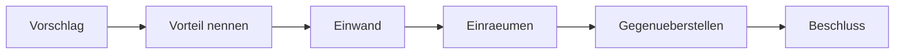

# Dialogue · Architektur-Diskussion

> **Level:** B2+ · **Focus:** Trade-offs abwägen, überzeugen, am Whiteboard argumentieren · **Time:** ~1.5 h
> _After this module you can argue an architecture decision in German — and lose one gracefully._

This is the meeting where technical German is hardest: everyone talks fast, everyone has an opinion,
and the useful moves are all about **weighing** rather than asserting. The good news is that the
language is highly patterned — a dozen structures carry the whole discussion.

## Objectives / Lernziele

- Present an option with its **Vor- und Nachteile**.
- Weigh two options and land on a recommendation.
- Push back on a strong proposal without blocking it.
- Close with a decision or an explicit next step.

## 1. Der Dialog (Deutsch)

**Sabine:** Wir haben zwei Vorschläge für die Zahlungsanbindung. Marek, magst du anfangen?

**Marek:** Klar. **Ich plädiere dafür**, den Zahlungsdienst synchron über REST anzubinden. Der Vorteil ist, dass wir sofort wissen, ob die Zahlung geklappt hat. Der Code bleibt einfach, und Debugging ist deutlich angenehmer.

**Huy:** **Da hätte ich einen Einwand.** Wenn der Zahlungsanbieter langsam antwortet, blockiert das unseren gesamten Bestellprozess. **Wir koppeln uns damit an die Verfügbarkeit eines Dritten.**

**Marek:** Das stimmt, **aber** wir können ein Timeout setzen und danach abbrechen.

**Huy:** Schon — nur dann hat der Kunde bezahlt und wir wissen es nicht. **Genau das ist der Fall, den ich vermeiden möchte.**

**Sabine:** Huy, was wäre deine Alternative?

**Huy:** **Ich würde vorschlagen**, die Zahlung asynchron über ein Event abzuwickeln. Wir nehmen die Bestellung an, stellen sie in den Status „in Prüfung" und reagieren auf die Antwort des Anbieters. **Der Vorteil dabei ist**, dass ein langsamer Anbieter uns nicht mehr blockiert.

**Jonas:** **Der Nachteil ist allerdings**, dass wir dann Zustände verwalten müssen. Und der Kunde sieht nicht sofort ein Ergebnis.

**Huy:** **Da hast du recht.** Wir bräuchten eine Statusanzeige im Frontend.

**Sabine:** **Lass uns das mal gegenüberstellen.** Synchron: einfach, sofortiges Ergebnis, aber gekoppelt. Asynchron: entkoppelt, robuster, aber mehr Komplexität und UI-Aufwand. **Habe ich das richtig zusammengefasst?**

**Marek:** Ja. **Wenn ich ehrlich bin**, überzeugt mich das Kopplungsargument schon.

**Jonas:** Mich auch — **unter der Voraussetzung, dass** wir die Statusanzeige wirklich bauen und nicht auf später schieben.

**Sabine:** Gut. **Dann halten wir fest:** Wir gehen asynchron, mit Statusanzeige im ersten Wurf. Huy schreibt ein kurzes ADR mit Kontext und Konsequenzen, Jonas prüft, was das fürs Monitoring bedeutet. **Einverstanden?**

**Alle:** Einverstanden.

🔊 **Schlüsselsätze zum Nachsprechen:**

```audio
Ich plädiere dafür, den Dienst asynchron anzubinden. Der Vorteil dabei ist, dass ein langsamer Anbieter uns nicht blockiert.
```

```audio
Da hätte ich einen Einwand. Wir koppeln uns damit an die Verfügbarkeit eines Dritten. Lass uns das mal gegenüberstellen.
```

## 2. English translation

- **Sabine:** We have two proposals for the payment integration. Marek, want to start?
- **Marek:** Sure. I'm in favour of connecting the payment service synchronously over REST. The advantage is that we know immediately whether the payment worked. The code stays simple and debugging is far more pleasant.
- **Huy:** I'd have an objection there. If the payment provider responds slowly, it blocks our entire order process. We'd be coupling ourselves to a third party's availability.
- **Marek:** That's true, but we can set a timeout and abort after that.
- **Huy:** Sure — only then the customer has paid and we don't know about it. That's exactly the case I want to avoid.
- **Sabine:** Huy, what would your alternative be?
- **Huy:** I'd suggest handling the payment asynchronously via an event. We accept the order, set it to "under review" and react to the provider's response. The advantage is that a slow provider no longer blocks us.
- **Jonas:** The disadvantage, though, is that we then have to manage states. And the customer doesn't see an immediate result.
- **Huy:** You're right there. We'd need a status display in the frontend.
- **Sabine:** Let's put those side by side. Synchronous: simple, immediate result, but coupled. Asynchronous: decoupled, more robust, but more complexity and UI work. Have I summarised that correctly?
- **Marek:** Yes. If I'm honest, the coupling argument does convince me.
- **Jonas:** Me too — provided we actually build the status display and don't push it to later.
- **Sabine:** Good. Then let's record: we go asynchronous, with the status display in the first cut. Huy writes a short ADR with context and consequences, Jonas checks what it means for monitoring. Agreed?

## 3. Vietnamese notes (nur für die harten Stellen)

- **Ich plädiere dafür, … zu …** — `VI:` "Tôi ủng hộ việc…" — trang trọng hơn *Ich bin dafür*.
- **Da hätte ich einen Einwand.** — `VI:` "Chỗ này tôi có ý phản biện." Cách mở phản đối lịch sự nhất.
- **sich koppeln an** — `VI:` "gắn/phụ thuộc vào". *Wir koppeln uns an einen Dritten* = ta tự buộc
  mình vào bên thứ ba.
- **abwickeln** — `VI:` "xử lý, thực hiện (một quy trình)". *eine Zahlung abwickeln*.
- **gegenüberstellen** — `VI:` "đặt cạnh nhau để so sánh".
- **unter der Voraussetzung, dass …** — `VI:` "với điều kiện là…" — đồng ý có điều kiện.
- **im ersten Wurf** — `VI:` "ngay từ bản đầu tiên" — khẩu ngữ.
- **Wenn ich ehrlich bin, …** — `VI:` "Nói thật thì…" — thường dẫn tới việc **đổi ý**, không phải
  phản đối.

## 4. Vor- und Nachteile abwägen — das Muster

Eine deutsche Architekturdiskussion folgt fast immer derselben Bewegung:



| Schritt | Redemittel |
|---|---|
| Vorschlag | **Ich plädiere dafür, … zu …** · **Ich würde vorschlagen, dass …** |
| Vorteil | **Der Vorteil ist, dass …** · **Der Vorteil dabei ist, dass …** |
| Einwand | **Da hätte ich einen Einwand.** · **Der Nachteil ist allerdings, dass …** |
| Einräumen | **Das stimmt, aber …** · **Da hast du recht.** |
| Gegenüberstellen | **Lass uns das mal gegenüberstellen.** · **Habe ich das richtig zusammengefasst?** |
| Beschluss | **Dann halten wir fest: …** · **Einverstanden?** |

> **Die wichtigste Beobachtung:** Niemand gewinnt, indem er lauter behauptet. Man gewinnt, indem man
> den **Einwand des anderen zuerst einräumt** und ihn dann so weit einschränkt, dass er den eigenen
> Fall nicht mehr trifft. *Das stimmt, aber …* ist der meistgenutzte Satz der ganzen Diskussion.

## 5. Important grammar (im Dialog markiert)

1. **dafür/dagegen + zu-Infinitiv** — *„Ich plädiere **dafür**, den Dienst asynchron **anzubinden**."*
   Das *da(r)-*Wort kündigt den Infinitivsatz an. Ebenso: *Ich bin dagegen, das zu verschieben.*
2. **Konjunktiv II durchgehend** — *hätte, würde, bräuchten, wäre*. Vorschlag und Einwand stehen im
   Konjunktiv, der Beschluss im Indikativ. Der Wechsel markiert das Ende der Debatte.
3. **Der Vorteil ist, dass …** — Verb am Ende im *dass*-Satz. Dasselbe für *Der Nachteil ist, dass …*
4. **unter der Voraussetzung, dass …** — konditionale Zustimmung, Verb am Ende.
5. **Nominalstil im Beschluss** — *„mit Statusanzeige im ersten Wurf"* statt eines ganzen Nebensatzes.
   Siehe [Phase 3 · Grammar](#/phase-3/grammar).

## 6. Important vocabulary

| Deutsch | Artikel | Plural | English | VI (if hard) |
|---|---|---|---|---|
| Anbindung | die | Anbindungen | integration, connection | tích hợp |
| Einwand | der | Einwände | objection | ý phản biện |
| Vorteil / Nachteil | der | Vor-/Nachteile | advantage / disadvantage | ưu / nhược điểm |
| Kopplung | die | Kopplungen | coupling | sự phụ thuộc |
| Verfügbarkeit | die | — | availability | tính khả dụng |
| Statusanzeige | die | -anzeigen | status display | hiển thị trạng thái |
| Voraussetzung | die | Voraussetzungen | precondition | điều kiện |
| Dritter | der | Dritte | third party | bên thứ ba |
| abwickeln | — | — | to process, handle | xử lý |
| gegenüberstellen | — | — | to compare side by side | đối chiếu |
| entkoppeln | — | — | to decouple | tách rời |
| plädieren (für) | — | — | to argue in favour of | ủng hộ |

→ Add these to your deck in [Flashcards](#/@flashcards).

## 7. Native expressions · Redemittel

**Position beziehen**

| Redemittel | English |
|---|---|
| **Ich plädiere dafür, … zu …** | I'm in favour of … |
| **Ich würde vorschlagen, dass …** | I'd suggest that … |
| **Aus meiner Sicht spricht mehr für …** | From my point of view more speaks for … |
| **Mein Vorschlag wäre, zuerst … zu …** | My proposal would be to first … |

**Vorteile und Nachteile**

| Redemittel | English |
|---|---|
| **Der Vorteil ist, dass …** | The advantage is that … |
| **Der Nachteil ist allerdings, dass …** | The disadvantage, though, is that … |
| **Das spricht dafür / dagegen.** | That speaks for / against it. |
| **Der Preis dafür ist …** | The price for that is … |

**Einwand erheben** ⭐

| Redemittel | English |
|---|---|
| **Da hätte ich einen Einwand.** | I'd have an objection there. |
| **Genau das ist der Fall, den ich vermeiden möchte.** | That's exactly the case I want to avoid. |
| **Wir koppeln uns damit an …** | That couples us to … |
| **Was passiert, wenn …?** | What happens if …? |
| **Hast du den Fall X bedacht?** | Have you considered case X? |

**Einräumen** ⭐

| Redemittel | English |
|---|---|
| **Das stimmt, aber …** | That's true, but … |
| **Da hast du recht.** | You're right there. |
| **Schon — nur …** | Sure — only … |
| **Wenn ich ehrlich bin, überzeugt mich das.** | If I'm honest, that convinces me. |

**Abwägen und beschließen**

| Redemittel | English |
|---|---|
| **Lass uns das mal gegenüberstellen.** | Let's put them side by side. |
| **Habe ich das richtig zusammengefasst?** | Have I summarised that correctly? |
| **Unter der Voraussetzung, dass …** | Provided that … |
| **Dann halten wir fest: …** | Then let's record: … |
| **Einverstanden?** | Agreed? |

## 8. Kultur — wie man eine Architekturdiskussion gewinnt (und verliert)

- **Einräumen ist keine Schwäche.** *„Das stimmt, aber …"* ist der Standardzug. Wer nie einräumt,
  wirkt nicht überzeugend, sondern beratungsresistent.
- **Die Meinung ändern ist erlaubt und wird respektiert.** *„Wenn ich ehrlich bin, überzeugt mich
  das Argument"* ist ein völlig normaler Satz — auch für die Person, die den ersten Vorschlag
  gemacht hat.
- **Bedingte Zustimmung ist ein eigenständiger Zug.** *„Unter der Voraussetzung, dass …"* lässt dich
  zustimmen, ohne dein Bedenken fallen zu lassen.
- **Ohne Beschluss und Namen ist nichts entschieden.** Genau wie in der
  [Retrospektive](#/dialogues/retrospektive): *Halten wir fest* + wer macht was.
- **Ein ADR schreiben heißt nicht, dass man gewonnen hat.** Es hält fest, **warum** so entschieden
  wurde — inklusive der verworfenen Alternative. Siehe
  [Phase 3 · Writing · Übungsteil](#/phase-3/writing-uebungen).

---

## 🧾 Zusammenfassung · Summary

A German architecture discussion is a fixed sequence: **Vorschlag → Vorteil → Einwand → Einräumen →
Gegenüberstellen → Beschluss**. Proposals and objections live in Konjunktiv II; the switch to the
Indikativ marks the decision. The single most-used move is **concede first, then narrow**
(*Das stimmt, aber …*) — asserting louder does not win. Conditional agreement (*unter der
Voraussetzung, dass …*) lets you say yes without dropping your concern, and changing your mind
mid-discussion is respected, not penalised. Nothing is decided until someone says **Dann halten wir
fest** and names an owner.

## 📇 Vokabel-Checkliste · Vocabulary checklist

| Deutsch | Artikel | Plural | English | VI (if hard) |
|---|---|---|---|---|
| Zahlungsanbieter | der | -anbieter | payment provider | nhà cung cấp thanh toán |
| Bestellprozess | der | -prozesse | order process | quy trình đặt hàng |
| Zustand | der | Zustände | state | trạng thái |
| Wurf | der | Würfe | throw; „im ersten Wurf" = first cut | bản đầu tiên |
| beratungsresistent | — | — | impervious to advice | không tiếp thu |
| bedenken | — | — | to consider | cân nhắc |
| verwerfen | — | — | to discard (an option) | loại bỏ |
| überzeugen | — | — | to convince | thuyết phục |

→ Drill these in [Flashcards](#/@flashcards).

## 🗣️ Sprechübung · Speaking practice

1. **Zwei Optionen aus deinem echten Stack** je mit Vorteil und Nachteil beschreiben.
2. **Einwand üben:** dreimal widersprechen, jedes Mal mit einer anderen Formel aus dem ⭐-Block.
3. **Einräumen und einschränken:** *Das stimmt, aber …* zu fünf echten Aussagen.
4. **Beschließen:** eine Entscheidung mit *Dann halten wir fest* und zwei Verantwortlichen formulieren.

```audio
Das stimmt, aber wir koppeln uns damit an die Verfügbarkeit eines Dritten. Unter der Voraussetzung, dass wir die Statusanzeige bauen, wäre ich einverstanden.
```

## ❓ Mini-Quiz

1. Wie leitest du einen höflichen Einwand ein?
2. Vervollständige: *„Ich plädiere ___, den Dienst asynchron ___zubinden."*
3. Wie stimmst du zu, ohne dein Bedenken fallen zu lassen?
4. Welcher Satz beendet die Diskussion?
5. Warum ist *„Das stimmt, aber …"* stärker als sofortiger Widerspruch?

> **Lösungen:** 1) *Da hätte ich einen Einwand.* · 2) *Ich plädiere **dafür**, den Dienst asynchron
> **an**zubinden.* (trennbares Verb → *zu* kommt zwischen Präfix und Stamm) · 3) *Unter der
> Voraussetzung, dass …* · 4) *Dann halten wir fest: …* + Verantwortliche · 5) weil du zeigst, dass
> du das Argument verstanden hast — erst dann hört dir jemand beim Einschränken zu.
> More at [Quizzes](#/@quiz).

## 📝 Hausaufgabe · Homework

- [ ] Beschreibe **zwei echte Optionen** aus deinem Projekt mit Vor- und Nachteilen.
- [ ] Memoriere den ⭐-Block **Einwand** und den ⭐-Block **Einräumen**.
- [ ] Führe eine echte Diskussion, in der du **einmal einräumst** und dann einschränkst.
- [ ] Schreibe das Ergebnis als **ADR** — siehe [Writing · Übungsteil](#/phase-3/writing-uebungen).
- [ ] Shadow beide 🔊 Clips **5× each**.

## 📚 Empfohlene Ressourcen · Recommended resources

- **Verwandt:** [Dialogue · Code Review](#/dialogues/code-review), [Retrospektive](#/dialogues/retrospektive).
- **Struktur:** [Phase 3 · Speaking · Übungsteil](#/phase-3/speaking-uebungen) — Architektur erklären.
- **Schreiben:** [Phase 3 · Writing · Übungsteil](#/phase-3/writing-uebungen) — das ADR danach.
- **Weiter:** [Dialogue · Deployment außerhalb der Arbeitszeit](#/dialogues/deployment-notfall).
