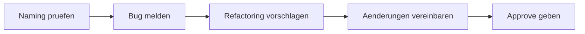

# Dialogue · Code Review

> **Level:** B2 · **Focus:** the language of the PR review — naming, catching a bug, suggesting a refactor and agreeing on changes without stepping on toes · **Time:** ~1.5 h
> _After this module you can review a colleague's pull request in German: flag an unclear name, point out a bug, propose a refactor as an option, and land on a clear set of agreed changes._

The **Code-Review** is where German dev culture shows its love of *Sachlichkeit* — factual, on-the-point feedback about the code, never the person. The trick is to soften suggestions with **Konjunktiv II** (*Könntest du …?*, *Ich würde vorschlagen …*, *Was hältst du davon …?*) while staying crystal-clear about what's a blocking bug and what's just a *Kleinigkeit*. Below is a realistic review at a Berlin e-commerce company along the lines of **Zalando**. The team is *per du*. Katrin (reviewer) walks Tobias (author) through his PR for the order service.

## Objectives / Lernziele

- **Flag naming** diplomatically: *Der Name ist nicht besonders aussagekräftig — könntest du …?*
- **Report a bug** factually with Passiv: *Hier hat sich ein Bug eingeschlichen … da wird auf das nächste Element zugegriffen.*
- **Suggest a refactor as an option**, not an order: *Was hältst du davon, … auszulagern?*
- **Separate blocking from nice-to-have**: *Kein Muss*, *nur eine Kleinigkeit*, *das machen wir in einem separaten Ticket*.
- **Agree and approve**: *Sobald das drin ist, gebe ich dir mein Approve.*



## 1. Der Dialog (Deutsch)

**Katrin (Reviewerin):** Hey Tobias, ich habe deinen PR für den Bestell-Service durchgeschaut. Insgesamt sieht das schon richtig gut aus — sauber getestet. Ein paar Anmerkungen habe ich aber noch.

**Tobias (Autor):** Hi Katrin, super, danke fürs schnelle Review. Schieß los.

**Katrin:** Erstens eine Kleinigkeit beim Naming: Die Methode heißt `doCheck()`. **Mir ist nicht ganz klar, was sie eigentlich prüft.** Könntest du sie in etwas Aussagekräftigeres umbenennen, zum Beispiel `validateOrderStock()`?

**Tobias:** Guter Punkt. `doCheck` ist wirklich nichtssagend. Ich benenne sie um.

**Katrin:** Danke. Zweitens — und das wiegt schwerer — glaube ich, dass **sich hier ein Bug eingeschlichen hat.** In Zeile 42 wird bis `items.size()` iteriert, aber mit `items.get(i + 1)` auf das nächste Element zugegriffen. Beim letzten Element läuft das doch in eine IndexOutOfBoundsException, oder?

**Tobias:** Stimmt, das ist ein klassischer Off-by-one-Fehler. Der ist mir durchgerutscht. Ich passe die Schleife an und schreibe direkt einen Test, der den Randfall abdeckt.

**Katrin:** Perfekt, genau so. Ein Test für den Grenzfall ist mir sowieso lieber als nur der Fix — sonst kommt der Bug beim nächsten Umbau zurück.

**Tobias:** Sehe ich auch so. Gibt es sonst noch etwas?

**Katrin:** Ja, ein Vorschlag zum Refactoring — kein Muss. Die Methode ist mit ihren sechzig Zeilen ziemlich lang, und die Verschachtelung geht drei Ebenen tief. **Was hältst du davon, die Validierung in eine eigene Methode auszulagern?** Dann bleibt der Hauptpfad lesbarer.

**Tobias:** Das finde ich sinnvoll. Ich würde die Validierung rausziehen und die verschachtelten if-Blöcke durch frühe Returns ersetzen. Dann sparen wir uns eine Ebene.

**Katrin:** Klingt gut. Aber lass uns das nicht in diesem PR machen — der ist schon groß genug. Machst du das Refactoring in einem separaten Ticket?

**Tobias:** Einverstanden. Ich lege ein Folge-Ticket an und verlinke es im PR, damit es nicht untergeht.

**Katrin:** Top. Dann fassen wir zusammen: Du benennst `doCheck` um, fixst den Off-by-one mit einem Test, und das Refactoring kommt in ein eigenes Ticket. Sobald das drin ist, **gebe ich dir mein Approve.**

**Tobias:** Super, danke für das gründliche Review. Ich pinge dich, sobald ich die Änderungen gepusht habe.

**Katrin:** Mach das. Von meiner Seite steht dann nichts mehr im Weg.

🔊 **Schlüsselsätze zum Nachsprechen** — the two lines that carry the most reusable review language, reporting a bug and proposing a refactor:

```audio
Ich glaube, dass sich hier ein Bug eingeschlichen hat. Beim letzten Element läuft das in eine Exception, oder?
```

```audio
Was hältst du davon, die Validierung in eine eigene Methode auszulagern? Dann bleibt der Hauptpfad lesbarer.
```

## 2. English translation

- **Katrin:** Hey Tobias, I've gone through your PR for the order service. Overall it already looks really good — cleanly tested. But I've got a few comments.
- **Tobias:** Hi Katrin, great, thanks for the quick review. Fire away.
- **Katrin:** First, a small thing on naming: the method is called `doCheck()`. It's not quite clear to me what it actually checks. Could you rename it to something more meaningful, for example `validateOrderStock()`?
- **Tobias:** Good point. `doCheck` really is meaningless. I'll rename it.
- **Katrin:** Thanks. Second — and this matters more — I think a bug crept in here. In line 42 you iterate up to `items.size()`, but access the next element with `items.get(i + 1)`. On the last element that runs into an IndexOutOfBoundsException, doesn't it?
- **Tobias:** Right, that's a classic off-by-one error. It slipped past me. I'll adjust the loop and write a test straight away that covers the edge case.
- **Katrin:** Perfect, exactly that. A test for the boundary case is what I'd prefer anyway over just the fix — otherwise the bug comes back on the next rework.
- **Tobias:** I see it the same way. Is there anything else?
- **Katrin:** Yes, a suggestion for refactoring — not a must. The method is quite long at sixty lines, and the nesting goes three levels deep. What do you think about extracting the validation into its own method? Then the main path stays more readable.
- **Tobias:** I think that makes sense. I'd pull the validation out and replace the nested if-blocks with early returns. Then we save ourselves one level.
- **Katrin:** Sounds good. But let's not do it in this PR — it's big enough already. Will you do the refactoring in a separate ticket?
- **Tobias:** Agreed. I'll create a follow-up ticket and link it in the PR so it doesn't get lost.
- **Katrin:** Great. So to summarise: you rename `doCheck`, fix the off-by-one with a test, and the refactoring goes into its own ticket. As soon as that's in, I'll give you my approval.
- **Tobias:** Great, thanks for the thorough review. I'll ping you as soon as I've pushed the changes.
- **Katrin:** Do that. Then nothing's blocking from my side.

## 3. Vietnamese notes (nur für die harten Stellen)

- **aussagekräftig** — `VI:` "có ý nghĩa rõ ràng, dễ hiểu" (tên hàm/biến "nói lên được" nó làm gì) — ngược với *nichtssagend* = vô nghĩa.
- **sich einschleichen** — `VI:` "len lỏi/lọt vào một cách âm thầm" — bug *tự lẻn vào*: *hier hat sich ein Bug eingeschlichen*.
- **durchrutschen** — `VI:` "lọt lưới, bị bỏ sót" — *der Fehler ist mir durchgerutscht* = mình để lọt lỗi này.
- **auslagern** — `VI:` "tách ra ngoài" (đưa logic ra một hàm/lớp riêng) — refactor điển hình.
- **der Randfall / der Grenzfall** — `VI:` "trường hợp biên/ngoại lệ" (edge case) — nơi bug hay nấp.
- **kein Muss** — `VI:` "không bắt buộc" — đánh dấu góp ý là tùy chọn, không chặn merge.
- **untergehen** — `VI:` ở đây "bị chìm/quên mất" giữa nhiều việc — *damit es nicht untergeht* = để khỏi bị quên.
- **Von meiner Seite steht nichts im Weg.** — `VI:` "Về phía tôi thì không có gì cản trở" = OK, có thể merge.

## 4. Important grammar (im Dialog markiert)

Don't re-learn these — just spot them working in a real review. Full rules live in the phase modules.

1. **Konjunktiv II to soften every suggestion** — *"**Könntest** du sie umbenennen?"*, *"Ich **würde** die Validierung rausziehen"*, *"Ein Test **ist** mir lieber"*. This is what keeps review comments polite — see [Phase 2 · Grammar](#/phase-2/grammar) and diplomatic phrasing in [Phase 4 · Grammar](#/phase-4/grammar).
2. **Passiv (Vorgangspassiv)** — *"In Zeile 42 **wird** … **iteriert**"*, *"… **wird** auf das nächste Element **zugegriffen**"*. Reviewers love the passive because it talks about the *code*, not "you" — full paradigm in [Phase 2 · Grammar](#/phase-2/grammar) and the technical register in [Phase 3 · Grammar](#/phase-3/grammar).
3. **Relative clauses** — *"einen Test, **der** den Randfall **abdeckt**"*; *"die if-Blöcke, **die** verschachtelt sind"*. The verb goes to the end of the relative clause — [Phase 2 · Grammar](#/phase-2/grammar).
4. **`Was hältst du davon, … zu + Infinitiv`** — *"Was hältst du davon, die Validierung **auszulagern**?"* — a fixed frame for proposals with an infinitive clause. More in [Phase 3 · Grammar](#/phase-3/grammar).
5. **Comparatives** — *aussagekräftig**er***, *lesbar**er***, *lieb**er***. Softening a critique often means "make it *more* X" — [Phase 2 · Grammar](#/phase-2/grammar).
6. **Separable verbs** — *durchschauen*, *umbenennen*, *anpassen*, *auslagern*, *rausziehen*, *anlegen*. Prefix detaches in the main clause — [Phase 1 · Grammar](#/phase-1/grammar).

## 5. Important vocabulary

| Deutsch | Artikel | Plural | English | VI (if hard) |
|---|---|---|---|---|
| Pull Request (PR) | der | Pull Requests | pull request | |
| Anmerkung | die | Anmerkungen | comment / remark | ghi chú góp ý |
| Benennung / Naming | die | Benennungen | naming | cách đặt tên |
| Methode | die | Methoden | method | |
| Fehler / Bug | der | Fehler / Bugs | bug | |
| Grenzfall / Randfall | der | Grenzfälle / Randfälle | edge / boundary case | trường hợp biên |
| Schleife | die | Schleifen | loop | vòng lặp |
| Verschachtelung | die | Verschachtelungen | nesting | lồng nhau (if lồng) |
| Validierung | die | Validierungen | validation | |
| Refactoring | das | Refactorings | refactoring | |
| Hauptpfad | der | Hauptpfade | main / happy path | luồng chính |
| Folge-Ticket | das | Folge-Tickets | follow-up ticket | |
| Freigabe / Approve | die | Freigaben | approval / sign-off | duyệt merge |
| Änderung | die | Änderungen | change | |

→ Add these to your personal IT deck in [Flashcards](#/@flashcards).

## 6. Native expressions · Redemittel

These are the chunks German reviewers actually type into a PR. Learn them whole.

| Redemittel | English | Wann? |
|---|---|---|
| **Mir ist nicht ganz klar, was … macht.** | I'm not quite clear what … does. | flagging unclear code |
| **Der Name ist nicht besonders aussagekräftig.** | The name isn't very meaningful. | naming comment |
| **Hier hat sich ein Bug eingeschlichen.** | A bug crept in here. | reporting a bug gently |
| **Was hältst du davon, … zu …?** | What do you think about …? | proposing a change |
| **Ich würde vorschlagen, …** | I'd suggest … | a concrete suggestion |
| **Kein Muss / nur eine Kleinigkeit.** | Not a must / just a nit. | marking non-blocking |
| **Lass uns das in einem separaten Ticket machen.** | Let's do that in a separate ticket. | deferring scope |
| **Sehe ich auch so.** | I see it the same way. | agreeing |
| **Sobald das drin ist, gebe ich dir mein Approve.** | Once that's in, I'll approve. | conditional approval |
| **Von meiner Seite steht nichts im Weg.** | Nothing's blocking from my side. | final sign-off |

> **Pro-Tipp:** Mark severity explicitly, German-style. Prefix nits with *„Nit:"* or *„Kleinigkeit:"*, and reserve *„Blocker:"* / *„Das müssen wir vorher fixen"* for real problems — it saves a lot of back-and-forth.

## 7. Formal (Sie) vs. informal (du)

Internal reviews are *per du*. You'll switch to **Sie** with an external contractor, an open-source maintainer you don't know, or in a very formal enterprise (e.g. insurance IT). Same content, different register:

| Situation | du (Team-intern) | Sie (formal / extern) |
|---|---|---|
| Inviting the review | **Schieß los.** | **Legen Sie gern los.** |
| Suggesting a rename | **Könntest du das umbenennen?** | **Könnten Sie das umbenennen?** |
| Proposing a refactor | **Was hältst du davon, … auszulagern?** | **Was halten Sie davon, … auszulagern?** |
| Approving | **Ich gebe dir mein Approve.** | **Ich gebe Ihnen die Freigabe.** |
| Following up | **Ich pinge dich, sobald du gepusht hast.** | **Ich melde mich, sobald Sie gepusht haben.** |

Note that the **Konjunktiv II** softeners (*Könntest/Könnten*, *Ich würde*) do the politeness work in both registers — you only swap the pronoun and the verb ending. More on register in [Phase 6 · Grammar](#/phase-6/grammar).

---

## 🧾 Zusammenfassung · Summary

A German **Code-Review** stays *sachlich*: comment on the code, not the coder. Flag naming (*nicht aussagekräftig — könntest du …?*), report bugs with the **Passiv** (*hier wird auf … zugegriffen*), and float refactors as options (*Was hältst du davon, … auszulagern? Kein Muss.*). Separate blocking from nice-to-have, push big refactors into a **Folge-Ticket**, and close with a conditional approval (*Sobald das drin ist, gebe ich dir mein Approve*). The grammar is **Konjunktiv II** for softening plus **Passiv** and **relative clauses** — all from [Phase 2 · Grammar](#/phase-2/grammar). Reviews are *per du*, but the polite Konjunktiv II frames carry straight over to *Sie*.

## 📇 Vokabel-Checkliste · Vocabulary checklist

| Deutsch | Artikel | Plural | English | VI (if hard) |
|---|---|---|---|---|
| Codeüberprüfung | die | Codeüberprüfungen | code review | |
| Lesbarkeit | die | (meist Singular) | readability | tính dễ đọc |
| umbenennen | — | — | to rename | đổi tên |
| auslagern | — | — | to extract / factor out | tách ra |
| abdecken | — | — | to cover (a case) | bao phủ (test) |
| durchrutschen | — | — | to slip through | bị lọt/bỏ sót |
| nichtssagend | — | — | meaningless / vague | vô nghĩa |
| verschachtelt | — | — | nested | lồng nhau |

→ Drill these in [Flashcards](#/@flashcards); more workplace vocab in [Phase 3 · Vocabulary](#/phase-3/vocabulary).

## 🗣️ Sprechübung · Speaking practice

1. **Flag a name.** Pick a real method name from your code and critique it: *"Der Name … ist nicht besonders aussagekräftig. Könntest du ihn in … umbenennen?"*
2. **Report a bug factually** with Passiv: *"Hier hat sich ein Bug eingeschlichen — in Zeile … wird … . Beim … läuft das in eine Exception."*
3. **Propose a refactor as an option**: *"Was hältst du davon, … auszulagern? Kein Muss — das können wir auch in einem separaten Ticket machen."*
4. Record yourself and compare rhythm and stress with the 🔊 below.

```audio
Kein Muss, nur eine Kleinigkeit: Könntest du die Methode umbenennen und die Validierung auslagern? Sobald das drin ist, gebe ich dir mein Approve.
```

## ❓ Mini-Quiz

1. Turn this into a polite review comment: *"Benenne das um."* → *"___ du das bitte ___?"* (Konjunktiv II)
2. Put it in the Passiv: *"Man greift auf das nächste Element zu."* → *"Auf das nächste Element ___ ___."*
3. Complete the fixed proposal frame: *"___ hältst du ___, die Validierung auszulagern?"*
4. Which structure is *"einen Test, der den Randfall abdeckt"* — and where does the verb go?
5. Make it formal: *"Könntest du das umbenennen?"* → *"___ Sie das umbenennen?"*

> **Lösungen:** 1) ***Könntest** du das bitte **umbenennen**?* (Konjunktiv II — [Phase 2 · Grammar](#/phase-2/grammar)). · 2) *Auf das nächste Element **wird zugegriffen*** (Vorgangspassiv). · 3) ***Was** hältst du **davon**, die Validierung auszulagern?* · 4) A **relative clause** — the conjugated verb *abdeckt* goes to the **end** of the clause. · 5) ***Könnten** Sie das umbenennen?* More at [Quizzes](#/@quiz).

## 📝 Hausaufgabe · Homework

- [ ] Write **three review comments** on your own recent code: one naming nit, one bug report in the Passiv, one refactor suggestion with *Was hältst du davon, … zu …?*
- [ ] Rewrite **three comments** from *du* into *Sie* for an external contractor.
- [ ] Convert **three active sentences** about code into the **Passiv** (e.g. *„Man ruft die Methode auf" → „Die Methode wird aufgerufen"*).
- [ ] Mark each comment with a severity tag: *Nit / Kleinigkeit* vs. *Blocker*.
- [ ] Shadow the two 🔊 clips **5× each**, matching stress and speed.
- [ ] Do the [Grammar quiz](#/@quiz) on Passiv + Konjunktiv II — aim for ≥ 4/5.

## 📚 Empfohlene Ressourcen · Recommended resources

- **Grammar:** deutsch.lingolia.com on **Passiv** and **Konjunktiv II**; Schubert-Verlag online exercises for both.
- **Video:** *Deutsch mit Marija* (Passiv), *Easy German* (real workplace phrasing and softeners).
- **Dictionary:** dict.leo.org and Linguee for review collocations (*einen PR reviewen*, *einen Fehler beheben*, *Code auslagern*).
- **Next:** the [Developer ↔ Team Lead (1:1)](#/dialogues/team-lead) dialogue for giving and taking feedback beyond the code, and [Phase 3 · Vocabulary](#/phase-3/vocabulary) for the technical register.
