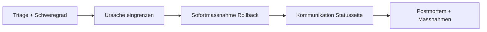

# Dialogue · Production Incident

> **Level:** C1 · **Focus:** the language of an on-call incident call — triage, narrowing the root cause, mitigation, and clean stakeholder comms under pressure · **Time:** ~2 h
> _After this module you can hold your own on a German incident call: report status crisply, help narrow the cause, argue for a mitigation, and phrase what goes on the status page — in the dense, factual C1 register the situation demands._

A **Störung** in production is where German engineering culture turns fully *sachlich*: short sentences, precise connectors, and a heavy dose of **Passiv** and **Nominalstil** so the talk stays about the *system*, not about blame. This is C1 territory — you'll hear **Funktionsverbgefüge** (*Entwarnung geben*, *Maßnahmen ableiten*, *einen Rollback anstoßen*) and **indirekte Rede** in the comms. Below is a realistic Sev-1 call at a Berlin neobroker along the lines of **Trade Republic**, where an order outage is genuinely customer-critical. Markus runs the call as Incident Commander; Minh has the on-call pager; Carla covers infrastructure; Julia owns communications.

## Objectives / Lernziele

- **Report status crisply**: *Die Fehlerrate ist sprunghaft angestiegen, kurz nachdem das Release ausgerollt wurde.*
- **Classify severity**: *Ich stufe den Vorfall als Sev-1 ein — kundenkritisch.*
- **Narrow the root cause** in the Passiv/Nominalstil: *Im Release wurde eine Migration eingespielt, die einen Index entfernt.*
- **Argue for a mitigation**: *Priorität eins ist, den Service wiederherzustellen. Ich plädiere für den Rollback.*
- **Phrase external comms** cleanly and declare state: *Ich erkläre den Incident für mitigiert.*



## 1. Der Dialog (Deutsch)

**Markus (Incident Commander):** Ich eröffne hiermit den Incident-Call. Wir haben seit 14:03 Uhr eine erhöhte Fehlerrate im Order-Service — aktuell rund vierzig Prozent 5xx. Ich übernehme die Leitung. Minh, du hast Bereitschaft — gib uns bitte den aktuellen Stand.

**Minh (On-Call Backend):** Bestätigt. **Die Fehlerrate ist sprunghaft angestiegen, kurz nachdem das Release 2.14 ausgerollt wurde.** Betroffen sind sämtliche Order-Endpoints; Nutzer können derzeit keine Wertpapierorders aufgeben. Die Latenz liegt beim Fünffachen des Normalwerts.

**Markus:** Damit stufe ich den Vorfall als Sev-1 ein — kundenkritisch. Carla, wie sieht es auf der Infrastrukturseite aus?

**Carla (SRE):** Der Verbindungspool zur Datenbank läuft voll. Die offenen Verbindungen stauen sich, und der Service bekommt keine neuen mehr. Das deckt sich zeitlich exakt mit dem Deployment.

**Minh:** Das ergibt Sinn. Im Release wurde eine Migration eingespielt, die einen Index entfernt. Ohne diesen Index laufen die Abfragen in einen Full-Table-Scan, halten die Verbindungen zu lange und erschöpfen den Pool. Das ist mit hoher Wahrscheinlichkeit die Ursache.

**Markus:** Gut eingegrenzt. Dann trennen wir Sofortmaßnahme und Ursachenbehebung. **Priorität eins ist, den Service wiederherzustellen.** Was ist schneller — ein Rollback des Releases oder das Wiederherstellen des Index?

**Carla:** Der Rollback ist sicherer. Den Index neu aufzubauen würde bei dieser Tabellengröße rund zwanzig Minuten dauern und die Datenbank zusätzlich belasten. Ich plädiere klar für den Rollback.

**Markus:** Einverstanden. Carla, fahr bitte den Rollback auf Version 2.13. Minh, skaliere parallel den Order-Service hoch, damit der Rückstau schneller abgearbeitet wird.

**Carla:** Rollback ist angestoßen. Ich halte euch über den Fortschritt auf dem Laufenden.

**Julia (Comms):** Ich übernehme die Kommunikation. Ich aktualisiere die Statusseite und informiere den Support, dass die Orderaufgabe vorübergehend gestört ist. Markus, welche Formulierung ist freigegeben?

**Markus:** Schreib: „Uns ist eine Störung bei der Orderaufgabe bekannt. Wir arbeiten mit Hochdruck an der Behebung." Keine technischen Details nach außen und noch keine Zeitangabe zur Wiederherstellung.

**Julia:** Verstanden, so ist es raus. Der Support meldet, es gingen bereits erste Beschwerden ein; ich melde mich, sobald wir Entwarnung geben können.

**Carla:** Der Rollback ist durch. Die Fehlerrate fällt bereits — wir liegen wieder unter fünf Prozent, und die Latenz normalisiert sich.

**Minh:** Kann ich bestätigen. Die Orders gehen wieder durch, der Rückstau ist fast abgearbeitet. Ich behalte die Metriken die nächste halbe Stunde im Auge.

**Markus:** Sehr gut. **Ich erkläre den Incident für mitigiert**, aber noch nicht für geschlossen — wir beobachten weiter. Minh, dokumentiere bitte die Zeitleiste lückenlos. Wir setzen morgen ein schuldfreies Postmortem an und leiten Maßnahmen ab, damit sich das nicht wiederholt.

**Minh:** Mache ich. Ich halte fest: Ursache war die entfernte Migration, Sofortmaßnahme der Rollback. Carla bestätigt, die Datenbank sei wieder stabil. Fürs Postmortem schlage ich vor, automatische Migrationsprüfungen in die Pipeline aufzunehmen.

**Markus:** Guter Punkt, das nehmen wir auf. Danke an alle für die schnelle und ruhige Arbeit. Ich schließe den Call, sobald wir dreißig Minuten stabil laufen.

🔊 **Schlüsselsätze zum Nachsprechen** — the two lines that carry the most reusable incident language, the status report and the mitigation call:

```audio
Die Fehlerrate ist sprunghaft angestiegen, kurz nachdem das Release ausgerollt wurde. Nutzer können derzeit keine Orders aufgeben.
```

```audio
Priorität eins ist, den Service wiederherzustellen. Was ist schneller — ein Rollback oder das Wiederherstellen des Index?
```

## 2. English translation

- **Markus:** I hereby open the incident call. Since 14:03 we've had an elevated error rate in the order service — currently around forty percent 5xx. I'll take command. Minh, you're on call — please give us the current status.
- **Minh:** Confirmed. The error rate spiked sharply just after release 2.14 was rolled out. All order endpoints are affected; users currently can't place any securities orders. Latency is at five times the normal value.
- **Markus:** With that I'm classifying the incident as Sev-1 — customer-critical. Carla, how does it look on the infrastructure side?
- **Carla:** The database connection pool is filling up. The open connections are backing up, and the service isn't getting any new ones. That coincides exactly in time with the deployment.
- **Minh:** That makes sense. In the release a migration was applied that removes an index. Without that index the queries run into a full-table scan, hold the connections too long, and exhaust the pool. That's very probably the cause.
- **Markus:** Well narrowed down. Then let's separate the immediate action from the root-cause fix. Priority one is to restore the service. What's faster — a rollback of the release or rebuilding the index?
- **Carla:** The rollback is safer. Rebuilding the index would take about twenty minutes at this table size and put extra load on the database. I clearly advocate for the rollback.
- **Markus:** Agreed. Carla, please run the rollback to version 2.13. Minh, scale the order service up in parallel so the backlog is worked off faster.
- **Carla:** Rollback is triggered. I'll keep you posted on the progress.
- **Julia:** I'll take comms. I'll update the status page and inform support that order placement is temporarily disrupted. Markus, which wording is approved?
- **Markus:** Write: "We are aware of a disruption to order placement. We're working hard on a fix." No technical details externally, and no time estimate for recovery yet.
- **Julia:** Understood, it's out. Support reports that first complaints are already coming in; I'll get back to you as soon as we can give the all-clear.
- **Carla:** The rollback is through. The error rate is already dropping — we're back under five percent, and latency is normalising.
- **Minh:** I can confirm that. Orders are going through again, the backlog is almost worked off. I'll keep an eye on the metrics for the next half hour.
- **Markus:** Very good. I declare the incident mitigated, but not yet closed — we'll keep watching. Minh, please document the timeline completely. Tomorrow we'll schedule a blameless postmortem and derive action items so this doesn't recur.
- **Minh:** Will do. For the record: the cause was the removed migration, the immediate action the rollback. Carla confirms the database is stable again. For the postmortem I suggest adding automatic migration checks to the pipeline.
- **Markus:** Good point, we'll take that on. Thanks, everyone, for the fast and calm work. I'll close the call once we've run stable for thirty minutes.

## 3. Vietnamese notes (nur für die harten Stellen)

- **eingrenzen** — `VI:` "khoanh vùng, thu hẹp" nguyên nhân — *gut eingegrenzt* = đã khoanh vùng tốt.
- **sich decken mit + Dativ** — `VI:` "trùng khớp với" — *das deckt sich zeitlich mit dem Deployment* = trùng thời điểm với lần deploy.
- **den Pool erschöpfen** — `VI:` "làm cạn/hết pool kết nối" — hết connection để cấp phát.
- **der Rückstau** — `VI:` "phần bị dồn ứ/đọng lại" (requests xếp hàng) — *abarbeiten* = xử lý cho hết.
- **plädieren für + Akk** — `VI:` "nghiêng về, ủng hộ" một phương án — trang trọng.
- **Entwarnung geben** — `VI:` "báo hết sự cố / all-clear" (Funktionsverbgefüge).
- **etwas für mitigiert/geschlossen erklären** — `VI:` "tuyên bố là đã giảm thiểu / đã đóng" — *mitigiert* = tạm ổn nhưng chưa đóng hẳn.
- **auf dem Laufenden halten** — `VI:` "cập nhật liên tục cho ai đó".
- **schuldfrei (blameless)** — `VI:` "không quy trách nhiệm cá nhân" — văn hoá postmortem.
- **Maßnahmen ableiten** — `VI:` "rút ra/đề ra các biện pháp" (action items).

## 4. Important grammar (im Dialog markiert)

At C1 the interest shifts from "is it correct?" to "does it sound like a German engineer under pressure?" Spot these registers at work; full rules live in the phase modules.

1. **Vorgangspassiv everywhere** — *"das Release **ausgerollt wurde**"*, *"eine Migration **wurde eingespielt**"*, *"der Rückstau **abgearbeitet wird**"*, *"Rollback ist **angestoßen**"*. The passive keeps the focus on the system and off any person — see [Phase 3 · Grammar](#/phase-3/grammar) and reports in [Phase 4 · Grammar](#/phase-4/grammar).
2. **Nominalstil & Funktionsverbgefüge** — *die **Ursachenbehebung***, *die **Wiederherstellung***, *die **Sofortmaßnahme***; ***Entwarnung geben***, ***Maßnahmen ableiten***, *einen Rollback **anstoßen***, *Priorität **hat***. This dense nominal register is the heart of [Phase 3 · Grammar](#/phase-3/grammar).
3. **Indirekte Rede (Konjunktiv I / II)** — *"Carla bestätigt, die Datenbank **sei** wieder stabil"* (Konjunktiv I), *"Der Support meldet, es **gingen** bereits erste Beschwerden ein"* (Konjunktiv II as substitute). Reporting speech without vouching for it — [Phase 4 · Grammar](#/phase-4/grammar) and [Phase 6 · Grammar](#/phase-6/grammar).
4. **Partizipialattribute** — *die **entfernte** Migration*, *die **betroffenen** Endpoints*, *die **offenen** Verbindungen*. A participle compresses a whole relative clause into one adjective — [Phase 3 · Grammar](#/phase-3/grammar).
5. **Precise connectors** — *kurz **nachdem** das Release ausgerollt wurde*, ***damit** der Rückstau abgearbeitet wird*, ***sobald** wir Entwarnung geben können*. Temporal and purpose links carry the urgency — [Phase 3 · Grammar](#/phase-3/grammar).
6. **Extended infinitive with `zu`** — *"Priorität eins ist, den Service **wiederherzustellen**"*, *"Den Index neu **aufzubauen** würde … dauern"*. More in [Phase 4 · Grammar](#/phase-4/grammar).

## 5. Important vocabulary

| Deutsch | Artikel | Plural | English | VI (if hard) |
|---|---|---|---|---|
| Vorfall / Incident | der | Vorfälle | incident | sự cố |
| Störung | die | Störungen | disruption / outage | gián đoạn dịch vụ |
| Ausfall | der | Ausfälle | outage / failure | |
| Fehlerrate | die | Fehlerraten | error rate | |
| Bereitschaft / Bereitschaftsdienst | die / der | Bereitschaftsdienste | on-call (duty) | trực on-call |
| Schweregrad | der | Schweregrade | severity | mức độ nghiêm trọng |
| Ursache | die | Ursachen | root cause | nguyên nhân gốc |
| Sofortmaßnahme | die | Sofortmaßnahmen | immediate action / mitigation | biện pháp tức thời |
| Wiederherstellung | die | Wiederherstellungen | recovery / restoration | khôi phục |
| Verbindungspool | der | Verbindungspools | connection pool | |
| Rückstau | der | Rückstaus | backlog / queue buildup | dồn ứ |
| Statusseite | die | Statusseiten | status page | |
| Postmortem | das | Postmortems | postmortem | |
| Zeitleiste | die | Zeitleisten | timeline | |

→ Add these to your personal IT deck in [Flashcards](#/@flashcards).

## 6. Native expressions · Redemittel

The fixed chunks that keep an incident call fast, calm and factual. Learn them whole.

| Redemittel | English | Wann? |
|---|---|---|
| **Ich eröffne den Incident-Call. Ich übernehme die Leitung.** | I'm opening the call / taking command. | starting as IC |
| **Gib uns bitte den aktuellen Stand.** | Give us the current status. | asking for a status |
| **Ich stufe den Vorfall als Sev-1 ein.** | I'm classifying it as Sev-1. | triage |
| **Das deckt sich zeitlich mit …** | That coincides in time with … | linking cause & event |
| **Gut eingegrenzt.** | Well narrowed down. | acknowledging root-cause work |
| **Priorität eins ist, … wiederherzustellen.** | Priority one is to restore … | setting mitigation focus |
| **Ich plädiere für …** | I advocate for … | recommending an option |
| **Ich halte euch auf dem Laufenden.** | I'll keep you posted. | promising updates |
| **Ich übernehme die Kommunikation.** | I'll take comms. | claiming a role |
| **Ich erkläre den Incident für mitigiert.** | I declare the incident mitigated. | de-escalating |

> **Pro-Tipp:** German incident culture is strict about *Rollenklarheit* and *Sachlichkeit*: one Incident Commander decides, everyone else reports facts and claims a clear role (*„Ich übernehme X"*). Keep speculation out — say *„mit hoher Wahrscheinlichkeit"* until the cause is confirmed.

## 7. Formal (Sie) vs. informal (du)

The internal call is *per du*, even under pressure. **Sie** and an impersonal register appear the moment you speak *outward* — to management, external stakeholders, or on the public status page. Same facts, very different register:

| Situation | du (Call-intern) | Sie / unpersönlich (extern) |
|---|---|---|
| Asking for status | **Gib uns den aktuellen Stand.** | **Können Sie uns bitte den aktuellen Stand geben?** |
| Directing an action | **Fahr bitte den Rollback.** | **Würden Sie bitte den Rollback einleiten?** |
| Keeping posted | **Ich halte dich auf dem Laufenden.** | **Ich halte Sie auf dem Laufenden.** |
| Public status page | **Wir haben ein Problem und fixen es gerade.** | **Uns ist eine Störung bekannt. Wir arbeiten mit Hochdruck an der Behebung.** |
| Escalating to management | **Sag der Chefin kurz Bescheid.** | **Ich informiere die Geschäftsführung über den aktuellen Stand.** |

Notice how the external register also drops the person entirely — *„Uns ist eine Störung bekannt"* — using the **Passiv/Nominalstil** to stay neutral and non-committal. More on register-switching in [Phase 6 · Grammar](#/phase-6/grammar).

---

## 🧾 Zusammenfassung · Summary

A German **Incident-Call** is run by one **Incident Commander**; everyone else reports facts and claims a role. The moves: **triage** (*Ich stufe das als Sev-1 ein*), **narrow the cause** in the Passiv/Nominalstil (*Im Release wurde eine Migration eingespielt, die …*), **mitigate** (*Priorität eins ist, … wiederherzustellen — ich plädiere für den Rollback*), and **communicate** cleanly (*Uns ist eine Störung bekannt*), before declaring the incident *mitigiert* and scheduling a *schuldfreies Postmortem*. The C1 grammar is **Passiv**, **Nominalstil + Funktionsverbgefüge**, **indirekte Rede** and **Partizipialattribute** — all from [Phase 3 · Grammar](#/phase-3/grammar) and [Phase 4 · Grammar](#/phase-4/grammar). Internal talk is *du*; external comms flip to an impersonal *Sie* register.

## 📇 Vokabel-Checkliste · Vocabulary checklist

| Deutsch | Artikel | Plural | English | VI (if hard) |
|---|---|---|---|---|
| Ursachenbehebung | die | Ursachenbehebungen | root-cause fix | khắc phục nguyên nhân |
| Behebung | die | Behebungen | remediation / fixing | |
| Eskalation | die | Eskalationen | escalation | |
| eingrenzen | — | — | to narrow down | khoanh vùng |
| beheben | — | — | to fix / remedy | khắc phục |
| wiederherstellen | — | — | to restore / recover | khôi phục |
| hochskalieren | — | — | to scale up | |
| abarbeiten | — | — | to work off (a backlog) | xử lý cho hết |
| mitigieren | — | — | to mitigate | giảm thiểu |

→ Drill these in [Flashcards](#/@flashcards); more workplace vocab in [Phase 3 · Vocabulary](#/phase-3/vocabulary).

## 🗣️ Sprechübung · Speaking practice

1. **Give a 20-second status report** on a made-up incident: error rate, affected users, latency, and the suspected trigger (*„… kurz nachdem … ausgerollt wurde"*).
2. **Narrow a root cause** in one Passiv sentence: *„Im Release wurde … eingespielt, wodurch …"*.
3. **Argue for a mitigation** and claim a role: *„Priorität eins ist, … wiederherzustellen. Ich plädiere für … . Ich übernehme … ."*
4. Draft the **public status-page line** in the impersonal register, then read it aloud. Compare with the 🔊 below.

```audio
Uns ist eine Störung bei der Orderaufgabe bekannt. Wir arbeiten mit Hochdruck an der Behebung und halten Sie auf dem Laufenden.
```

## ❓ Mini-Quiz

1. Put it in the Passiv: *"Wir haben das Release ausgerollt."* → *"Das Release ___ ___."*
2. Report it as indirekte Rede: *"Carla: Die Datenbank ist stabil."* → *"Carla bestätigt, die Datenbank ___ stabil."*
3. Compress to a Partizipialattribut: *"die Migration, die entfernt wurde"* → *"die ___ Migration."*
4. Complete the Funktionsverbgefüge: *"Sobald es stabil läuft, können wir ___ geben."* (all-clear)
5. Rewrite for the public status page, impersonal/formal: *"Wir haben gerade ein Problem mit den Orders."*

> **Lösungen:** 1) *Das Release **wurde ausgerollt*** (Vorgangspassiv — [Phase 3 · Grammar](#/phase-3/grammar)). · 2) *…, die Datenbank **sei** stabil* (Konjunktiv I, indirekte Rede — [Phase 4 · Grammar](#/phase-4/grammar)). · 3) *die **entfernte** Migration* (Partizip II as attribute). · 4) *… können wir **Entwarnung** geben* (Funktionsverbgefüge). · 5) e.g. *„**Uns ist eine Störung bei der Orderaufgabe bekannt. Wir arbeiten an der Behebung.**"* (impersonal, Passiv/Nominalstil). More at [Quizzes](#/@quiz).

## 📝 Hausaufgabe · Homework

- [ ] Write a **60-second incident status report** for a made-up Sev-2, using at least three Passiv verbs.
- [ ] Convert **five active incident sentences** into the **Passiv** (e.g. *„Man hat den Rollback angestoßen" → „Der Rollback wurde angestoßen"*).
- [ ] Report **three teammate statements** as **indirekte Rede** (Konjunktiv I where possible).
- [ ] Draft a **blameless postmortem timeline** with five entries and two derived *Maßnahmen*.
- [ ] Write **one public status-page update** in the impersonal formal register.
- [ ] Shadow the two 🔊 clips **5× each**, matching the calm, factual delivery.
- [ ] Do the [Grammar quiz](#/@quiz) on Passiv + indirekte Rede — aim for ≥ 4/5.

## 📚 Empfohlene Ressourcen · Recommended resources

- **Grammar:** Schubert-Verlag online exercises on **Passiv** and **indirekte Rede (Konjunktiv I)**; deutsch.lingolia.com on **Nominalisierung**.
- **Reading:** heise.de and Golem.de post-incident write-ups — real German *Nominalstil* under pressure.
- **Podcast:** *Engineering Kiosk* on on-call and reliability; *programmier.bar* for war stories.
- **Next:** [Phase 4 · Grammar](#/phase-4/grammar) for report language, and the [Sprint Planning](#/dialogues/sprint-planning) dialogue for the calmer everyday register.
