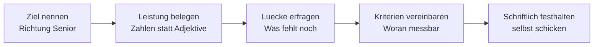

# Dialogue · Karrieregespräch (1:1)

> **Level:** C1 · **Focus:** Entwicklung ansprechen, Feedback einfordern, Kriterien vereinbaren · **Time:** ~1.5 h
> _After this module you can ask for the next step in your career in German — and leave the meeting with written criteria instead of goodwill._

Das jährliche **Mitarbeitergespräch** oder ein reguläres 1:1 ist der Ort, an dem in deutschen Firmen
über Entwicklung entschieden wird — nicht der Flurfunk. Wer dort nur *„Ich würde gern mehr machen"*
sagt, bekommt Zustimmung und nichts weiter. Wer mit Belegen kommt und mit **überprüfbaren Kriterien**
herausgeht, hat den Schritt tatsächlich eingeleitet.

## Objectives / Lernziele

- Ein Entwicklungsziel **konkret** benennen statt allgemein zu wünschen.
- Eigene Leistung **belegen**, ohne anzugeben.
- Nach **Kriterien** fragen: Woran wird es gemessen, bis wann, von wem?
- Kritisches Feedback annehmen und in einen nächsten Schritt übersetzen.

## 1. Der Dialog (Deutsch)

**Sabine (Teamleiterin):** Schön, dass wir mal in Ruhe reden. Wie geht es dir insgesamt mit deiner Rolle?

**Cu:** Gut, ehrlich gesagt richtig gut. **Genau deshalb** wollte ich heute etwas ansprechen: Ich **würde mich gern** in Richtung Senior entwickeln — und wollte fragen, was dafür aus deiner Sicht noch fehlt.

**Sabine:** Das freut mich, dass du das von dir aus ansprichst. Sag mal aus deiner Sicht: Wo stehst du gerade?

**Cu:** **Fachlich fühle ich mich sicher.** Ich habe im letzten halben Jahr die Migration der Zahlungsdienste verantwortet — zwölf Services, ohne größeren Ausfall. Und ich mache seit April das Onboarding der beiden Neuen, inklusive Pairing zwei Vormittage pro Woche.

**Sabine:** Das sehe ich genauso, die Migration lief sehr sauber. **Wo ich noch Luft sehe**, ist der Bereich außerhalb des eigenen Teams. Ein Senior bei uns wird auch gerufen, wenn andere Teams eine Architekturfrage haben — und da bist du bisher wenig sichtbar.

**Cu:** **Das kann ich nachvollziehen.** Ich habe mich in der Architekturrunde bisher eher zurückgehalten. **Verstehe ich dich richtig** — es geht weniger um Wissen als um Sichtbarkeit?

**Sabine:** Genau. Es geht um Wirkung über das Team hinaus. Das ist bei uns der Hauptunterschied zwischen den Stufen.

**Cu:** Dann **würde ich das gern konkret machen.** Woran würdest du in sechs Monaten sehen, dass ich so weit bin?

**Sabine:** Gute Frage. Ich würde sagen: Du hast mindestens zwei Architekturentscheidungen über Teamgrenzen hinweg begleitet und dokumentiert, du vertrittst uns regelmäßig in der Architekturrunde, und das Onboarding läuft so, dass du nicht mehr der einzige Ansprechpartner bist.

**Cu:** **Halten wir das so fest?** Ich würde es aufschreiben und dir schicken — dann haben wir beide dieselbe Version.

**Sabine:** Sehr gern, mach das.

**Cu:** Noch eine Frage: **Wie realistisch ist der Zeitrahmen?** Sechs Monate — oder hängt es an einem Budget- oder Stellenrahmen?

**Sabine:** Fair, dass du fragst. Die Beförderungsrunde ist im Frühjahr, das ist der nächste mögliche Zeitpunkt. Bis dahin müssen die Punkte belegt sein, sonst wird es die Runde danach.

**Cu:** Verstanden. **Dann plane ich auf das Frühjahr.** Und was das Gehalt angeht: Wird das im Zuge der Beförderung mit angepasst, oder ist das ein separater Vorgang?

**Sabine:** Das läuft zusammen. Aber lass uns das führen, wenn die Beförderung steht — vorher kann ich dir keine Zahl nennen.

**Cu:** Das ist völlig in Ordnung. **Dann fasse ich zusammen:** zwei begleitete Architekturentscheidungen, regelmäßige Vertretung in der Runde, Onboarding auf mehrere Schultern. Ziel Frühjahr, Gehalt dann gemeinsam.

**Sabine:** Genau so. Und melde dich zwischendurch, wenn du irgendwo hängst — dafür sind wir da.

🔊 **Schlüsselsätze zum Nachsprechen:**

```audio
Ich würde mich gern in Richtung Senior entwickeln — und wollte fragen, was dafür aus deiner Sicht noch fehlt.
```

```audio
Verstehe ich dich richtig: Es geht weniger um Wissen als um Sichtbarkeit? Dann würde ich das gern konkret machen. Woran würdest du in sechs Monaten sehen, dass ich so weit bin?
```

```audio
Halten wir das so fest? Ich würde es aufschreiben und dir schicken — dann haben wir beide dieselbe Version.
```

## 2. English translation

- **Sabine:** Good that we can talk properly. How are you doing with your role overall?
- **Cu:** Good — honestly, really good. Which is exactly why I wanted to raise something today: I'd like to develop toward senior, and wanted to ask what's still missing from your point of view.
- **Sabine:** I'm glad you're raising it yourself. Tell me from your side: where do you stand right now?
- **Cu:** Technically I feel confident. Over the last six months I was responsible for the migration of the payment services — twelve services, no major outage. And since April I've been doing the onboarding of the two new colleagues, including pairing two mornings a week.
- **Sabine:** I see it the same way, the migration went very cleanly. Where I still see room is the area outside your own team. A senior here also gets called when other teams have an architecture question — and there you've been little visible so far.
- **Cu:** I can understand that. I've held back in the architecture round so far. Do I understand you correctly — it's less about knowledge than about visibility?
- **Sabine:** Exactly. It's about impact beyond the team. That's the main difference between the levels here.
- **Cu:** Then I'd like to make that concrete. What would you look at in six months to see that I'm ready?
- **Sabine:** Good question. I'd say: you've accompanied and documented at least two architecture decisions across team boundaries, you represent us regularly in the architecture round, and the onboarding runs so that you're no longer the only contact.
- **Cu:** Shall we record that? I'd write it up and send it to you — then we both have the same version.
- **Sabine:** Gladly, do that.
- **Cu:** One more question: how realistic is the timeframe? Six months — or does it depend on a budget or headcount frame?
- **Sabine:** Fair that you ask. The promotion round is in spring, that's the next possible point. The items have to be evidenced by then, otherwise it'll be the round after.
- **Cu:** Understood. Then I'll plan for spring. And as for salary: is that adjusted along with the promotion, or is it a separate process?
- **Sabine:** It runs together. But let's have that conversation once the promotion is settled — I can't name you a figure before then.
- **Cu:** That's completely fine. So to summarise: two accompanied architecture decisions, regular representation in the round, onboarding spread across several shoulders. Target spring, salary jointly after that.
- **Sabine:** Exactly. And get in touch in between if you're stuck anywhere — that's what we're here for.

## 3. Vietnamese notes (nur für die harten Stellen)

- **das Mitarbeitergespräch** — `VI:` "buổi trao đổi định kỳ với sếp". Thường 1 năm/lần, có biên bản.
- **Wo ich noch Luft sehe** — `VI:` "chỗ tôi thấy còn dư địa". Cách nói giảm cho "chỗ bạn còn thiếu".
  Nghe nhẹ, nhưng đó **chính là** phần phê bình.
- **sich zurückhalten** — `VI:` "giữ kẽ, không lên tiếng". Trong văn hoá Đức thường bị đọc là thiếu
  chủ động, không phải khiêm tốn.
- **die Sichtbarkeit** — `VI:` "mức độ được nhìn thấy". Ở công ty Đức, senior = ảnh hưởng vượt ra
  ngoài nhóm, không chỉ giỏi kỹ thuật.
- **über Teamgrenzen hinweg** — `VI:` "vượt ra ngoài phạm vi nhóm".
- **auf mehrere Schultern verteilen** — `VI:` "chia cho nhiều người gánh".
- **die Beförderungsrunde** — `VI:` "đợt xét thăng chức". Thường 1–2 đợt/năm, có lịch cố định.
- **belegen** — `VI:` "chứng minh bằng bằng chứng cụ thể" — khác *sagen*.
- **hängen an + Dat.** — `VI:` "phụ thuộc vào". *Es hängt am Budget* = còn tuỳ ngân sách.

## 4. Vom Wunsch zum Kriterium — das Kernmuster

Der Unterschied zwischen einem folgenlosen und einem wirksamen Karrieregespräch sind vier Fragen,
die **du** stellst:

| Schritt | Frage | Warum sie wirkt |
|---|---|---|
| 1 · Lücke | *Was fehlt dafür aus deiner Sicht noch?* | Du erfragst die Kritik, statt sie abzuwarten. |
| 2 · Messbarkeit | *Woran würdest du in sechs Monaten sehen, dass ich so weit bin?* | Macht aus einem Eindruck ein Kriterium. |
| 3 · Zeitrahmen | *Hängt es an einem Budget- oder Stellenrahmen?* | Deckt strukturelle Grenzen auf, die niemand freiwillig nennt. |
| 4 · Festhalten | *Ich schreibe es auf und schicke es dir.* | Ohne Dokument ist es eine Erinnerung, kein Ziel. |



> **Warum du das Protokoll schreibst.** Nicht aus Misstrauen — sondern weil die Person gegenüber
> zwanzig solcher Gespräche führt. Wer selbst zusammenfasst, bestimmt die Formulierung und hat im
> Frühjahr ein Dokument, auf das beide sich beziehen können.

## 5. Important grammar (im Dialog markiert)

1. **Konjunktiv II für Wunsch und Vorschlag** — *„Ich **würde** mich gern … entwickeln"*,
   *„**würde** ich das gern konkret machen"*. Der ganze Dialog trägt das Anliegen im Konjunktiv;
   siehe [Phase 5 · Grammar](#/phase-5/grammar).
2. **Rückversichernde Frage** — *„**Verstehe ich dich richtig** — es geht weniger um Wissen als um
   Sichtbarkeit?"* Verb an Position 2 im Aussagesatz, gefolgt von der Paraphrase. Das ist die
   stärkste Zuhörtechnik im Gespräch.
3. ***weniger … als …*** — Vergleichskonstruktion: *„weniger um Wissen **als** um Sichtbarkeit"*.
   Beide Teile im selben Kasus (hier Akkusativ nach *um*).
4. **Perfekt für Belege** — *„Ich **habe** die Migration **verantwortet**"*, *„Ich **mache** seit
   April das Onboarding"*. Abgeschlossenes im Perfekt, Laufendes im Präsens mit *seit*.
5. **Nominalisierte Zusammenfassung** — *„zwei begleitete Architekturentscheidungen, regelmäßige
   Vertretung, Onboarding auf mehrere Schultern"*. Der Nominalstil aus
   [Phase 3 · Grammar](#/phase-3/grammar) macht die Zusammenfassung protokollreif.

## 6. Important vocabulary

| Deutsch | Artikel | Plural | English | VI (if hard) |
|---|---|---|---|---|
| Mitarbeitergespräch | das | -gespräche | performance / development review | trao đổi định kỳ |
| Beförderung | die | Beförderungen | promotion | thăng chức |
| Beförderungsrunde | die | -runden | promotion cycle | đợt xét thăng chức |
| Sichtbarkeit | die | — | visibility | mức độ hiện diện |
| Wirkung | die | Wirkungen | impact | tác động |
| Entwicklungsziel | das | -ziele | development goal | mục tiêu phát triển |
| Stellenrahmen | der | — | headcount frame | chỉ tiêu biên chế |
| Ansprechpartner | der | Ansprechpartner | point of contact | người phụ trách |
| belegen | — | — | to evidence, substantiate | chứng minh |
| begleiten | — | — | to accompany, to shepherd | đồng hành |
| sich zurückhalten | — | — | to hold back | giữ kẽ |
| vertreten | — | — | to represent | đại diện |
| anpassen | — | — | to adjust (salary) | điều chỉnh |

→ Add these to your deck in [Flashcards](#/@flashcards).

## 7. Native expressions · Redemittel

**Das Thema eröffnen** ⭐

| Redemittel | English |
|---|---|
| **Ich wollte heute etwas ansprechen: …** | I wanted to raise something today: … |
| **Ich würde mich gern in Richtung … entwickeln.** | I'd like to develop toward … |
| **Was fehlt dafür aus deiner Sicht noch?** | What's still missing for that from your point of view? |

**Leistung belegen, ohne anzugeben**

| Redemittel | English |
|---|---|
| **Ich habe im letzten halben Jahr … verantwortet.** | Over the last six months I was responsible for … |
| **… zwölf Services, ohne größeren Ausfall.** | … twelve services, without a major outage. |
| **Seit April mache ich …** | Since April I've been doing … |
| **Fachlich fühle ich mich sicher.** | Technically I feel confident. |

**Kritik annehmen und zurückspiegeln** ⭐

| Redemittel | English |
|---|---|
| **Das kann ich nachvollziehen.** | I can understand that. |
| **Verstehe ich dich richtig — es geht um …?** | Do I understand you correctly — it's about …? |
| **Da hast du recht, da habe ich mich zurückgehalten.** | You're right, I've held back there. |
| **Was wäre aus deiner Sicht der erste Schritt?** | What would be the first step from your side? |

**Kriterien vereinbaren** ⭐

| Redemittel | English |
|---|---|
| **Woran würdest du sehen, dass ich so weit bin?** | What would show you that I'm ready? |
| **Dann würde ich das gern konkret machen.** | Then I'd like to make that concrete. |
| **Wie realistisch ist der Zeitrahmen?** | How realistic is the timeframe? |
| **Hängt es an einem Budget- oder Stellenrahmen?** | Does it depend on a budget or headcount frame? |
| **Halten wir das so fest?** | Shall we record it like that? |

**Abschließen**

| Redemittel | English |
|---|---|
| **Dann fasse ich zusammen: …** | So to summarise: … |
| **Ich schreibe es auf und schicke es dir.** | I'll write it up and send it to you. |
| **Dann plane ich auf das Frühjahr.** | Then I'll plan for spring. |

## 🏋️ Drill · Vom Wunsch zum Kriterium

```uebung
? Welche Eröffnung ist im deutschen 1:1 die wirksamste?
* Ich würde mich gern in Richtung Senior entwickeln — was fehlt dafür aus deiner Sicht noch?
x Ich möchte mehr Gehalt.
x Ich mache hier eigentlich schon Senior-Arbeit.
x Wann werde ich endlich befördert?
! Richtung nennen **und** die Lücke erfragen. Die anderen drei fordern ein Ergebnis, ohne den Weg dorthin zu klären — und lassen der anderen Seite nur ja oder nein.

? Wie belegst du Leistung, ohne anzugeben?
* Ich habe die Migration von zwölf Services verantwortet, ohne größeren Ausfall.
x Ich bin der Beste im Team.
x Ohne mich würde hier vieles nicht laufen.
x Ich arbeite sehr viel.
! Handlung plus Zahl. Selbsteinschätzungen sind im Deutschen wertlos; überprüfbare Fakten sind es nicht.

? „Wo ich noch Luft sehe, ist …“ Was ist das?
* die eigentliche Kritik, höflich verpackt
x ein Lob
x eine Nebenbemerkung ohne Bedeutung
x eine Frage
! Deutsche Führungskräfte verpacken Kritik im 1:1 oft in eine Möglichkeitsform. *Luft* heißt: Da fehlt etwas. Genau hier musst du nachhaken, nicht nicken.

? Welche Frage macht aus einem Eindruck ein Kriterium?
* Woran würdest du in sechs Monaten sehen, dass ich so weit bin?
x Findest du, dass ich gut arbeite?
x Bin ich auf dem richtigen Weg?
x Was denkst du über meine Leistung?
! Die anderen drei laden zu einer freundlichen, unverbindlichen Antwort ein. *Woran würdest du sehen* verlangt ein beobachtbares Merkmal.

? Warum fragst du nach Budget- oder Stellenrahmen?
* weil strukturelle Grenzen sonst ungenannt bleiben und dein Plan ins Leere läuft
x um Druck aufzubauen
x weil das Gehalt sonst nicht steigt
x um zu zeigen, dass du dich auskennst
! Eine Beförderung kann an einer Runde, einem Budget oder einer offenen Stelle hängen. Diese Frage kostet nichts und verhindert ein halbes Jahr Arbeit auf ein Ziel, das gar nicht offen ist.

? Wer schreibt die Zusammenfassung des Gesprächs?
* du selbst, und du schickst sie
x die Führungskraft
x die Personalabteilung
x niemand, ein Gespräch reicht
! Nicht aus Misstrauen — sondern weil du die Formulierung bestimmst und im Frühjahr ein gemeinsames Dokument existiert.

? Wie reagierst du auf berechtigte Kritik?
= Das kann ich nachvollziehen | Da hast du recht | Das kann ich nachvollziehen, da habe ich mich zurückgehalten
! Annehmen, nicht verteidigen. Wer sofort erklärt, warum es so kommen musste, bekommt beim nächsten Mal kein ehrliches Feedback mehr.

? Die Führungskraft nennt noch keine Gehaltszahl. Was tust du?
* akzeptieren und die Zahl an die Beförderung koppeln
x auf einer Zahl bestehen
x das Gespräch beenden
x mit einem anderen Angebot drohen
! Solange die Beförderung nicht steht, kann die Führungskraft oft wirklich nichts zusagen. Die Gehaltsverhandlung folgt dann dem Muster aus [Dialogue · Gehaltsgespräch](#/dialogues/gehaltsgespraech).

? „Onboarding auf mehrere Schultern verteilen“ bedeutet …
* die Aufgabe auf mehrere Personen aufteilen, damit sie nicht an einer hängt
x mehr Zeit dafür einplanen
x das Onboarding abschaffen
x die Verantwortung abgeben
! Ein Kriterium, das oft übersehen wird: Ein Senior macht sich in Routineaufgaben **ersetzbar**, um für die schwierigen frei zu sein.
```

## 8. Kultur — was ein deutsches Karrieregespräch erwartet

- **Du eröffnest das Thema.** Auf ein Angebot der Führungskraft zu warten, gilt nicht als bescheiden,
  sondern als fehlende Initiative. Die meisten Beförderungen beginnen mit einem Satz des Mitarbeiters.
- **Belege statt Selbsteinschätzung.** *„Ich bin bereit"* trägt nichts. *„Zwölf Services migriert,
  kein größerer Ausfall"* trägt.
- **Sichtbarkeit ist ein eigenes Kriterium.** In vielen deutschen Firmen ist der Unterschied zwischen
  den Stufen **Wirkung über das Team hinaus** — nicht mehr Fachwissen.
- **Kritik wird weich formuliert und ist trotzdem ernst.** *„Wo ich noch Luft sehe"* ist die Kritik.
  Nicken beendet das Gespräch; Nachfragen macht es nützlich.
- **Gehalt kommt nach der Rolle.** Erst die Beförderung klären, dann die Zahl. Beides gleichzeitig zu
  verhandeln, schwächt meist beides.
- **Ohne Dokument war es ein nettes Gespräch.** Schreib die Kriterien auf und schick sie noch am
  selben Tag.

---

## 🧾 Zusammenfassung · Summary

A German development review turns into a career step only if **you** run four moves. Open the topic
yourself — waiting reads as passivity, not modesty — and name a **direction**, then ask what is
missing. Evidence your case with actions and numbers, never with self-assessment. When the critique
arrives softly wrapped as *„wo ich noch Luft sehe"*, treat it as the real content: acknowledge it,
paraphrase it back (*„Verstehe ich dich richtig — es geht um Sichtbarkeit?"*), and then convert it
with the one question that changes everything: *„Woran würdest du in sechs Monaten sehen, dass ich
so weit bin?"* Ask whether a budget or headcount frame constrains the timing, keep salary for after
the promotion is settled, and write the summary yourself the same day — without a document it was a
pleasant conversation, not a plan.

## 📇 Vokabel-Checkliste · Vocabulary checklist

| Deutsch | Artikel | Plural | English | VI (if hard) |
|---|---|---|---|---|
| Entwicklungsschritt | der | -schritte | development step | bước phát triển |
| Selbsteinschätzung | die | -einschätzungen | self-assessment | tự đánh giá |
| Architekturrunde | die | -runden | architecture forum | hội đồng kiến trúc |
| Zeitrahmen | der | Zeitrahmen | timeframe | khung thời gian |
| Initiative | die | Initiativen | initiative | sự chủ động |
| nachhaken | — | — | to follow up, press further | hỏi tới |
| zurückspiegeln | — | — | to reflect back | phản hồi lại |
| ersetzbar | — | — | replaceable | có thể thay thế |
| unverbindlich | — | — | non-committal | không ràng buộc |

→ Drill these in [Flashcards](#/@flashcards).

## 🗣️ Sprechübung · Speaking practice

1. **Eröffnung.** Sprich deinen Einstiegssatz fünfmal: Richtung plus Frage nach der Lücke.
2. **Belege.** Nenne laut drei eigene Leistungen — jede mit einer Zahl, keine mit einem Adjektiv.
3. **Zurückspiegeln.** Lass dir eine Kritik geben und paraphrasiere sie: *„Verstehe ich dich richtig — …?"*
4. **Kriterienfrage.** Sprich *„Woran würdest du in sechs Monaten sehen, dass ich so weit bin?"*, bis sie beiläufig klingt.

```audio
Ich wollte heute etwas ansprechen: Ich würde mich gern in Richtung Senior entwickeln. Was fehlt dafür aus deiner Sicht noch? Und woran würdest du in sechs Monaten sehen, dass ich so weit bin?
```

## ❓ Mini-Quiz

1. Wer eröffnet in einer deutschen Firma üblicherweise das Thema Beförderung?
2. Was bedeutet *„Wo ich noch Luft sehe, ist …"*?
3. Welche Frage macht aus einem Eindruck ein überprüfbares Kriterium?
4. Warum fragst du nach Budget- oder Stellenrahmen?
5. Wer schreibt die Zusammenfassung — und warum?

> **Lösungen:** 1) **Du selbst** — Warten wirkt als fehlende Initiative. · 2) Das ist die **eigentliche
> Kritik**, höflich verpackt. · 3) *Woran würdest du in sechs Monaten sehen, dass ich so weit bin?* ·
> 4) Weil eine Beförderung an einer Runde, einem Budget oder einer offenen Stelle hängen kann — sonst
> arbeitest du auf ein Ziel hin, das gar nicht offen ist. · 5) **Du**, damit die Formulierung von dir
> stammt und beide dasselbe Dokument haben. More at [Quizzes](#/@quiz).

## 📝 Hausaufgabe · Homework

- [ ] Schreibe **drei Belege** deiner Leistung, jeder mit einer Zahl.
- [ ] Formuliere deinen **Eröffnungssatz** und übe ihn laut.
- [ ] Notiere die **vier Fragen** (Lücke · Messbarkeit · Zeitrahmen · Festhalten) auf eine Karte.
- [ ] Schreibe eine **Musterzusammenfassung** von fünf Zeilen, die du nach dem echten Gespräch nur noch anpassen musst.
- [ ] Führe das Gespräch — oder setze zumindest den Termin.

## 📚 Empfohlene Ressourcen · Recommended resources

- **Verwandt:** [Dialogue · Gehaltsgespräch](#/dialogues/gehaltsgespraech) · [Dialogue · Developer ↔ Team Lead](#/dialogues/team-lead).
- **Feedback-Sprache:** [Phase 4 · Speaking](#/phase-4/speaking) — Ich-Botschaften und der [Übungsteil](#/phase-4/speaking-uebungen).
- **Grammatik:** [Phase 5 · Grammar · Übungsteil](#/phase-5/grammar-uebungen) — Konjunktiv II und Modalnuancen.
- **Schriftlich:** [E-Mail-Baukasten](#/templates/emails) für die Zusammenfassung nach dem Gespräch.
