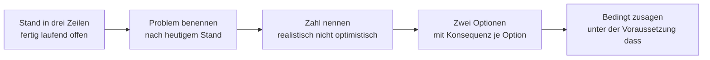

# Dialogue · Kundentermin mit Product Owner

> **Level:** B2+ · **Focus:** Stand berichten, Erwartungen steuern, bedingt zusagen · **Time:** ~1.5 h
> _After this module you can report a delay to a German client without losing their trust — because you say it early, plainly, and with an option attached._

Der Termin mit Kunde und Product Owner ist die Situation, in der deutsche Sachlichkeit am meisten
zählt und am schwersten fällt: Etwas läuft nicht wie geplant, und du musst es sagen. Die Regel ist
einfacher, als sie sich anfühlt — **früh, klar, mit Optionen**. Was in vielen Kulturen als schlechte
Nachricht gilt, gilt hier als Verlässlichkeit.

## Objectives / Lernziele

- Den **Stand** in drei Sätzen berichten: fertig · läuft · offen.
- Eine **Verzögerung** benennen, ohne zu beschönigen und ohne sich zu entschuldigen.
- **Bedingt zusagen** — *unter der Voraussetzung, dass …* — statt zu versprechen.
- Erwartungen steuern und mit einem **nächsten Schritt** abschließen.

## 1. Der Dialog (Deutsch)

**Frau Lorenz (Kundin):** Guten Morgen. Wir würden gern wissen, wo wir mit dem Bestellportal stehen — der Marketingstart ist ja für den fünfzehnten geplant.

**Cu:** Guten Morgen. **Ich fasse den Stand kurz zusammen, dann gehen wir ins Detail.** Fertig und abgenommen ist die Bestellübersicht. In Arbeit ist die Anbindung an den Zahlungsdienst. **Offen — und das ist der Punkt, über den wir heute sprechen sollten** — ist der Export der Rechnungen.

**Frau Lorenz:** Offen heißt: Er kommt nicht zum Fünfzehnten?

**Cu:** **Nach heutigem Stand: nein.** Wir haben in der Testphase gesehen, dass der Zahlungsanbieter die Rechnungsnummern anders vergibt als dokumentiert. Das müssen wir sauber abbilden, sonst stimmen die Nummern in der Buchhaltung nicht.

**Frau Lorenz:** Das klingt ärgerlich. Wie viel Verzug reden wir?

**Cu:** **Realistisch zehn Arbeitstage** nach dem Fünfzehnten. Ich sage bewusst realistisch und nicht optimistisch — **ich möchte Ihnen keine Zahl nennen, die wir dann wieder korrigieren müssen.**

**Frau Lorenz:** Das schätze ich. Nur: Der Marketingstart steht, die Anzeigen sind gebucht.

**Cu:** Verstanden. **Dann würde ich zwei Optionen vorschlagen.** Erstens: Wir starten am Fünfzehnten ohne den Rechnungsexport; die Bestellungen laufen normal, der Export kommt zehn Tage später nach. Zweitens: Wir verschieben den gesamten Start um zwei Wochen und liefern alles zusammen.

**Frau Lorenz:** Was heißt Option eins praktisch für die Buchhaltung?

**Cu:** Die Rechnungen sind vorhanden, sie lassen sich nur nicht automatisch exportieren. Für die ersten zehn Tage wäre der Export manuell nötig — bei Ihrem erwarteten Volumen schätze ich das auf etwa eine Stunde pro Tag.

**Frau Lorenz:** *(überlegt)* Eine Stunde am Tag können wir stemmen. Dann Option eins.

**Cu:** Gut. **Dann halte ich fest:** Start am Fünfzehnten ohne Rechnungsexport, Export bis spätestens zum neunundzwanzigsten, Übergangslösung manuell. **Unter der Voraussetzung, dass** wir bis Freitag die Testzugänge des Zahlungsanbieters bekommen — daran hängt der ganze Zeitplan.

**Frau Lorenz:** Die Zugänge kläre ich heute noch. Was passiert, wenn sie später kommen?

**Cu:** **Dann verschiebt sich der Export Tag für Tag mit.** Ich melde mich unaufgefordert, sobald sich daran etwas ändert — Sie müssen nicht nachfragen.

**Frau Lorenz:** Sehr gut. Und wie halten wir uns bis dahin auf dem Laufenden?

**Cu:** **Ich schicke jeden Dienstag einen kurzen Statusbericht:** Stand, Risiko, nächster Schritt. Und das Protokoll von heute bekommen Sie bis heute Abend.

**Frau Lorenz:** Perfekt. Danke für die klare Ansage — das ist mir lieber als eine schöne Zahl.

🔊 **Schlüsselsätze zum Nachsprechen:**

```audio
Ich fasse den Stand kurz zusammen: Fertig und abgenommen ist die Bestellübersicht. In Arbeit ist die Anbindung an den Zahlungsdienst. Offen ist der Export der Rechnungen.
```

```audio
Realistisch zehn Arbeitstage. Ich sage bewusst realistisch und nicht optimistisch — ich möchte Ihnen keine Zahl nennen, die wir dann wieder korrigieren müssen.
```

```audio
Dann halte ich fest: Start am Fünfzehnten ohne Rechnungsexport. Unter der Voraussetzung, dass wir bis Freitag die Testzugänge bekommen. Ich melde mich unaufgefordert, sobald sich etwas ändert.
```

## 2. English translation

- **Ms Lorenz:** Good morning. We'd like to know where we stand with the order portal — the marketing launch is planned for the fifteenth, after all.
- **Cu:** Good morning. I'll summarise the status briefly, then we'll go into detail. Finished and signed off is the order overview. In progress is the payment-service integration. Open — and that's the point we should talk about today — is the invoice export.
- **Ms Lorenz:** Open means: it won't be there by the fifteenth?
- **Cu:** As things stand today: no. In the test phase we saw that the payment provider assigns invoice numbers differently than documented. We have to map that cleanly, otherwise the numbers in accounting won't match.
- **Ms Lorenz:** That sounds annoying. How much delay are we talking about?
- **Cu:** Realistically ten working days after the fifteenth. I'm deliberately saying realistic and not optimistic — I don't want to give you a figure we then have to correct again.
- **Ms Lorenz:** I appreciate that. Only: the marketing launch is fixed, the ads are booked.
- **Cu:** Understood. Then I'd propose two options. First: we launch on the fifteenth without the invoice export; orders run normally and the export follows ten days later. Second: we postpone the whole launch by two weeks and deliver everything together.
- **Ms Lorenz:** What does option one mean in practice for accounting?
- **Cu:** The invoices exist, they just can't be exported automatically. For the first ten days the export would have to be manual — at your expected volume I estimate about an hour a day.
- **Ms Lorenz:** *(considers)* An hour a day we can manage. Option one, then.
- **Cu:** Good. Then let me record it: launch on the fifteenth without invoice export, export by the twenty-ninth at the latest, manual interim solution. On the condition that we get the payment provider's test credentials by Friday — the whole schedule hangs on that.
- **Ms Lorenz:** I'll sort out the credentials today. What happens if they come later?
- **Cu:** Then the export shifts day for day with them. I'll get in touch unprompted as soon as anything changes — you won't have to ask.
- **Ms Lorenz:** Very good. And how do we keep each other posted until then?
- **Cu:** I'll send a short status report every Tuesday: status, risk, next step. And you'll get today's minutes by this evening.
- **Ms Lorenz:** Perfect. Thank you for the clear message — I prefer that to a nice figure.

## 3. Vietnamese notes (nur für die harten Stellen)

- **abnehmen / abgenommen** — `VI:` "nghiệm thu". *Fertig und abgenommen* = xong **và** khách đã
  chấp nhận — hai việc khác nhau.
- **nach heutigem Stand** — `VI:` "theo tình hình hiện tại". Câu mở đầu bắt buộc khi báo tin xấu:
  nó gắn lời nói vào thời điểm, không hứa mãi mãi.
- **der Verzug** — `VI:` "sự chậm trễ". Trong hợp đồng còn có nghĩa pháp lý — nên nói rõ số ngày.
- **abbilden** — `VI:` "mô hình hoá, thể hiện trong hệ thống".
- **stemmen** — `VI:` "gánh được, kham được". Khẩu ngữ nhưng rất hay dùng trong công việc.
- **Unter der Voraussetzung, dass …** — `VI:` "Với điều kiện là…". Đây là **cam kết có điều kiện**,
  không phải lời hứa.
- **sich unaufgefordert melden** — `VI:` "chủ động báo mà không cần ai hỏi". Ở Đức đây là dấu hiệu
  của *Verlässlichkeit* — đáng tin cậy.
- **die Übergangslösung** — `VI:` "giải pháp tạm thời".
- **Tag für Tag mitverschieben** — `VI:` "trễ bao nhiêu ngày thì dời bấy nhiêu ngày".

## 4. Schlechte Nachrichten auf Deutsch — das Kernmuster



**Vier Regeln, die den Unterschied machen:**

1. **Früh statt fertig.** Eine Verzögerung, die vier Wochen vorher gemeldet wird, ist ein
   Planungsthema. Dieselbe Verzögerung am Stichtag ist ein Vertrauensbruch.
2. **Realistisch statt optimistisch.** *„Ich möchte Ihnen keine Zahl nennen, die wir dann wieder
   korrigieren müssen"* ist ein Satz, den deutsche Kundinnen sehr direkt honorieren.
3. **Optionen statt Entschuldigungen.** Eine lange Entschuldigung verlagert die Arbeit auf die
   andere Seite. Zwei Optionen mit ihren Konsequenzen geben ihr eine Entscheidung.
4. **Bedingt zusagen.** *„Unter der Voraussetzung, dass …"* nennt die Abhängigkeit **vorher** —
   danach klingt dieselbe Abhängigkeit wie eine Ausrede.

| Statt | Sag |
|---|---|
| Es tut mir wirklich sehr leid … | Nach heutigem Stand schaffen wir den Fünfzehnten nicht. |
| Wir versuchen es irgendwie. | Realistisch sind zehn Arbeitstage. |
| Wir schaffen das schon. | Unter der Voraussetzung, dass die Zugänge bis Freitag da sind, ja. |
| Melden Sie sich, wenn Sie was brauchen. | Ich melde mich unaufgefordert, sobald sich etwas ändert. |

## 5. Important grammar (im Dialog markiert)

1. **Vorfeld-Betonung für den Statusbericht** — *„**Fertig und abgenommen ist** die
   Bestellübersicht."* Das Wichtigste steht vorn, das Verb bleibt an Position 2. Diese Inversion
   macht aus drei Sätzen einen Statusbericht.
2. **Konditionale Zusage** — *„**Unter der Voraussetzung, dass** wir … bekommen."* Präposition +
   *dass*-Satz, Verb am Ende. Die formellste Art, eine Bedingung zu setzen.
3. **Konjunktiv II für Vorschläge** — *„Dann **würde** ich zwei Optionen **vorschlagen**"*,
   *„**wäre** der Export manuell nötig"*. Siehe [Phase 5 · Grammar](#/phase-5/grammar).
4. **Passiv ohne Akteur bei Problemen** — *„Wir haben gesehen, dass die Rechnungsnummern anders
   **vergeben werden** als dokumentiert."* Kein Schuldiger, nur ein Sachverhalt —
   dieselbe Technik wie in der [Retrospektive](#/dialogues/retrospektive).
5. ***sobald* + Nebensatz** — *„Ich melde mich, **sobald** sich daran etwas **ändert**."*
   *sobald* ist präziser als *wenn*: Es verspricht den frühestmöglichen Zeitpunkt.

## 6. Important vocabulary

| Deutsch | Artikel | Plural | English | VI (if hard) |
|---|---|---|---|---|
| Verzug | der | — | delay | sự chậm trễ |
| Abnahme | die | Abnahmen | sign-off, acceptance | nghiệm thu |
| Übergangslösung | die | -lösungen | interim solution | giải pháp tạm |
| Arbeitstag | der | Arbeitstage | working day | ngày làm việc |
| Statusbericht | der | -berichte | status report | báo cáo tiến độ |
| Testzugang | der | -zugänge | test credentials | tài khoản thử |
| Buchhaltung | die | Buchhaltungen | accounting | kế toán |
| Volumen | das | Volumina | volume | khối lượng |
| abbilden | — | — | to map, to represent | mô hình hoá |
| stemmen | — | — | to manage, to shoulder | kham được |
| beschönigen | — | — | to gloss over | nói giảm cho đẹp |
| honorieren | — | — | to appreciate, to reward | ghi nhận |

→ Add these to your deck in [Flashcards](#/@flashcards).

## 7. Native expressions · Redemittel

**Stand berichten** ⭐

| Redemittel | English |
|---|---|
| **Ich fasse den Stand kurz zusammen, dann gehen wir ins Detail.** | I'll summarise briefly, then we'll go into detail. |
| **Fertig und abgenommen ist …** | Finished and signed off is … |
| **In Arbeit ist …** | In progress is … |
| **Offen ist … — und das ist der Punkt für heute.** | Open is … — and that's today's point. |

**Schlechte Nachricht** ⭐

| Redemittel | English |
|---|---|
| **Nach heutigem Stand: nein.** | As things stand today: no. |
| **Realistisch sind zehn Arbeitstage.** | Realistically it's ten working days. |
| **Ich sage bewusst realistisch und nicht optimistisch.** | I'm deliberately saying realistic, not optimistic. |
| **Ich möchte Ihnen keine Zahl nennen, die wir korrigieren müssen.** | I don't want to give you a figure we'll have to correct. |

**Optionen anbieten** ⭐

| Redemittel | English |
|---|---|
| **Dann würde ich zwei Optionen vorschlagen.** | Then I'd propose two options. |
| **Erstens: … Zweitens: …** | First: … Second: … |
| **Was heißt das praktisch für …?** | What does that mean in practice for …? |
| **Was wäre Ihnen lieber?** | Which would you prefer? |

**Bedingt zusagen** ⭐

| Redemittel | English |
|---|---|
| **Unter der Voraussetzung, dass …** | On the condition that … |
| **Daran hängt der ganze Zeitplan.** | The whole schedule hangs on that. |
| **Dann verschiebt sich das Tag für Tag mit.** | Then it shifts day for day along with it. |

**Abschließen und Erwartungen steuern**

| Redemittel | English |
|---|---|
| **Dann halte ich fest: …** | Then let me record: … |
| **Ich melde mich unaufgefordert, sobald …** | I'll get in touch unprompted as soon as … |
| **Ich schicke jeden Dienstag einen kurzen Statusbericht.** | I'll send a short status report every Tuesday. |
| **Das Protokoll bekommen Sie bis heute Abend.** | You'll have the minutes by this evening. |

## 🏋️ Drill · Schlechte Nachrichten sauber überbringen

```uebung
? Wie berichtest du den Stand in einem Kundentermin?
x chronologisch, was das Team diese Woche gemacht hat
x nur die Probleme
x nur die Erfolge
* Fertig und abgenommen ist X. In Arbeit ist Y. Offen ist Z.
! Drei Zeilen, drei Zustände. Ein Tätigkeitsbericht beantwortet nicht die einzige Frage der Kundin: Kann ich planen?

? Der Termin ist nicht zu halten. Wann sagst du es?
* sobald du es weißt, auch wenn noch nicht alles geklärt ist
x am Stichtag
x wenn die Kundin nachfragt
x erst, wenn du eine Lösung hast
! Vier Wochen vorher ist es ein Planungsthema, am Stichtag ein Vertrauensbruch. Die Lösung darfst du nachliefern — die Information nicht.

? Welche Zeitangabe ist im deutschen Kundengespräch die richtige?
x Ein paar Tage.
* Realistisch zehn Arbeitstage.
x Wir versuchen, es irgendwie zu schaffen.
x Vielleicht schaffen wir es doch.
! Eine Zahl, die hält, schlägt eine optimistische, die korrigiert werden muss. Und *Arbeitstage* statt *Tage* — der Unterschied sind zwei Wochenenden.

? Was gehört NICHT in die Meldung einer Verzögerung?
x der Grund in einem Satz
x zwei Optionen mit ihren Konsequenzen
* eine lange Entschuldigung
x der neue realistische Termin
! Eine ausführliche Entschuldigung verlagert die Arbeit auf die andere Seite: Sie muss dich dann auch noch beruhigen. Ein Satz genügt, dann die Sache.

? „Unter der Voraussetzung, dass wir bis Freitag die Zugänge bekommen.“ Was ist das?
x eine Ausrede
x eine Absage
x eine Bitte
* eine bedingte Zusage — die Abhängigkeit wird vorher genannt
! Vorher genannt ist es eine Bedingung, hinterher genannt klingt dieselbe Abhängigkeit wie eine Ausrede. Das ist der ganze Unterschied.

? Warum bietest du zwei Optionen statt einer Empfehlung?
* weil die Kundin die Konsequenzen für ihr Geschäft besser beurteilen kann als du
x weil du dich nicht entscheiden willst
x weil das die Verantwortung abgibt
x weil es länger dauert
! Du kennst den technischen Preis jeder Option, sie kennt den geschäftlichen. Eine Empfehlung darfst du danach trotzdem geben.

? „Ich melde mich unaufgefordert, sobald sich etwas ändert.“ Warum ist der Satz stark?
x Er ist reine Höflichkeit.
* Er nimmt der Kundin das Nachfragen ab — genau das ist Verlässlichkeit.
x Er verspricht einen früheren Termin.
x Er verschiebt die Verantwortung.
! *Verlässlichkeit* ist im deutschen Berufsleben eine höhere Währung als Geschwindigkeit. Wer von selbst meldet, muss seltener erklären.

? Formuliere sachlich: „Es tut mir wirklich sehr leid, wir schaffen das leider vielleicht nicht ganz.“
= Nach heutigem Stand schaffen wir den Termin nicht | Nach heutigem Stand schaffen wir den Fünfzehnten nicht
! *Nach heutigem Stand* bindet die Aussage an einen Zeitpunkt und macht sie überprüfbar. *vielleicht nicht ganz* ist keine Information.

? Womit endet ein guter Kundentermin?
x einer Zusammenfassung der Probleme
x der Zusage, sich bald zu melden
* Beschluss, Bedingung, nächster Schritt und Termin des nächsten Berichts
x einem Dank
! „Bald“ ist kein Termin. Der Dienstags-Statusbericht ist einer — und macht den nächsten Anruf überflüssig.
```

## 8. Kultur — was ein deutscher Kundentermin erwartet

- **Sachlichkeit ist Respekt.** Eine klare Absage wird höher bewertet als eine freundliche
  Unklarheit. *„Danke für die klare Ansage"* ist ein echtes Lob.
- **Verlässlichkeit schlägt Geschwindigkeit.** Ein gehaltener realistischer Termin ist mehr wert als
  ein optimistischer, der zweimal verschoben wird.
- **Schlechte Nachrichten früh.** Wer wartet, bis er eine Lösung hat, hat schon zu lange gewartet.
- **Kein übermäßiges Entschuldigen.** Ein Satz reicht. Lange Entschuldigungen wirken nicht höflicher,
  sondern unsicher — und lenken von der Sache ab.
- **Alles Wichtige schriftlich.** Das Protokoll am selben Tag ist Standard, nicht Extraservice —
  siehe [Protokoll, Incident & Übergabe](#/templates/protokoll-incident).
- **Duzen erst nach Angebot.** Mit Kundschaft bleibt es beim **Sie**, bis die andere Seite das Du
  anbietet — auch wenn das Team intern längst per du ist.

---

## 🧾 Zusammenfassung · Summary

A German client meeting rewards plainness. Report the status in **three lines** — *fertig und
abgenommen · in Arbeit · offen* — so the client can plan, not so you can list activity. When a date
will not hold, say it **early**, bind it to a moment (*nach heutigem Stand*), and give a
**realistic** number in *Arbeitstage*, explicitly labelled as realistic rather than optimistic. Skip
the long apology — one sentence, then two **options with their consequences**, because you know the
technical price and the client knows the business one. Commit conditionally with *unter der
Voraussetzung, dass …*, naming the dependency **before** it bites rather than after, when the same
sentence sounds like an excuse. And close with a standing report date plus *„Ich melde mich
unaufgefordert"* — in German working culture, Verlässlichkeit outranks speed.

## 📇 Vokabel-Checkliste · Vocabulary checklist

| Deutsch | Artikel | Plural | English | VI (if hard) |
|---|---|---|---|---|
| Verlässlichkeit | die | — | reliability | sự đáng tin cậy |
| Ansage | die | Ansagen | clear statement, announcement | thông báo rõ ràng |
| Stichtag | der | Stichtage | cut-off date | ngày chốt |
| Zeitplan | der | Zeitpläne | schedule | kế hoạch thời gian |
| Konsequenz | die | Konsequenzen | consequence | hệ quả |
| Rechnungsexport | der | -exporte | invoice export | xuất hoá đơn |
| vergeben (Nummern) | — | — | to assign (numbers) | cấp phát |
| mitverschieben | — | — | to shift along with | dời theo |
| nachliefern | — | — | to deliver later | giao bổ sung |
| beurteilen | — | — | to judge, assess | đánh giá |

→ Drill these in [Flashcards](#/@flashcards).

## 🗣️ Sprechübung · Speaking practice

1. **Dreizeilen-Status.** Berichte dein echtes Projekt in drei Sätzen: fertig · in Arbeit · offen.
2. **Verzögerung melden.** Sprich die schlechte Nachricht in vier Sätzen: Stand · Grund · Zahl · Optionen.
3. **Bedingt zusagen.** Formuliere drei echte Abhängigkeiten mit *unter der Voraussetzung, dass …*
4. **Abschluss.** Sprich den Schlussblock: Beschluss, Bedingung, Berichtsrhythmus.

```audio
Nach heutigem Stand schaffen wir den Fünfzehnten nicht. Realistisch sind zehn Arbeitstage. Dann würde ich zwei Optionen vorschlagen: Erstens starten wir ohne den Export. Zweitens verschieben wir den gesamten Start um zwei Wochen.
```

## ❓ Mini-Quiz

1. Wie berichtest du den Stand in drei Zeilen?
2. Warum sagst du *„realistisch"* statt *„optimistisch"*?
3. Was ist der Unterschied zwischen einer Bedingung und einer Ausrede?
4. Warum zwei Optionen statt einer Empfehlung?
5. Was heißt *„Ich melde mich unaufgefordert"* — und warum zählt es?

> **Lösungen:** 1) *Fertig und abgenommen ist … · In Arbeit ist … · Offen ist …* · 2) Weil eine
> korrigierte Zahl mehr Vertrauen kostet, als eine spätere Zahl gekostet hätte. · 3) Der **Zeitpunkt**:
> vorher genannt ist es eine Bedingung, hinterher eine Ausrede. · 4) Weil die Kundin die geschäftlichen
> Konsequenzen besser beurteilen kann als du. · 5) „Ich melde mich von selbst" — es nimmt der Kundin
> das Nachfragen ab, und **Verlässlichkeit** zählt im deutschen Berufsleben mehr als Tempo.
> More at [Quizzes](#/@quiz).

## 📝 Hausaufgabe · Homework

- [ ] Schreibe deinen **Dreizeilen-Status** für dein echtes Projekt.
- [ ] Formuliere eine echte **Verzögerung** in vier Sätzen — ohne Entschuldigungsabsatz.
- [ ] Bereite **zwei Optionen** mit ihren Konsequenzen vor.
- [ ] Notiere drei echte Abhängigkeiten als *unter der Voraussetzung, dass …*
- [ ] Schicke nach dem nächsten Termin ein **Protokoll am selben Tag**.

## 📚 Empfohlene Ressourcen · Recommended resources

- **Verwandt:** [Dialogue · Sprint Planning](#/dialogues/sprint-planning) · [Dialogue · Deployment-Notfall](#/dialogues/deployment-notfall).
- **Schriftlich:** [Protokoll, Incident & Übergabe](#/templates/protokoll-incident) und der [E-Mail-Baukasten](#/templates/emails) für den Statusbericht.
- **Register:** [Phase 4 · Grammar](#/phase-4/grammar) — Passiv und diplomatische Abschwächung.
- **Moderation:** [Phase 4 · Speaking · Übungsteil](#/phase-4/speaking-uebungen).
