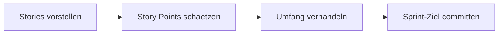

# Dialogue · Sprint Planning

> **Level:** B2 · **Focus:** the language of Scrum planning — estimating stories, negotiating scope, splitting work and committing to a sprint goal · **Time:** ~1.5 h
> _After this module you can take part in a German Sprint Planning: give an estimate, push back on a story that's too big, propose a split, and help phrase and commit to the sprint goal._

**Sprint Planning** is the meeting where the team decides what it can realistically promise. The German here is all about **estimating** (*Ich würde das auf fünf schätzen*), **negotiating scope** (*Das sprengt den Sprint — können wir die Story aufteilen?*) and **committing** (*Committen wir uns darauf*). It leans on **Konjunktiv II** for estimates and proposals, **modal verbs** for capability and obligation, and **conditional clauses** for risks. Below is a realistic planning at a Berlin food-delivery company along the lines of **Delivery Hero**. The team is *per du*: Product Owner Daniel presents, Scrum Master Nadia facilitates, and two devs — Sven (backend) and Aylin (frontend) — estimate and negotiate.

## Objectives / Lernziele

- **Give an estimate** naturally: *Ich würde das auf drei Story Points schätzen.*
- **Flag a risky dependency** with a conditional: *Wenn die Schnittstelle nicht stabil ist, haben wir eine Abhängigkeit.*
- **Push back on scope** politely: *Die Story ist mir zu groß — das sprengt den Sprint.*
- **Propose a split** and re-estimate: *Können wir die Story aufteilen?*
- **Commit to the sprint goal**: *Ich ziehe mit. Committen wir uns darauf.*



## 1. Der Dialog (Deutsch)

**Nadia (Scrum Master):** So, willkommen zum Sprint Planning. Wir haben zwei Wochen und ungefähr vierzig Story Points Kapazität. Daniel, magst du uns durch die wichtigsten Stories führen?

**Daniel (Product Owner):** Gerne. Ganz oben steht die neue Filterfunktion für die Restaurant-Suche: Die Nutzer sollen nach Lieferzeit und Bewertung filtern können. Wie schätzt ihr das ein?

**Sven (Backend):** Backend-seitig ist das überschaubar. Die Query gibt es schon, ich muss sie nur um zwei Parameter erweitern. **Ich würde das auf drei Story Points schätzen.**

**Aylin (Frontend):** Im Frontend ist es etwas mehr — Filter-UI, Zustände, Caching. Ich würde eher auf fünf gehen. Zusammen also acht.

**Nadia:** Acht Punkte für die ganze Story — seid ihr euch da einig?

**Sven:** Ja, acht passt. Aber eine Sache müssen wir klären: Die Bewertungen kommen aus einem anderen Service. **Wenn dessen Schnittstelle nicht stabil ist, haben wir eine Abhängigkeit.**

**Daniel:** Guter Hinweis. Die Schnittstelle steht, das habe ich gestern mit dem anderen Team geklärt. Dann notiere ich acht Punkte. Als Nächstes kommt das neue Empfehlungssystem — personalisierte Vorschläge auf der Startseite.

**Aylin:** Ehrlich gesagt ist mir die Story zu groß und zu unklar. Da steckt Machine Learning dahinter, ein neues Datenmodell, und die Akzeptanzkriterien sind noch schwammig. **Das sprengt den Sprint.**

**Sven:** Sehe ich auch so. Können wir die Story aufteilen? In diesem Sprint machen wir nur die Datenerfassung, die eigentlichen Empfehlungen kommen später.

**Daniel:** Damit kann ich leben. Ich ziehe die Empfehlungslogik raus und lege sie als eigene Story an. Die reine Datenerfassung — wie schätzt ihr die?

**Sven:** Auf fünf. Das ist machbar.

**Nadia:** Dann haben wir acht plus fünf, also dreizehn Punkte fest eingeplant. Bei vierzig Kapazität bleibt genug Luft für den Bugfix-Puffer und die zwei kleinen Tickets. Passt das für alle?

**Aylin:** Für mich ja. Ich ziehe mit.

**Sven:** Von mir aus auch. **Committen wir uns darauf.**

**Nadia:** Super. Dann formulieren wir das Sprint-Ziel: „Nutzer können die Restaurant-Suche filtern, und wir erfassen die Daten für spätere Empfehlungen." Einverstanden?

**Daniel:** Perfekt formuliert. Ich bin dabei — dann ist der Sprint geplant. Danke euch, guten Start!

🔊 **Schlüsselsätze zum Nachsprechen** — the two lines that carry the most reusable planning language, estimating and pushing back on scope:

```audio
Ich würde das auf drei Story Points schätzen. Im Frontend eher auf fünf, zusammen also acht.
```

```audio
Ehrlich gesagt ist mir die Story zu groß und zu unklar. Das sprengt den Sprint. Können wir sie aufteilen?
```

## 2. English translation

- **Nadia:** So, welcome to Sprint Planning. We have two weeks and roughly forty story points of capacity. Daniel, do you want to walk us through the most important stories?
- **Daniel:** Gladly. At the top is the new filter function for the restaurant search: users should be able to filter by delivery time and rating. How do you estimate that?
- **Sven:** On the backend it's manageable. The query already exists, I just have to extend it by two parameters. I'd estimate it at three story points.
- **Aylin:** On the frontend it's a bit more — filter UI, states, caching. I'd rather go with five. So eight together.
- **Nadia:** Eight points for the whole story — are you agreed on that?
- **Sven:** Yes, eight fits. But there's one thing we need to clarify: the ratings come from another service. If its interface isn't stable, we have a dependency.
- **Daniel:** Good point. The interface is in place, I sorted that out with the other team yesterday. Then I'll note eight points. Next up is the new recommendation system — personalised suggestions on the home page.
- **Aylin:** Honestly, that story is too big and too unclear for me. There's machine learning behind it, a new data model, and the acceptance criteria are still vague. That blows up the sprint.
- **Sven:** I see it the same way. Can we split the story? This sprint we only do the data collection, the actual recommendations come later.
- **Daniel:** I can live with that. I'll pull the recommendation logic out and create it as its own story. The pure data collection — how do you estimate that?
- **Sven:** At five. That's doable.
- **Nadia:** So we've got eight plus five, thirteen points firmly planned in. With forty capacity there's enough room for the bugfix buffer and the two small tickets. Does that work for everyone?
- **Aylin:** For me yes. I'm on board.
- **Sven:** Fine by me too. Let's commit to it.
- **Nadia:** Great. Then let's phrase the sprint goal: "Users can filter the restaurant search, and we collect the data for later recommendations." Agreed?
- **Daniel:** Perfectly phrased. I'm in — then the sprint is planned. Thanks, everyone, good start!

## 3. Vietnamese notes (nur für die harten Stellen)

- **etwas einschätzen / schätzen** — `VI:` "ước lượng, đánh giá độ lớn" — trong Scrum là estimate: *Wie schätzt ihr das ein?* Tách được: *ich schätze … ein*.
- **überschaubar** — `VI:` "vừa phải, dễ nắm, không phức tạp" — khối lượng "trong tầm kiểm soát".
- **jemandem zu groß / zu unklar sein** — `VI:` "với tôi thì quá lớn/quá mơ hồ" — *mir* (Dativ) = theo cảm nhận của tôi.
- **den Sprint sprengen** — `VI:` thành ngữ: "làm vỡ/quá tải sprint" — không nhét vừa, vượt capacity.
- **schwammig** — `VI:` "mơ hồ, không rõ ràng" (yêu cầu chưa cụ thể) — ngược với *klar/konkret*.
- **eine Story aufteilen / splitten** — `VI:` "chia nhỏ story" ra nhiều phần.
- **mitziehen** — `VI:` "đồng thuận, cùng làm theo" — *ich ziehe mit* = tôi ủng hộ/theo.
- **sich auf etwas committen** — `VI:` "cam kết vào (điều gì)" — Anh-lai-Đức trong team dev; đi với *auf + Akkusativ*.
- **Damit kann ich leben.** — `VI:` "Tôi chấp nhận được điều đó" — đồng ý một cách thực dụng.

## 4. Important grammar (im Dialog markiert)

Don't re-learn these — just spot them working in a real planning. Full rules live in the phase modules.

1. **Konjunktiv II for estimates & proposals** — *"Ich **würde** das auf drei Punkte **schätzen**"*, *"Ich **würde** eher auf fünf gehen"*, *"Damit **kann** ich leben"*. The polite backbone of estimation — see [Phase 2 · Grammar](#/phase-2/grammar) and negotiation in [Phase 5 · Grammar](#/phase-5/grammar).
2. **Conditional clause (`wenn`)** — *"**Wenn** dessen Schnittstelle nicht stabil **ist**, **haben** wir eine Abhängigkeit"*. Verb-to-end in the *wenn*-clause, then verb-first in the main clause — [Phase 1 · Grammar](#/phase-1/grammar).
3. **Modal verbs stacked** — *"Die Nutzer **sollen** … filtern **können**"* (soll + können + Infinitiv), *"Wir **müssen** das klären"*, *"**Können** wir die Story aufteilen?"*. Recall the modal frame from [Phase 1 · Grammar](#/phase-1/grammar).
4. **Genitive `dessen`** — *"Wenn **dessen** Schnittstelle …"* (*dessen* = "its", genitive of the other service). A compact C1-flavoured relative — [Phase 2 · Grammar](#/phase-2/grammar).
5. **Dative of judgement** — *"Die Story ist **mir** zu groß"* — *mir* marks whose view it is. Case roles in [Phase 1 · Grammar](#/phase-1/grammar).
6. **Separable verbs** — *einschätzen*, *erweitern*, *aufteilen*, *rausziehen*, *anlegen*, *einplanen*, *mitziehen*. Prefix detaches in the main clause — [Phase 1 · Grammar](#/phase-1/grammar).

## 5. Important vocabulary

| Deutsch | Artikel | Plural | English | VI (if hard) |
|---|---|---|---|---|
| Sprint-Planung / Sprint Planning | die | Sprint-Planungen | sprint planning | |
| Story Point | der | Story Points | story point | |
| Kapazität | die | Kapazitäten | capacity | |
| Schätzung | die | Schätzungen | estimate | ước lượng |
| User Story / Story | die | Stories | user story | |
| Umfang | der | Umfänge | scope / size | phạm vi công việc |
| Akzeptanzkriterium | das | Akzeptanzkriterien | acceptance criterion | tiêu chí nghiệm thu |
| Abhängigkeit | die | Abhängigkeiten | dependency | phụ thuộc |
| Sprint-Ziel | das | Sprint-Ziele | sprint goal | |
| Puffer | der | Puffer | buffer | vùng đệm / dự phòng |
| Datenerfassung | die | Datenerfassungen | data collection | thu thập dữ liệu |
| Empfehlungssystem | das | Empfehlungssysteme | recommendation system | |
| Filterfunktion | die | Filterfunktionen | filter feature | |
| Backlog | das | Backlogs | backlog | |

→ Add these to your personal IT deck in [Flashcards](#/@flashcards).

## 6. Native expressions · Redemittel

These are the chunks German teams actually say in planning. Learn them whole.

| Redemittel | English | Wann? |
|---|---|---|
| **Wie schätzt ihr das ein?** | How do you estimate that? | asking for an estimate |
| **Ich würde das auf … schätzen.** | I'd estimate it at … | giving an estimate |
| **Seid ihr euch da einig?** | Are you agreed on that? | checking consensus |
| **Die Story ist mir zu groß / zu unklar.** | The story is too big / unclear for me. | pushing back |
| **Das sprengt den Sprint.** | That blows up the sprint. | scope too big |
| **Können wir die Story aufteilen?** | Can we split the story? | proposing a split |
| **Damit kann ich leben.** | I can live with that. | pragmatic agreement |
| **Passt das ins Sprint-Ziel?** | Does that fit the sprint goal? | checking alignment |
| **Ich ziehe mit. / Ich bin dabei.** | I'm on board. | committing |
| **Committen wir uns darauf.** | Let's commit to it. | sealing the commitment |

> **Pro-Tipp:** In German planning, a factual *„zu groß"* is respected, not rude — *Sachlichkeit* again. But always pair the pushback with a concrete alternative (*„… aber wir könnten sie aufteilen"*); saying only "no" stalls the meeting.

## 7. Formal (Sie) vs. informal (du)

The team is *per du*. You'll switch to **Sie** when an external client, a stakeholder from another company, or a consultant PO joins the planning. Same content, different register:

| Situation | du (Team-intern) | Sie (formal / extern) |
|---|---|---|
| Inviting to present | **Magst du uns durch die Stories führen?** | **Möchten Sie uns durch die Stories führen?** |
| Asking for an estimate | **Wie schätzt ihr das ein?** | **Wie schätzen Sie das ein?** |
| Checking consensus | **Seid ihr euch da einig?** | **Sind Sie sich da einig?** |
| Checking fit | **Passt das für alle?** | **Passt das für Sie?** |
| Committing (we-form) | **Committen wir uns darauf.** | **Committen wir uns darauf.** (unchanged — *wir* stays) |

Note the *wir*-forms (*Committen wir …*, *Formulieren wir …*) don't change between registers — only the *du*/*ihr* → *Sie* address does. More on register in [Phase 6 · Grammar](#/phase-6/grammar).

---

## 🧾 Zusammenfassung · Summary

A German **Sprint Planning** runs on four moves: **estimate** (*Ich würde das auf … schätzen*), **flag risks** with a conditional (*Wenn … nicht stabil ist, haben wir eine Abhängigkeit*), **negotiate scope** (*zu groß, das sprengt den Sprint — können wir aufteilen?*), and **commit** (*Ich ziehe mit. Committen wir uns darauf*). The grammar is **Konjunktiv II** for estimates, **modal verbs** for capability, and **wenn-clauses** for risk — from [Phase 1 · Grammar](#/phase-1/grammar) and [Phase 2 · Grammar](#/phase-2/grammar). Pushing back factually is fine, but always offer an alternative. Teams plan *per du*; only external stakeholders trigger *Sie*.

## 📇 Vokabel-Checkliste · Vocabulary checklist

| Deutsch | Artikel | Plural | English | VI (if hard) |
|---|---|---|---|---|
| Aufwandsschätzung | die | Aufwandsschätzungen | effort estimate | ước lượng công sức |
| Velocity / Geschwindigkeit | die | Geschwindigkeiten | team velocity | |
| einschätzen | — | — | to estimate / assess | |
| aufteilen / splitten | — | — | to split | chia nhỏ |
| einplanen | — | — | to plan in / allocate | đưa vào kế hoạch |
| verhandeln | — | — | to negotiate | thương lượng |
| sich committen (auf) | — | — | to commit (to) | cam kết |
| machbar | — | — | doable / feasible | khả thi |

→ Drill these in [Flashcards](#/@flashcards); more workplace vocab in [Phase 6 · Vocabulary](#/phase-6/vocabulary).

## 🗣️ Sprechübung · Speaking practice

1. **Estimate a task.** Take a real ticket and give a number: *"Ich würde das auf … Story Points schätzen, weil …"*
2. **Flag a dependency** with a conditional: *"Wenn … nicht stabil ist, haben wir eine Abhängigkeit."*
3. **Push back and offer a split**: *"Die Story ist mir zu groß — das sprengt den Sprint. Können wir sie aufteilen? Diesen Sprint nur …, den Rest später."*
4. Record yourself and compare rhythm and stress with the 🔊 below.

```audio
Die Story ist mir zu groß und zu unklar. Können wir sie aufteilen? Diesen Sprint nur die Datenerfassung, die Empfehlungen kommen später.
```

## ❓ Mini-Quiz

1. Give a polite estimate: *"Das sind drei Punkte."* → *"Ich ___ das ___ drei Punkte schätzen."*
2. Complete the conditional: *"___ die Schnittstelle nicht stabil ist, ___ wir eine Abhängigkeit."*
3. Stack the modals: *"Die Nutzer ___ nach Bewertung filtern ___."* (should be able to)
4. Which case is *mir* in *"Die Story ist **mir** zu groß"* — and what does it express?
5. Make it formal: *"Wie schätzt ihr das ein?"* → *"Wie ___ Sie das ein?"*

> **Lösungen:** 1) *Ich **würde** das **auf** drei Punkte schätzen* (Konjunktiv II — [Phase 2 · Grammar](#/phase-2/grammar)). · 2) ***Wenn** die Schnittstelle nicht stabil ist, **haben** wir eine Abhängigkeit* (verb-to-end, then verb-first). · 3) *Die Nutzer **sollen** nach Bewertung filtern **können*** (soll + können, both frame the clause). · 4) **Dativ** — it marks *whose* judgement it is ("too big *for me*"). · 5) *Wie **schätzen** Sie das ein?* More at [Quizzes](#/@quiz).

## 📝 Hausaufgabe · Homework

- [ ] Estimate **three real tickets** out loud, each with *Ich würde … auf … schätzen, weil …*.
- [ ] Write **one dependency risk** as a *wenn*-clause: *„Wenn …, dann …"*.
- [ ] Take one **oversized story** and write a split into two smaller stories with a re-estimate.
- [ ] Draft a **sprint goal** in one sentence: *„Nutzer können …, und wir …"*.
- [ ] Shadow the two 🔊 clips **5× each**, matching stress and speed.
- [ ] Do the [Grammar quiz](#/@quiz) on modal verbs + Konjunktiv II — aim for ≥ 4/5.

## 📚 Empfohlene Ressourcen · Recommended resources

- **Grammar:** mein-deutschbuch.de on **Konditionalsätze (wenn)** and **Modalverben**; deutsch.lingolia.com on Konjunktiv II.
- **Video:** *Easy German* (meetings & opinions), *Deutsch mit Marija* (modal verbs & word order).
- **Podcast:** *Engineering Kiosk* — hear German devs argue scope and estimates in real teams.
- **Next:** the [Daily Standup](#/dialogues/standup) dialogue for the everyday follow-through, and [Phase 6 · Speaking](#/phase-6/speaking) for meeting language.
