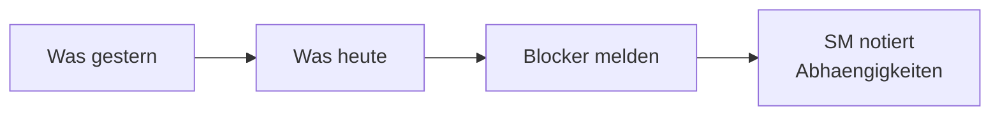

# Dialogue · Daily Standup (Daily-Standup)

> **Level:** B2 · **Focus:** the language of the Scrum daily — reporting progress, naming blockers, asking for help · **Time:** ~1.5 h
> _After this module you can run through your own three standup answers — yesterday, today, blockers — in natural, confident German._

The **Daily** (also *das Stand-up*) is the one meeting you'll speak in every single working day, so it's the fastest German to make automatic. It's short, it's structured, and it re-uses the same handful of phrases. Below is a realistic 15-minute Daily at a Berlin fintech scale-up — a company along the lines of **N26** or **Trade Republic**, where the team is *per du* (everyone uses informal *du*). Three developers report to a Scrum Master. Read it, steal the phrases, and make them yours.

## Objectives / Lernziele

- Deliver your **three standup answers** (gestern / heute / Blocker) fluently.
- Use the core **Redemittel**: *Ich bin durch mit …*, *Ich hänge noch an …*, *Ich bin blockiert durch …*, *Kannst du mich kurz unterstützen?*
- Switch between the **du** (team-internal) and **Sie** (formal) registers on demand.
- Recognise the grammar you already know from [Phase 1 · Grammar](#/phase-1/grammar) at work in real speech.



## 1. Der Dialog (Deutsch)

**Lena (Scrum Master):** Guten Morgen zusammen! Lasst uns pünktlich starten, ich halte uns wie immer kurz — maximal fünfzehn Minuten. Max, magst du anfangen?

**Max (Backend):** Klar. Gestern **bin ich durch mit** dem Refactoring vom Zahlungs-Service. Ich habe die alte Schnittstelle entfernt und die Unit-Tests wieder grün bekommen. Heute nehme ich mir das Code-Review von Priyas Pull Request vor und fange mit der neuen REST-Schnittstelle an. Blocker habe ich keine.

**Lena:** Super, danke. Priya, wie sieht's bei dir aus?

**Priya (Frontend):** Also, ich **hänge noch an** dem Login-Flow. Das Frontend ruft den neuen Endpoint auf, aber ich bekomme ständig einen 401. Ich bin mir nicht sicher, ob das an meinem Token liegt oder am Backend. Ehrlich gesagt **bin ich blockiert durch** dieses Auth-Problem.

**Max:** Das kann an der Konfiguration liegen. Schick mir nach dem Daily kurz den Request, dann schauen wir zusammen drauf.

**Priya:** Sehr gerne, danke.

**Lena:** Gut, dann notiere ich das als Abhängigkeit zwischen euch beiden. Jonas, du bist dran.

**Jonas (DevOps):** Gestern habe ich die Pipeline umgebaut, damit die Deployments schneller durchlaufen. Das hat leider länger gedauert als geplant, weil der Build-Server zwischendurch ausgefallen ist. Heute will ich das Staging-Deployment automatisieren. Ein kleines Hindernis: Mir fehlen noch die Zugangsdaten für die neue Datenbank. **Kannst du mich da kurz unterstützen**, Lena?

**Lena:** Klar, die liegen beim Ops-Team. Ich kümmere mich darum und hake heute Vormittag nach.

**Jonas:** Perfekt, danke dir.

**Lena:** Gibt es sonst noch etwas, das das ganze Team betrifft?

**Max:** Ja, nur eine kurze Erinnerung: Denkt bitte daran, dass wir morgen den Release-Branch einfrieren. Wer noch etwas mergen will, sollte das heute bis fünfzehn Uhr machen.

**Priya:** Guter Hinweis, danke.

**Lena:** Alles klar, dann sind wir durch. Ich fasse zusammen: Max und Priya klären das Auth-Problem, ich besorge Jonas die Zugangsdaten, und der Merge-Stopp ist heute um fünfzehn Uhr. Schönen Tag euch allen!

🔊 **Schlüsselsätze zum Nachsprechen** — the two lines that carry the most reusable standup language:

```audio
Gestern bin ich durch mit dem Refactoring vom Zahlungs-Service. Heute nehme ich mir das Code-Review vor.
```

```audio
Ich hänge noch an dem Login-Flow und bin blockiert durch ein Auth-Problem. Kannst du mich da kurz unterstützen?
```

## 2. English translation

- **Lena:** Good morning, everyone! Let's start on time; as always I'll keep us short — fifteen minutes max. Max, do you want to start?
- **Max:** Sure. Yesterday I finished the refactoring of the payment service. I removed the old interface and got the unit tests green again. Today I'll take on the code review of Priya's pull request and start on the new REST interface. I have no blockers.
- **Lena:** Great, thanks. Priya, how's it going with you?
- **Priya:** Well, I'm still stuck on the login flow. The frontend calls the new endpoint, but I keep getting a 401. I'm not sure whether it's my token or the backend. Honestly, I'm blocked by this auth problem.
- **Max:** That could be down to the configuration. Send me the request after the Daily and we'll look at it together.
- **Priya:** Gladly, thanks.
- **Lena:** Good, I'll note that as a dependency between you two. Jonas, you're up.
- **Jonas:** Yesterday I rebuilt the pipeline so deployments run faster. It took longer than planned, unfortunately, because the build server went down in the middle. Today I want to automate the staging deployment. One small obstacle: I'm still missing the credentials for the new database. Can you give me a hand there, Lena?
- **Lena:** Sure, they're with the ops team. I'll take care of it and follow up this morning.
- **Jonas:** Perfect, thanks.
- **Lena:** Is there anything else that concerns the whole team?
- **Max:** Yes, just a quick reminder: please remember that we freeze the release branch tomorrow. Whoever still wants to merge something should do it today by 3 p.m.
- **Priya:** Good point, thanks.
- **Lena:** All right, then we're done. To summarise: Max and Priya sort out the auth problem, I'll get Jonas the credentials, and the merge stop is today at 3 p.m. Have a good day, everyone!

## 3. Vietnamese notes (nur für die harten Stellen)

- **durch sein mit + Dativ** — `VI:` "xong với, hoàn thành xong" — cách nói khẩu ngữ của dân dev, không phải "đi xuyên qua".
- **an etwas hängen** — `VI:` ở đây nghĩa là "còn mắc/kẹt ở việc gì", chưa xong, không phải "treo".
- **es liegt an + Dativ** — `VI:` "là do/tại vì (cái gì đó)" khi tìm nguyên nhân: *Das liegt an der Konfiguration* = lỗi là do cấu hình.
- **nachhaken** — `VI:` "hỏi/đòi lại cho ra nhẽ, follow up" — tách được: *ich hake nach*.
- **einfrieren (den Branch)** — `VI:` "đóng băng" branch: không cho merge thêm trước release.
- **Wer noch etwas mergen will, …** — `VI:` "Ai còn muốn merge gì thì…" — *wer* làm chủ ngữ của mệnh đề (whoever).

## 4. Important grammar (im Dialog markiert)

Don't re-learn these — just spot them working in real speech. Full rules live in [Phase 1 · Grammar](#/phase-1/grammar).

1. **Inversion / Verb-Second** — *"Gestern **habe** ich die Pipeline umgebaut"*: when *Gestern* takes position 1, the subject *ich* moves after the verb. See word order in [Phase 1 · Grammar](#/phase-1/grammar).
2. **Perfekt for the spoken past** — *"Ich **habe** die alte Schnittstelle **entfernt**"* (haben) vs. *"der Build-Server **ist** … **ausgefallen**"* (sein, change of state). Recall the *haben*/*sein* split from [Phase 1 · Grammar](#/phase-1/grammar).
3. **Nebensatz — verb to the end** — *"…, **weil** der Build-Server zwischendurch **ausgefallen ist**"*. The conjugated verb jumps to the very end after *weil*.
4. **Modal verb + infinitive at the end** — *"Heute **will** ich das Staging-Deployment **automatisieren**"*; *"Wer noch etwas mergen **will**, **sollte** das heute … **machen**"*.
5. **Separable verbs** — *umbauen → **umge**baut*, *anfangen → ich **fange** … **an***, *nachhaken → ich **hake** … **nach***. The prefix detaches in the main clause and rejoins in the Partizip II.

## 5. Important vocabulary

| Deutsch | Artikel | Plural | English | VI (if hard) |
|---|---|---|---|---|
| Daily / Stand-up | das | Dailys / Stand-ups | daily standup | |
| Schnittstelle | die | Schnittstellen | interface / endpoint | |
| Endpoint | der | Endpoints | endpoint | |
| Pull Request (PR) | der | Pull Requests | pull request | |
| Code-Review | das | Code-Reviews | code review | |
| Token | das | Token / Tokens | (auth) token | |
| Pipeline | die | Pipelines | CI/CD pipeline | |
| Build-Server | der | Build-Server | build server | |
| Staging-Deployment | das | Staging-Deployments | staging deployment | |
| Zugangsdaten | die | (nur Plural) | credentials / access data | |
| Abhängigkeit | die | Abhängigkeiten | dependency | phụ thuộc (giữa 2 việc) |
| Release-Branch | der | Release-Branches | release branch | |
| Hindernis | das | Hindernisse | obstacle | trở ngại nhỏ |
| Erinnerung | die | Erinnerungen | reminder | |

→ Add these to your personal IT deck in [Flashcards](#/@flashcards).

## 6. Native expressions · Redemittel

These are the phrases real German dev teams actually say in the Daily. Learn them as fixed chunks.

| Redemittel | English | Wann? |
|---|---|---|
| **Ich bin durch mit …** (+ Dativ) | I'm done with … | reporting a finished task |
| **Ich hänge noch an …** (+ Dativ) | I'm still stuck on … | task not finished yet |
| **Ich bin blockiert durch …** | I'm blocked by … | naming a blocker |
| **Kannst du mich kurz unterstützen?** | Can you give me a hand? | asking for help |
| **Wie sieht's bei dir aus?** | How's it going with you? | handing over to the next person |
| **Ich kümmere mich darum.** | I'll take care of it. | taking ownership |
| **Ich hake (bei X) nach.** | I'll follow up (with X). | chasing something |
| **Lass uns nach dem Daily draufschauen.** | Let's look at it after the Daily. | deferring detail (the "16th-minute" rule) |
| **Ich nehme mir X vor.** | I'll take X on today. | stating today's plan |
| **Blocker habe ich keine.** | No blockers on my side. | clean close of your turn |

> **Pro-Tipp:** German standups value *Struktur*. Keep deep debugging out of the Daily — *"Lass uns das nach dem Daily klären"* is the polite, expected move.

## 7. Formal (Sie) vs. informal (du)

Dev teams are almost always *per du* internally — *"Wir sind hier alle per du."* But you'll need **Sie** with external partners, clients, or a brand-new stakeholder joining the call. Same content, different register:

| Situation | du (team-intern) | Sie (formal / extern) |
|---|---|---|
| Handing over | **Wie sieht's bei dir aus?** | **Wie sieht es bei Ihnen aus?** |
| Inviting to start | **Magst du anfangen?** | **Möchten Sie anfangen?** |
| Asking for help | **Kannst du mich kurz unterstützen?** | **Könnten Sie mich kurz unterstützen?** |
| Sending something | **Schick mir kurz den Request.** | **Schicken Sie mir bitte kurz den Request.** |
| Reminder | **Denkt bitte an den Merge-Stopp.** | **Denken Sie bitte an den Merge-Stopp.** |

Note how *Könnten Sie …?* (Konjunktiv II) is the softer, more formal sibling of *Kannst du …?* — more on softening requests in [Phase 4 · Speaking](#/phase-4/speaking).

---

## 🧾 Zusammenfassung · Summary

A German **Daily** is three answers per person — *gestern*, *heute*, *Blocker* — glued together by a small, fixed set of **Redemittel**: *Ich bin durch mit …*, *Ich hänge noch an …*, *Ich bin blockiert durch …*, *Kannst du mich kurz unterstützen?* The grammar under the hood is nothing new: inversion, Perfekt, Nebensätze with *weil*, modals and separable verbs — all straight from [Phase 1 · Grammar](#/phase-1/grammar). Teams speak *du* internally but switch to *Sie* for externals. Keep it short, name blockers early, and defer the deep debugging to after the meeting.

## 📇 Vokabel-Checkliste · Vocabulary checklist

| Deutsch | Artikel | Plural | English | VI (if hard) |
|---|---|---|---|---|
| Anforderung | die | Anforderungen | requirement | |
| Frist | die | Fristen | deadline | thời hạn |
| einfrieren | — | — | to freeze (a branch) | đóng băng |
| mergen / zusammenführen | — | — | to merge | |
| nachhaken | — | — | to follow up | hỏi cho ra nhẽ |
| sich um etwas kümmern | — | — | to take care of sth | |
| sich etwas vornehmen | — | — | to take sth on / plan to do | |
| entkoppelt | — | — | decoupled | tách rời (loose coupling) |

→ Drill these in [Flashcards](#/@flashcards); more workplace vocab in [Phase 6 · Vocabulary](#/phase-6/vocabulary).

## 🗣️ Sprechübung · Speaking practice

1. **Your real Daily.** Say *your* three answers out loud about your actual current task: *"Gestern bin ich durch mit …, heute nehme ich mir … vor, Blocker habe ich keine."*
2. **Name a blocker + ask for help** in one breath: *"Ich hänge noch an …, ich bin blockiert durch …. Kannst du mich kurz unterstützen?"*
3. **Register switch.** Take your line from (2) and say it once *per du*, once *per Sie*.
4. Record yourself and compare rhythm and stress with the 🔊 below.

```audio
Guten Morgen! Gestern bin ich durch mit dem Bugfix, heute nehme ich mir das Code-Review vor. Blocker habe ich keine.
```

## ❓ Mini-Quiz

1. Complete the Redemittel for a finished task: *"Ich ___ ___ mit dem Refactoring."*
2. You're still not finished with the migration. How do you say it idiomatically?
3. Why is it *"…, weil der Build-Server ausgefallen **ist**"* and not *"… ist ausgefallen"* at this position?
4. Make it formal: *"Kannst du mich kurz unterstützen?"* → *"___ ___ mich kurz unterstützen?"*
5. Perfekt of *abstürzen*: *"Der Server ___ heute Nacht ___."* (haben or sein?)

> **Lösungen:** 1) *Ich **bin durch** mit dem Refactoring.* · 2) *Ich **hänge noch an** der Migration.* · 3) It's a **Nebensatz** (after *weil*), so the conjugated verb *ist* goes to the very end — see [Phase 1 · Grammar](#/phase-1/grammar). · 4) ***Könnten Sie** mich kurz unterstützen?* (Konjunktiv II, formal). · 5) *ist … **abgestürzt*** (change of state → *sein*). More at [Quizzes](#/@quiz).

## 📝 Hausaufgabe · Homework

- [ ] Write your **own three-line Daily** for tomorrow: one Perfekt line (gestern), one modal line (heute), one blocker line using a Redemittel.
- [ ] Rewrite **three lines of the dialogue** from *du* into *Sie*.
- [ ] Underline every **separable verb** and every **Partizip II** in the dialogue (there are at least six).
- [ ] Shadow the two 🔊 audio clips **5× each**, matching stress and speed.
- [ ] Do the [Grammar quiz](#/@quiz) on Perfekt + Nebensatz — aim for ≥ 4/5.

## 📚 Empfohlene Ressourcen · Recommended resources

- **German tech podcasts:** *Engineering Kiosk* and *programmier.bar* — hear real developers use exactly this register.
- **Video:** *Easy German* (workplace & everyday phrases), *Deutsch mit Marija* (verb position & Perfekt).
- **Dictionary:** dict.leo.org and Linguee for IT collocations (e.g. *einen PR reviewen*, *einen Branch mergen*).
- **Next:** [Phase 6 · Speaking — Daily Standups & Reviews](#/phase-6/speaking) and [Phase 3 · IT Vocabulary Systems](#/phase-3/vocabulary).
