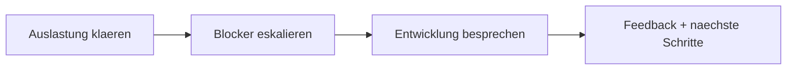

# Dialogue · Developer ↔ Team Lead (1:1)

> **Level:** B2 · **Focus:** the language of the monthly 1:1 — talking about workload, naming a blocker, asking for feedback and steering your own growth · **Time:** ~1.5 h
> _After this module you can run your own 1:1 in German: describe how loaded you are, escalate a blocker calmly, and ask your lead for honest feedback and a next career step._

The **1:1** (das Vieraugengespräch) is where you shape your own working life — not in the Daily, but here, one-on-one with your Team Lead. It rewards a slightly softer, more reflective register than the standup: lots of **Konjunktiv II** (*ich würde …*, *ich hätte gern …*, *das wäre super*) and honest but polite phrasing. Below is a realistic monthly 1:1 at a Munich HR-tech company along the lines of **Personio**. The team is *per du*. Sandra (Team Lead) and Minh (backend developer) talk through three things: how loaded Minh is, a blocker that's eating his week, and where he wants to grow. Steal the phrases and make them yours.

## Objectives / Lernziele

- Describe your **workload** honestly: *Ich komme kaum hinterher*, *mir wächst das über den Kopf*.
- **Escalate a blocker** without drama and hand it to your lead.
- Use **Konjunktiv II** to steer your growth: *Ich würde mich gern … entwickeln*, *ich hätte gern mehr Verantwortung*.
- **Ask for feedback** and receive it: *Wo siehst du bei mir noch Luft nach oben?*
- Switch the same lines between **du** (internal) and **Sie** (formal review).



## 1. Der Dialog (Deutsch)

**Sandra (Team Lead):** Hi Minh, schön, dass wir uns die Zeit für unser 1:1 nehmen. Wie geht's dir gerade — so ganz allgemein?

**Minh (Backend):** Hi Sandra. Im Großen und Ganzen gut, danke. Ehrlich gesagt ist gerade ziemlich viel los. **Ich komme kaum hinterher**, weil ich an drei Themen gleichzeitig sitze.

**Sandra:** Das klingt nach viel. Magst du mir sagen, was dich am meisten auslastet?

**Minh:** Vor allem die Migration auf den neuen Zahlungsanbieter. Die frisst mehr Zeit, als wir geschätzt haben. Nebenbei mache ich noch die Code-Reviews fürs halbe Team. **Mir wächst das gerade ein bisschen über den Kopf.**

**Sandra:** Danke für die Offenheit. Lass uns das gemeinsam sortieren. Was von den drei Themen hat für dich die höchste Priorität?

**Minh:** Ganz klar die Migration — die hat ein festes Enddatum. Die Reviews könnte ich abgeben, wenn jemand anderes einspringt.

**Sandra:** Gute Idee. Ich verteile die Reviews ab morgen auf Tobias und Aylin, dann **nehme ich dir das ab**. Gibt es sonst etwas, das dich blockiert?

**Minh:** Ja, tatsächlich. Ich warte seit einer Woche auf die Zugänge zur neuen Datenbank. Ohne die komme ich bei der Migration nicht weiter — **ich hänge da komplett fest.**

**Sandra:** Das darf nicht sein. Ich spreche heute noch mit dem Platform-Team und eskaliere das, wenn es sein muss. So eine Abhängigkeit sollte dich nicht eine ganze Woche ausbremsen.

**Minh:** Das wäre super, danke. Dann kann ich endlich weitermachen.

**Sandra:** Sehr gern. Kommen wir zum zweiten Teil: Lass uns über deine Entwicklung reden. Wo möchtest du in den nächsten Monaten hin?

**Minh:** **Ich würde mich gern stärker in Richtung Architektur entwickeln.** Ich schreibe gern Code, aber ich hätte gern mehr Einfluss darauf, wie wir unsere Schnittstellen entwerfen.

**Sandra:** Das passt gut, ehrlich gesagt. Du denkst ohnehin schon sehr strukturiert. Ich könnte mir vorstellen, dass du das API-Design für den neuen Service übernimmst — als ersten Schritt.

**Minh:** Das würde ich sehr gern machen. Eine Frage noch: **Wo siehst du bei mir gerade noch Luft nach oben?** Ich hätte gern ehrliches Feedback.

**Sandra:** Fachlich bist du stark. Woran du arbeiten könntest, ist, früher um Hilfe zu bitten — du beißt dich manchmal zu lange allein an einem Problem fest. Sag eher Bescheid, dann sind wir zusammen schneller.

**Minh:** Das stimmt. Das nehme ich mir zu Herzen. Danke, das war ein sehr hilfreiches Gespräch.

**Sandra:** Sehr gerne. Ich fasse zusammen: Ich nehme dir die Reviews ab, ich kläre die DB-Zugänge, und du übernimmst das API-Design. Nächstes Mal schauen wir, wie es läuft.

🔊 **Schlüsselsätze zum Nachsprechen** — the two lines that carry the most reusable 1:1 language, workload and growth:

```audio
Ehrlich gesagt komme ich kaum hinterher. Die Migration frisst mehr Zeit als geschätzt, und mir wächst das gerade über den Kopf.
```

```audio
Ich würde mich gern stärker in Richtung Architektur entwickeln. Wo siehst du bei mir noch Luft nach oben?
```

## 2. English translation

- **Sandra:** Hi Minh, glad we're making time for our 1:1. How are you doing right now — generally speaking?
- **Minh:** Hi Sandra. On the whole, good, thanks. Honestly, there's a lot going on at the moment. I can barely keep up, because I'm sitting on three topics at once.
- **Sandra:** That sounds like a lot. Do you want to tell me what's loading you up the most?
- **Minh:** Mainly the migration to the new payment provider. It's eating more time than we estimated. On the side I'm also doing the code reviews for half the team. It's getting a bit over my head right now.
- **Sandra:** Thanks for being open. Let's sort this out together. Which of the three topics has the highest priority for you?
- **Minh:** Clearly the migration — it has a fixed end date. I could hand off the reviews if someone else steps in.
- **Sandra:** Good idea. I'll spread the reviews across Tobias and Aylin from tomorrow, then I'll take that off your plate. Is there anything else blocking you?
- **Minh:** Yes, actually. I've been waiting a week for access to the new database. Without it I can't make progress on the migration — I'm completely stuck there.
- **Sandra:** That shouldn't be happening. I'll talk to the platform team today and escalate it if I have to. A dependency like that shouldn't hold you up for a whole week.
- **Minh:** That'd be great, thanks. Then I can finally carry on.
- **Sandra:** Gladly. On to part two: let's talk about your development. Where do you want to head in the coming months?
- **Minh:** I'd like to grow more toward architecture. I enjoy writing code, but I'd like more influence over how we design our interfaces.
- **Sandra:** That fits well, honestly. You already think very structured anyway. I could imagine you taking over the API design for the new service — as a first step.
- **Minh:** I'd really like to do that. One more question: where do you see room for improvement with me right now? I'd like honest feedback.
- **Sandra:** Technically you're strong. What you could work on is asking for help earlier — sometimes you dig into a problem alone for too long. Speak up sooner, then we're faster together.
- **Minh:** That's true. I'll take that to heart. Thanks, that was a really helpful conversation.
- **Sandra:** My pleasure. To summarise: I take the reviews off you, I sort out the DB access, and you take over the API design. Next time we'll see how it's going.

## 3. Vietnamese notes (nur für die harten Stellen)

- **hinterherkommen** — `VI:` "theo kịp, làm kịp tiến độ" — tách được: *ich komme kaum hinterher* = làm gần như không kịp.
- **jemandem über den Kopf wachsen** — `VI:` thành ngữ: việc "quá tải, ngập đầu", vượt khả năng kiểm soát — không dịch chữ đen "mọc qua đầu".
- **jemandem etwas abnehmen** — `VI:` ở đây nghĩa "gánh/làm hộ ai việc gì": *Ich nehme dir die Reviews ab*. Đi với Dativ (dir).
- **festhängen / sich festbeißen an + Dativ** — `VI:` "mắc kẹt / cắn chặt vào một vấn đề, cố mãi không buông" — dev hay bị.
- **Luft nach oben (haben)** — `VI:` thành ngữ: "còn chỗ để cải thiện, chưa tối đa" — hỏi feedback rất tự nhiên.
- **sich etwas zu Herzen nehmen** — `VI:` "ghi nhận, tiếp thu nghiêm túc" một lời góp ý.
- **Bescheid sagen/geben** — `VI:` "báo/nói cho biết" — *Sag eher Bescheid* = báo sớm hơn nhé.

## 4. Important grammar (im Dialog markiert)

Don't re-learn these — just spot them working in a real 1:1. Full rules live in the phase modules.

1. **Konjunktiv II for soft wishes & offers** — *"Ich **würde** mich gern … entwickeln"*, *"Ich **hätte** gern mehr Einfluss"*, *"Das **wäre** super"*, *"Ich **könnte** mir vorstellen, dass …"*. This is the polite backbone of the whole 1:1 — see [Phase 2 · Grammar](#/phase-2/grammar) and the negotiation drills in [Phase 5 · Grammar](#/phase-5/grammar).
2. **Verbs with fixed prepositions** — *warten **auf** + Akk* (*Ich warte auf die Zugänge*), *arbeiten **an** + Dat* (*Woran du arbeiten könntest …*), *sich entwickeln **in Richtung***. Learn the preposition with the verb — [Phase 2 · Grammar](#/phase-2/grammar).
3. **Dative object verb** — *jemandem etwas **abnehmen*** (*Ich nehme **dir** die Reviews ab*). The person is Dative, the thing Accusative. Recall the case roles from [Phase 1 · Grammar](#/phase-1/grammar).
4. **Indirect questions as Nebensätze** — *"Magst du mir sagen, **was** dich am meisten **auslastet**?"* — the verb goes to the end of the embedded clause. More in [Phase 4 · Grammar](#/phase-4/grammar).
5. **Separable verbs** — *hinterherkommen → ich komme … **hinter**her*, *abgeben*, *einspringen*, *weitermachen*, *ausbremsen*, *übernehmen*. Prefix detaches in the main clause — [Phase 1 · Grammar](#/phase-1/grammar).

## 5. Important vocabulary

| Deutsch | Artikel | Plural | English | VI (if hard) |
|---|---|---|---|---|
| Vieraugengespräch / 1:1 | das | Vieraugengespräche | one-on-one | nói chuyện riêng 2 người |
| Auslastung | die | Auslastungen | workload / utilisation | mức độ bận/tải |
| Priorität | die | Prioritäten | priority | |
| Abhängigkeit | die | Abhängigkeiten | dependency | phụ thuộc (giữa 2 việc/team) |
| Zugang | der | Zugänge | access / credentials | quyền truy cập |
| Migration | die | Migrationen | migration | |
| Zahlungsanbieter | der | Zahlungsanbieter | payment provider | |
| Schnittstelle | die | Schnittstellen | interface / API | |
| Verantwortung | die | Verantwortungen | responsibility | |
| Entwicklung | die | Entwicklungen | development / growth | |
| Einfluss | der | Einflüsse | influence | tầm ảnh hưởng |
| Feedback | das | Feedbacks | feedback | |
| Enddatum | das | Enddaten | end date / deadline | |

→ Add these to your personal IT deck in [Flashcards](#/@flashcards).

## 6. Native expressions · Redemittel

These are the chunks that make a German 1:1 sound natural. Learn them whole.

| Redemittel | English | Wann? |
|---|---|---|
| **Ich komme kaum hinterher.** | I can barely keep up. | describing overload |
| **Mir wächst das über den Kopf.** | It's getting over my head. | serious overload |
| **Ehrlich gesagt fühle ich mich etwas überlastet.** | Honestly, I feel a bit overloaded. | naming it plainly |
| **Ich hänge da komplett fest.** | I'm completely stuck there. | a hard blocker |
| **Ich würde mich gern in Richtung … entwickeln.** | I'd like to grow toward … | steering your career |
| **Ich hätte gern mehr Verantwortung bei …** | I'd like more responsibility in … | asking for scope |
| **Wo siehst du bei mir noch Luft nach oben?** | Where's my room for improvement? | asking for feedback |
| **Das nehme ich mir zu Herzen.** | I'll take that to heart. | receiving feedback well |
| **Ich nehme dir das ab.** | I'll take that off your plate. | the lead offering relief |
| **Lass uns das gemeinsam sortieren.** | Let's sort this out together. | reframing overload calmly |

> **Pro-Tipp:** German leads value *Ehrlichkeit ohne Drama*. State the problem factually, propose one concrete fix, and let the lead own the escalation — *"Ich hänge fest, weil … . Könntest du das mit dem Platform-Team klären?"*

## 7. Formal (Sie) vs. informal (du)

Your own team lead is almost always *per du*. But you'll hit **Sie** in a formal performance review (*das Mitarbeitergespräch*), with a skip-level manager you've just met, or with an external coach. Same content, different register:

| Situation | du (Team-intern) | Sie (formal / Review) |
|---|---|---|
| Opening | **Wie geht's dir gerade?** | **Wie geht es Ihnen gerade?** |
| Inviting to share | **Magst du mir sagen, was dich auslastet?** | **Möchten Sie mir sagen, was Sie am meisten auslastet?** |
| Offering relief | **Ich nehme dir die Reviews ab.** | **Ich nehme Ihnen die Reviews ab.** |
| Asking for feedback | **Wo siehst du bei mir Luft nach oben?** | **Wo sehen Sie bei mir noch Luft nach oben?** |
| Stating a wish | **Ich würde mich gern weiterentwickeln.** | **Ich würde mich gern weiterentwickeln.** (unchanged — Konjunktiv II already carries the politeness) |

Note that *Ich würde …* / *Ich hätte gern …* stays identical in both registers — **Konjunktiv II** is polite enough on its own. More on softening in [Phase 4 · Grammar](#/phase-4/grammar).

---

## 🧾 Zusammenfassung · Summary

A German **1:1** is three moves: describe your **workload** honestly (*Ich komme kaum hinterher*, *mir wächst das über den Kopf*), **name and hand over a blocker** (*Ich hänge fest — könntest du das eskalieren?*), and **steer your growth** with feedback (*Ich würde mich gern in Richtung … entwickeln*, *Wo siehst du noch Luft nach oben?*). The grammar under the hood is mostly **Konjunktiv II** for politeness plus verbs with fixed prepositions — straight from [Phase 2 · Grammar](#/phase-2/grammar). Teams speak *du*, but the polite Konjunktiv II lines survive unchanged in a formal *Sie* review. State problems factually, propose one fix, and take feedback *zu Herzen*.

## 📇 Vokabel-Checkliste · Vocabulary checklist

| Deutsch | Artikel | Plural | English | VI (if hard) |
|---|---|---|---|---|
| Mitarbeitergespräch | das | Mitarbeitergespräche | performance review | đánh giá nhân sự |
| Überlastung | die | Überlastungen | overload | quá tải |
| eskalieren | — | — | to escalate | |
| priorisieren | — | — | to prioritise | |
| abgeben | — | — | to hand off | |
| einspringen | — | — | to step in / cover | nhảy vào làm thay |
| ausbremsen | — | — | to slow sb down | làm chậm/cản trở |
| sich weiterentwickeln | — | — | to grow / develop further | |

→ Drill these in [Flashcards](#/@flashcards); more workplace vocab in [Phase 6 · Vocabulary](#/phase-6/vocabulary).

## 🗣️ Sprechübung · Speaking practice

1. **Your real workload.** Describe your actual current load: *"Gerade ist viel los. Ich komme kaum hinterher, weil …"*
2. **Hand over a blocker** in two sentences: *"Ich hänge fest bei …, weil ich auf … warte. Könntest du das mit … klären?"*
3. **Steer your growth.** Say where you want to go: *"Ich würde mich gern stärker in Richtung … entwickeln"*, then ask *"Wo siehst du bei mir noch Luft nach oben?"*
4. Record yourself and compare rhythm and stress with the 🔊 below.

```audio
Ich hänge gerade fest, weil ich seit einer Woche auf die Datenbank-Zugänge warte. Könntest du das mit dem Platform-Team klären?
```

## ❓ Mini-Quiz

1. Complete the overload idiom: *"Mir ___ das gerade über den ___."*
2. Turn this into a polite Konjunktiv II wish: *"Ich will mehr Verantwortung."* → *"Ich ___ gern mehr Verantwortung."*
3. Which case is *dir* in *"Ich nehme **dir** die Reviews ab"*, and why?
4. Fill the fixed preposition: *"Ich warte seit einer Woche ___ die Zugänge."*
5. Make it formal: *"Wo siehst du bei mir noch Luft nach oben?"* → *"Wo ___ Sie bei mir noch Luft nach oben?"*

> **Lösungen:** 1) *Mir **wächst** das gerade über den **Kopf**.* · 2) *Ich **hätte** gern mehr Verantwortung* (Konjunktiv II — see [Phase 2 · Grammar](#/phase-2/grammar)). · 3) **Dativ** — *abnehmen* takes a Dative person + Accusative thing (*jemandem etwas abnehmen*). · 4) *Ich warte … **auf** die Zugänge* (*warten auf* + Akk). · 5) *Wo **sehen** Sie …* (Sie-form of *sehen*). More at [Quizzes](#/@quiz).

## 📝 Hausaufgabe · Homework

- [ ] Write **your own three 1:1 lines**: one workload line, one blocker line with *weil*, one growth wish in Konjunktiv II.
- [ ] Rewrite **three lines of the dialogue** from *du* into *Sie* for a formal review.
- [ ] Underline every **Konjunktiv II** form in the dialogue (there are at least five).
- [ ] List three verbs from the module with their **fixed preposition** (e.g. *warten auf*, *arbeiten an*, *sich entwickeln in Richtung*).
- [ ] Shadow the two 🔊 clips **5× each**, matching stress and speed.
- [ ] Do the [Grammar quiz](#/@quiz) on Konjunktiv II — aim for ≥ 4/5.

## 📚 Empfohlene Ressourcen · Recommended resources

- **Grammar:** deutsch.lingolia.com and mein-deutschbuch.de on **Konjunktiv II** — the engine of every polite 1:1 line.
- **Video:** *Deutsch mit Marija* (Konjunktiv II & polite requests), *Easy German* (workplace conversations).
- **Dictionary:** dict.leo.org and Linguee for collocations (*Verantwortung übernehmen*, *Feedback geben*, *Luft nach oben*).
- **Next:** [Phase 4 · Speaking](#/phase-4/speaking) for diplomatic phrasing, and the [Code Review](#/dialogues/code-review) dialogue for giving and taking feedback on a PR.
