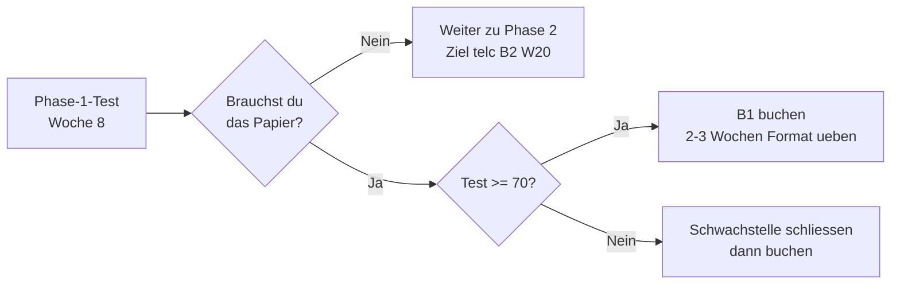

# Goethe B1 · Der Meilenstein in Woche 8

> **Level:** B1 · **Focus:** brauchst du das Zertifikat überhaupt, wie die vier Module funktionieren, und was der Phase-1-Test dir darüber verrät · **Time:** ~2 h
> _After this module you have decided — with reasons — whether to book Goethe B1, and you know the format well enough that the exam holds no surprises._

Dieses Modul ist der **Meilenstein in Woche 8**. Es ist bewusst anders als die anderen
Prüfungsmodule: Bei [telc B2](#/exams/telc-b2-lesen-sprachbausteine) und
[Goethe C1](#/exams/goethe-c1-lesen-hoeren) lautet die Frage *wie bestehe ich*. Hier lautet sie
zuerst **ob du überhaupt antreten solltest**.

Der Grund ist einfach: Diese Roadmap **startet** bei B1. Phase 1 heißt „Strengthen B1", nicht
„Reach B1". Ein Zertifikat über ein Niveau, das du schon hast, ist kein Lernziel — es ist ein
Dokument. Ob du es brauchst, hängt nicht von deinem Deutsch ab, sondern von deinem Aktenordner.

> **Die ehrliche Kurzfassung:** Die meisten Leser dieser Roadmap brauchen Goethe B1 **nicht** für
> den Job — dort zählt B2 aufwärts. Sie brauchen es womöglich für die **Niederlassungserlaubnis**
> oder die **Einbürgerung**. Das ist ein Behördengrund, kein Sprachgrund, und ein völlig legitimer.

## Objectives / Lernziele

- **Decide with reasons**, not by default: a three-question test for whether B1 is worth your week.
- Know the **modular structure** — four modules, each passed and repeated on its own.
- Know what B1 actually asks for, and **how it differs from B2** in week 20.
- Use your **Phase-1 test score** as the readiness signal it was built to be.
- Walk into the exam knowing the shape of every part, so nothing costs you points by surprise.



## 1. Brauchst du das Zertifikat? Drei Fragen

Beantworte sie in dieser Reihenfolge. Bei der ersten klaren Antwort hörst du auf.

| # | Frage | Wenn ja | Wenn nein |
|---|---|---|---|
| 1 | Verlangt eine **Behörde** in den nächsten zwei Jahren einen B1-Nachweis von dir — Niederlassungserlaubnis, Einbürgerung, Familiennachzug? | **Buchen.** Das ist der eigentliche Grund. | weiter zu 2 |
| 2 | Hast du **bereits** einen B1-Nachweis (Integrationskurs, DTZ, früheres Zertifikat, Studienabschluss auf Deutsch)? | **Nicht buchen.** Du hast es schon. | weiter zu 3 |
| 3 | Willst du einmal **echte Prüfungsmechanik** üben, bevor telc B2 in Woche 20 ernst wird? | Optional buchen — als Generalprobe. | **Nicht buchen.** Geh direkt auf B2 zu. |

Der häufigste Fall in dieser Roadmap ist **Frage 1 = ja**. Der zweithäufigste ist **Frage 3**, und
dort ist die Antwort eine Abwägung, keine Pflicht: Eine Generalprobe kostet dich eine Gebühr und
zwei bis drei Wochen Formattraining. Dieselbe Zeit in Phase 2 gesteckt bringt dich näher an B2.

> **Was B1 im Bewerbungsprozess bringt: wenig.** Für IT-Stellen ist B2 die Schwelle, ab der ein
> Zertifikat im Lebenslauf etwas bewirkt. B1 dort zu nennen ist nicht falsch, aber es ersetzt keine
> Zeile Berufserfahrung. Siehe [Der Bewerbungsprozess](#/bewerbung/prozess).

## 2. Der Aufbau — vier Module, einzeln zu erobern

Goethe B1 ist **modular** aufgebaut, genau wie C1. Das ist die eine organisatorische Tatsache, die
deine Vorbereitung verändert:

| Modul | Dauer | Was geprüft wird |
|---|---|---|
| **Lesen** | ~65 min | Anzeigen, Blogbeiträge, Meinungstexte, kurze Sachtexte |
| **Hören** | ~40 min | Durchsagen, Alltagsgespräche, Radiobeiträge, Diskussion |
| **Schreiben** | ~60 min | private Nachricht, Forumsbeitrag mit Meinung, halbformelle Mitteilung |
| **Sprechen** | ~15 min | zu zweit: gemeinsam planen, kurz präsentieren, nachfragen |

Jedes Modul zählt **/100** und ist ab **60 Punkten** bestanden. Jedes Modul kann **einzeln abgelegt
und einzeln wiederholt** werden.

**Was das praktisch heißt:** Du bereitest nicht „die Prüfung" vor, sondern vier getrennte. Bestehst
du drei und fällst im vierten durch, bleiben die drei bestanden — du wiederholst nur eines. Also
steckst du deine Zeit gezielt in dein schwächstes Modul, nicht gleichmäßig in alle vier.

Das Zertifikat wurde gemeinsam mit dem ÖSD entwickelt und heißt deshalb an manchen Prüfungszentren
**Zertifikat B1**. Inhaltlich dasselbe.

> **Termine, Gebühren, Anmeldefristen stehen hier bewusst nicht.** Sie unterscheiden sich je nach
> Prüfungszentrum und ändern sich jährlich. Hol sie dir auf **goethe.de** für dein Zentrum — und
> lade dir dort im selben Zug den kostenlosen **Modellsatz** herunter. Der ist die einzige
> verlässliche Quelle für das aktuelle Format; die Beschreibung hier gibt dir die Struktur, nicht
> den Ersatz.

## 3. B1 gegen B2 — was der Unterschied wirklich ist

Der Sprung von B1 nach B2 in Phase 2 fühlt sich groß an. Er lässt sich aber in einem Satz fassen:

**B1 verlangt, dass du dich verständlich machst. B2 verlangt, dass du Position beziehst.**

| | B1 (Woche 8) | B2 (Woche 20) |
|---|---|---|
| Texte | Alltag, vertraute Themen | auch abstrakte und fachliche Themen |
| Meinung | „Ich finde X gut, weil Y." | abwägen, einräumen, widerlegen |
| Grammatik | Perfekt, Nebensätze, Konjunktiv II als Höflichkeit | Passiv, erweiterte Attribute, Konjunktiv in indirekter Rede |
| Fehler | dürfen auffallen, solange klar bleibt, was gemeint ist | dürfen den Fluss nicht stören |
| Wortschatz | ~2.400 Wörter Alltagsthemen | Alltag + Beruf + Abstraktes |

Wenn du beim Phase-1-Test bereits sicher über 70 liegst, ist B1 für dich keine Herausforderung,
sondern eine Formsache. Das ist eine gute Nachricht — und genau der Grund, warum Frage 1 in
Abschnitt 1 die wichtigste ist.

## 4. Die vier Module, kurz und praktisch

### Lesen — die Aufgabe zuerst lesen

Bei B1 steht die Antwort fast immer **wörtlich** im Text. Das ist der große Unterschied zu C1, wo
Paraphrasen geprüft werden (siehe [Goethe C1 · Lesen & Hören](#/exams/goethe-c1-lesen-hoeren)).
Deshalb funktioniert hier eine Technik, die auf C1 scheitert: **erst die Frage lesen, dann im Text
gezielt danach suchen.**

Die typische Falle sind **Anzeigen-Zuordnungen**: mehr Anzeigen als Personen, und eine Anzeige
passt fast. Lies bei der fast passenden immer das Detail, das nicht passt — Preis, Termin, Ort.

### Hören — zweimal hören heißt nicht zweimal raten

Manche Teile werden **zweimal** gespielt, andere nur einmal. Die Regel für den ersten Durchgang:
**mitschreiben, nicht mitdenken.** Zahlen, Uhrzeiten, Namen, Orte — roh notieren. Beim zweiten
Durchgang entscheidest du.

Zahlen sind bei B1 der häufigste vermeidbare Punktverlust: *vierzehn* und *vierzig*, *dreizehn* und
*dreißig*. Übe sie laut, nicht im Kopf.

### Schreiben — drei kurze Texte, drei Register

Der Prüfungsteil verlangt drei verschiedene Tonlagen: eine **private Nachricht** (du), ein
**Forumsbeitrag mit Meinung** (neutral), eine **halbformelle Mitteilung** (Sie). Wer alle drei im
gleichen Ton schreibt, verliert Punkte, auch bei fehlerfreiem Deutsch.

Die Struktur ist jedes Mal dieselbe: **Anrede → Grund → Inhalt → Bitte oder Vorschlag → Gruß.**
Mehr braucht B1 nicht. Übe die Bausteine dafür im
[Prüfungs-Redemittel-Baukasten](#/exams/pruefungs-redemittel).

### Sprechen — ihr plant zu zweit, ihr konkurriert nicht

Der mündliche Teil läuft **paarweise**. Der wichtigste Satz dazu: **Deine Partnerin oder dein
Partner ist nicht deine Konkurrenz.** Bewertet wird auch, ob du auf die andere Person eingehst —
nachfragen, zustimmen, einen Gegenvorschlag machen. Wer den anderen niederredet, verliert Punkte
für Interaktion.

Die drei Teile: gemeinsam etwas **planen** (ein Ausflug, eine Feier), etwas kurz **präsentieren**,
und danach **Fragen** dazu stellen und beantworten.

## 🏋️ Übungsteil · Workbook

### A. Erkennen — die Prüfungslogik

```uebung
? Was ist die wichtigste organisatorische Eigenschaft des Goethe B1?
x Nur der Durchschnitt aller vier Module zählt.
x Sprechen zählt doppelt.
* Die vier Module sind einzeln bestehbar und einzeln wiederholbar.
x Man muss alle vier am selben Tag bestehen.
! Wie bei C1. Das ändert deine Vorbereitung: Zeit ins schwächste Modul stecken, nicht gleichmäßig verteilen — ein bestandenes Modul bleibt bestanden.

? Ab wie vielen Punkten ist ein Modul bestanden?
= 60 | mindestens 60 | 60 Punkte | ≥ 60
! Jedes Modul zählt /100, bestanden ab 60. Ein Modul mit 59 zieht die anderen nicht mit runter — es wird einzeln wiederholt.

? Du hast 78 im Lesen, 71 im Hören, 55 im Schreiben, 68 im Sprechen. Was tust du?
x die ganze Prüfung wiederholen
x nichts, der Durchschnitt liegt über 60
x Schreiben und Sprechen wiederholen
* nur Schreiben wiederholen
! Drei Module sind bestanden und bleiben es. Genau dafür gibt es die modulare Struktur — der Durchschnitt spielt keine Rolle.

? Was ist der übliche echte Grund, Goethe B1 abzulegen?
* ein Behördennachweis wie Niederlassungserlaubnis oder Einbürgerung
x ein Vorteil bei IT-Bewerbungen
x eine Voraussetzung für telc B2
x eine Pflicht innerhalb dieser Roadmap
! Im Bewerbungsprozess wirkt erst B2. B1 ist fast immer ein Dokument für eine Behörde — ein legitimer Grund, aber ein anderer.

? Warum funktioniert „erst die Frage lesen, dann im Text suchen" bei B1, aber schlecht bei C1?
x Bei C1 darf man den Text nicht zweimal lesen.
* Bei B1 steht die Antwort meist wörtlich im Text, bei C1 als Umformulierung.
x Bei C1 gibt es keine Fragen zum Text.
x Bei B1 ist mehr Zeit pro Text vorgesehen.
! Wörtliche Nähe ist auf B1 ein Hinweis, auf C1 eher ein Warnsignal. Dieselbe Technik, gegensätzliche Wirkung.
```

### B. Anwenden — Format und Entscheidung

```uebung
? Du brauchst den Nachweis für die Einbürgerung und hast im Phase-1-Test 74 Punkte. Was ist der sinnvollste nächste Schritt?
x erst telc B2 abwarten und dann beides zusammen machen
x auf den Nachweis verzichten
* B1 buchen und zwei bis drei Wochen gezielt das Format üben
x sofort ohne Vorbereitung antreten
! 74 heißt: das Niveau steht, es fehlt nur die Formatroutine. Genau dafür ist der Modellsatz da. Auf B2 zu warten verschiebt den Behördentermin ohne Gewinn.

? Du hast bereits ein B1-Zertifikat aus dem Integrationskurs. Was tust du in Woche 8?
x Goethe B1 zur Sicherheit noch einmal ablegen
x den Phase-1-Test überspringen
x auf Goethe C1 umsteigen
* den Phase-1-Test als Standortbestimmung nutzen und direkt auf Phase 2 zugehen
! Ein zweites Papier über dasselbe Niveau bringt nichts. Der Phase-1-Test bleibt trotzdem sinnvoll — er ist die Eingangsmessung für Phase 2, nicht die Prüfungsvorbereitung.

? In einer Zuordnungsaufgabe passt eine Anzeige fast perfekt. Woran erkennst du, ob sie es ist?
* am Detail, das nicht passt — Preis, Termin oder Ort
x an der Länge der Anzeige
x an der Reihenfolge der Anzeigen
x daran, wie viele Wörter sich mit der Aufgabe überschneiden
! Die Distraktoren sind absichtlich fast richtig. Sie scheitern an genau einem konkreten Detail, und das ist meistens eine Zahl.

? Welche drei Register verlangt der Schreiben-Teil?
x Bericht, Protokoll, Beschwerde
* private Nachricht, Forumsbeitrag mit Meinung, halbformelle Mitteilung
x dreimal formelle Briefe
x Lebenslauf, Anschreiben, E-Mail
! Drei Tonlagen sind Teil der Bewertung. Alle drei im selben Ton zu schreiben kostet Punkte, auch bei fehlerfreier Grammatik.

? Im ersten Hördurchgang solltest du vor allem …
x nur zuhören und nichts notieren
x den Text im Kopf übersetzen
* Zahlen, Namen und Orte roh mitschreiben
x sofort die Antworten ankreuzen
! Mitschreiben, nicht mitdenken. Entschieden wird im zweiten Durchgang — und wo es keinen zweiten gibt, hast du wenigstens die Rohdaten.

? Was wird im Sprechen-Teil außer deinem Deutsch noch bewertet?
x wie schnell du sprichst
x wie viele Fachwörter du verwendest
x ob du länger sprichst als die andere Person
* ob du auf deine Partnerin oder deinen Partner eingehst
! Interaktion ist ein eigenes Kriterium: nachfragen, zustimmen, einen Gegenvorschlag machen. Den anderen niederzureden senkt deine eigene Note.

? Welcher Satz passt zum B1-Niveau — nicht darunter, nicht darüber?
* Ich finde den Vorschlag gut, weil wir dann mehr Zeit haben.
x Vorschlag gut. Mehr Zeit.
x Zwar ließe sich einwenden, dass der Vorschlag den Zeitrahmen sprengt, doch überwiegen die Vorteile.
x Ich gut finden Vorschlag.
! B1 heißt: Meinung plus Begründung im Nebensatz. Der dritte Satz ist B2/C1 — richtig, aber nicht das geprüfte Niveau.
```

### C. Produzieren — schreiben und sprechen

1. **Die Entscheidung schriftlich.** Beantworte die drei Fragen aus Abschnitt 1 für dich, jeweils
   mit einem Satz Begründung. Halte am Ende **einen** Satz fest: „Ich lege B1 ab, weil …" oder
   „Ich lege B1 nicht ab, weil …" Diesen Satz brauchst du in Woche 20 wieder.
2. **Halbformelle Mitteilung, ~40 Wörter.** Dein Sprachkurs fällt aus, du willst den Beitrag
   zurück. Anrede → Grund → Bitte → Gruß.
3. **Private Nachricht, ~40 Wörter.** Du sagst einer Freundin ab, die dich zum Grillen eingeladen
   hat, und schlägst einen neuen Termin vor. Duzen, aber vollständige Sätze.
4. **Sprechen, 60 Sekunden laut.** Plane mit einer gedachten Partnerin einen Teamausflug: Vorschlag
   machen, Rückfrage stellen, auf einen Gegenvorschlag reagieren. Nimm dich auf und hör es dir an.

### D. Transfer — an deiner echten Lage

1. **Prüf deinen Aktenordner.** Suche heraus, ob du bereits einen B1-Nachweis hast — DTZ,
   Integrationskurs, altes Zertifikat. Sehr viele Leute haben einen und wissen es nicht mehr.
2. **Ein Termin, konkret.** Wenn Frage 1 mit ja beantwortet ist: Öffne goethe.de, suche dein
   Prüfungszentrum und schreib dir den nächsten realistischen Termin plus Anmeldefrist in den
   Kalender. Ohne Datum bleibt es ein Vorsatz.
3. **Modellsatz statt Meinung.** Lade den kostenlosen Modellsatz herunter und mach **nur den
   Lesen-Teil** unter Zeit. Vergleiche das Ergebnis mit deinem Gefühl aus diesem Modul.

## ✅ Musterlösungen für C und D

```spoiler
**C2 — halbformelle Mitteilung (~40 Wörter)**

> Sehr geehrte Damen und Herren,
>
> mein Deutschkurs am Dienstagabend ist seit drei Wochen ausgefallen. Ich bitte Sie deshalb, mir
> den Beitrag für diesen Monat zurückzuerstatten.
>
> Vielen Dank im Voraus.
>
> Mit freundlichen Grüßen
> Cu Dinh

Warum das reicht: Anrede, ein Satz Grund, ein Satz Bitte, Gruß. B1 verlangt keine Ausschmückung —
Vollständigkeit und der richtige Ton sind die Punkte.

**C3 — private Nachricht (~40 Wörter)**

> Hallo Lisa,
>
> danke für die Einladung! Leider schaffe ich es am Samstag nicht, ich muss arbeiten. Schade.
> Hättest du am nächsten Wochenende Zeit? Ich würde dich gern sehen.
>
> Liebe Grüße
> Cu

Der Unterschied zu C2 liegt nicht in der Grammatik, sondern im Register: *Hallo*, *danke*, *Schade*,
*Liebe Grüße* — und trotzdem ganze Sätze. Genau diese Umschaltung wird bewertet.

**C4 — Sprechen, Bausteine für den Planungsteil**

> **Vorschlag:** Wie wäre es, wenn wir zum Klettern gehen? · Ich würde vorschlagen, dass wir …
> **Rückfrage:** Was hältst du davon? · Passt dir das? · Wie siehst du das?
> **Reagieren:** Das finde ich gut, aber vielleicht … · Guter Punkt. Dann machen wir es so.
> **Einigen:** Dann halten wir fest: Samstag, zehn Uhr, am Bahnhof.

Wer diese vier Bausteine benutzt, erfüllt das Interaktionskriterium fast automatisch.

**D3 — was der Modellsatz dir sagt**

Über 80 % im Lesen unter Zeit heißt: Das Niveau ist da, es fehlt nichts. Zwischen 60 und 80 %:
Formattraining, keine Grammatikwiederholung. Unter 60 %: Zeit war das Problem, nicht Deutsch —
prüfe, ob du zu lange am ersten Text gesessen hast.
```

## 🧾 Zusammenfassung · Summary

- Goethe B1 in Woche 8 ist ein **Meilenstein, keine Pflicht**. Die Entscheidung fällt an drei
  Fragen, und die erste — braucht eine Behörde den Nachweis — entscheidet fast immer.
- Vier Module, jedes **/100**, bestanden ab **60**, jedes **einzeln** ablegbar und wiederholbar.
  Deshalb: Zeit ins schwächste Modul, nicht gleichmäßig verteilen.
- B1 verlangt **verständlich sein**, B2 verlangt **Position beziehen**. Wer im Phase-1-Test sicher
  über 70 liegt, für den ist B1 eine Formsache.
- Für den IT-Bewerbungsprozess wirkt erst **B2**. B1 ist ein Dokument, kein Karriereschritt.
- Termine und Gebühren stehen bewusst nicht hier — **goethe.de** und der kostenlose **Modellsatz**
  sind die verlässlichen Quellen.

## 📇 Vokabel-Checkliste · Vocabulary checklist

| Deutsch | Artikel | Plural | English | VI (if hard) |
|---|---|---|---|---|
| Nachweis | der | Nachweise | proof, certificate | giấy chứng nhận |
| Niederlassungserlaubnis | die | -erlaubnisse | permanent residence permit | giấy định cư vĩnh viễn |
| Einbürgerung | die | Einbürgerungen | naturalisation | nhập quốc tịch |
| Modellsatz | der | Modellsätze | official sample exam paper | bộ đề mẫu chính thức |
| Anmeldefrist | die | Anmeldefristen | registration deadline | hạn đăng ký |
| Zuordnung | die | Zuordnungen | matching task | bài nối |
| Durchsage | die | Durchsagen | public announcement | thông báo loa |
| Forumsbeitrag | der | Forumsbeiträge | forum post | bài đăng diễn đàn |
| Mitteilung | die | Mitteilungen | notification, message | thông báo |
| Generalprobe | die | Generalproben | dress rehearsal | tổng duyệt |
| Standortbestimmung | die | -bestimmungen | assessment of where you stand | xác định trình độ hiện tại |
| Formsache | die | Formsachen | formality | thủ tục hình thức |
| erstatten | — | — | to refund | hoàn lại |
| ablegen | — | — | to sit (an exam) | dự thi |
| eingehen (auf) | — | — | to engage with, respond to | đáp lại, tiếp lời |

→ Drill these and more in [Flashcards](#/@flashcards).

## 📝 Hausaufgabe · Homework

- ☐ Die drei Fragen aus Abschnitt 1 beantworten und **einen** Entscheidungssatz aufschreiben
- ☐ Aktenordner prüfen: liegt schon ein B1-Nachweis vor?
- ☐ Falls buchen: Prüfungszentrum auf goethe.de suchen, Termin **und** Anmeldefrist eintragen
- ☐ Modellsatz herunterladen, Lesen-Teil unter Zeit machen, Ergebnis notieren
- ☐ Die drei Kurztexte aus Block C schreiben — je ~40 Wörter, drei verschiedene Register
- ☐ Den Planungsdialog 60 Sekunden laut aufnehmen und einmal anhören

## 📚 Empfohlene Ressourcen · Recommended resources

- **Goethe-Institut:** Modellsatz und Übungsmaterial zum Zertifikat B1 (kostenlos auf goethe.de),
  dort auch Termine und Gebühren deines Prüfungszentrums.
- **Innerhalb dieser Roadmap:** [Prüfungen · Überblick](#/exams/overview) für die Einordnung aller
  Prüfungen · [Prüfungs-Redemittel](#/exams/pruefungs-redemittel) für die Schreib- und
  Sprechbausteine · [Phase-1-Test](#/phase-1/assessment) als Standortbestimmung ·
  [telc B2 · Lesen & Sprachbausteine](#/exams/telc-b2-lesen-sprachbausteine) als nächster Schritt.
- **Behördliches:** Die Anforderungen für Niederlassungserlaubnis und Einbürgerung unterscheiden
  sich je nach Bundesland und Aufenthaltstitel — frag bei deiner Ausländerbehörde nach, welcher
  Nachweis in deinem Fall zählt, bevor du buchst.
