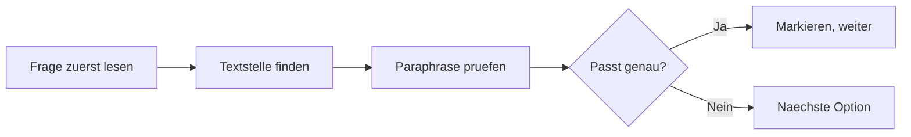

# Goethe C1 · Lesen & Hören

> **Level:** C1 · **Focus:** Modulstrategie, Paraphrasen erkennen, Notizen unter Zeitdruck · **Time:** ~3 h
> _After this module you know why C1 reading punishes vocabulary-hunting — and what to do instead._

Das Goethe-Zertifikat C1 besteht aus **vier Modulen**, die **einzeln bestanden und einzeln
wiederholt** werden können. Jedes Modul zählt **/100**, bestanden ab **60**. Diese eine Regel
verändert deine ganze Vorbereitung: Du bereitest nicht „die Prüfung" vor, sondern vier getrennte
Prüfungen — und du darfst sie einzeln erobern.

**Lesen** und **Hören** sind die beiden rezeptiven Module. Sie sind sich ähnlicher, als es aussieht:
In beiden ist die richtige Antwort fast nie das, was im Text steht, sondern eine **Umformulierung
davon**. Wer Wörter sucht, verliert. Wer Bedeutungen vergleicht, gewinnt.

> ⚠️ **Format vor der Anmeldung prüfen.** Aufgabenzahl und Teilstruktur werden vom Goethe-Institut
> gelegentlich überarbeitet. Lade den aktuellen **Modellsatz C1** auf **goethe.de** herunter und
> vergleiche ihn mit diesem Modul. Die Übungen hier sind **nach dem veröffentlichten Format selbst
> geschrieben** — kein Prüfungsmaterial.

## Objectives / Lernziele

- Die **Modulstrategie** nutzen: was man zuerst angeht und was man notfalls wiederholt.
- **Paraphrasen** erkennen statt Wörter zu suchen.
- Im Lesen die Zeit über die Teile **verteilen** statt sie zu verbrauchen.
- Im Hören unter Zeitdruck **stichwortartig** mitschreiben.

## 1. Die Modulstrategie

| Modul | Zeit | Typische Hürde |
|---|---|---|
| Lesen | ~70 Min. | Dichte und Paraphrasen |
| Hören | ~40 Min. | ein Teil wird nur **einmal** gespielt |
| Schreiben | ~65 Min. | Umfang und Struktur unter Zeitdruck |
| Sprechen | ~15 Min. | paarweise, mit Vorbereitungszeit |

Weil die Module einzeln zählen, gilt: **Bereite alle vier vor, aber optimiere das schwächste.**
Ein Kandidat mit 75 / 72 / 58 / 70 hat drei Module bestanden und wiederholt nur Schreiben — nicht
den ganzen Tag.

```uebung
? Was ist die wichtigste organisatorische Eigenschaft des Goethe C1?
x Sprechen zählt doppelt.
* Die vier Module sind einzeln bestehbar und einzeln wiederholbar.
x Man muss alle vier am selben Tag bestehen.
x Es zählt nur der Durchschnitt.
! Das ändert die Strategie: Du optimierst gezielt das schwächste Modul, statt überall gleichmäßig zu üben.

? Wie viele Punkte braucht man pro Modul?
= 60 | mindestens 60 | 60 Punkte | ≥ 60
! Jedes Modul zählt /100, bestanden ab 60. Ein Modul mit 59 zieht die anderen nicht mit runter — es wird einfach wiederholt.

? Du hast 75 im Lesen, 72 im Hören, 58 im Schreiben, 70 im Sprechen. Was tust du?
x nichts, der Durchschnitt reicht
x Lesen und Schreiben wiederholen
* nur Schreiben wiederholen
x die ganze Prüfung wiederholen
! Drei Module sind bestanden und bleiben es. Genau dafür existiert die modulare Struktur.
```

## 2. Die Kernkompetenz: Paraphrasen erkennen

Auf C1 wird nie die Formulierung des Textes als Antwort angeboten. Die richtige Option sagt
**dasselbe mit anderen Mitteln**; die falschen sind oft **wörtlich näher** am Text.

| Im Text | Richtige Antwort sagt | Falsche Falle |
|---|---|---|
| *Die Maßnahme stieß auf erheblichen Widerstand.* | Viele lehnten sie ab. | *Die Maßnahme war erheblich.* |
| *Der Effekt blieb hinter den Erwartungen zurück.* | Es wirkte weniger als erhofft. | *Es gab keinen Effekt.* |
| *Der Autor räumt ein, dass …* | Er gesteht einen Punkt zu. | *Der Autor fordert, dass …* |
| *Nicht zuletzt deshalb …* | Das ist einer der Gründe. | *Das ist der einzige Grund.* |

Drei Wortgruppen entscheiden dabei fast immer über richtig und falsch:

- **Einschränkung:** *zwar … aber, allerdings, freilich, gleichwohl, indes*
- **Abstufung:** *nicht zuletzt, insbesondere, vor allem, kaum, keineswegs*
- **Haltung des Autors:** *räumt ein, bezweifelt, plädiert für, warnt vor, hält für*

```uebung
? Im Text steht: „Die Maßnahme stieß auf erheblichen Widerstand.“ Welche Antwort ist richtig?
x Die Maßnahme war erheblich.
x Die Maßnahme wurde umgesetzt.
x Es gab keinen Widerstand.
* Viele lehnten die Maßnahme ab.
! Die falsche Option recycelt das auffälligste Wort (*erheblich*). Auf C1 ist wörtliche Nähe eher ein Warnsignal als ein Hinweis.

? Was bedeutet „Der Autor räumt ein, dass …“?
* Er gesteht einen Punkt zu, den er sonst nicht vertritt.
x Er fordert etwas.
x Er bestreitet etwas.
x Er erklärt etwas ausführlich.
! *einräumen* signalisiert ein Zugeständnis — und danach folgt fast immer ein *aber*.

? „Nicht zuletzt deshalb wurde das Projekt gestoppt.“ Was heißt das?
x Das war kein Grund.
* Das war einer der Gründe, und zwar ein wichtiger.
x Das war der einzige Grund.
x Das war der unwichtigste Grund.
! *nicht zuletzt* ist eine Abstufung, keine Ausschließlichkeit. Genau hier setzen Distraktoren an.

? Welche Wörter signalisieren eine Einschränkung? (mehrere richtig)
* zwar … aber
* allerdings
* gleichwohl
x insbesondere
x folglich
! *insbesondere* stuft ab, *folglich* zieht eine Folge. Nur die ersten drei schränken ein.
```

## 3. Lesen — Zeit verteilen statt verbrauchen

Das Modul besteht aus mehreren Teilen mit unterschiedlichen Aufgabentypen: Sachtexte mit
Mehrfachauswahl, kürzere Texte zum Zuordnen, ein Lückentext auf Wortschatz- und Strukturebene.
Prüfe die genaue Zusammensetzung im aktuellen Modellsatz.

**Die Zeitfalle:** Der erste, längste Text zieht Zeit. Setze dir **vorher** ein Limit pro Teil und
halte es — ein halb gelesener letzter Teil kostet mehr Punkte als eine unsichere Antwort im ersten.



**Reihenfolge, die funktioniert:** erst die Frage, dann gezielt die Textstelle, dann alle Optionen
gegen **diese eine** Stelle prüfen. Wer den ganzen Text zuerst liest, liest ihn zweimal.

### Übungstext (nach Prüfungsformat selbst geschrieben)

> **Vier-Tage-Woche: mehr als ein Experiment?**
>
> Seit einigen Jahren erproben Unternehmen verschiedener Branchen eine verkürzte Arbeitswoche bei
> gleichbleibendem Gehalt. Die Befunde aus den bisherigen Versuchen sind bemerkenswert einheitlich:
> Die Zufriedenheit der Beschäftigten steigt deutlich, die Zahl der Krankmeldungen geht zurück, und
> die Produktivität bleibt in vielen Fällen stabil. Kritiker weisen allerdings darauf hin, dass die
> untersuchten Betriebe sich freiwillig gemeldet haben — was die Aussagekraft der Ergebnisse
> einschränkt.
>
> Wer genauer hinsieht, erkennt zudem, dass die Verkürzung selten allein wirkt. In fast allen
> erfolgreichen Fällen wurden gleichzeitig Besprechungen reduziert, Zuständigkeiten geklärt und
> Prozesse vereinfacht. Nicht zuletzt deshalb halten manche Fachleute die eingesparte Zeit für den
> weniger interessanten Teil des Befunds: Entscheidend sei nicht die Vier-Tage-Woche als solche,
> sondern der Zwang, die verbleibende Zeit besser zu organisieren.
>
> Ob sich das Modell durchsetzt, dürfte weniger von den Studien abhängen als von der Lage am
> Arbeitsmarkt. Solange Fachkräfte knapp sind, ist eine verkürzte Woche ein wirksames Argument im
> Wettbewerb um Personal. Kehrt sich diese Lage um, wird sich zeigen, wie belastbar die
> Überzeugungen tatsächlich waren.

```uebung
? Was ist die Hauptaussage des zweiten Absatzes?
x Die Vier-Tage-Woche allein steigert die Produktivität.
x Besprechungen sind das größte Problem in Unternehmen.
x Fachleute lehnen die Vier-Tage-Woche ab.
* Die Verkürzung wirkt vor allem, weil sie zu besserer Organisation zwingt.
! „Entscheidend sei nicht die Vier-Tage-Woche als solche, sondern der Zwang, die verbleibende Zeit besser zu organisieren.“ Der Rest des Absatzes bereitet genau diesen Satz vor.

? Welchen Einwand nennt der Text gegen die bisherigen Befunde?
* Die untersuchten Betriebe haben sich freiwillig gemeldet.
x Die Studien wurden von Gewerkschaften finanziert.
x Die Zahl der Krankmeldungen wurde nicht erhoben.
x Die Produktivität ist überall gesunken.
! *Kritiker weisen allerdings darauf hin, dass …* — das Signalwort *allerdings* kündigt die Einschränkung an.

? „Ob sich das Modell durchsetzt, dürfte weniger von den Studien abhängen als von der Lage am Arbeitsmarkt.“ Was sagt der Satz?
x Das Modell wird sich nicht durchsetzen.
* Der Arbeitsmarkt ist der wichtigere Faktor.
x Studien sind entscheidend.
x Beide Faktoren sind gleich wichtig.
! *weniger … als* ist ein Vergleich mit klarer Rangfolge. *dürfte* markiert zusätzlich eine Vermutung, keine Behauptung.

? Wie steht der Text insgesamt zur Vier-Tage-Woche?
x eindeutig ablehnend
x sachlich neutral ohne jede Wertung
* abwägend — er nennt Belege und Einschränkungen
x eindeutig befürwortend
! Typischer C1-Text: Er referiert Befunde, nennt Kritik und ordnet ein, ohne Partei zu ergreifen. Fragen nach der Haltung des Autors zielen fast immer auf genau diese Abwägung.

? „Kehrt sich diese Lage um, wird sich zeigen, wie belastbar die Überzeugungen tatsächlich waren.“ Was ist grammatisch besonders?
x ein Passivsatz
x ein Relativsatz
x eine indirekte Frage
* ein Konditionalsatz ohne *wenn*, mit dem Verb an erster Stelle
! *Kehrt sich die Lage um, …* = *Wenn sich die Lage umkehrt, …*. Sehr häufig in C1-Texten und leicht zu überlesen.
```

## 4. Hören — mitschreiben, nicht mitdenken

Das Hörmodul kombiniert längere und kürzere Hörtexte, darunter Gespräche und Vorträge. Ein Teil
wird **nur einmal** gespielt — prüfe im Modellsatz, welcher.

Drei Regeln, die Punkte retten:

1. **Fragen vorher lesen.** Die Vorbereitungszeit ist Teil der Aufgabe, nicht Pause.
2. **Stichworte, keine Sätze.** Zahlen, Namen, Negationen. Wer schön schreibt, hört nicht zu.
3. **Negationen markieren.** *nicht, kein, kaum, keineswegs* entscheiden häufiger über die Antwort als jedes Fachwort.

**Hörtext (nach Prüfungsformat selbst geschrieben) — Interview**

```hoertext
Frau Professor Adler, Sie forschen zur Vier-Tage-Woche. Überrascht Sie die Begeisterung? — Ehrlich gesagt überrascht mich eher, wie wenig differenziert diskutiert wird. Die Zahlen sind ja gut, keine Frage. Nur stammen sie überwiegend aus Betrieben, die sich freiwillig gemeldet haben, und das sind selten die, bei denen es ohnehin schlecht läuft. Was wir dagegen ziemlich verlässlich sehen: Wo die Arbeitszeit sinkt, ohne dass gleichzeitig die Zusammenarbeit aufgeräumt wird, verpufft der Effekt innerhalb weniger Monate. Insofern würde ich sagen: Die Vier-Tage-Woche ist kein Ziel, sondern ein Anlass. Und ob sie bleibt, entscheidet nicht die Forschung, sondern der Arbeitsmarkt.
```

```uebung
? Was überrascht Frau Adler nach eigener Aussage?
* wie wenig differenziert diskutiert wird
x wie gut die Zahlen sind
x wie viele Betriebe teilnehmen
x wie stark die Produktivität steigt
! „Ehrlich gesagt überrascht mich **eher**, wie wenig differenziert diskutiert wird.“ Das *eher* korrigiert die Frage — genau das ist die Aufgabe.

? Was passiert laut Adler, wenn nur die Arbeitszeit sinkt?
x Nichts verändert sich.
* Der Effekt verschwindet nach wenigen Monaten.
x Die Produktivität steigt trotzdem.
x Die Krankmeldungen nehmen zu.
! *verpuffen* = wirkungslos verfliegen. Ein typisches C1-Verb, das man einmal lernt und danach überall hört.

? „Die Vier-Tage-Woche ist kein Ziel, sondern ein Anlass.“ Was meint sie damit?
x Sie ist unwichtig.
x Sie sollte abgeschafft werden.
* Sie ist nicht der Zweck, sondern der Auslöser für bessere Organisation.
x Sie ist ein Grund zum Feiern.
! *kein … sondern* ist die schärfste Korrekturfigur im Deutschen — im Hören ein sicheres Signal, dass gleich die Kernaussage kommt.

? Wovon hängt laut Adler die Zukunft des Modells ab?
= vom Arbeitsmarkt | Arbeitsmarkt | von der Lage am Arbeitsmarkt
! Letzter Satz. Bei Interviews steht die Kernaussage sehr oft ganz am Ende — nicht vorher abschalten.

? Welche Wörter musst du beim Hören besonders markieren?
x Fachbegriffe
x Eigennamen
x Zahlen
* Negationen und Einschränkungen wie *kein*, *kaum*, *eher*, *nur*
! Namen und Zahlen schreibt man ohnehin mit. Die Antwort kippt fast immer an einer Negation oder Abstufung — und die überhört man am leichtesten.
```

## 5. Die typischen Punktverluste

| Fehler | Kostet | Gegenmittel |
|---|---|---|
| Wörter statt Bedeutungen suchen | viele Punkte | Optionen als Paraphrase prüfen |
| Zu lange am ersten Text | den letzten Teil | Limit pro Teil vorher festlegen |
| Beim Hören mitschreiben wie im Diktat | den Faden | Stichworte, keine Sätze |
| Negationen überlesen | einzelne, aber entscheidende Items | markieren, sobald sie fallen |
| Kein Antwortbogen-Übertrag eingeplant | ganze Antworten | Zeit dafür reservieren |
| Leere Felder | sicher 0 | immer raten, es gibt keinen Abzug |

```audio
Im Lesen ist die richtige Antwort fast nie die wörtliche Formulierung des Textes, sondern eine Umformulierung davon. Im Hören entscheiden die Negationen. Und leere Felder bringen sicher null Punkte — also immer raten.
```

## 🏋️ Kurzübung

**Ü1.** Lade den aktuellen **Modellsatz C1** von goethe.de und vergleiche seine Teilstruktur mit diesem Modul.
**Ü2.** Nimm den Übungstext oben und markiere alle **Einschränkungs- und Abstufungswörter**.
**Ü3.** Formuliere drei Sätze aus dem Text als **Paraphrase** — ohne die auffälligen Wörter zu wiederholen.
**Ü4.** Höre den Hörtext einmal und schreibe **nur Stichworte** mit. Vergleiche danach mit dem Transkript.

```spoiler
**Ü2. Musterlösung (Signalwörter im Text):**
*allerdings* (Einschränkung) · *selten* (Abstufung) · *fast alle* (Abstufung) · *nicht zuletzt*
(Abstufung) · *weniger … als* (Rangfolge) · *dürfte* (Vermutung) · *Solange … , ist …* (Bedingung) ·
*Kehrt sich … um* (Konditional ohne *wenn*).

Acht Stellen in drei Absätzen — und an mindestens vier davon hängt eine Prüfungsfrage.

**Ü3. Musterlösung (drei Paraphrasen):**

| Original | Paraphrase |
|---|---|
| *Die Befunde sind bemerkenswert einheitlich.* | Die Untersuchungen kommen zu sehr ähnlichen Ergebnissen. |
| *Was die Aussagekraft der Ergebnisse einschränkt.* | Deshalb lassen sich die Ergebnisse nur begrenzt verallgemeinern. |
| *Nicht zuletzt deshalb halten manche Fachleute die eingesparte Zeit für den weniger interessanten Teil.* | Für einige Fachleute ist die Zeitersparnis daher nicht das Wichtigste. |

Genau diese Bewegung — dasselbe sagen, ohne dieselben Wörter zu benutzen — ist die eigentliche
C1-Kompetenz. Sie hilft im Lesen, im Hören **und** im Schreiben.

**Ü1, Ü4** prüfst du selbst:

| Check | Frage |
|---|---|
| Format | Stimmt die Teilstruktur im Modellsatz mit diesem Modul überein? |
| Zeit | Hast du dir pro Teil ein Limit gesetzt — und es gehalten? |
| Notizen | Stichworte oder ganze Sätze? |
| Negationen | Hast du *kein, kaum, eher, nur* markiert? |
| Leerfelder | Ist am Ende jedes Feld ausgefüllt? |
```

---

## 🧾 Zusammenfassung · Summary

Goethe C1 is **four separate exams**, each scored /100 and passed at **60**, each individually
repeatable — so prepare all four but optimise your weakest. In both receptive modules the correct
answer is almost never the text's own wording but a **paraphrase** of it, while the distractors sit
suspiciously close to the original; the words that decide are the ones learners skim past —
*allerdings, zwar … aber, nicht zuletzt, weniger … als, räumt ein, dürfte*. In **Lesen**, set a time
limit per part before you start and read the question before the text, not after. In **Hören**, use
the preparation time to read the questions, write **keywords not sentences**, and mark every
negation the moment it lands. And never leave a field empty — there is no penalty for guessing.

## 📇 Vokabel-Checkliste · Vocabulary checklist

| Deutsch | Artikel | Plural | English | VI (if hard) |
|---|---|---|---|---|
| Modellsatz | der | Modellsätze | official sample paper | đề mẫu chính thức |
| Aussagekraft | die | — | validity, informative value | tính thuyết phục |
| Befund | der | Befunde | finding | kết quả nghiên cứu |
| Zuständigkeit | die | Zuständigkeiten | responsibility, remit | phạm vi trách nhiệm |
| Umformulierung | die | -formulierungen | paraphrase | diễn đạt lại |
| einräumen | — | — | to concede | thừa nhận |
| verpuffen | — | — | to fizzle out | tan biến vô ích |
| belastbar | — | — | robust, resilient | vững chắc |
| gleichwohl | — | — | nevertheless | tuy vậy |
| nicht zuletzt | — | — | not least | không kém phần |

→ Drill these in [Flashcards](#/@flashcards).

## 📝 Hausaufgabe · Homework

- [ ] **Ü1** — Modellsatz herunterladen und Format abgleichen.
- [ ] **Ü2 und Ü3** — Signalwörter markieren, drei Paraphrasen schreiben.
- [ ] Einen echten heise- oder Zeit-Artikel lesen und fünf Sätze paraphrasieren.
- [ ] **Ü4** — Hörtext einmal hören, nur Stichworte, dann vergleichen.
- [ ] Zehn Einschränkungs- und Abstufungswörter in [Flashcards](#/@flashcards) anlegen.

## 📚 Empfohlene Ressourcen · Recommended resources

- **Offiziell zuerst:** goethe.de — Modellsatz C1 und Prüfungsordnung.
- **Lesetraining:** Zeit Online, Süddeutsche, heise.de, Informatik Aktuell für dichte Sachtexte.
- **Hörtraining:** DW *Top-Thema*, Deutschlandfunk, Engineering Kiosk für Interviews im C1-Tempo.
- **Weiter:** [Goethe C1 · Schreiben](#/exams/goethe-c1-schreiben) · [Goethe C1 · Sprechen](#/exams/goethe-c1-sprechen).
- **Redemittel:** [Prüfungs-Redemittel · Baukasten](#/exams/pruefungs-redemittel).
