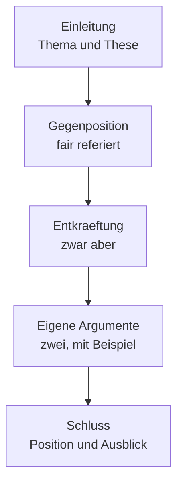

# Goethe C1 · Schreiben

> **Level:** C1 · **Focus:** Textproduktion in 65 Minuten, Bewertungsraster, zwei vollständige Musterlösungen · **Time:** ~3 h
> _After this module you have a writing frame you can fill in under time pressure — and you know which half of the marks is decided before you write a single sentence._

Das Schreibmodul ist für viele das **teuerste** — nicht wegen der Grammatik, sondern wegen der
Uhr. In etwa **65 Minuten** entstehen zwei Texte unterschiedlicher Art, und der häufigste Grund für
ein knappes Nichtbestehen ist nicht ein Fehler, sondern ein **unfertiger zweiter Text**.

Die gute Nachricht: Ein großer Teil der Punkte hängt an **Aufbau und Aufgabenerfüllung** — beides
lässt sich vorher festlegen. Was du im Prüfungsraum wirklich neu erfindest, sind die Argumente.

> ⚠️ **Format vor der Anmeldung prüfen.** Aufgabenzahl, Wortumfang und Gewichtung werden gelegentlich
> überarbeitet. Lade den aktuellen **Modellsatz C1** auf **goethe.de** und vergleiche. Alle Texte
> hier sind **nach dem veröffentlichten Format selbst geschrieben**.

## Objectives / Lernziele

- Die Zeit auf **Planen · Schreiben · Prüfen** verteilen und die Verteilung einhalten.
- Einen **argumentativen Text** aufbauen, der eine Position vertritt statt aufzuzählen.
- Die **Umformulierung** als Werkzeug einsetzen — dieselbe Kompetenz wie im Lesen.
- Die eigenen Texte gegen ein **Raster** prüfen, statt sie nur durchzulesen.

## 1. Die Zeitrechnung

| Phase | Anteil | Was passiert |
|---|---|---|
| Lesen und Planen | ~10 Min. | Aufgabe genau lesen, Gliederung in Stichworten |
| Text 1 schreiben | ~30 Min. | der längere, argumentative Text |
| Text 2 schreiben | ~15 Min. | der kürzere, funktionale Text |
| Prüfen | ~10 Min. | Selbstkontrolle nach fester Liste |

**Die eiserne Regel:** Wenn die Zeit knapp wird, **schreibe den zweiten Text zu Ende** und lass
den ersten unpoliert. Ein fehlender Text kostet mehr als ein unrunder Absatz — genau wie bei telc,
nur mit höherem Einsatz.

```uebung
? Die Zeit wird knapp. Was tust du?
* den zweiten Text zu Ende schreiben und den ersten unpoliert lassen
x den ersten Text perfektionieren
x beide Texte kürzen
x den zweiten Text weglassen
! Aufgabenerfüllung wird pro Text bewertet. Ein fehlender Text ist eine ganze Position; ein unrunder Absatz kostet Nuancen.

? Wie viel Zeit reservierst du fürs Prüfen?
* etwa zehn Minuten
x null — schreiben bis zum Schluss
x eine Minute
x die Hälfte
! In zehn Minuten findest du Endungen, Verbstellung und fehlende Konnektoren. Ohne Prüfzeit bleiben genau die Fehler stehen, die am billigsten zu beheben wären.

? Womit beginnst du?
* mit einer Gliederung in Stichworten
x mit dem ersten Satz
x mit der Einleitung, ausformuliert
x mit dem Schluss
! Zehn Minuten Planung machen die dreißig Minuten Schreiben planbar. Wer sofort formuliert, schreibt sich in eine Struktur hinein, die er später nicht mehr verlassen kann.
```

## 2. Der argumentative Text — das Gerüst

Ein C1-Text ist **kein Aufzählen von Meinungen**, sondern eine geführte Argumentation. Fünf Blöcke:



| Block | Aufgabe | Bausteine |
|---|---|---|
| Einleitung | Thema einordnen, These nennen | *In der Diskussion um … wird häufig …* |
| Gegenposition | fair und stark referieren | *Befürworter argumentieren, dass …* |
| Entkräftung | einräumen, dann einschränken | *Zwar … , allerdings …* |
| Eigene Argumente | zwei, jeweils mit Beleg | *Hinzu kommt, dass …* · *Entscheidend erscheint mir …* |
| Schluss | Position, kein neues Argument | *Insgesamt spricht mehr dafür, dass …* |

**Der Block, den fast alle weglassen, ist der zweite.** Eine Gegenposition **stark** zu referieren
und danach zu entkräften, ist auf C1 das Merkmal, das eine Meinungsäußerung von einer Argumentation
trennt.

```uebung
? Welcher Block fehlt in schwachen C1-Texten am häufigsten?
* die fair referierte Gegenposition
x die Einleitung
x der Schluss
x die eigenen Argumente
! Wer nur die eigene Meinung ausbreitet, schreibt B2. Erst das Einräumen und Entkräften zeigt, dass man eine Diskussion überblickt.

? Was gehört NICHT in den Schluss?
* ein neues Argument
x die eigene Position
x ein Ausblick
x eine Zusammenfassung der Abwägung
! Ein neues Argument im Schluss wirkt, als wäre der Text ausgegangen, bevor er fertig war.

? „Zwar lassen sich die Kosten senken, allerdings …“ Was leistet diese Figur?
* Sie räumt einen Punkt ein und schränkt ihn dann ein.
x Sie stimmt vollständig zu.
x Sie lehnt vollständig ab.
x Sie stellt eine Frage.
! *zwar … allerdings/aber* ist das Arbeitspferd des argumentativen Schreibens. Zwei bis drei davon tragen einen ganzen Text.

? Wie viele eigene Argumente sind sinnvoll?
* zwei, jeweils mit Beleg oder Beispiel
x möglichst viele
x eines
x fünf bis sechs
! Zwei ausgeführte Argumente wiegen mehr als fünf behauptete. Beleg heißt nicht Statistik — ein konkretes Beispiel genügt.
```

## 3. Musterlösung — argumentativer Text

**Aufgabe (nach Prüfungsformat selbst geschrieben):** *In einem Online-Forum wird diskutiert, ob
Unternehmen die Vier-Tage-Woche einführen sollten. Nehmen Sie Stellung. Gehen Sie auf mindestens
zwei Argumente der Gegenseite ein.*

> In der Diskussion um die Vier-Tage-Woche wird häufig so getan, als ginge es allein um weniger
> Arbeit. Tatsächlich steht dahinter eine ältere Frage: wie viel von der bezahlten Zeit überhaupt in
> produktive Arbeit fließt.
>
> Die Gegenseite argumentiert nicht ohne Grund. Zum einen lässt sich in Bereichen mit fester
> Präsenzpflicht — in der Pflege, im Verkauf, im Betrieb kritischer Systeme — die Arbeitszeit nicht
> ohne zusätzliches Personal verkürzen. Zum anderen stammen die positiven Befunde überwiegend aus
> Betrieben, die freiwillig teilgenommen haben, was ihre Aussagekraft einschränkt.
>
> Beide Einwände sind berechtigt, treffen aber nicht den Kern. Zwar lässt sich das Modell nicht
> überall übertragen, allerdings war das bei der Einführung des freien Samstags ebenso wenig der
> Fall, und niemand fordert ihn heute zurück. Und der Hinweis auf die Freiwilligkeit spricht weniger
> gegen das Modell als für eine bessere Untersuchung.
>
> Für die Verkürzung spricht aus meiner Sicht vor allem, dass sie einen Zwang erzeugt, der ohne sie
> ausbleibt: Wer einen Tag weniger hat, muss Besprechungen kürzen und Zuständigkeiten klären. In
> meinem eigenen Arbeitsumfeld hat allein die Ankündigung eines kürzeren Freitags dazu geführt, dass
> zwei wöchentliche Termine ersatzlos gestrichen wurden. Hinzu kommt, dass eine verkürzte Woche im
> Wettbewerb um Fachkräfte wirkt — ein Argument, das Unternehmen schneller überzeugt als jede Studie.
>
> Insgesamt spricht mehr dafür als dagegen, das Modell zumindest zu erproben. Entscheidend wird
> allerdings sein, ob die gewonnene Zeit tatsächlich in bessere Organisation fließt — oder ob am
> Ende dieselbe Arbeit in vier statt fünf Tagen erledigt werden soll.

**Was diesen Text auf C1 hebt:** Er referiert die Gegenseite **stark**, bevor er sie entkräftet
(Absatz 2), nutzt *zwar … allerdings*, hat ein **konkretes eigenes Beispiel** statt einer
Behauptung, und schließt mit einer Bedingung statt mit einem Ausrufezeichen.

## 4. Der funktionale Text

Der zweite Text ist kürzer und **funktional**: eine Nachricht, eine Stellungnahme, eine formelle
Bitte. Hier zählt nicht Argumentation, sondern **Textsorte treffen** — Anrede, Anliegen, Bitte,
Gruß, alles in richtiger Register-Stufe.

> **Aufgabe:** *Sie haben an einer Weiterbildung teilgenommen und wurden um eine kurze Rückmeldung
> gebeten.*
>
> Sehr geehrte Frau Dr. Herrmann,
>
> vielen Dank für die Möglichkeit, an der Weiterbildung „Verteilte Systeme in der Praxis"
> teilzunehmen.
>
> Besonders hilfreich fand ich den praktischen Teil am zweiten Tag: Dass wir die Beispiele direkt
> auf eine eigene Anwendung übertragen konnten, hat den Stoff deutlich greifbarer gemacht. Etwas zu
> kurz kam aus meiner Sicht der Abschnitt zur Fehlersuche im Betrieb — hier hätte ich mir statt der
> Übersicht ein durchgerechnetes Beispiel gewünscht.
>
> Für Rückfragen stehe ich Ihnen gern zur Verfügung und würde an einer Fortsetzung des Formats
> teilnehmen.
>
> Mit freundlichen Grüßen
> Cu Dinh

Vier Sätze Substanz, korrekter Rahmen — und ein Lob **und** ein Kritikpunkt, beide konkret. Genau
das verlangt die Aufgabenstellung meistens.

```uebung
? Worauf kommt es beim funktionalen Text vor allem an?
* die Textsorte zu treffen: Anrede, Anliegen, Register, Gruß
x möglichst viele Argumente
x maximale Länge
x komplexe Nebensätze
! Aufgabenerfüllung schlägt Eleganz. Wer eine Rückmeldung schreibt, aber eine Beschwerde produziert, verliert die Position — egal wie gut die Sprache ist.

? Die Aufgabe verlangt eine Rückmeldung. Was gehört hinein?
* etwas Konkretes, das gut war, und etwas Konkretes, das fehlte
x nur Lob
x nur Kritik
x eine allgemeine Einschätzung
! „Sehr informativ" ist keine Rückmeldung. Zwei konkrete Punkte sind das Minimum — und sie zeigen, dass du wirklich teilgenommen hast.

? „Etwas zu kurz kam aus meiner Sicht …“ Warum ist diese Formulierung gut?
* Sie kritisiert konkret und bleibt höflich, weil sie als eigene Sicht markiert ist.
x Sie ist unverbindlich.
x Sie vermeidet Kritik.
x Sie ist umgangssprachlich.
! *aus meiner Sicht* macht aus einem Urteil eine Perspektive — im deutschen Schriftverkehr die Standardabschwächung.
```

## 5. Das Prüfraster — deine letzten zehn Minuten

Lies deinen Text **nicht** einfach durch. Prüfe in vier Durchgängen, jeder mit **einer** Frage:

| Durchgang | Frage | Häufigster Fund |
|---|---|---|
| 1 · Aufgabe | Ist jeder verlangte Punkt sichtbar behandelt? | ein vergessener Teilauftrag |
| 2 · Struktur | Steht die Gegenposition drin? Gibt es einen Schluss? | fehlende Entkräftung |
| 3 · Verben | Steht das Verb im Nebensatz am Ende? | Verbstellung nach *dass* und *weil* |
| 4 · Endungen | Adjektivendungen, Genitive, Pluralformen | *wegen dem*, falsche Adjektivendung |

**Warum vier Durchgänge und nicht einer:** Beim gleichzeitigen Suchen nach allem findet man nichts.
Ein Kriterium pro Durchgang ist schneller **und** gründlicher.

```uebung
? Wie prüfst du deinen Text am effektivsten?
* in vier Durchgängen mit je einem Kriterium
x einmal aufmerksam durchlesen
x rückwärts lesen
x jemanden fragen
! Ein Kriterium pro Durchgang ist schneller und findet mehr. Beim Suchen nach allem gleichzeitig übersieht man alles.

? Welcher Fehler kostet am meisten?
* ein vergessener Teilauftrag der Aufgabenstellung
x eine falsche Adjektivendung
x ein Rechtschreibfehler
x ein zu kurzer Satz
! Aufgabenerfüllung ist eine eigene Bewertungsposition. Einzelne Formfehler gehen in eine Gesamteinschätzung ein — ein fehlender Punkt nicht.

? Was prüfst du im dritten Durchgang?
= die Verbstellung | Verbstellung | das Verb am Ende | Verb am Satzende
! Nach *dass, weil, obwohl, während* gehört das konjugierte Verb ans Ende. Unter Zeitdruck ist das der Fehler, der am häufigsten stehen bleibt.
```

```audio
Zehn Minuten planen, dreißig für den ersten Text, fünfzehn für den zweiten, zehn zum Prüfen. Und wenn die Zeit knapp wird: den zweiten Text zu Ende schreiben, nicht den ersten polieren.
```

## 🏋️ Kurzübung

**Ü1.** Schreibe die **Gliederung** zu einer eigenen Streitfrage in fünf Stichworten — die fünf Blöcke aus §2.
**Ü2.** Schreibe nur den **Gegenpositions-Absatz**: zwei starke Einwände, fair formuliert.
**Ü3.** Entkräfte beide mit *zwar … allerdings* — ohne die Gegenseite lächerlich zu machen.
**Ü4.** Schreibe einen vollständigen argumentativen Text unter Zeit: **30 Minuten**, Stoppuhr.
**Ü5.** Prüfe ihn in **vier Durchgängen** nach dem Raster und notiere, was jeder Durchgang gefunden hat.

```spoiler
**Ü2 / Ü3. Musterlösung (Gegenposition und Entkräftung):**

> **Gegenposition:** *Gegen eine verkürzte Woche wird zweierlei eingewandt. Erstens lässt sich in
> Bereichen mit fester Präsenzpflicht die Arbeitszeit nicht ohne zusätzliches Personal senken.
> Zweitens stammen die positiven Befunde überwiegend aus Betrieben, die sich freiwillig gemeldet
> haben — was ihre Übertragbarkeit einschränkt.*
>
> **Entkräftung:** *Beide Einwände sind berechtigt, treffen aber nicht den Kern. Zwar lässt sich das
> Modell nicht überall übertragen, allerdings galt das für den freien Samstag ebenso, und niemand
> fordert ihn heute zurück. Und die Freiwilligkeit der Teilnehmer spricht weniger gegen das Modell
> als für eine sorgfältigere Untersuchung.*

Beachte, was die Entkräftung **nicht** tut: Sie erklärt die Gegenseite nicht für dumm. Sie räumt ein
(*berechtigt*), verschiebt dann den Bezugspunkt (*treffen aber nicht den Kern*) — und genau diese
Bewegung wird auf C1 bewertet.

**Ü1. Musterlösung (Gliederung in fünf Stichworten):**
*Einleitung: nicht weniger Arbeit, sondern bessere Zeitnutzung · Gegenposition: Präsenzberufe,
Freiwilligkeit der Studien · Entkräftung: freier Samstag, bessere Studien statt kein Modell ·
Eigene Argumente: Organisationszwang (Beispiel eigenes Team), Fachkräftewettbewerb · Schluss:
erproben, aber Bedingung nennen.*

Fünf Zeilen, zehn Minuten — und der Text schreibt sich danach fast von selbst.

**Ü4, Ü5** prüfst du selbst:

| Check | Frage |
|---|---|
| Aufgabe | Ist jeder Teilauftrag sichtbar behandelt? |
| Gegenposition | Steht sie drin — und ist sie stark formuliert? |
| Entkräftung | Mindestens ein *zwar … allerdings*? |
| Beispiel | Mindestens ein konkretes eigenes Beispiel? |
| Schluss | Position und Ausblick, kein neues Argument? |
| Verben | Nach *dass, weil, obwohl* das Verb am Ende? |
| Zeit | 30 Minuten gehalten — oder überzogen? |
```

---

## 🧾 Zusammenfassung · Summary

The C1 writing module is lost on the **clock**, not on grammar: two texts in about 65 minutes, and
the commonest near-miss is an unfinished second text. Split the time **10 · 30 · 15 · 10** and, when
it runs short, finish the second text rather than polish the first. The argumentative text runs five
blocks — Einleitung, **Gegenposition**, Entkräftung, two of your own arguments with a concrete
example, Schluss — and the block weak texts skip is the second one: stating the opposing case
*strongly* before dismantling it with *zwar … allerdings* is what separates C1 argumentation from B2
opinion. The functional text is judged on **hitting the genre** — Anrede, Anliegen, register, Gruß —
and a "Rückmeldung" needs one concrete positive and one concrete gap, not a general impression.
Finally, check in **four passes with one criterion each**: task coverage, structure, verb position,
endings. Searching for everything at once finds nothing.

## 📇 Vokabel-Checkliste · Vocabulary checklist

| Deutsch | Artikel | Plural | English | VI (if hard) |
|---|---|---|---|---|
| Stellungnahme | die | Stellungnahmen | position statement | ý kiến chính thức |
| Entkräftung | die | Entkräftungen | refutation | phản bác |
| Aufgabenerfüllung | die | — | task achievement | mức hoàn thành đề bài |
| Teilauftrag | der | Teilaufträge | sub-task in a prompt | phần nhiệm vụ |
| Übertragbarkeit | die | — | transferability | khả năng áp dụng |
| Präsenzpflicht | die | -pflichten | mandatory on-site presence | bắt buộc có mặt |
| einwenden | — | — | to object | phản đối |
| entkräften | — | — | to refute, to weaken | bác bỏ |
| erproben | — | — | to trial, to test out | thử nghiệm |
| greifbar | — | — | tangible, graspable | dễ nắm bắt |

→ Drill these in [Flashcards](#/@flashcards).

## 📝 Hausaufgabe · Homework

- [ ] **Ü1–Ü3** — Gliederung, Gegenposition, Entkräftung.
- [ ] **Ü4** — ein vollständiger argumentativer Text in 30 Minuten, mit Stoppuhr.
- [ ] **Ü5** — vier Prüfdurchgänge, Funde notieren.
- [ ] Einen funktionalen Text schreiben: Rückmeldung, Beschwerde oder formelle Bitte.
- [ ] Zehn Argumentations-Redemittel aus [Prüfungs-Redemittel](#/exams/pruefungs-redemittel) auswendig.

## 📚 Empfohlene Ressourcen · Recommended resources

- **Offiziell zuerst:** goethe.de — Modellsatz C1, Bewertungskriterien Schreiben.
- **Redemittel:** [Prüfungs-Redemittel · Baukasten](#/exams/pruefungs-redemittel).
- **Argumentative Vorbilder:** Kommentare in Zeit Online und Süddeutsche — Aufbau abschauen, nicht Inhalt.
- **Weiter:** [Goethe C1 · Sprechen](#/exams/goethe-c1-sprechen) · zurück zu [Lesen & Hören](#/exams/goethe-c1-lesen-hoeren).
- **Schreibregister:** [Phase 4 · Writing](#/phase-4/writing) und der [Übungsteil](#/phase-4/writing-uebungen).
