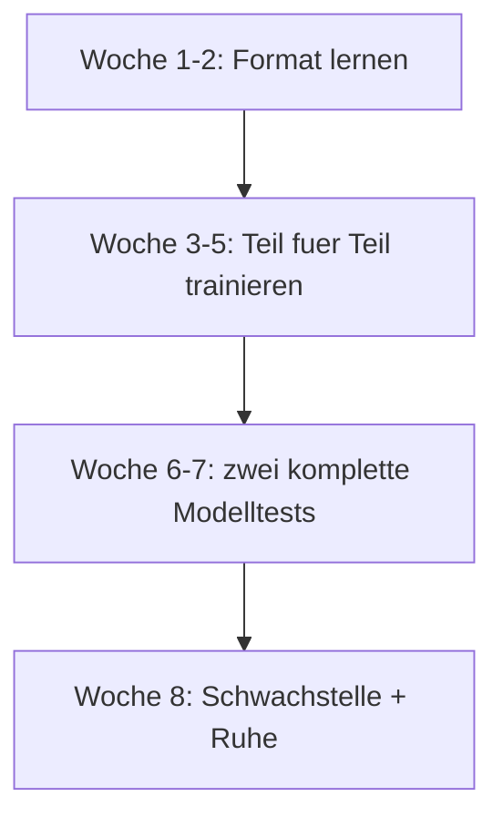

# Prüfungen · Überblick — welche Prüfung, wann und wie

> **Level:** B2/C1 · **Focus:** choosing the exam, registering, what counts, and an 8-week plan · **Time:** ~1 h
> _After this module you know which certificate you actually need, when to book it, and how the last eight weeks before the exam should look._

Most people prepare for the wrong thing. They grind vocabulary for months and then lose points to
**format** — running out of time, missing a content point, or not knowing that a part is scored
separately. This module fixes the strategy layer: which exam, when to book, how scoring works, and
what the eight weeks before the date should contain.

> ⚠️ **Verify before you book.** telc and the Goethe-Institut **revise their formats periodically**
> — item counts and part structures change. Everything in these modules is built to the published
> shape, but the authoritative source is the current **Übungstest / Modellsatz** on
> **telc.net** or **goethe.de**. Download it the day you start preparing and compare it against
> what you read here. If they differ, the official paper wins.

## Objectives / Lernziele

- Decide between **telc B2**, **Goethe B2** and **Goethe C1** for your actual goal.
- Understand how scoring and **module-wise passing** works.
- Know what registration costs and how far ahead to book.
- Run a realistic **8-week** preparation plan.

## 1. Welche Prüfung brauchst du wirklich?

| Ziel | Was verlangt wird | Empfehlung |
|---|---|---|
| IT-Job in einem internationalen Team | oft gar kein Zertifikat, Englisch reicht | B2 als **Signal** im Lebenslauf |
| IT-Job im Mittelstand / außerhalb der Großstädte | häufig B2 erwartet | **telc B2** oder **Goethe B2** |
| Niederlassungserlaubnis (unbefristet) | i. d. R. **B1** | **Goethe B1** — als Nachweis, nicht als Lernziel |
| Einbürgerung | **B1** (mit Ausnahmen) | **Goethe B1**, falls noch kein Nachweis vorliegt |
| Studium an einer deutschen Hochschule | **C1** (TestDaF/DSH häufiger als Goethe) | anderer Prüfungspfad — prüfe die Hochschule |
| Persönliches Ziel: „ich will wirklich gut werden" | — | **Goethe C1** als ehrlicher Maßstab |

**Für den Roadmap-Pfad in diesem Handbuch:** **Goethe B1** in Woche 20 nicht nötig, aber als
Meilenstein in **Woche 8** möglich — siehe [Goethe B1 · Meilenstein Woche 8](#/exams/goethe-b1);
dann **telc B2** in Woche 20 und **Goethe C1** in Woche 51.
B2 ist der Punkt, ab dem dein Deutsch im Bewerbungsprozess **hilft** statt nur zu existieren; C1 ist
der Punkt, ab dem es **kein Thema mehr ist**.

> **telc B2 oder Goethe B2?** Inhaltlich vergleichbar und beide anerkannt. telc gilt vielen als
> etwas berechenbarer im Format und hat oft mehr Prüfungstermine; Goethe hat international den
> bekannteren Namen. Nimm die Prüfung, für die du in deiner Stadt **einen Termin bekommst** — der
> Unterschied im Ansehen ist für einen IT-Job vernachlässigbar.

## 2. Aufbau und Zeiten

**telc Deutsch B2** — schriftlicher Teil an einem Tag, mündlich meist am selben oder am Folgetag:

| Teil | Inhalt | Zeit |
|---|---|---|
| Leseverstehen + Sprachbausteine | Lesetexte + Grammatik-/Wortschatzlücken | ~90 Min. |
| Hörverstehen | mehrere Hörteile, meist **einmaliges** Hören in einem Teil | ~20 Min. |
| Schriftlicher Ausdruck | ein Brief / eine E-Mail (~150–200 Wörter) | ~30 Min. |
| Mündlicher Ausdruck | **paarweise**: Präsentation, Diskussion, gemeinsam planen | ~15 Min. + Vorbereitung |

**Goethe-Zertifikat C1** — vier Module, jedes **/100 Punkte**, **≥ 60 zum Bestehen**:

| Modul | Zeit |
|---|---|
| Lesen | ~70 Min. |
| Hören | ~40 Min. |
| Schreiben | ~65 Min. |
| Sprechen | ~15 Min. (paarweise) |

**Der entscheidende Unterschied:** Bei Goethe sind die vier Module **einzeln** bestehbar und
einzeln wiederholbar. Du kannst also drei Module bestehen und nur eines nachholen. Das ändert die
Strategie erheblich — mehr dazu in den C1-Modulen (Đợt 9).

## 3. Anmeldung, Kosten, Termine

| Frage | Antwort |
|---|---|
| **Wo anmelden?** | telc: bei einem lizenzierten Prüfungszentrum (Volkshochschule, Sprachschule). Goethe: beim Goethe-Institut oder Partner. |
| **Wie früh?** | **6–10 Wochen vorher.** Beliebte Termine in Großstädten sind früh ausgebucht. |
| **Kosten** | grob **150–300 €** je nach Prüfung und Anbieter — die aktuelle Gebühr steht beim jeweiligen Zentrum. |
| **Ausweis** | Personalausweis oder Pass am Prüfungstag **zwingend** mitbringen. |
| **Wiederholung** | telc: ganze Prüfung. Goethe C1: **modulweise** möglich. |
| **Gültigkeit** | Zertifikate laufen formal nicht ab; manche Stellen akzeptieren nur Nachweise der letzten **2 Jahre**. |

> **Buche den Termin, bevor du dich bereit fühlst.** Ein fester Termin in acht Wochen erzeugt
> genau den Druck, der die Vorbereitung strukturiert. Wer wartet, bis er sich sicher fühlt, meldet
> sich nie an.

## 4. Der 8-Wochen-Plan vor der Prüfung

| Woche | Fokus | Konkret |
|:--:|---|---|
| 1 | **Format** | Übungstest herunterladen, einmal komplett ohne Zeitdruck ansehen. Keine Punkte, nur verstehen, was verlangt wird. |
| 2 | **Diagnose** | Einen kompletten Modelltest unter Zeit. Das Ergebnis ist deine Prioritätenliste, nicht dein Selbstwert. |
| 3 | **Lesen + Sprachbausteine** | [telc B2 · Lesen](#/exams/telc-b2-lesen-sprachbausteine) — Zeitmanagement ist hier der Hauptgegner. |
| 4 | **Hören** | [telc B2 · Hören](#/exams/telc-b2-hoeren) — täglich 20 Minuten, Notiztechnik üben. |
| 5 | **Schreiben** | [telc B2 · Schreiben](#/exams/telc-b2-schreiben) — drei Briefe unter 30 Minuten. |
| 6 | **Sprechen** | [telc B2 · Sprechen](#/exams/telc-b2-sprechen) — mit Partner üben, aufnehmen. |
| 7 | **Modelltest 2** | Kompletter Durchlauf unter echten Bedingungen. Vergleich mit Woche 2. |
| 8 | **Schwachstelle + Ruhe** | Nur noch der schwächste Teil. Letzte drei Tage: Redemittel wiederholen, früh schlafen. |

Parallel dazu, jeden Tag: **20 Minuten [Flashcards](#/@flashcards)** und die
**[Prüfungs-Redemittel](#/exams/pruefungs-redemittel)** — das ist der Teil, der am Prüfungstag
tatsächlich abrufbar sein muss.

## 5. Die drei Fehler, die Punkte kosten

**1. Zeitmanagement.** Die meisten Kandidaten, die durchfallen, konnten das Deutsch — sie wurden
nicht fertig. Übe **jeden** Teil mit Uhr, ab dem ersten Tag.

**2. Inhaltspunkte übersehen.** Im Schreiben wird abgehakt, ob du alle Vorgaben beantwortet hast.
Vier Punkte in einfachem Deutsch schlagen drei Punkte in schönem Deutsch — jedes Mal.

**3. Im mündlichen Teil monologisieren.** Der Diskussionsteil bewertet **Interaktion**. Wer den
Partner nicht einbezieht, verliert Punkte, auch bei fehlerfreiem Deutsch.

> **Vierter, unsichtbarer Fehler:** zu spät anmelden und dann „nächstes Mal" sagen. Der Termin ist
> die Vorbereitung.

## 6. Am Prüfungstag

- **Ausweis, Anmeldebestätigung, Stifte** (Kugelschreiber, kein Bleistift für den Bogen), Wasser.
- **30 Minuten früher da sein.** Prüfungszentren sind selten dort, wo du sie vermutest.
- **Antwortbogen sauber führen.** Bei manchen Formaten zählt nur, was auf dem Bogen steht — nicht,
  was im Aufgabenheft steht. Übertrage rechtzeitig, nicht in den letzten zwei Minuten.
- **Kein Wörterbuch, kein Handy.** Auch nicht in der Tasche am Platz.
- **Nach dem schriftlichen Teil nicht nachrechnen.** Der mündliche Teil kommt oft direkt danach und
  braucht deinen Kopf.

---

## 🧾 Zusammenfassung · Summary

Pick the exam your goal actually needs: **telc B2** or **Goethe B2** as the useful CV signal for an
IT job, **Goethe C1** when you want German to stop being a topic. Book **6–10 weeks ahead** — the
date is what structures the preparation. telc B2 is one written block plus a **paired** oral; Goethe
C1 has **four separately passable modules**, which changes your strategy. The three point-killers
are **time management**, **missed content points** and **monologuing in the oral**. And always
verify the current format against the official **Übungstest**, because the exam boards revise it.

## 📇 Vokabel-Checkliste · Vocabulary checklist

| Deutsch | Artikel | Plural | English | VI (if hard) |
|---|---|---|---|---|
| Prüfung | die | Prüfungen | exam | kỳ thi |
| Prüfungszentrum | das | Prüfungszentren | exam centre | trung tâm thi |
| Anmeldung | die | Anmeldungen | registration | đăng ký |
| Gebühr | die | Gebühren | fee | lệ phí |
| Antwortbogen | der | Antwortbögen | answer sheet | phiếu trả lời |
| Modelltest | der | Modelltests | model/practice test | đề thi thử |
| Übungstest | der | Übungstests | practice test | đề luyện |
| bestehen | — | — | to pass | đỗ |
| durchfallen | — | — | to fail | trượt |
| wiederholen | — | — | to retake | thi lại |

→ Drill these in [Flashcards](#/@flashcards).

## 📝 Hausaufgabe · Homework

- [ ] Entscheide dich für **eine** Prüfung und schreib das Zieldatum auf.
- [ ] Suche **drei Prüfungszentren** in deiner Nähe und notiere die nächsten Termine.
- [ ] Lade den offiziellen **Übungstest** herunter und sieh ihn einmal komplett durch.
- [ ] Trage den **8-Wochen-Plan** in deinen Kalender ein, rückwärts vom Prüfungstag.
- [ ] Melde dich an — heute, nicht „wenn ich bereit bin".

## 📚 Empfohlene Ressourcen · Recommended resources

- **Offiziell:** telc.net (Übungstest telc Deutsch B2), goethe.de (Modellsatz C1) — **immer zuerst**.
- **Trainer:** *So geht's noch besser* (telc-Training), *Aspekte neu B2* (Klett), *Sicher! B2/C1* (Hueber).
- **Nächste Schritte:** [telc B2 · Lesen & Sprachbausteine](#/exams/telc-b2-lesen-sprachbausteine),
  dann [Hören](#/exams/telc-b2-hoeren), [Schreiben](#/exams/telc-b2-schreiben),
  [Sprechen](#/exams/telc-b2-sprechen).
- **Redemittel:** [Prüfungs-Redemittel](#/exams/pruefungs-redemittel) — täglich wiederholen.
- **Standortbestimmung:** [Phase 2 · Modelltest](#/phase-2/assessment).
