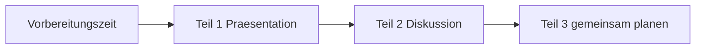

# telc B2 · Mündlicher Ausdruck

> **Level:** B2 · **Focus:** the three paired oral parts — presentation, discussion, planning together · **Time:** ~2 h
> _After this module you know what each part is scored on, and you've rehearsed all three with a script you can actually reuse._

The oral exam is **paired** and lasts about 15 minutes plus preparation. It's the part candidates
fear most and prepare least — usually because it's hard to practise alone. This module fixes that:
every part gets a fixed skeleton, and the drills work solo.

The single biggest scoring insight: **Teil 2 and Teil 3 are scored on interaction**, not on the
quality of your monologue. A shorter turn that reacts to your partner beats a flawless speech that
ignores them.

> ⚠️ Verify part order and timing against the current *Übungstest* on **telc.net** — see
> [Prüfungen · Überblick](#/exams/overview).

## Objectives / Lernziele

- Deliver **Teil 1** (presentation) with a skeleton that survives nerves.
- Carry **Teil 2** (discussion) by reacting and handing the turn back.
- Reach an actual agreement in **Teil 3** (planning together).
- Rescue yourself when you don't understand or lose the word.

## 1. Der Ablauf



| Teil | Was du tust | Worauf bewertet wird |
|---|---|---|
| **1 · Präsentation** | dein Thema ~1–2 Min. vorstellen | Aufbau, Wortschatz, Flüssigkeit |
| **2 · Diskussion** | Meinungen austauschen | **Interaktion**, Reagieren, Begründen |
| **3 · Gemeinsam planen** | etwas Konkretes vereinbaren | Vorschläge, Kompromiss, **Einigung** |

```uebung
? Worauf wird Teil 2 vor allem bewertet?
x auf die Aussprache
x auf die Länge deines Redebeitrags
* auf Interaktion — reagieren, nachfragen, den Partner einbeziehen
x auf fehlerfreie Grammatik
! Ein langer, korrekter Monolog erfüllt die Aufgabe nicht. Wer nicht auf den Partner eingeht, verliert Punkte — auch bei gutem Deutsch.

? Was muss am Ende von Teil 3 stehen?
x deine persönliche Meinung
x eine Zusammenfassung des Themas
x eine Liste aller Vorschläge
* eine ausgesprochene gemeinsame Entscheidung
! Die Aufgabe heißt „gemeinsam **planen**". Ohne ausgesprochenen Beschluss („Dann halten wir fest: …") ist sie nicht erfüllt.

? Dein Partner spricht sehr viel und lässt dich kaum zu Wort kommen. Was tust du?
* höflich unterbrechen: „Darf ich kurz ergänzen?"
x aufgeben und nur zuhören
x lauter sprechen als er
x abwarten, bis er fertig ist
! Du wirst auf **deinen** Anteil bewertet. Höfliches Unterbrechen ist eine geprüfte Fertigkeit, kein Regelverstoß.
```

## 2. Teil 1 — die Präsentation

Ein Skelett, das auch bei Nervosität trägt:

> **1. Einleitung:** *Ich möchte heute über … sprechen.*
> **2. Meinung:** *Meiner Meinung nach …, weil … und weil …*
> **3. Beispiel:** *Aus meiner Erfahrung als Entwickler …*
> **4. Fazit:** *Zusammenfassend würde ich sagen, dass …*

Vier Sätze. Alles darüber hinaus ist Bonus. Wer ohne Skelett startet, redet 40 Sekunden und bleibt
dann stehen — das kostet mehr als jeder Grammatikfehler.

```uebung
? Welcher Teil fehlt am häufigsten in Prüfungspräsentationen?
x die Meinung
* das Beispiel und das Fazit
x die Begrüßung
x die Einleitung
! Kandidaten sagen ihre Meinung mit Begründung und hören dann auf. Beispiel und Fazit sind die zwei Elemente, die eine Präsentation von einer Antwort unterscheiden.

? Ergänze die Einleitung: „Ich ___ heute über das Thema Homeoffice sprechen."
= möchte
! *Ich möchte heute über … sprechen* — fester Baustein, auswendig können.

? Ergänze das Fazit: „___ würde ich sagen, dass ein hybrides Modell am besten funktioniert."
= Zusammenfassend
! *Zusammenfassend* signalisiert dem Prüfer, dass du strukturiert schließt — nicht, dass dir die Worte ausgehen.

? Wie leitest du dein Beispiel ein?
x Man sagt oft, dass …
x Es ist bekannt, dass …
* Aus meiner Erfahrung als Entwickler …
x Zum Beispiel gibt es viele Dinge.
! Ein persönliches, konkretes Beispiel ist glaubwürdiger und leichter zu produzieren als eine allgemeine Behauptung — und es zeigt Wortschatz aus deinem echten Leben.
```

## 3. Teil 2 — die Diskussion

Drei Bewegungen, die du abwechselnd einsetzt:

| Bewegung | Redemittel |
|---|---|
| **reagieren** | *Da stimme ich dir zu.* · *Das sehe ich anders.* · *Da hast du teilweise recht, aber …* |
| **begründen** | *Das liegt daran, dass …* · *Ein gutes Beispiel dafür ist …* |
| **zurückgeben** | *Und wie siehst du das?* · *Was meinst du dazu?* |

**Die Regel:** Nie zwei Beiträge hintereinander ohne Rückgabe. Wer den Ball behält, verliert Punkte.

```uebung
? Welche Antwort ist im Prüfungssinn am besten?
x Ich stimme dir völlig zu, in allen Punkten, ohne Einschränkung.
x Ja.
x Ich weiß nicht.
* Das sehe ich anders — ein Monolith wäre am Anfang einfacher. Und wie siehst du das?
! Position + Begründung + Rückgabe. Option 4 ist grammatisch fein, produziert aber keine Interaktion.

? Du bist inhaltlich einverstanden, willst aber einschränken. Was sagst du?
* Da hast du teilweise recht, aber …
x Nein, das ist falsch.
x Ja, genau.
x Das ist mir egal.
! Teilzustimmung ist die häufigste und nützlichste Bewegung in einer deutschen Fachdiskussion.

? Ergänze die Rückgabe: „… Und wie ___ du das?"
= siehst
! *Und wie siehst du das?* — der wichtigste Satz in Teil 2. Als Reflex einüben.

? Was tust du, wenn dir mitten im Satz das Wort fehlt?
x still werden und neu anfangen
* umschreiben: „also, dieses Ding, mit dem man …"
x ins Englische wechseln
x die Prüfung unterbrechen
! Umschreiben ist eine bewertete Strategie (kommunikative Kompetenz). Ein Wechsel ins Englische ist der teuerste Zug im ganzen Teil.
```

## 4. Teil 3 — gemeinsam planen

Hier wird verhandelt, nicht diskutiert. Der Ablauf ist fast immer gleich:

1. **Vorschlag** — *Ich schlage vor, dass wir …*
2. **Reaktion** — *Das klingt gut, aber …* / *Wäre auch Dienstag möglich?*
3. **Kompromiss** — *Können wir uns auf … einigen?*
4. **Beschluss** ⭐ — *Dann halten wir fest: …*

Schritt 4 ist der, den fast alle vergessen — und der, auf den die Aufgabe abzielt.

```uebung
? Ergänze den Vorschlag: „Ich ___ vor, dass wir den Workshop auf Dienstag legen."
= schlage
! *Ich schlage vor, dass …* — Verb am Ende im dass-Satz.

? Ergänze den Beschluss: „Dann ___ wir fest: Dienstag um zehn, Thema Testautomatisierung."
= halten
! *Dann halten wir fest: …* Dieser eine Satz macht sichtbar, dass ihr die Aufgabe gelöst habt.

? Dein Partner schlägt einen Termin vor, der dir nicht passt. Beste Reaktion?
x Das entscheidest du.
x Nein.
* Dienstag passt mir leider nicht — wäre Mittwoch eine Option?
x Mir ist alles recht.
! Ablehnen **plus Gegenvorschlag**. Reines Ablehnen bremst die Verhandlung, reines Zustimmen zeigt keine Aushandlung.

? Welche Elemente gehören in eine vollständige Planung? (mehrere richtig)
* ein Thema oder Inhalt
* eine Einigung am Ende
x eine Begründung deiner persönlichen Meinung
* ein konkreter Termin
! Teil 3 ist Organisation, nicht Meinung. Wer hier lange begründet, verwechselt Teil 3 mit Teil 2.
```

## 5. Rettungssätze — auswendig, nicht improvisiert

```uebung
? Du hast die Frage des Prüfers nicht verstanden.
* Entschuldigung, könnten Sie die Frage bitte wiederholen?
x Was?
x Ich verstehe nicht.
x (schweigen)
! Höflich, vollständig, in Konjunktiv II. Nachfragen kostet keine Punkte — Schweigen schon.

? Du brauchst zwei Sekunden zum Nachdenken.
x (lange Pause)
* Moment, ich überlege kurz.
x Ähm … ähm …
x Sorry, one second.
! Ein gefüllter, deutscher Übergang wirkt souverän. Ein englisches Füllwort fällt sofort auf.

? Ergänze: „Das ist eine ___ Frage." (Zeit gewinnen, positiv)
= gute
! *Das ist eine gute Frage.* — klassischer Zeitkauf, funktioniert in jeder Prüfung und in jedem Meeting.

? Du merkst mitten im Satz, dass du dich vertan hast.
x Sorry, my mistake.
x (aufhören zu sprechen)
* Entschuldigung, ich formuliere das noch einmal.
x (einfach weiterreden, als wäre nichts)
! Selbstkorrektur ist ein **positives** Bewertungsmerkmal — sie zeigt Sprachbewusstsein. Nur muss sie auf Deutsch passieren.
```

## 6. Allein üben — so geht es doch

Die Prüfung ist paarweise, das Üben muss es nicht sein.

| Übung | Wie |
|---|---|
| **Teil 1 solo** | Thema ziehen, 2 Min. Vorbereitung, 2 Min. sprechen, 🎙 aufnehmen |
| **Teil 2 solo** | Beide Rollen sprechen: Position, Gegenposition, Reaktion, Rückgabe |
| **Teil 3 solo** | Vorschlag → Einwand → Kompromiss → Beschluss, laut durchspielen |
| **Selbstkorrektur** | Aufnahme transkribieren und die eigenen Fehler markieren |
| **Mit Partner** | mindestens **einmal** vor der Prüfung komplett durchlaufen |

**Themenpool zum Ziehen:** Homeoffice · Vier-Tage-Woche · KI am Arbeitsplatz · Öffentlicher
Nahverkehr · Fremdsprachen im Beruf · Weiterbildung · Umweltschutz im Alltag · Social Media ·
Ehrenamt · Pünktlichkeit.

---

## 🧾 Zusammenfassung · Summary

Three parts, three different jobs. **Teil 1** needs a four-slot skeleton — Einleitung, Meinung mit
zwei Gründen, Beispiel, Fazit — because nerves eat improvisation. **Teil 2** is scored on
**interaction**: position, reason, and always hand the ball back with *Und wie siehst du das?*
**Teil 3** is a negotiation that must end in a spoken decision — *Dann halten wir fest: …* — the
step most candidates skip. Keep the rescue sentences memorized rather than improvised, and never
switch to English: paraphrasing is a scored skill, code-switching is the most expensive move
available.

## 📇 Vokabel-Checkliste · Vocabulary checklist

| Deutsch | Artikel | Plural | English | VI (if hard) |
|---|---|---|---|---|
| Präsentation | die | Präsentationen | presentation | bài trình bày |
| Einigung | die | Einigungen | agreement | sự thống nhất |
| Kompromiss | der | Kompromisse | compromise | thỏa hiệp |
| Beschluss | der | Beschlüsse | decision, resolution | quyết định |
| Gegenvorschlag | der | Gegenvorschläge | counter-proposal | đề xuất ngược lại |
| Selbstkorrektur | die | Selbstkorrekturen | self-correction | tự sửa lỗi |
| umschreiben | — | — | to paraphrase | diễn đạt vòng |
| ergänzen | — | — | to add | bổ sung |
| festhalten | — | — | to record, to state | chốt lại |

→ Drill these in [Flashcards](#/@flashcards).

## 🗣️ Sprechübung · Speaking practice

Shadow this, then produce your own version on a topic from the pool.

```audio
Ich möchte heute über Homeoffice sprechen. Meiner Meinung nach ist ein hybrides Modell am besten, weil ich mich zu Hause besser konzentrieren kann. Aus meiner Erfahrung als Entwickler funktionieren Code-Reviews auch remote gut. Zusammenfassend würde ich sagen, dass zwei Bürotage pro Woche ein guter Kompromiss sind.
```

## 📝 Hausaufgabe · Homework

- [ ] 🎙 Nimm **Teil 1** zu drei Themen aus dem Pool auf, je 2 Minuten.
- [ ] Übe Teil 2 solo: Position, Gegenposition und **Rückgabe** zu je zwei Themen.
- [ ] Spiele Teil 3 laut durch und beende ihn **immer** mit „Dann halten wir fest: …".
- [ ] Lerne die **fünf Rettungssätze** auswendig.
- [ ] Mache **einen kompletten Durchlauf mit einem Partner** vor der Prüfung.

## 📚 Empfohlene Ressourcen · Recommended resources

- **Offiziell:** telc.net — *Übungstest telc Deutsch B2* mit Beschreibung der mündlichen Prüfung.
- **Redemittel:** [Prüfungs-Redemittel](#/exams/pruefungs-redemittel) — täglich wiederholen.
- **Drills:** [Phase 2 · Speaking · Übungsteil](#/phase-2/speaking-uebungen).
- **Input:** *Easy German Podcast* für echtes Diskussionstempo.
- **Weiter:** [Prüfungs-Redemittel](#/exams/pruefungs-redemittel).
