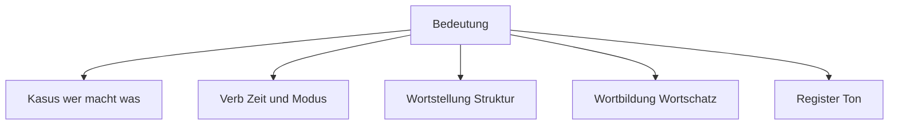
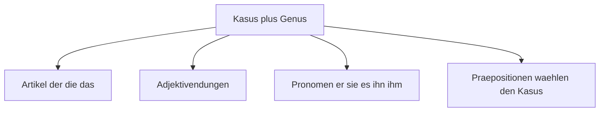
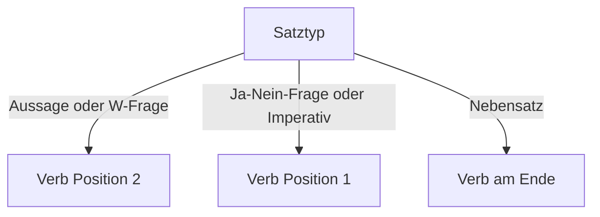
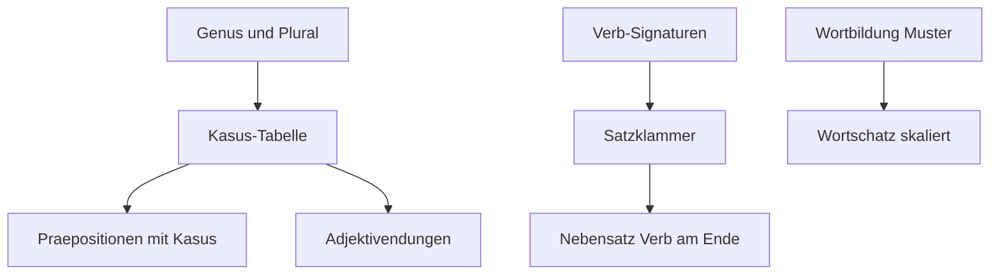

# Foundations · German as a System — The Architecture of the Language

> **Level:** All (B1+) · **Focus:** systems thinking — subsystems, interfaces, dependencies, leverage · **Time:** ~2–3 h
> _After this module you'll see German as one connected machine — five subsystems with clean interfaces — instead of ten thousand disconnected facts, and you'll know exactly which parts to learn first and why._

You debug distributed systems for a living. You never memorize every behavior of Spring
Boot — you learn the **architecture** and derive the behavior. This module applies the same
move to German. In systems thinking (Donella Meadows), a system is **elements +
interconnections + purpose**. Learners who plateau treat German as a list of elements
(words, rules, exceptions). Learners who accelerate treat it as an architecture: a small
core of subsystems with well-defined interfaces. Good news: German is unusually
**systematic** — far more consistent than English in spelling, word order, and even gender.
It rewards exactly the kind of thinking you already do at work.

## Objectives / Lernziele

- Draw the **system map** of German: five subsystems and what each one encodes.
- Explain **what problem cases solve** — and why they make German word order flexible.
- Treat verbs as **APIs**: learn signatures (valency), never bare infinitives.
- **Parse** any compound noun and predict most genders from suffixes.
- Prioritize your study using the **dependency graph** and **error triage**.

## 1. The system map — start from the purpose

Every language has the same purpose: encode **who does what to whom, when, how, and in what
tone**. Languages differ in *how* they encode it. Vietnamese and English rely mostly on
**word position** ("Tôi sửa lỗi" / "I fix the bug" — swap the order, change the meaning).
German instead relies heavily on **markers**: endings on articles, adjectives and verbs
carry the information. This single design decision generates almost everything learners
call "hard" — cases, endings, agreement — *and* the payoff: flexible word order and
extreme precision. Don't map German onto position-thinking; map it onto marker-thinking.

| Subsystem | What it encodes | Engineer's analogy |
|---|---|---|
| **Kasus-System** (cases) | who does what to whom | type system / interfaces |
| **Verbsystem** (tense, mood, valency) | when, how certain, what arguments | scheduler + API contracts |
| **Wortstellung** (word order) | sentence structure | serialization protocol |
| **Wortbildung** (word formation) | vocabulary at scale | package composition |
| **Register** (Sie/du, particles) | tone, distance, politeness | auth levels + headers |



The next sections walk the five subsystems in dependency order.

## 2. The case system — the central hub

A case is a **type signature on a noun phrase**. `der / den / dem Server` is the same noun
in three roles: subject, direct object, indirect object. Because the **role is marked on
the word**, it no longer depends on position — which is why German word order is flexible
where English is rigid:

🇩🇪 **Der Praktikant findet den Bug.** — *The intern finds the bug.*
🇩🇪 **Den Bug findet der Praktikant.** — *THE BUG is what the intern finds.* (emphasis)

Same fact, different focus. `den` tells every listener "object!", no matter where it
stands. English cannot do this — "The bug finds the intern" is a different (and alarming)
sentence.

The hub has **four dependent modules** — one gender decision cascades into all of them:



**Consequence 1 — nouns are atomic units.** Store `der Server, die Server`, never `Server`.
A noun without its gender is a corrupted key: every downstream ending breaks silently.
(This is golden rule #2 of the [Roadmap Overview](#/roadmap-overview).)

**Consequence 2 — prepositions are typed functions.** `mit(Dativ)`, `für(Akkusativ)`; the
*Wechselpräpositionen* are overloaded — motion → Akkusativ, location → Dativ:

🇩🇪 **Ich arbeite mit dem neuen Framework für den Kunden.** — *mit* forces Dativ, *für*
forces Akkusativ, in one sentence.

The full case table and preposition lists live in [Phase 1 · Grammar](#/phase-1/grammar) —
this module's job is to show you they are **one subsystem**, not four topics.

## 3. The verb — the system's orchestrator

Two ideas turn verb chaos into order.

**Idea 1 — every verb has a signature (valency).** Like an API, a verb defines its
arguments and their types. Learn the signature, not the bare word:

| Signature | Example | English |
|---|---|---|
| helfen **+ Dat** | Ich helfe **dem** neuen Kollegen. | I help the new colleague. |
| warten **auf + Akk** | Wir warten **auf das** Code-Review. | We're waiting for the code review. |
| abhängen **von + Dat** | Das Release hängt **von den** Tests **ab**. | The release depends on the tests. |
| sich kümmern **um + Akk** | Ich kümmere mich **um das** Deployment. | I'll take care of the deployment. |

Calling `helfen` with Akkusativ is calling an API with the wrong parameter type — it
"compiles" in your head but fails at the listener. Rule: **never store a bare verb.** Store
`abhängen von + Dat` as one unit.

**Idea 2 — the Satzklammer (sentence bracket).** The conjugated verb opens a bracket in
position 2; the rest of the verb complex closes it at the end. Everything in between is
payload:

| Opens (position 2) | Mittelfeld (payload) | Closes (end) |
|---|---|---|
| Ich **habe** | den Service gestern um 16 Uhr | **deployt** |
| Ich **muss** | die Migration heute noch | **testen** |
| Wir **stellen** | den neuen Dienst morgen | **bereit** |
| Der Server **stürzt** | unter Last ständig | **ab** |

One pattern explains what textbooks teach as three separate rules: Perfekt (`habe …
deployt`), modals (`muss … testen`), and separable verbs (`stelle … bereit`). Think
opening and closing tags — the sentence isn't done until the bracket closes. Germans
genuinely listen to the end of the sentence for this reason.

And verb **position** is a three-state machine — deterministic, no exceptions worth your
attention:



Three rules → 100 % of your sentences. Details and drills: [Phase 1 ·
Grammar](#/phase-1/grammar).

```audio
Das Release hängt von den Tests ab. Wir warten auf das Code-Review und stellen den Dienst morgen bereit.
```

## 4. Word formation — composition over memorization

German doesn't have a bigger dictionary than English — it has a better **package system**.
You install a small set of roots and compose everything else.

**Komposita are head-final: parse right-to-left.** The last noun is the "base type" — it
determines gender and category; everything before it configures it. Exactly like
`List<User>` is a List:

| Compound | Parse | Meaning |
|---|---|---|
| die Datenbank**migration** | die Migration ← Datenbank | database migration |
| das Sicherheits**update** | das Update ← Sicherheit | security update |
| die Zugriffs**kontrolle** | die Kontrolle ← Zugriff | access control |
| der Bereitstellungs**prozess** | der Prozess ← Bereitstellung | deployment process |

**Prefixes are decorators.** One root, many behaviors — here's the `stellen` (to put)
family every IT worker needs:

| Verb | Meaning | IT example |
|---|---|---|
| ein·stellen | to hire; to configure | einen Parameter einstellen |
| bereit·stellen | to provision, deploy | eine Umgebung bereitstellen |
| um·stellen | to switch over | auf Kafka umstellen |
| her·stellen | to establish, produce | eine Verbindung herstellen |
| fest·stellen | to determine, notice | einen Fehler feststellen |
| vor·stellen | to introduce, present | die Architektur vorstellen |
| dar·stellen | to represent | Daten grafisch darstellen |

Ten roots (`stellen, laden, geben, nehmen, setzen, ziehen, schreiben, führen, halten,
bauen`) × a dozen prefixes ≈ **hundreds of verbs for the price of ten**.

**Gender follows suffix patterns** (~80 %+ coverage — pattern-match first, memorize only
exceptions):

| Suffix | Genus | Examples |
|---|---|---|
| -ung, -heit, -keit, -schaft, -ion, -tät | **die** | die Anforderung, die Sicherheit, die Konfiguration |
| -er (devices & people), -ling | **der** | der Server, der Compiler, der Entwickler |
| -chen, -um, -ment | **das** | das Deployment, das Dokument, das Zentrum |

**The emergent payoff:** you can now parse words you never studied. Meet
`die Bereitstellungsgeschwindigkeit` in the wild → head is `die Geschwindigkeit` (speed),
configured by `Bereitstellung` (deployment) → *deployment speed*. You just read German you
were never taught. That is emergence — the system gives you more than the sum of what you
memorized.

## 5. Register — the protocol layer

Same payload, different headers. `Sie` vs `du` sets the auth level (workplace default:
**Sie** with strangers and externals; most dev teams run **du** internally — *"Wir sind
hier alle per du"*). Konjunktiv II is politeness middleware (`Könntest du …?` instead of
the blunt imperative), and **Modalpartikeln** (`mal, doch, ja, eben`) are tone flags that
change the feel, not the facts:

🇩🇪 **Schick mir mal den Link.** — *Send me the link (casual, friendly).*
🇩🇪 **Schick mir den Link.** — same request, noticeably colder.

Full treatment in [Phase 4 · Grammar](#/phase-4/grammar) — for now, just know this layer
exists so you don't mistake tone bugs for grammar bugs.

## 6. Leverage points — let the dependency graph set your study order



Topological sort of the graph = your priority list:

1. **Nouns as atomic units** (`der Server, die Server`) — everything depends on gender.
2. **The case table, cold** — it unblocks articles, pronouns, prepositions.
3. **The three verb-position rules** + Satzklammer — every sentence uses them.
4. **The top ~50 verb signatures** from your daily work.
5. **Suffix and prefix patterns** — vocabulary starts scaling on its own.
6. Only then: adjective endings and polish.

**Error triage** — not all bugs are equal, so budget practice like incident response:

| Priority | Error type | Impact |
|---|---|---|
| **P1** | wrong verb, wrong valency | listener misunderstands the *content* |
| **P1** | verb position chaos | sentence becomes hard to parse at all |
| **P2** | wrong case ending | almost always still understood |
| **P3** | adjective endings, occasional gender slip | cosmetic |

Practicing perfect adjective endings while your Nebensatz verb order is broken is polishing
the favicon while prod is down. Fix P1s first.

---

## 🧾 Zusammenfassung · Summary

German is **five subsystems, not ten thousand facts**: the **case system** is the hub that
marks roles (making word order flexible), the **verb** orchestrates each sentence through
signatures and the Satzklammer, **word order** is a deterministic three-state machine,
**word formation** composes vocabulary from a small set of roots (head-final compounds,
prefix decorators, suffix→gender rules), and **register** sets the tone. Learn in
dependency order — gender+plural → cases → verb rules → signatures → word formation — and
triage your errors: content-breaking bugs before cosmetic ones.

## 📇 Vokabel-Checkliste · Vocabulary checklist

| Deutsch | Artikel | Plural | English | VI (if hard) |
|---|---|---|---|---|
| Zusammenhang | der | Zusammenhänge | connection, interrelation | mối liên hệ |
| Muster | das | Muster | pattern | khuôn mẫu |
| Ausnahme | die | Ausnahmen | exception | ngoại lệ |
| Endung | die | Endungen | (grammatical) ending | |
| Wortbildung | die | Wortbildungen | word formation | cấu tạo từ |
| Satzklammer | die | Satzklammern | sentence bracket | khung động từ |
| Kompositum | das | Komposita | compound word | từ ghép |
| Vorsilbe | die | Vorsilben | prefix | tiền tố |
| Bestandteil | der | Bestandteile | component, part | thành phần |
| ableiten | — | — | to derive | suy ra, phái sinh |

→ Drill these and more in [Flashcards](#/@flashcards).

## 🗣️ Sprechübung · Speaking practice

1. Describe your current service in **3 sentences**, each starting with a *different*
   element in position 1 (time, object, subject) — verb stays second every time.
2. Take three compound nouns from a heise.de headline and **parse them aloud**:
   *"… besteht aus … und …. Der Kern ist …"*
3. Answer out loud: *"Wovon hängt euer Release ab?"* → *"Unser Release hängt von … ab."*
   Then record yourself and compare with the 🔊 below.

```audio
Unser System besteht aus drei Services. Der Kern ist die Datenbank, denn alle Services hängen von ihr ab.
```

## ❓ Mini-Quiz

1. Gender of *Verfügbarkeit* (availability) — and which rule tells you?
2. Parse *die Fehlerbehebungsstrategie*: what's the head, what's the gender, what does it
   mean?
3. Which error is **P1**: (a) *"Ich arbeite mit die Datenbank"* or (b) *"Ich weiß, dass er
   hat den Bug gefixt"*?
4. What is the full signature of *warten*, and how do you say "I'm waiting for the build"?

> **Lösungen:** 1) **die** — suffix `-keit` is always feminine. · 2) Head = **die
> Strategie** → feminine; *error-fixing strategy*. · 3) **(b)** — broken verb-end rule in
> the Nebensatz damages the sentence structure itself; (a) is a P2 case slip (*mit der
> Datenbank*). · 4) **warten auf + Akk** → *Ich warte auf den Build.* More:
> [Quizzes](#/@quiz).

## 📝 Hausaufgabe · Homework

- [ ] Build your **Verb-API sheet**: 15 verbs from your daily work, each with its full
      signature (e.g. `abhängen von + Dat`, `sich kümmern um + Akk`).
- [ ] Collect **10 Komposita** from one heise.de or Golem.de article; mark the head of each
      and derive its gender.
- [ ] Write **5 sentences** about your project, each with something other than the subject
      in position 1.
- [ ] Reproduce the **case table** from memory ([Phase 1 · Grammar](#/phase-1/grammar)) —
      100 % correct before you move on.

## 📚 Empfohlene Ressourcen · Recommended resources

- **DWDS.de** — word formation, frequency, real usage examples.
- **Duden.de** — the authority for gender and valency questions.
- **dict.leo.org / dict.cc** — always copy the case info into your notes, not just the word.
- **mein-deutschbuch.de** — lists of *Verben mit Präpositionen* (verb signatures).
- **Next:** [Your Learning System](#/foundations/learning-system) — the same systems
  thinking, applied to *how you learn and use* German.
