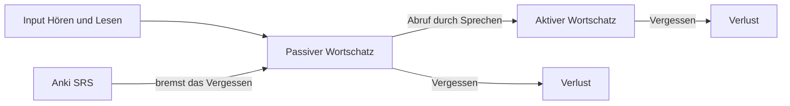
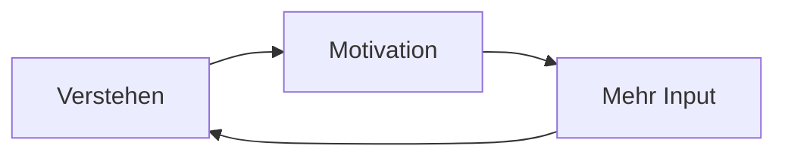
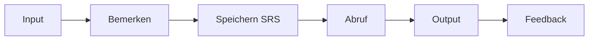
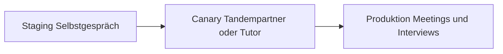

# Foundations · Your Learning System — Loops, Stocks & Leverage

> **Level:** All · **Focus:** feedback loops, stocks & flows, bottlenecks, leverage points, your daily operating system · **Time:** ~2 h (then daily use)
> _After this module you'll stop "studying harder" and start operating a system that produces German — with feedback loops you designed, a bottleneck you chose on purpose, and German running in your IT workday from today._

[German as a System](#/foundations/german-as-a-system) showed that the *language* is a
system. Your *learning* is one too — and you are its SRE. When progress stalls, most
learners tweak **parameters** ("more hours!"). Systems thinking says parameters are the
weakest lever: the real gains come from redesigning **loops, rules and goals**. This module
maps the acquisition system, finds your bottleneck, and wires everything into the
[52-Week Study Plan](#/plans/52-week-plan) you're already running.

## Objectives / Lernziele

- Model your German as **stocks and flows** — and explain why you forget.
- Name the **three loops** that drive (or kill) progress, and install the missing one.
- Find your current **bottleneck** and point your practice at it, not at what's comfortable.
- Rank interventions by **leverage** — from minutes-per-day up to identity.
- Run **German inside your IT workday** starting today, with a staging→production pipeline.

## 1. Stocks & flows — why you forget

Your German lives in a few **stocks** (reservoirs): passive vocabulary (recognize),
active vocabulary (produce), automatic grammar patterns, listening speed. **Flows** fill
and drain them:



Two engineering truths fall out of this picture:

**Truth 1 — vocabulary is a cache with a TTL.** Unrefreshed entries expire (the Ebbinghaus
forgetting curve). **Anki/SRS is the optimal refresh scheduler**: it re-shows a card just
before eviction. That's why 20 minutes of SRS daily beats 3 hours of re-reading on Sunday —
same total effort, radically different retention.

**Truth 2 — passive and active are *separate stocks* with separate fill mechanisms.**
Recognition (reading, listening) fills the passive stock. Only **retrieval** — producing
the word under pressure — pumps it into the active stock. Reading a word 100 times does not
make you able to *say* it. This is the systems reason behind the roadmap's rule
**"output > input for fluency"**: no retrieval, no active German.

## 2. Feedback loops — the engine room

Three loops decide your trajectory. Two you want to ignite; one you must *install*.

**R1 — the comprehension loop (reinforcing).** Understand more → enjoy more → consume more
→ understand more. It has a cold-start problem: real German is too hard at first, so the
loop never ignites. Solution: **comprehensible input** — material slightly above your level
(Easy German, Slow German) until authentic content (podcasts, heise.de) can take over.



**R2 — the confidence loop (reinforcing, runs both ways).** Speaking success → confidence →
more speaking. Beware: it runs in **reverse** too — avoid speaking → skills decay → worse
experience → avoid harder. That death spiral is how people "study German for 5 years" and
can't order coffee. The guard: a **daily minimum output** (a 3-minute recording), small
enough that you never skip it, so the loop can only spin forward.

**B1 — the correction loop (balancing, must be installed).** Output → feedback → correction
→ accuracy. This loop **does not exist by default**: it needs an external feedback source —
a tutor, a language partner, an AI conversation, or self-review against a transcript.
Without it, errors ship to production and harden ("fossilization") — like merging every PR
with no review, forever. If you practice output but never get corrected, you are training
your mistakes.

**Delays — the loop killer.** Speaking ability lags input by *weeks to months*. The
infamous B1→B2 plateau is not failure; it's **system delay**. Most people quit inside the
delay. Countermeasure: track **leading indicators** you control (minutes spoken, cards
reviewed, articles read — the [Weekly Checklist](#/@checklist)) instead of the lagging one
("do I feel fluent?").

## 3. Find the bottleneck — theory of constraints

Acquisition is a pipeline; throughput equals the **slowest stage**:



For a typical B1 engineer the profile is lopsided: reading is ahead (it transfers from
English and from docs), **spontaneous speaking is the constraint**. The trap: adding more
of what's comfortable — another article, another grammar video — piles inventory *before*
the bottleneck and improves throughput by zero. The rule is brutal and freeing: **practice
at the constraint.** If speaking is the bottleneck, timed speaking drills, shadowing, and
standup simulations ([Dialogue — Daily Standup](#/dialogues/standup)) are the only work
that moves the needle.

Your **Monthly Assessment** modules (e.g. [Phase 1 · Assessment](#/phase-1/assessment)) are
the profiler: score all four skills, find the *new* bottleneck — it moves! — and re-aim the
next month. Profile monthly, optimize the hot path, repeat.

## 4. Leverage points — where to push, ranked

Donella Meadows ranked the places to intervene in any system, weakest to strongest.
Adapted to your project:

| # | Leverage point | In your German system | Engineer's analogy |
|---|---|---|---|
| 7 | **Parameters** | minutes/day, deck size | tuning JVM flags |
| 6 | **Buffers** | a ready queue of saved articles & episodes — zero friction to start | prefetching |
| 5 | **Information flows** | visible metrics: progress bar, streak, error counts | observability |
| 4 | **Feedback loops** | add a tutor/partner + a Fehlerjournal | code review |
| 3 | **Rules** | non-negotiables: "20 cards before coffee", "3-min recording daily" | CI gates |
| 2 | **Goals** | concrete gates: telc B2 mock in month 5, interview sim in month 10 | release milestones |
| 1 | **Paradigm** | *"Ich bin Entwickler und ich arbeite auf Deutsch."* | changing the architecture |

Notice what most learners do when stuck: adjust **#7** ("I'll study 30 minutes more"). The
system barely responds. Installing a weekly feedback session (#4), a hard rule (#3), or the
identity shift (#1) — *you don't study German; you work in German, currently with training
wheels* — reorganizes everything below it. Push high on the table.

## 5. Your daily operating system

The [Roadmap Overview](#/roadmap-overview) gives you ~2.5 h/day. Here is the same schedule,
seen as a system — each slot maintains a different part of the machine:

| Slot | Time | System function |
|---|---|---|
| Morning | 30 min | **Stock maintenance:** SRS reviews (cache refresh) + 1 grammar pattern |
| Afternoon | 30 min | **Input at i+1:** podcast/video with shadowing — fills passive stock, trains the ear |
| Evening | 1–2 h | **Output first:** speaking sim, writing, dialogues — pumps passive → active |
| Weekly | +1 h | **Integration test:** one full simulated standup or code review, out loud; review the Fehlerjournal |
| Monthly | 2 h | **Regression test & re-profile:** assessment module, pick next bottleneck |

The order matters: output work goes in your **best** energy slot (evening deep work), not
the leftovers, because it's the bottleneck stage. Details per phase live in each phase's
plan (start: [Phase 1 · Plan](#/phase-1/plan)); the year view is the
[52-Week Study Plan](#/plans/52-week-plan).

## 6. Deploy German into your workday — today

You don't need to be in Germany to run German in production. Ship it into your existing
IT life:

- **Standup notes auf Deutsch** — write yesterday/today/blockers in German every morning,
  then *say* them aloud once. 5 minutes, uses [Phase 1 · Grammar](#/phase-1/grammar)
  patterns daily.
- **Rubber-duck debugging auf Deutsch** — *"Warum ist der Test rot? Weil die Umgebungsvariable
  fehlt."* Nobody hears you; the retrieval still counts.
- **Environment auf Deutsch** — phone UI, and commit messages in side projects
  (*"Fix: Nullpointer beim Login behoben"*).
- **Daily reading** — one heise.de / Golem.de article (15 min); your IT English makes this
  the cheapest input you own.
- **Commute audio** — programmier.bar, Engineering Kiosk, Working Draft: real tech German
  at real speed.
- **Personal IT deck** — every new word from work context goes into Anki with its article,
  plural, and verb signature.

Then promote your German through environments like any deploy:



**Staging** = self-talk and recordings (safe, daily). **Canary** = a tutor or tandem
partner (real human, low stakes, feedback loop B1 lives here). **Production** = real
meetings and interviews. Don't skip environments — and don't hide in staging forever.

**Observability: the Fehlerjournal.** Run a bug tracker for your German. One table, four
columns:

| Fehler | Korrektur | Regel | Status |
|---|---|---|---|
| *mit die Datenbank* | mit **der** Datenbank | mit + Dativ | 3× this week → drill |
| *Ich weiß, dass er hat…* | …dass er den Bug gefixt **hat** | Nebensatz: Verb ans Ende | recurring → P1 |

A recurring error is a flaky test: don't shrug — write a targeted drill, close the ticket.
Review the journal in your weekly integration hour.

## 7. System traps — the classic antipatterns

| Trap | Symptom | Countermeasure |
|---|---|---|
| **Read-only replica** | hours of Netflix/YouTube, no speaking | output minimum every day, no exceptions |
| **Shifting the burden** | translating via English in your head | learn chunks; think in simple German from the start |
| **Goal erosion** | "tired today, double tomorrow" | tiny non-negotiable minimum (10 min) protects the streak |
| **Local optimum** | polishing reading while speaking rots | monthly re-profile; practice at the constraint |
| **Big-bang release** | "I'll speak when I'm ready" | ship daily: staging → canary → production |

---

## 🧾 Zusammenfassung · Summary

Your learning is a system: **stocks** (passive/active vocabulary, automatic grammar) filled
by input and retrieval and drained by forgetting — with **SRS as the refresh scheduler**.
Progress is driven by two reinforcing loops (comprehension, confidence) plus one balancing
loop (**correction — which you must install** via tutor/partner/journal). Throughput equals
the **bottleneck** — for most engineers, spontaneous speaking — so practice at the
constraint and re-profile monthly. Push the **high leverage points** (rules, goals,
identity) instead of only adding minutes, run the daily operating system, and deploy German
into your IT workday through staging → canary → production. Expect the plateau: it's system
delay, not failure.

## 📇 Vokabel-Checkliste · Vocabulary checklist

| Deutsch | Artikel | Plural | English | VI (if hard) |
|---|---|---|---|---|
| Gewohnheit | die | Gewohnheiten | habit | thói quen |
| Rückmeldung | die | Rückmeldungen | feedback | phản hồi |
| Engpass | der | Engpässe | bottleneck | nút thắt cổ chai |
| Wiederholung | die | Wiederholungen | repetition, review | |
| Abruf | der | Abrufe | retrieval, recall | truy xuất, gợi nhớ |
| Gedächtnis | das | Gedächtnisse | memory | trí nhớ |
| Fortschritt | der | Fortschritte | progress | |
| Selbstgespräch | das | Selbstgespräche | self-talk | tự nói một mình |
| verbessern | — | — | to improve | |
| durchhalten | — | — | to persevere, keep going | kiên trì |

→ Drill these and more in [Flashcards](#/@flashcards).

## 🗣️ Sprechübung · Speaking practice

1. Describe your learning system in German, 4 sentences: *"Jeden Morgen … Danach … Abends …
   Einmal pro Woche …"* Record it; this is your staging environment.
2. Yesterday's standup, auf Deutsch, 60 seconds: *"Gestern habe ich … Heute will ich …
   Es gibt ein Problem: …"*
3. Explain to an imaginary colleague **why** you review flashcards daily — one Nebensatz
   with *weil* minimum.

```audio
Jeden Morgen wiederhole ich zwanzig Karten in Anki. Danach höre ich zehn Minuten einen deutschen Podcast. Abends spreche ich drei Minuten über meinen Tag, weil Sprechen wichtiger als Lesen ist.
```

## ❓ Mini-Quiz

1. *"Ich verstehe mehr, also höre ich mehr Podcasts, also verstehe ich noch mehr."* —
   which loop type is this?
2. Your profile: reading B2+, listening B1, speaking A2+. Where do the next 30 days of
   evening deep work go — and why *not* into reading?
3. Which is the stronger lever: +15 min of Anki per day, or a weekly session with a tutor
   who corrects you? Which leverage points are involved?
4. Your vocabulary keeps evaporating despite lots of reading. Name the missing flow and
   the tool that manages it.

> **Lösungen:** 1) A **reinforcing loop** (verstärkende Schleife) — R1, comprehension. ·
> 2) **Speaking** — it's the bottleneck; adding input before the constraint adds inventory,
> not throughput. · 3) The **tutor**: that installs the missing balancing loop B1
> (feedback, #4) — far above parameters (#7). · 4) **Retrieval** (Abruf) pumping passive →
> active, scheduled by **SRS/Anki**; reading alone only refills the passive stock.

## 📝 Hausaufgabe · Homework

- [ ] Create your **Fehlerjournal** (Fehler | Korrektur | Regel | Status) and add the first
      5 entries this week.
- [ ] Write your **3 non-negotiable daily rules** and pin them where you work (e.g. 20 Anki
      cards before coffee · 10 min podcast · 3-min recording).
- [ ] **Profile your bottleneck**: rate all 4 skills 1–10, pick the lowest, and point 60 %
      of your evening slot at it for the next 2 weeks.
- [ ] Switch your **phone UI to German** for one week (report back to yourself auf Deutsch).
- [ ] Install the **correction loop**: book a tutor trial or find a tandem partner this
      week; put the first session in your calendar.
- [ ] Say the identity sentence out loud, daily: *"Ich bin Entwickler und ich arbeite auf
      Deutsch."*

## 📚 Empfohlene Ressourcen · Recommended resources

- **SRS:** Anki — plus your personal IT deck (see [IT Vocabulary](#/vocabulary/software-development)).
- **Comprehensible input:** Easy German (YouTube + Podcast), Slow German (Annik Rubens),
  DW *Langsam gesprochene Nachrichten*.
- **Tech German at real speed:** programmier.bar, Engineering Kiosk, Working Draft;
  heise.de & Golem.de for daily reading.
- **Method:** *Fluent Forever* (Wyner) for SRS technique; Krashen's comprehensible-input
  idea — apply it, don't just read about it.
- **Community & feedback:** r/German, Engineering Kiosk Discord; any tutor platform for the
  weekly correction loop.
- **Next:** open [Phase 1 · Plan](#/phase-1/plan) and slot this system into your calendar
  today.
