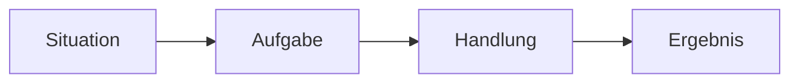

# Interview Q&A · Backend / Java Developer

> **Level:** C1 · **Focus:** answering real HR + technical interview questions in fluent, structured German · **Time:** ~2.5 h
> _After this module you can give strong, native-sounding answers to the eight questions that decide most backend interviews in Germany._

A German technical interview rewards **Struktur, Klarheit und Ehrlichkeit** far more than "sales talk". You don't need perfect grammar — you need a clear line of thought, honest trade-offs, and the right technical vocabulary. Below are eight model answers (*Musterantworten*) — three HR classics and five technical questions a backend/Java developer will genuinely be asked at firms like **SAP**, **Zalando**, **Celonis** or an insurance-IT shop like **Allianz**. Read the answer, translate it, then rebuild it in your own words. Practise delivering these live in [Phase 5 · Mock Interviews](#/phase-5/speaking).

## Objectives / Lernziele

- Answer *Erzählen Sie von sich* and *Warum Deutschland?* in a tight 60–90 seconds.
- Discuss **REST vs. messaging**, **microservices trade-offs**, **incidents**, **Spring Boot** and **code quality** with nuance, not hype.
- Deploy C1 **Redemittel** for weighing options: *Das hängt davon ab, ob …*, *Als Faustregel gilt …*, *Ich lege Wert auf …*.
- Avoid the classic learner traps that make a strong candidate sound weaker than they are.

A useful backbone for the "tell me about a time …" answers is **STAR**:



## 1. „Erzählen Sie von sich."

**Frage (DE):** Erzählen Sie doch kurz etwas über sich.
**Question (EN):** Tell us a bit about yourself.

**Musterantwort (DE):** Sehr gerne. Ich bin Backend-Entwickler mit rund fünf Jahren Erfahrung, hauptsächlich in Java und Spring Boot. In meiner letzten Position habe ich Microservices für eine Zahlungsplattform entwickelt und betrieben — von der Datenbank bis zur REST-Schnittstelle. Besonders viel Freude macht mir sauberer, gut getesteter Code und die enge Zusammenarbeit im Team. Zurzeit lerne ich intensiv Deutsch, weil ich meine berufliche Zukunft langfristig in Deutschland sehe. Deshalb passt diese Stelle für mich fachlich und persönlich sehr gut.

**English:** Gladly. I'm a backend developer with around five years of experience, mainly in Java and Spring Boot. In my last position I built and operated microservices for a payment platform — from the database to the REST interface. I take particular pleasure in clean, well-tested code and close teamwork. Right now I'm learning German intensively, because I see my professional future in Germany long-term. That's why this role fits me well, both technically and personally.

**Vietnamese:** `VI:` *Besonders viel Freude macht mir …* là câu **đảo ngữ** để nhấn mạnh — tân ngữ (*viel Freude*) đứng đầu, động từ thứ hai, chủ ngữ (*mir*) ra sau. Nghĩa: "điều tôi đặc biệt thích là…".

**Vokabular:** die Erfahrung (experience) · die Zahlungsplattform (payment platform) · die Zusammenarbeit (collaboration) · langfristig (long-term).

**Grammatik/Redemittel:** self-intro frame → *"Ich bin … mit rund X Jahren Erfahrung, hauptsächlich in …."* Note *mit … Jahren Erfahrung* (Dativ after *mit*), **not** *für X Jahre*.

**Native tip:** Don't recite your whole CV. 60–90 seconds, ending on *why this role* — German interviewers read a long monologue as poor *Struktur*. And avoid the false friend *"Ich habe 5 Jahre Erfahrung für Java"* → say *"… Erfahrung **mit** Java"*.

## 2. „Warum Deutschland?"

**Frage (DE):** Warum möchten Sie ausgerechnet in Deutschland arbeiten?
**Question (EN):** Why do you want to work in Germany specifically?

**Musterantwort (DE):** Deutschland hat für mich als Softwareentwickler eine besondere Anziehungskraft. Die deutsche Tech-Branche ist stark — gerade im Engineering und im Mittelstand — und der Fokus auf Qualität und Struktur passt sehr gut zu meiner Arbeitsweise. Außerdem schätze ich die verlässlichen Rahmenbedingungen und die Work-Life-Balance. Ich möchte nicht nur remote arbeiten, sondern wirklich Teil eines Teams vor Ort sein. Genau deshalb lerne ich die Sprache und bereite mich gezielt auf ein Leben in Deutschland vor.

**English:** Germany holds a particular appeal for me as a software developer. The German tech sector is strong — especially in engineering and the Mittelstand — and the focus on quality and structure fits my way of working very well. I also value the reliable general conditions and the work-life balance. I don't just want to work remotely, but to really be part of a team on site. That's exactly why I'm learning the language and preparing deliberately for a life in Germany.

**Vietnamese:** `VI:` *die Rahmenbedingungen* = "các điều kiện khung" (khung pháp lý, xã hội, phúc lợi) — khó dịch sát một từ, hiểu là môi trường ổn định, đáng tin cậy.

**Vokabular:** die Anziehungskraft (appeal) · der Mittelstand (mid-sized companies) · die Rahmenbedingungen (general/framework conditions) · gezielt (in a targeted way).

**Grammatik/Redemittel:** correlative pair *"nicht nur …, sondern (auch) …"* — a clean, high-value C1 structure for contrast.

**Native tip:** Skip clichés like *"Deutschland ist ein schönes Land"* and don't make it only about salary. Name something concrete about **engineering culture** — that reads as genuine motivation.

## 3. „Ihre Stärken und Schwächen?"

**Frage (DE):** Was würden Sie als Ihre größten Stärken und Schwächen bezeichnen?
**Question (EN):** What would you describe as your greatest strengths and weaknesses?

**Musterantwort (DE):** Zu meinen Stärken zählt vor allem meine strukturierte, analytische Arbeitsweise — ich zerlege komplexe Probleme gern in kleine, testbare Schritte. Außerdem bin ich ein zuverlässiger Teamplayer, der offen kommuniziert. Eine Schwäche, an der ich aktiv arbeite, ist, dass ich früher dazu geneigt habe, Aufgaben zu perfektionieren, statt sie rechtzeitig abzugeben. Inzwischen setze ich bewusst Prioritäten und hole mir früher Feedback ein. Dadurch bin ich effizienter geworden, ohne die Qualität zu vernachlässigen.

**English:** Among my strengths is above all my structured, analytical way of working — I like to break complex problems into small, testable steps. I'm also a reliable team player who communicates openly. A weakness I'm actively working on is that I used to tend to perfect tasks instead of handing them over in time. By now I set priorities deliberately and get feedback earlier. As a result I've become more efficient without neglecting quality.

**Vietnamese:** `VI:` *dazu neigen, etwas zu tun* = "có xu hướng làm gì". Ở đây *abgeben* nghĩa là "giao/bàn giao công việc", không phải "từ bỏ".

**Vokabular:** die Arbeitsweise (way of working) · zuverlässig (reliable) · die Priorität (priority) · vernachlässigen (to neglect).

**Grammatik/Redemittel:** relative clause with preposition → *"eine Schwäche, **an der** ich arbeite"* (*an* + Dativ relative pronoun). Case logic is in [Phase 1 · Grammar](#/phase-1/grammar).

**Native tip:** The classic trap is a fake weakness (*"Ich bin zu perfektionistisch"*) with no growth. Name a **real but harmless** weakness and, crucially, show the **concrete fix** — that arc is what interviewers score.

## 4. REST vs. Messaging

**Frage (DE):** Wann setzen Sie eine synchrone REST-Schnittstelle ein und wann eine asynchrone, nachrichtenbasierte Kommunikation?
**Question (EN):** When do you use a synchronous REST interface and when asynchronous, message-based communication?

**Musterantwort (DE):** Das hängt stark vom Anwendungsfall ab. Eine synchrone REST-Schnittstelle wähle ich, wenn der Client sofort eine Antwort braucht — etwa bei der Abfrage von Nutzerdaten. Sobald es aber um entkoppelte, ereignisgesteuerte Abläufe geht, bevorzuge ich Messaging, zum Beispiel mit Kafka oder RabbitMQ. Der große Vorteil ist die lose Kopplung: Der Sender muss nicht wissen, wer die Nachricht verarbeitet, und das System bleibt auch bei Lastspitzen stabil. Der Nachteil ist eine höhere Komplexität, weil man sich um Idempotenz und die Reihenfolge der Nachrichten kümmern muss. Als Faustregel gilt: synchron für Abfragen, asynchron für Ereignisse und lang laufende Prozesse.

**English:** It depends heavily on the use case. I choose a synchronous REST interface when the client needs an immediate response — for example, when querying user data. But as soon as it's about decoupled, event-driven flows, I prefer messaging, for example with Kafka or RabbitMQ. The big advantage is loose coupling: the sender doesn't need to know who processes the message, and the system stays stable even under load spikes. The downside is higher complexity, because you have to deal with idempotency and message ordering. As a rule of thumb: synchronous for queries, asynchronous for events and long-running processes.

**Vietnamese:** `VI:` *die lose Kopplung* = "liên kết lỏng" (loose coupling); *die Idempotenz* = tính idempotent — xử lý một message nhiều lần vẫn cho cùng kết quả.

**Vokabular:** synchron / asynchron · die Kopplung (coupling) · ereignisgesteuert (event-driven) · die Lastspitze (load spike) · die Idempotenz (idempotency).

**Grammatik/Redemittel:** *"Das hängt (stark) von … ab"* (*abhängen von* + Dativ) and the framing *"Als Faustregel gilt: …"* to land a crisp conclusion.

**Native tip:** Avoid *Denglisch* like *"es dependt"* or *"es ist gecoupled"* — say *"es hängt ab"*, *"lose gekoppelt"*. Knowing *die Nachricht* (message) and *die Warteschlange* (queue) in German signals real command of the domain.

## 5. Microservices — Trade-offs

**Frage (DE):** Welche Vor- und Nachteile haben Microservices gegenüber einem Monolithen?
**Question (EN):** What are the advantages and disadvantages of microservices compared with a monolith?

**Musterantwort (DE):** Microservices bieten vor allem Skalierbarkeit und Unabhängigkeit: Jedes Team kann seinen Service eigenständig entwickeln, deployen und skalieren. Das erhöht die Entwicklungsgeschwindigkeit, sobald die Organisation eine gewisse Größe erreicht hat. Allerdings erkauft man sich diese Flexibilität mit deutlich mehr Komplexität im Betrieb — Stichworte sind verteiltes Logging, Netzwerklatenz und Datenkonsistenz. Für ein kleines Team oder ein junges Produkt ist ein gut strukturierter Monolith oft die bessere Wahl. Ich plädiere deshalb für einen pragmatischen Ansatz: erst sauber modularisieren und nur dann in Services aufteilen, wenn es einen echten fachlichen oder organisatorischen Grund gibt.

**English:** Microservices mainly offer scalability and independence: each team can develop, deploy and scale its service autonomously. That increases development speed once the organisation has reached a certain size. However, you pay for this flexibility with considerably more operational complexity — keywords are distributed logging, network latency and data consistency. For a small team or a young product, a well-structured monolith is often the better choice. I therefore argue for a pragmatic approach: first modularise cleanly, and only split into services when there's a real business or organisational reason.

**Vietnamese:** `VI:` *sich etwas mit etwas erkaufen* = "phải đánh đổi/trả giá để có được"; *für etwas plädieren* = "ủng hộ, nghiêng về" phương án nào.

**Vokabular:** die Skalierbarkeit (scalability) · der Monolith (monolith, *n*-declension: den Monolith**en**) · die Netzwerklatenz (network latency) · die Datenkonsistenz (data consistency) · der Ansatz (approach).

**Grammatik/Redemittel:** the conditional frame *"erst …, und nur dann …, wenn …"* for a measured recommendation.

**Native tip:** Don't present microservices as universally better — that hype reads as junior. Interviewers reward *"es kommt darauf an"* with a concrete threshold (team size, domain boundaries).

## 6. Umgang mit einem Produktionsfehler

**Frage (DE):** Wie gehen Sie vor, wenn im Produktivsystem ein kritischer Fehler auftritt?
**Question (EN):** How do you proceed when a critical error occurs in the production system?

**Musterantwort (DE):** Zuerst geht es darum, den Schaden zu begrenzen — nicht sofort die Ursache zu finden. Ich verschaffe mir schnell einen Überblick über Logs und Metriken und prüfe, ob ein Rollback oder ein Feature-Flag die Situation sofort entschärfen kann. Parallel informiere ich transparent die betroffenen Kollegen und, falls nötig, den Bereitschaftsdienst. Sobald das System wieder stabil läuft, analysiere ich in Ruhe die Grundursache. Zum Schluss halte ich die Erkenntnisse in einem Post-Mortem fest — und zwar ohne Schuldzuweisungen, damit wir denselben Fehler künftig vermeiden.

**English:** First it's about limiting the damage — not immediately finding the cause. I quickly get an overview of logs and metrics and check whether a rollback or a feature flag can defuse the situation right away. In parallel, I transparently inform the affected colleagues and, if necessary, the on-call engineer. As soon as the system is stable again, I analyse the root cause calmly. Finally, I record the findings in a post-mortem — and without blame, so that we avoid the same error in future.

**Vietnamese:** `VI:` *den Schaden begrenzen* = "giảm thiểu thiệt hại, cầm máu trước đã"; *ohne Schuldzuweisungen* = "không đổ lỗi" (blameless post-mortem).

**Vokabular:** das Produktivsystem (production system) · der Rollback · der Bereitschaftsdienst (on-call duty) · die Grundursache (root cause) · das Post-Mortem.

**Grammatik/Redemittel:** the sequencing chain *"Zuerst …, parallel …, sobald …, zum Schluss …"* and *"es geht darum, … zu + Infinitiv"*.

**Native tip:** Don't say you'd *"sofort einen Hotfix deployen"* under pressure. German teams prize a calm, structured, **blameless** process — stabilise first, assign no blame, learn systematically.

## 7. Erfahrung mit Spring Boot

**Frage (DE):** Erzählen Sie von Ihrer Erfahrung mit Spring Boot.
**Question (EN):** Tell us about your experience with Spring Boot.

**Musterantwort (DE):** Spring Boot ist mein täglich genutztes Framework. Ich habe damit zahlreiche REST-Services gebaut und schätze besonders die Autokonfiguration und das Dependency-Injection-Modell, weil sie den Boilerplate-Code stark reduzieren. In einem Projekt habe ich eine bestehende Anwendung auf Spring Boot migriert und dabei die Startzeit mithilfe von Profilen und Caching deutlich verbessert. Für die Datenbankzugriffe setze ich meist Spring Data JPA ein, achte aber darauf, bei kritischen Abfragen die generierten SQL-Statements zu überprüfen. Beim Testen arbeite ich mit JUnit und Testcontainers, um möglichst realitätsnah zu testen.

**English:** Spring Boot is my day-to-day framework. I've built numerous REST services with it and particularly value the auto-configuration and the dependency-injection model, because they strongly reduce boilerplate code. In one project I migrated an existing application to Spring Boot and, in doing so, significantly improved the startup time using profiles and caching. For database access I mostly use Spring Data JPA, but I make sure to review the generated SQL statements for critical queries. For testing I work with JUnit and Testcontainers, in order to test as realistically as possible.

**Vietnamese:** `VI:` *mein täglich genutztes Framework* dùng **phân từ làm định ngữ mở rộng** ("framework tôi dùng hằng ngày"); *realitätsnah* = "sát với thực tế".

**Vokabular:** die Autokonfiguration (auto-configuration) · der Boilerplate-Code · der Datenbankzugriff (database access) · realitätsnah (realistic, true-to-life).

**Grammatik/Redemittel:** *"Ich schätze besonders …, weil …"* to justify a preference; and the extended participle attribute *"mein **täglich genutztes** Framework"* (a hallmark of C1 written/technical German).

**Native tip:** Don't just list features from the docs. Name **one concrete project + a measurable result** (*"Startzeit deutlich verbessert"*) — evidence beats vocabulary.

## 8. Code-Qualität sicherstellen

**Frage (DE):** Wie stellen Sie sicher, dass Ihr Code eine hohe Qualität hat?
**Question (EN):** How do you ensure that your code is of high quality?

**Musterantwort (DE):** Für mich ist Code-Qualität kein einzelner Schritt, sondern Teil des gesamten Prozesses. Ich schreibe von Anfang an aussagekräftige Tests und halte mich an vereinbarte Konventionen, die wir mit Werkzeugen wie Checkstyle oder SonarQube automatisiert prüfen. Jeder Pull Request wird von mindestens einer Kollegin oder einem Kollegen reviewt, bevor er gemergt wird. Ich lege außerdem Wert auf lesbaren Code mit klaren Namen, denn Code wird viel öfter gelesen als geschrieben. Und wenn mir technische Schulden auffallen, spreche ich sie offen an, statt sie stillschweigend liegen zu lassen.

**English:** For me, code quality isn't a single step but part of the whole process. I write meaningful tests from the start and stick to agreed conventions, which we check automatically with tools like Checkstyle or SonarQube. Every pull request is reviewed by at least one colleague before it's merged. I also value readable code with clear names, because code is read far more often than it's written. And when I notice technical debt, I raise it openly instead of quietly letting it lie.

**Vietnamese:** `VI:` *aussagekräftig* = "có sức biểu đạt, nói lên nhiều" (meaningful); *technische Schulden* = "nợ kỹ thuật"; *stillschweigend* = "âm thầm, lặng lẽ (bỏ qua)".

**Vokabular:** aussagekräftig (meaningful) · die Konvention (convention) · die technischen Schulden (technical debt, meist Plural) · lesbar (readable).

**Grammatik/Redemittel:** *"Ich lege Wert auf + Akkusativ"* (to place value on sth) and the contrast *"…, statt … zu + Infinitiv"* (instead of doing …).

**Native tip:** Don't reduce quality to *"Ich schreibe Tests."* Show the **whole loop** — tests + review + tooling + readability + communicating tech debt. *Klare Kommunikation* is exactly what German teams want to hear.

---

## 🧾 Zusammenfassung · Summary

Strong German interview answers share a shape: a clear opening, an honest trade-off, and a crisp conclusion — never hype. For HR questions, be **structured and specific** (*Erzählen Sie von sich* in 60–90 s; concrete reasons for *Warum Deutschland?*; a real weakness **plus** its fix). For technical questions, lead with *"Das hängt davon ab"* and back it with named trade-offs (loose coupling vs. complexity, scalability vs. operational overhead, stabilise-then-analyse for incidents). Re-use the C1 Redemittel — *Als Faustregel gilt …*, *Ich lege Wert auf …*, *nicht nur …, sondern …* — and rehearse delivery in [Phase 5 · Mock Interviews](#/phase-5/speaking).

## 📇 Vokabel-Checkliste · Vocabulary checklist

| Deutsch | Artikel | Plural | English | VI (if hard) |
|---|---|---|---|---|
| Anziehungskraft | die | Anziehungskräfte | appeal / draw | sức hút |
| Rahmenbedingungen | die | (meist Plural) | framework conditions | điều kiện khung |
| Kopplung | die | Kopplungen | coupling | liên kết |
| Idempotenz | die | — | idempotency | |
| Skalierbarkeit | die | — | scalability | |
| Grundursache | die | Grundursachen | root cause | nguyên nhân gốc |
| Bereitschaftsdienst | der | Bereitschaftsdienste | on-call duty | trực on-call |
| Post-Mortem | das | Post-Mortems | post-mortem | |
| technische Schulden | die | (Plural) | technical debt | nợ kỹ thuật |
| aussagekräftig | — | — | meaningful / expressive | |

→ Load these into [Flashcards](#/@flashcards); more in [Phase 5 · Interview Vocabulary](#/phase-5/vocabulary).

## 🗣️ Sprechübung · Speaking practice

1. **Your 60-second intro.** Record *Erzählen Sie von sich* for your real profile, ending on *why this role*. Time it — aim for under 90 seconds.
2. **Trade-off drill.** Answer *REST vs. Messaging* out loud using *"Das hängt davon ab, ob …"* and closing with *"Als Faustregel gilt …"*.
3. **Weakness with a fix.** Deliver one real weakness + concrete improvement in three sentences.
4. Shadow the model rhythm with the 🔊 below, then swap in your own content.

```audio
Das hängt stark vom Anwendungsfall ab. Als Faustregel gilt: synchron für Abfragen, asynchron für Ereignisse und lang laufende Prozesse.
```

## ❓ Mini-Quiz

1. Fix the preposition: *"Ich habe fünf Jahre Erfahrung ___ Java."* (für / mit?)
2. Which correlative pair fits? *"Ich möchte ___ ___ remote arbeiten, ___ Teil eines Teams vor Ort sein."*
3. Complete the technical frame: *"Das ___ stark vom Anwendungsfall ___."* (which separable verb?)
4. What's the C1 pattern for valuing something? *"Ich ___ ___ auf lesbaren Code."*
5. Incident order: which comes **first** — *die Grundursache analysieren* or *den Schaden begrenzen*?

> **Lösungen:** 1) *Erfahrung **mit** Java* (*mit* + Dativ; *für* is a false friend here). · 2) *…**nicht nur** remote arbeiten, **sondern** Teil eines Teams …* · 3) *Das **hängt** stark vom Anwendungsfall **ab**.* (*abhängen von*). · 4) *Ich **lege Wert** auf lesbaren Code.* (+ Akkusativ). · 5) ***den Schaden begrenzen*** first — stabilise, then analyse the root cause. More at [Quizzes](#/@quiz).

## 📝 Hausaufgabe · Homework

- [ ] Write and memorise your own **Musterantwort** for *Erzählen Sie von sich* (max. 120 words).
- [ ] Draft a **trade-off answer** (REST vs. messaging **or** microservices) using at least two Redemittel from this module.
- [ ] Turn one answer into a **STAR** story (Situation, Aufgabe, Handlung, Ergebnis) from your real experience.
- [ ] List **10 job-relevant terms** from a real German job ad (see [Phase 5 · Job Ads & Company Research](#/phase-5/reading)) and add them to [Flashcards](#/@flashcards).
- [ ] Do a full run-through in [Phase 5 · Mock Interviews](#/phase-5/speaking) and record yourself.

## 📚 Empfohlene Ressourcen · Recommended resources

- **Exam prep:** Goethe-Institut (goethe.de) and telc (telc.net) for C1 speaking formats; textbooks *Aspekte neu C1* (Klett) and *Sicher! C1* (Hueber).
- **Technical German for the ear:** *Engineering Kiosk* and *programmier.bar* — internalise how German developers phrase trade-offs.
- **Pronunciation:** YouGlish (German) and forvo.com for terms like *asynchron*, *Skalierbarkeit*, *Bereitschaftsdienst*.
- **Community:** r/cscareerquestionsEU for real German interview reports.
- **Next:** [Phase 5 · Mock Interviews](#/phase-5/speaking) and [Phase 5 · Interview Vocabulary](#/phase-5/vocabulary).
