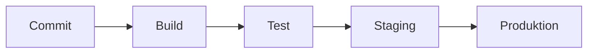

# Interview Q&A · DevOps Engineer

> **Level:** C1 · **Focus:** answering real HR + technical DevOps interview questions in fluent, structured German · **Time:** ~2.5 h
> _After this module you can talk about CI/CD, containers, monitoring, on-call and incidents in German the way a senior DevOps engineer at a German firm actually would._

A German DevOps interview probes two things at once: **Kultur** (culture, mindset) and **Technik** (the tooling). Firms like **Zalando**, **Delivery Hero**, **HelloFresh** or **DB Systel** don't want a tool-dropping monologue — they want calm reasoning, honest trade-offs and the vocabulary of automation, reliability and *blameless* operations. Below are eight model answers (*Musterantworten*) — three culture/HR questions and five technical ones a DevOps engineer will genuinely face. Read the answer, translate it, then rebuild it in your own words and rehearse it live in [Phase 5 · Mock Interviews](#/phase-5/speaking).

## Objectives / Lernziele

- Explain **what DevOps means** and how you handle **Bereitschaftsdienst** (on-call) without clichés.
- Discuss **CI/CD**, **Docker vs. Kubernetes**, **Monitoring/Alerting**, **Infrastructure as Code** and **incident handling** with nuance, not hype.
- Deploy C1 **Redemittel** for weighing options: *Als Faustregel gilt …*, *in erster Linie …*, *lieber …, dafür …*.
- Avoid the learner traps that make a strong DevOps candidate sound junior.

A useful mental picture for the pipeline questions is the flow from commit to production:



## 1. „Was bedeutet DevOps für Sie?"

**Frage (DE):** Was bedeutet DevOps für Sie — eher Werkzeug oder eher Kultur?
**Question (EN):** What does DevOps mean to you — more tooling or more culture?

**Musterantwort (DE):** Für mich ist DevOps in erster Linie eine Kultur und erst danach ein Werkzeugkasten. Im Kern geht es darum, die Mauer zwischen Entwicklung und Betrieb einzureißen, damit beide Seiten gemeinsam Verantwortung für die Software übernehmen — nach dem Prinzip „you build it, you run it". Werkzeuge wie Docker, Kubernetes oder Terraform sind wichtig, aber sie sind nur Mittel zum Zweck. Entscheidend sind kurze Feedback-Schleifen, die Automatisierung wiederkehrender Aufgaben und eine offene Fehlerkultur. Wenn ein Deployment fehlschlägt, fragen wir nicht „wer war schuld?", sondern „wie verhindern wir das künftig automatisch?". Genau diese Haltung möchte ich in Ihr Team einbringen.

**English:** For me, DevOps is first and foremost a culture and only then a toolbox. At its core, it's about tearing down the wall between development and operations, so that both sides take joint responsibility for the software — following the principle "you build it, you run it". Tools like Docker, Kubernetes or Terraform are important, but they're only a means to an end. What's decisive are short feedback loops, the automation of recurring tasks and an open error culture. When a deployment fails, we don't ask "who was to blame?", but "how do we prevent this automatically in future?". This is exactly the attitude I want to bring to your team.

**Vietnamese:** `VI:` *die Mauer … einreißen* = "phá bỏ bức tường" (nghĩa bóng: xóa ranh giới Dev/Ops); *Mittel zum Zweck* = "phương tiện để đạt mục đích" — ý nói công cụ chỉ là phụ, tư duy mới là chính.

**Vokabular:** der Werkzeugkasten (toolbox) · der Betrieb (operations) · die Feedback-Schleife (feedback loop) · die Fehlerkultur (error culture) · einreißen (to tear down).

**Grammatik/Redemittel:** ranking frame *„in erster Linie …, erst danach …"* (first and foremost …, only then …), plus *„es geht darum, … zu + Infinitiv"* to state the essence.

**Native tip:** Don't reduce DevOps to a tool list — that reads as junior. And a language point: DevOps is a *way of working*, not a person, so say *„Ich arbeite als DevOps Engineer"*, **not** *„Ich bin ein DevOps"*.

## 2. „Wie gehen Sie mit Bereitschaftsdiensten um?"

**Frage (DE):** Bereitschaftsdienste gehören bei uns zur Rolle. Wie gehen Sie mit dieser Belastung um?
**Question (EN):** On-call duties are part of the role here. How do you deal with that strain?

**Musterantwort (DE):** Bereitschaftsdienst gehört für mich zum Beruf dazu, und ich gehe ihn strukturiert an. Wichtig ist mir vor allem eine gute Vorbereitung: aussagekräftige Alarme, klare Runbooks und ein sauberes Eskalationsverfahren, damit ich nachts nicht raten muss. Ich achte außerdem darauf, dass die Alarme wirklich handlungsrelevant sind — ständige Fehlalarme führen nur zu Alarmmüdigkeit. Nach einem anstrengenden Einsatz nehme ich mir bewusst Ausgleich und bringe das Thema im Team ein, damit wir die Ursache dauerhaft beheben. So bleibt die Belastung fair verteilt und beherrschbar. Ein guter Bereitschaftsdienst ist für mich am Ende einer, den man durch Automatisierung mit der Zeit überflüssig macht.

**English:** On-call is part of the profession for me, and I approach it in a structured way. What matters most to me is good preparation: meaningful alerts, clear runbooks and a clean escalation procedure, so that I don't have to guess at night. I also make sure the alerts are genuinely actionable — constant false alarms only lead to alert fatigue. After a demanding call-out, I deliberately take time to recover and raise the issue in the team, so that we fix the root cause permanently. That way the load stays fairly distributed and manageable. In the end, a good on-call rotation is one you gradually make redundant through automation.

**Vietnamese:** `VI:` *die Alarmmüdigkeit* = "alert fatigue" (mệt mỏi vì báo động liên tục); *handlungsrelevant* = "đáng để hành động" — alert phải thực sự cần xử lý, không phải nhiễu.

**Vokabular:** die Belastung (strain, load) · handlungsrelevant (actionable) · die Alarmmüdigkeit (alert fatigue) · der Ausgleich (balance, recovery) · beherrschbar (manageable).

**Grammatik/Redemittel:** emphatic fronting *„Wichtig ist mir vor allem …"* (Dativ *mir*) — a natural way to signal a top priority in speech.

**Native tip:** Don't claim you *love* being woken at 3 a.m. — it rings false. German teams reward an honest, structured answer that ends on **reducing** on-call through *Automatisierung*. Use *der Bereitschaftsdienst*, not *die Bereitschaft* alone (which is broader).

## 3. CI/CD-Pipeline

**Frage (DE):** Beschreiben Sie eine CI/CD-Pipeline, die Sie aufgebaut haben.
**Question (EN):** Describe a CI/CD pipeline you have built.

**Musterantwort (DE):** Gern. In meinem letzten Projekt habe ich mit GitLab CI eine mehrstufige Pipeline aufgebaut. Bei jedem Commit laufen zunächst die Unit-Tests und eine statische Code-Analyse; erst wenn beide grün sind, wird ein Docker-Image gebaut und in die Registry geschoben. Anschließend wird das Image automatisch in eine Staging-Umgebung ausgerollt, wo die Integrationstests laufen. Der Schritt in die Produktion erfordert eine manuelle Freigabe, denn bei kritischen Releases wollten wir bewusst einen Menschen im Spiel behalten. Für das Deployment selbst setze ich auf eine rollierende Aktualisierung, sodass es keine Ausfallzeit gibt. Dadurch haben wir die Auslieferung von mehreren Tagen auf unter eine Stunde verkürzt.

**English:** Gladly. In my last project I built a multi-stage pipeline with GitLab CI. On every commit, the unit tests and a static code analysis run first; only when both are green is a Docker image built and pushed to the registry. Then the image is automatically rolled out to a staging environment, where the integration tests run. The step into production requires a manual approval, because for critical releases we deliberately wanted to keep a human in the loop. For the deployment itself I use a rolling update, so that there's no downtime. As a result, we shortened the release from several days to under an hour.

**Vietnamese:** `VI:` *einen Menschen im Spiel behalten* = "giữ con người trong vòng lặp" (human in the loop) — vẫn cần người duyệt; *die rollierende Aktualisierung* = "rolling update".

**Vokabular:** mehrstufig (multi-stage) · die Registry · die Freigabe (approval, sign-off) · rollierend (rolling) · die Ausfallzeit (downtime).

**Grammatik/Redemittel:** conditional sequencing *„erst wenn …, (dann) …"* — note the verb-final Nebensatz and the inversion in the main clause. Recall the Nebensatz rule from [Phase 1 · Grammar](#/phase-1/grammar).

**Native tip:** Don't narrate every YAML line. Name the **stages** and **one measurable outcome** (*Auslieferung von Tagen auf unter eine Stunde*). Article check: *die Pipeline*, *das Deployment*, *die Auslieferung*.

## 4. Docker vs. Kubernetes

**Frage (DE):** Worin liegt der Unterschied zwischen Docker und Kubernetes, und wann brauchen Sie wirklich Kubernetes?
**Question (EN):** What's the difference between Docker and Kubernetes, and when do you really need Kubernetes?

**Musterantwort (DE):** Docker und Kubernetes lösen unterschiedliche Probleme und ergänzen sich. Docker verpackt eine Anwendung mitsamt ihren Abhängigkeiten in ein Image, das überall gleich läuft — es geht also um das Bauen und Ausführen einzelner Container. Kubernetes hingegen ist ein Orchestrierungswerkzeug: Es kümmert sich darum, viele Container über mehrere Server hinweg zu verteilen, ausfallsicher zu betreiben und je nach Last zu skalieren. Für eine einzelne kleine Anwendung wäre Kubernetes überdimensioniert; da genügt oft Docker Compose oder ein einfacher Dienst. Kubernetes lohnt sich erst, wenn man viele Services betreibt, die unabhängig skalieren und ausfallsicher laufen müssen. Als Faustregel gilt: Docker fürs Verpacken, Kubernetes fürs Betreiben im großen Maßstab.

**English:** Docker and Kubernetes solve different problems and complement each other. Docker packages an application together with its dependencies into an image that runs the same everywhere — so it's about building and running individual containers. Kubernetes, on the other hand, is an orchestration tool: it takes care of distributing many containers across several servers, operating them fault-tolerantly and scaling them according to load. For a single small application, Kubernetes would be over-dimensioned; there, Docker Compose or a simple service often suffices. Kubernetes only pays off once you operate many services that need to scale independently and run fault-tolerantly. As a rule of thumb: Docker for packaging, Kubernetes for operating at scale.

**Vietnamese:** `VI:` *überdimensioniert* = "quá mức cần thiết" (over-engineered); *im großen Maßstab* = "ở quy mô lớn".

**Vokabular:** die Abhängigkeit (dependency) · das Orchestrierungswerkzeug (orchestration tool) · überdimensioniert (over-dimensioned) · ausfallsicher (fault-tolerant) · der Maßstab (scale).

**Grammatik/Redemittel:** contrastive *„hingegen"* to set two options against each other, closed off with *„Als Faustregel gilt: …"* for a crisp verdict.

**Native tip:** Don't claim Kubernetes is always the answer — naming when it's overkill signals seniority. Grammar: the verb is *skalieren*, the noun is *die Skalierung*; avoid Denglisch like *„es ist gescaled"*.

## 5. Monitoring und Alerting

**Frage (DE):** Wie gestalten Sie Monitoring und Alerting für ein Produktivsystem?
**Question (EN):** How do you design monitoring and alerting for a production system?

**Musterantwort (DE):** Ich denke Monitoring immer vom Nutzer her. Statt nur CPU und Speicher zu überwachen, konzentriere ich mich auf aussagekräftige Kennzahlen wie Fehlerrate, Antwortzeit und Durchsatz — häufig entlang der vier goldenen Signale. Für Metriken setze ich meist auf Prometheus und Grafana, für eine nachvollziehbare Fehlersuche zusätzlich auf zentrales Logging und Tracing. Beim Alerting gilt für mich: lieber wenige, dafür wirklich relevante Alarme, die an ein konkretes Symptom für den Nutzer geknüpft sind. Jeder Alarm sollte umsetzbar sein und auf ein Runbook verweisen. So vermeiden wir Alarmmüdigkeit und reagieren auf echte Probleme, bevor der Kunde sie überhaupt bemerkt.

**English:** I always think about monitoring from the user's perspective. Instead of only monitoring CPU and memory, I focus on meaningful metrics like error rate, response time and throughput — often along the four golden signals. For metrics I mostly rely on Prometheus and Grafana, and for traceable debugging additionally on centralised logging and tracing. For alerting, my rule is: better few but genuinely relevant alerts, tied to a concrete symptom for the user. Every alert should be actionable and point to a runbook. That way we avoid alert fatigue and react to real problems before the customer even notices them.

**Vietnamese:** `VI:` *vom Nutzer her denken* = "tư duy xuất phát từ người dùng"; *an ein Symptom geknüpft* = "gắn với một triệu chứng" — alert dựa trên triệu chứng người dùng thực sự gặp.

**Vokabular:** die Kennzahl (metric, KPI) · der Durchsatz (throughput) · die Fehlerrate (error rate) · nachvollziehbar (traceable, comprehensible) · umsetzbar (actionable).

**Grammatik/Redemittel:** the perspective frame *„vom Nutzer her denken"* (to think from X's point of view) and the trade-off *„lieber …, dafür …"* (rather few, but in return relevant).

**Native tip:** Don't equate monitoring with dashboards full of graphs. Interviewers value the *symptom-over-cause* and *actionable-alert* mindset. Say *die Kennzahl* / *die Metrik* — don't fall back on only *„die Metrics"*.

## 6. Infrastructure as Code

**Frage (DE):** Warum setzen Sie auf Infrastructure as Code, und welche Werkzeuge nutzen Sie?
**Question (EN):** Why do you rely on Infrastructure as Code, and which tools do you use?

**Musterantwort (DE):** Infrastructure as Code ist für mich unverzichtbar, weil sie Infrastruktur reproduzierbar und überprüfbar macht. Statt Server manuell zu konfigurieren, beschreibe ich den gewünschten Zustand deklarativ — meist mit Terraform für die Cloud-Ressourcen und Ansible für die Konfiguration. Der große Vorteil ist, dass jede Änderung über einen Pull Request läuft, versioniert wird und im Code-Review nachvollziehbar bleibt. Dadurch verschwindet das Problem, dass sich Umgebungen unbemerkt auseinanderentwickeln — der berüchtigte „works on my machine"-Effekt. Außerdem kann ich im Notfall eine komplette Umgebung innerhalb von Minuten neu aufsetzen. Ich achte allerdings darauf, den Zustand sauber zu verwalten, denn ein verlorener oder inkonsistenter State kann schnell teuer werden.

**English:** Infrastructure as Code is indispensable to me because it makes infrastructure reproducible and auditable. Instead of configuring servers manually, I describe the desired state declaratively — mostly with Terraform for the cloud resources and Ansible for the configuration. The big advantage is that every change goes through a pull request, is versioned and stays traceable in code review. This makes the problem disappear where environments drift apart unnoticed — the notorious "works on my machine" effect. Moreover, in an emergency I can rebuild a complete environment within minutes. However, I make sure to manage the state cleanly, because a lost or inconsistent state can quickly become expensive.

**Vietnamese:** `VI:` *sich auseinanderentwickeln* = "trôi lệch khỏi nhau" (config drift — các môi trường dần khác nhau); *berüchtigt* = "khét tiếng, tai tiếng".

**Vokabular:** reproduzierbar (reproducible) · überprüfbar (auditable, verifiable) · deklarativ (declarative) · der Zustand (state) · berüchtigt (notorious).

**Grammatik/Redemittel:** contrast old vs. new practice with *„Statt … zu + Infinitiv, …"*, and justify strongly with *„unverzichtbar, weil …"*.

**Native tip:** Don't oversell IaC as magic — mentioning the **state-management** caveat shows real operational experience. Vocabulary bridge: use *der Zustand* as the clean German alternative to *„der State"*.

## 7. Umgang mit einem Produktionsausfall

**Frage (DE):** Ein zentrales Produktivsystem fällt aus. Wie gehen Sie in den ersten Minuten vor?
**Question (EN):** A central production system goes down. How do you proceed in the first minutes?

**Musterantwort (DE):** In den ersten Minuten steht die Wiederherstellung des Betriebs über allem — die Ursachenforschung kommt später. Zuerst verschaffe ich mir über die Dashboards einen Überblick: Was genau ist betroffen, seit wann, und wie viele Nutzer? Dann prüfe ich die naheliegenden Hebel — einen Rollback der letzten Auslieferung oder das Deaktivieren eines Feature-Flags. Gleichzeitig eröffne ich einen Incident-Kanal und benenne eine Person, die kommuniziert, damit ich mich auf die Technik konzentrieren kann. Sobald das System wieder stabil läuft, dokumentiere ich den Ablauf für ein schuldfreies Post-Mortem. Der wichtigste Grundsatz ist für mich: ruhig bleiben, transparent kommunizieren und niemanden an den Pranger stellen.

**English:** In the first minutes, restoring operations takes priority over everything — the search for causes comes later. First I get an overview via the dashboards: what exactly is affected, since when, and how many users? Then I check the obvious levers — a rollback of the last release or disabling a feature flag. At the same time I open an incident channel and appoint someone to communicate, so that I can focus on the technical side. As soon as the system is running stably again, I document the sequence of events for a blameless post-mortem. The most important principle for me is: stay calm, communicate transparently and don't put anyone in the pillory.

**Vietnamese:** `VI:` *der Hebel* = "đòn bẩy" — ở đây là "cách/biện pháp nhanh để khắc phục"; *jemanden an den Pranger stellen* = "bêu riếu, đổ lỗi công khai" (blameless: không làm vậy).

**Vokabular:** die Wiederherstellung (restoration) · die Ursachenforschung (root-cause investigation) · der Hebel (lever) · schuldfrei (blameless) · der Grundsatz (principle).

**Grammatik/Redemittel:** *„… steht über allem"* (X takes priority over everything) and the sequencing chain *„Zuerst …, dann …, gleichzeitig …, sobald …"*. The same calm sequence works for any incident, whatever the stack.

**Native tip:** Don't rush to a hotfix under pressure. German teams reward calm triage, a clear **communication role** and a *schuldfreies* (blameless) *Post-Mortem*. Idiom worth owning: *jemanden an den Pranger stellen* = to blame publicly.

## 8. DevOps-Kultur im Team verankern

**Frage (DE):** Wie überzeugen Sie ein Entwicklungsteam, DevOps-Praktiken zu übernehmen?
**Question (EN):** How do you convince a development team to adopt DevOps practices?

**Musterantwort (DE):** Ich überzeuge lieber durch Nutzen als durch Vorschriften. Statt neue Werkzeuge von oben vorzuschreiben, suche ich mir einen konkreten Schmerzpunkt des Teams — etwa manuelle, fehleranfällige Deployments — und automatisiere genau den zuerst. Wenn die Kolleginnen und Kollegen sehen, dass eine Aufgabe plötzlich zuverlässig und in Minuten statt Stunden läuft, entsteht die Akzeptanz fast von allein. Wichtig ist mir, die Menschen mitzunehmen und mein Wissen offen zu teilen, statt es für mich zu behalten. Ich dokumentiere die neuen Abläufe verständlich und biete an, sie im Pair-Programming zu zeigen. Veränderung funktioniert für mich über kleine, sichtbare Erfolge, nicht über Zwang.

**English:** I prefer to convince through benefit rather than through rules. Instead of prescribing new tools from the top, I look for a concrete pain point of the team — such as manual, error-prone deployments — and automate exactly that one first. When my colleagues see that a task suddenly runs reliably and in minutes instead of hours, acceptance emerges almost by itself. It's important to me to bring people along and share my knowledge openly, instead of keeping it to myself. I document the new processes understandably and offer to demonstrate them in pair programming. For me, change works through small, visible successes, not through coercion.

**Vietnamese:** `VI:` *der Schmerzpunkt* = "điểm đau" (pain point); *die Menschen mitnehmen* = "đưa mọi người đi cùng" — lôi kéo sự đồng thuận, không áp đặt.

**Vokabular:** die Vorschrift (rule, regulation) · der Schmerzpunkt (pain point) · fehleranfällig (error-prone) · die Akzeptanz (acceptance) · der Zwang (coercion).

**Grammatik/Redemittel:** state a preference with *„lieber … als …"* (rather … than …) and contrast the wrong vs. right approach with *„Statt … zu + Infinitiv, …"*.

**Native tip:** Don't describe change as forcing tools on people — that reads as a poor team fit. German teams value *die Menschen mitnehmen* (bringing colleagues along) and evidence over authority. Note the very natural adjective *fehleranfällig* (error-prone).

---

## 🧾 Zusammenfassung · Summary

A strong German DevOps interview answer leads with **mindset**, then backs it with concrete tooling and one measurable result. For the culture/HR questions, be honest and structured (*DevOps = Kultur + Werkzeugkasten*; *Bereitschaftsdienst* handled through preparation and automation; change driven by *Nutzen*, not *Zwang*). For technical questions, weigh trade-offs openly — Docker for packaging vs. Kubernetes at scale, few actionable alerts vs. *Alarmmüdigkeit*, IaC power vs. the *Zustand*/state caveat — and for incidents, **stabilise first, stay blameless**. Re-use the C1 Redemittel (*Als Faustregel gilt …*, *in erster Linie …*, *lieber …, dafür …*) and rehearse delivery in [Phase 5 · Mock Interviews](#/phase-5/speaking).

## 📇 Vokabel-Checkliste · Vocabulary checklist

| Deutsch | Artikel | Plural | English | VI (if hard) |
|---|---|---|---|---|
| Werkzeugkasten | der | Werkzeugkästen | toolbox | |
| Fehlerkultur | die | Fehlerkulturen | error culture | |
| Belastung | die | Belastungen | strain / load | gánh nặng |
| Ausfallzeit | die | Ausfallzeiten | downtime | thời gian ngừng |
| Orchestrierungswerkzeug | das | Orchestrierungswerkzeuge | orchestration tool | |
| ausfallsicher | — | — | fault-tolerant | |
| Kennzahl | die | Kennzahlen | metric / KPI | chỉ số |
| Durchsatz | der | Durchsätze | throughput | |
| Zustand | der | Zustände | state | |
| Ursachenforschung | die | Ursachenforschungen | root-cause investigation | truy tìm nguyên nhân |
| Schmerzpunkt | der | Schmerzpunkte | pain point | điểm đau |
| fehleranfällig | — | — | error-prone | |

→ Load these into [Flashcards](#/@flashcards); more in [Phase 5 · Interview Vocabulary](#/phase-5/vocabulary).

## 🗣️ Sprechübung · Speaking practice

1. **Culture in 60 seconds.** Answer *„Was bedeutet DevOps für Sie?"* out loud, opening with *„in erster Linie …, erst danach …"*. Time it — under 90 seconds.
2. **Pipeline walkthrough.** Describe a CI/CD pipeline you've built, naming each stage and one measurable outcome, using *„erst wenn …, (dann) …"*.
3. **Trade-off drill.** Answer *Docker vs. Kubernetes* and close with *„Als Faustregel gilt: …"*.
4. Shadow the model rhythm with the 🔊 below, then swap in your own content.

```audio
Als Faustregel gilt: Docker fürs Verpacken, Kubernetes fürs Betreiben im großen Maßstab. Und bei einem Ausfall gilt: erst den Betrieb wiederherstellen, dann die Ursache suchen.
```

## ❓ Mini-Quiz

1. Which tool *orchestrates* many containers across several servers — Docker or Kubernetes?
2. Fix the pattern: *„Ich ___ auf Infrastructure as Code."* (which verb + preposition means "to rely on"?)
3. What's the German term for "alert fatigue"?
4. Complete the Redemittel: *„___ Faustregel ___: Docker fürs Verpacken, Kubernetes fürs Betreiben."*
5. Incident order: which comes **first** — *die Ursachenforschung* or *die Wiederherstellung des Betriebs*?

> **Lösungen:** 1) **Kubernetes** orchestrates; Docker packages/runs single containers. · 2) *Ich **setze auf** Infrastructure as Code.* (*setzen auf* + Akkusativ). · 3) *die **Alarmmüdigkeit***. · 4) ***Als** Faustregel **gilt**: …* · 5) *die **Wiederherstellung des Betriebs*** first — stabilise, then investigate the root cause. More at [Quizzes](#/@quiz).

## 📝 Hausaufgabe · Homework

- [ ] Write and memorise your own **Musterantwort** for *„Was bedeutet DevOps für Sie?"* (max. 120 words).
- [ ] Sketch a **CI/CD pipeline** you have built and describe each stage out loud in German, ending on one measurable result.
- [ ] Draft a **blameless incident answer** using the sequencing chain *„Zuerst …, dann …, gleichzeitig …, sobald …"*.
- [ ] Pull **10 DevOps terms** from a real German job ad (see [Phase 5 · Job Ads & Company Research](#/phase-5/reading)) and add them to [Flashcards](#/@flashcards).
- [ ] Do a full run-through in [Phase 5 · Mock Interviews](#/phase-5/speaking) and record yourself.

## 📚 Empfohlene Ressourcen · Recommended resources

- **Exam prep:** Goethe-Institut (goethe.de) and telc (telc.net) for C1 speaking formats; textbooks *Aspekte neu C1* (Klett) and *Sicher! C1* (Hueber).
- **Technical German for the ear:** *Engineering Kiosk*, *programmier.bar* and *Working Draft* — hear how German engineers phrase CI/CD, Cloud and reliability trade-offs.
- **Reading:** heise.de, Golem.de and Informatik Aktuell for German-language DevOps, Kubernetes and Cloud articles.
- **Pronunciation:** YouGlish (German) and forvo.com for terms like *Orchestrierung*, *ausfallsicher*, *Bereitschaftsdienst*.
- **Community:** r/cscareerquestionsEU and the Engineering Kiosk Discord for real German interview reports.
- **Next:** [Phase 5 · Mock Interviews](#/phase-5/speaking) and [Phase 5 · Interview Vocabulary](#/phase-5/vocabulary).
