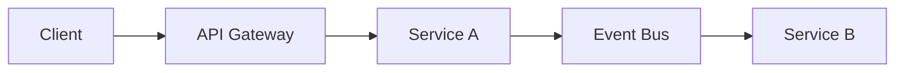

# Interview Q&A · Spring & Microservices

> **Level:** C1 · **Focus:** answering real HR + technical Spring/Microservices interview questions in fluent, structured German · **Time:** ~2.5 h
> _After this module you can discuss Spring Boot, service communication, boundaries, resilience and data consistency in German with the nuance German engineering interviews reward._

For a Spring & Microservices role, German interviewers at firms like **SAP**, **N26**, **Trade Republic**, **Celonis** or **Otto** listen for two layers at once: solid **distributed-systems reasoning** and a **business-aware, communicative** attitude. Buzzwords ("modern, skalierbar, cool") count for little; clear boundaries, honest trade-offs and clean *Kommunikation* count for a lot. Below are eight model answers (*Musterantworten*) — two motivation/teamwork HR questions and six technical ones. Read the answer, translate it, rebuild it in your own words, and rehearse it live in [Phase 5 · Mock Interviews](#/phase-5/speaking).

## Objectives / Lernziele

- Give a confident **motivation** answer and a **teamwork/conflict** story in German.
- Discuss **Spring Boot & Dependency Injection**, **REST vs. messaging**, **service boundaries**, **resilience** and **data consistency** with real nuance.
- Deploy C1 **Redemittel**: *Mich reizt vor allem …*, *Als Faustregel gilt …*, *Stattdessen setze ich auf …*.
- Dodge the false friends and anti-patterns that make a strong candidate sound junior.

A useful picture for the communication questions is how services talk — some synchronously, some via events:



## 1. „Was reizt Sie an Microservices?"

**Frage (DE):** Was reizt Sie an der Arbeit mit einer Microservice-Architektur?
**Question (EN):** What appeals to you about working with a microservice architecture?

**Musterantwort (DE):** Mich reizt vor allem die Kombination aus technischer Herausforderung und Eigenverantwortung. In einer Microservice-Architektur kann ein Team seinen Dienst unabhängig entwickeln, deployen und betreiben — das gibt einem ein echtes Ende-zu-Ende-Verantwortungsgefühl. Gleichzeitig zwingt einen die verteilte Natur dazu, sauber über Grenzen, Verträge und Fehlerfälle nachzudenken, und genau diese Denkweise finde ich spannend. Ich schätze außerdem, dass man Technologien pro Dienst gezielt wählen kann, ohne das ganze System anzufassen. Natürlich ist mir bewusst, dass diese Freiheit mit Verantwortung für Betrieb und Konsistenz einhergeht. Genau dieses Zusammenspiel aus Autonomie und Sorgfalt entspricht meiner Arbeitsweise.

**English:** What appeals to me most is the combination of technical challenge and personal responsibility. In a microservice architecture, a team can develop, deploy and operate its service independently — that gives you a real end-to-end sense of ownership. At the same time, the distributed nature forces you to think cleanly about boundaries, contracts and failure cases, and it's exactly this mindset I find exciting. I also value being able to choose technologies deliberately per service, without touching the whole system. Of course I'm aware that this freedom comes with responsibility for operations and consistency. It's precisely this interplay of autonomy and diligence that matches my way of working.

**Vietnamese:** `VI:` *das Verantwortungsgefühl* = "tinh thần/cảm giác trách nhiệm"; *mit etwas einhergehen* = "đi kèm với" — tự do đi kèm trách nhiệm.

**Vokabular:** die Eigenverantwortung (personal responsibility) · verteilt (distributed) · der Vertrag (contract) · das Zusammenspiel (interplay) · die Sorgfalt (diligence, care).

**Grammatik/Redemittel:** the fronted-object opener *„Mich reizt vor allem …"* (Akkusativ object first, verb second) — a natural, confident way to answer a motivation question.

**Native tip:** Don't answer motivation with buzzwords alone. Tie it to **how you work** (*Eigenverantwortung*, *saubere Grenzen*). Grammar trap: *reizen* takes an **Akkusativ** object — say *„Mich reizt …"*, not *„Mir reizt …"*.

## 2. Konflikt im Team

**Frage (DE):** Erzählen Sie von einer Situation, in der Sie einen fachlichen Konflikt im Team gelöst haben.
**Question (EN):** Tell us about a situation in which you resolved a technical disagreement in the team.

**Musterantwort (DE):** In einem Projekt gab es Streit darüber, ob zwei Teams einen gemeinsamen Dienst oder je einen eigenen bauen sollten. Meine Aufgabe war es, als Backend-Entwickler eine tragfähige Lösung zu moderieren, ohne eine Seite zu übergehen. Ich habe zunächst beide Positionen sachlich aufgeschrieben und die fachlichen Grenzen anhand der Domäne analysiert. Dann habe ich vorgeschlagen, den Dienst entlang eines klaren fachlichen Schnitts zu trennen, sodass jedes Team die volle Verantwortung für seinen Teil behält. Am Ende haben wir uns auf zwei Dienste mit einem sauber definierten Vertrag geeinigt. Das Ergebnis war weniger Reibung im Alltag und deutlich klarere Zuständigkeiten.

**English:** In one project there was a dispute about whether two teams should build a shared service or one each. My task, as a backend developer, was to moderate a viable solution without overriding either side. First I wrote down both positions objectively and analysed the functional boundaries based on the domain. Then I proposed separating the service along a clear functional cut, so that each team keeps full responsibility for its part. In the end we agreed on two services with a cleanly defined contract. The result was less friction in day-to-day work and considerably clearer responsibilities.

**Vietnamese:** `VI:` *tragfähig* = "khả thi, bền vững" (viable, load-bearing); *jemanden übergehen* = "phớt lờ, bỏ qua ai" — không xét ý kiến của họ.

**Vokabular:** tragfähig (viable) · übergehen (to override, bypass) · der Schnitt (cut) · sich einigen auf (to agree on) · die Zuständigkeit (responsibility, remit).

**Grammatik/Redemittel:** STAR in German — *„Meine Aufgabe war es, … zu + Infinitiv"* and a closing *„Das Ergebnis war …"*. Follow the S-A-H-E backbone (Situation, Aufgabe, Handlung, Ergebnis).

**Native tip:** Don't tell a story where you simply *win*. German interviewers value moderation, *sachliche* (objective) analysis and a shared agreement (*sich einigen auf* + Akkusativ). Word choice: a heated argument is *der Streit* / *die Auseinandersetzung*, not just *„diskutieren"*.

## 3. Dependency Injection in Spring

**Frage (DE):** Wie funktioniert Dependency Injection in Spring, und welchen Vorteil bringt sie?
**Question (EN):** How does dependency injection work in Spring, and what advantage does it bring?

**Musterantwort (DE):** Bei Dependency Injection stellt eine Klasse ihre Abhängigkeiten nicht selbst her, sondern bekommt sie von außen gereicht — in Spring übernimmt das der sogenannte Anwendungskontext. Ich bevorzuge dabei die Injektion über den Konstruktor, weil die Abhängigkeiten dadurch unveränderlich und beim Start klar ersichtlich sind. Der große Vorteil ist die lose Kopplung: Meine Geschäftslogik hängt nur von einer Schnittstelle ab, nicht von einer konkreten Implementierung. Das macht den Code leichter testbar, weil ich im Test einfach eine Attrappe einsetzen kann. Von der Feld-Injektion rate ich eher ab, da sie das Testen erschwert und Abhängigkeiten verschleiert. So bleibt der Code wartbar und die Verantwortlichkeiten sind sauber getrennt.

**English:** With dependency injection, a class doesn't produce its dependencies itself but has them handed in from outside — in Spring the so-called application context does this. I prefer constructor injection, because it makes the dependencies immutable and clearly visible at startup. The big advantage is loose coupling: my business logic depends only on an interface, not on a concrete implementation. That makes the code easier to test, because in a test I can simply plug in a mock. I tend to advise against field injection, since it makes testing harder and hides dependencies. That way the code stays maintainable and responsibilities are cleanly separated.

**Vietnamese:** `VI:` *die Attrappe* = "vật giả/mô hình giả" — ở đây là "mock/stub" trong test; *etwas verschleiern* = "che giấu, làm mờ" (hides the dependencies).

**Vokabular:** die Abhängigkeit (dependency) · der Anwendungskontext (application context) · die Schnittstelle (interface) · die Attrappe (mock, dummy) · wartbar (maintainable).

**Grammatik/Redemittel:** the contrast *„nicht … selbst …, sondern … von außen …"* (not itself, but from outside) and *„von etwas abraten"* (to advise against sth, + Dativ).

**Native tip:** Don't just say *„Spring macht das automatisch"*. Show **why** (loose coupling, testability) and state a **preference** (*Konstruktor-Injektion*). *Die Schnittstelle* = interface; avoid over-relying on the English *„das Interface"* in a German interview.

## 4. Kommunikation zwischen Diensten

**Frage (DE):** Wie kommunizieren Ihre Microservices miteinander — synchron oder asynchron?
**Question (EN):** How do your microservices communicate with each other — synchronously or asynchronously?

**Musterantwort (DE):** Ich versuche, so viel wie möglich asynchron und ereignisgesteuert zu lösen, weil das die Dienste entkoppelt und robuster macht. Ein Dienst veröffentlicht ein Ereignis, etwa „Bestellung aufgegeben", und andere Dienste reagieren darauf, ohne dass der Sender sie kennen muss. Synchrone REST-Aufrufe setze ich gezielt dort ein, wo der Aufrufer sofort eine Antwort braucht, zum Beispiel bei einer Preisabfrage. Wichtig ist mir, synchrone Aufrufketten kurz zu halten, denn jede zusätzliche Abhängigkeit senkt die Verfügbarkeit des Gesamtsystems. Beim Vertrag zwischen den Diensten achte ich auf Rückwärtskompatibilität und eine klare Versionierung. Als Faustregel gilt: Abfragen synchron, Zustandsänderungen als Ereignis.

**English:** I try to solve as much as possible asynchronously and event-driven, because that decouples the services and makes them more robust. One service publishes an event, e.g. "order placed", and other services react to it without the sender needing to know them. I use synchronous REST calls deliberately where the caller needs an immediate response, for example for a price query. It's important to me to keep synchronous call chains short, because every additional dependency lowers the availability of the overall system. For the contract between services I pay attention to backward compatibility and clear versioning. As a rule of thumb: queries synchronously, state changes as an event.

**Vietnamese:** `VI:` *die Aufrufkette* = "chuỗi lời gọi" (call chain); *die Rückwärtskompatibilität* = "tương thích ngược" (backward compatibility).

**Vokabular:** ereignisgesteuert (event-driven) · veröffentlichen (to publish) · die Verfügbarkeit (availability) · die Rückwärtskompatibilität (backward compatibility) · die Versionierung (versioning).

**Grammatik/Redemittel:** *„so viel wie möglich …"* (as much as possible) and cause-effect *„…, denn jede zusätzliche Abhängigkeit senkt …"* (…, because every extra dependency lowers …).

**Native tip:** Don't default to REST everywhere just because it's familiar. Naming the **availability cost** of long synchronous chains signals distributed-systems maturity. Say *die Verfügbarkeit* (availability), not *„die Availability"*.

## 5. Service-Schnitt

**Frage (DE):** Nach welchen Kriterien schneiden Sie einen Microservice zu?
**Question (EN):** By what criteria do you cut a microservice?

**Musterantwort (DE):** Ich schneide Dienste entlang fachlicher Grenzen, nicht entlang technischer Schichten. Als Orientierung dient mir das Domain-Driven Design mit seinen „Bounded Contexts": Ein Dienst sollte eine fachliche Fähigkeit vollständig abbilden und seine eigenen Daten besitzen. Ein gutes Zeichen für einen sauberen Schnitt ist, dass sich ein Dienst weitgehend unabhängig ändern lässt, ohne ständig andere Teams zu blockieren. Wenn zwei vermeintlich getrennte Dienste bei jeder Änderung gemeinsam angepasst werden müssen, ist das ein Hinweis, dass die Grenze falsch liegt. Ich fange lieber mit größeren Diensten an und teile erst dann feiner auf, wenn die Grenzen wirklich klar sind. Ein zu früher, zu feiner Schnitt rächt sich später durch verteilte Komplexität.

**English:** I cut services along functional boundaries, not along technical layers. Domain-driven design with its "bounded contexts" serves me as orientation: a service should fully represent one business capability and own its own data. A good sign of a clean cut is that a service can be changed largely independently, without constantly blocking other teams. If two supposedly separate services have to be adapted together with every change, that's an indication that the boundary is in the wrong place. I prefer to start with larger services and only split more finely once the boundaries are truly clear. A too-early, too-fine cut takes its revenge later through distributed complexity.

**Vietnamese:** `VI:` *vermeintlich* = "tưởng chừng, được cho là" (supposedly); *sich rächen* = "trả thù/phản đòn" — nghĩa bóng: về sau gây hậu quả.

**Vokabular:** fachlich (functional, domain-related) · die Schicht (layer) · die Fähigkeit (capability) · vermeintlich (supposedly) · sich rächen (to backfire).

**Grammatik/Redemittel:** *„entlang + Genitiv"* (along …): *entlang fachlicher Grenzen*; and the staged recommendation *„erst dann …, wenn …"* (only … once …).

**Native tip:** Don't split by technical layer (a "database service", a "controller service") — a classic anti-pattern. Interviewers want *fachliche Grenzen* and DDD awareness. Keep the *fachlich* (business/domain) vs. *technisch* distinction sharp — it's central to German engineering talk.

## 6. Resilienz in verteilten Systemen

**Frage (DE):** Wie sorgen Sie in einer verteilten Architektur für Ausfallsicherheit?
**Question (EN):** How do you ensure resilience in a distributed architecture?

**Musterantwort (DE):** Mein Grundsatz lautet: In einem verteilten System ist ein Ausfall kein Sonderfall, sondern der Normalfall — also plane ich ihn von vornherein ein. Konkret setze ich auf Zeitlimits für jeden externen Aufruf, dazu Wiederholungen mit exponentiellem Backoff, aber nur bei Operationen, die idempotent sind. Gegen überlastete Abhängigkeiten schützt ein Circuit Breaker, wie ihn zum Beispiel Resilience4j bietet; er unterbricht Aufrufe zu einem kranken Dienst und gibt ihm Zeit, sich zu erholen. Zusätzlich definiere ich sinnvolle Rückfallebenen, damit der Nutzer im Fehlerfall wenigstens eine reduzierte Antwort bekommt. Wichtig ist, diese Mechanismen auch regelmäßig zu testen, etwa mit gezielten Fehlerinjektionen. So bleibt ein einzelner Ausfall lokal und reißt nicht das ganze System mit.

**English:** My principle is: in a distributed system, a failure is not a special case but the normal case — so I plan for it from the outset. Concretely, I rely on timeouts for every external call, plus retries with exponential backoff, but only for operations that are idempotent. Against overloaded dependencies, a circuit breaker protects — as offered, for example, by Resilience4j; it interrupts calls to an unhealthy service and gives it time to recover. Additionally, I define sensible fallback levels, so that in the error case the user at least gets a reduced response. It's important to test these mechanisms regularly too, for instance with targeted fault injection. That way a single failure stays local and doesn't drag the whole system down with it.

**Vietnamese:** `VI:` *die Rückfallebene* = "mức dự phòng/phương án lùi" (fallback level); *etwas mitreißen* = "kéo theo, cuốn theo" — ở đây lỗi lan ra cả hệ thống.

**Vokabular:** das Zeitlimit (timeout) · idempotent · die Rückfallebene (fallback level) · die Fehlerinjektion (fault injection) · sich erholen (to recover).

**Grammatik/Redemittel:** the strong thesis *„kein …, sondern …"* (not X but Y) and the crucial condition *„nur bei …, die …"* (only for … that …) — e.g. retries only if idempotent.

**Native tip:** Don't list patterns without conditions. The detail that **retries need idempotent operations** separates seniors from juniors. Say *das Zeitlimit* or *der Timeout*; note *idempotent* is the same word in German, just pronounced differently.

## 7. Datenkonsistenz über Dienste hinweg

**Frage (DE):** Wie gewährleisten Sie Datenkonsistenz über mehrere Dienste hinweg, ohne verteilte Transaktionen?
**Question (EN):** How do you ensure data consistency across multiple services, without distributed transactions?

**Musterantwort (DE):** Klassische verteilte Transaktionen über mehrere Dienste vermeide ich bewusst, weil sie schlecht skalieren und die Dienste eng koppeln. Stattdessen setze ich auf letztendliche Konsistenz und das Saga-Muster: Ein Geschäftsvorfall wird in eine Kette lokaler Transaktionen zerlegt, und falls ein Schritt fehlschlägt, gleichen kompensierende Aktionen die vorherigen wieder aus. Damit ein Dienst zuverlässig ein Ereignis veröffentlicht, verwende ich das Outbox-Muster: Die Zustandsänderung und das Ereignis werden in derselben lokalen Transaktion gespeichert. Auf der Empfängerseite achte ich darauf, dass die Verarbeitung idempotent ist, damit doppelte Nachrichten keinen Schaden anrichten. Wichtig ist mir, mit dem Fachbereich zu klären, wo kurzfristige Inkonsistenz fachlich überhaupt akzeptabel ist. Häufig ist sie das — die reale Welt ist ohnehin selten sofort konsistent.

**English:** I deliberately avoid classic distributed transactions across multiple services, because they scale poorly and couple the services tightly. Instead, I rely on eventual consistency and the saga pattern: a business transaction is broken into a chain of local transactions, and if a step fails, compensating actions undo the previous ones. So that a service reliably publishes an event, I use the outbox pattern: the state change and the event are saved in the same local transaction. On the receiving side, I make sure the processing is idempotent, so that duplicate messages don't cause any harm. It's important to me to clarify with the business department where short-term inconsistency is functionally acceptable at all. Often it is — the real world is rarely instantly consistent anyway.

**Vietnamese:** `VI:` *die letztendliche Konsistenz* = "eventual consistency" (nhất quán sau cùng); *kompensierende Aktion* = "hành động bù trừ" trong Saga; *der Fachbereich* = "bộ phận nghiệp vụ".

**Vokabular:** die letztendliche Konsistenz (eventual consistency) · das Saga-Muster (saga pattern) · kompensierend (compensating) · der Fachbereich (business department) · anrichten (to cause/do damage).

**Grammatik/Redemittel:** pivot from anti-pattern to solution with *„Stattdessen setze ich auf …"*, and use purpose clauses *„damit … (Verb am Ende)"*. Recall the Nebensatz rule from [Phase 1 · Grammar](#/phase-1/grammar).

**Native tip:** Don't promise *„starke Konsistenz überall"* in microservices — a red flag. Negotiating acceptable inconsistency with the *Fachbereich* is exactly the business-aware thinking German firms want. False-friend alert: *eventuell* means **"possibly"**, not "eventual" — so *eventual consistency* = *letztendliche Konsistenz*.

## 8. Abstimmung mit anderen Teams

**Frage (DE):** Wie stimmen Sie sich mit anderen Teams über gemeinsame Schnittstellen ab?
**Question (EN):** How do you coordinate with other teams on shared interfaces?

**Musterantwort (DE):** Für mich ist eine Schnittstelle ein Vertrag, und Verträge stimmt man gemeinsam ab. Bei Änderungen an einer API suche ich früh das Gespräch mit den betroffenen Teams, statt sie vor vollendete Tatsachen zu stellen. Wir dokumentieren die Schnittstelle an einer zentralen Stelle — etwa mit einer OpenAPI-Spezifikation —, damit alle denselben Stand haben. Breaking Changes kündige ich rechtzeitig an und biete nach Möglichkeit einen Übergangszeitraum mit zwei parallelen Versionen. Wenn die Meinungen auseinandergehen, versuche ich, die Diskussion auf den fachlichen Bedarf zurückzuführen, statt auf persönliche Vorlieben. Klare, verlässliche Kommunikation ist hier für mich genauso wichtig wie die Technik selbst.

**English:** For me, an interface is a contract, and contracts are agreed on together. For changes to an API, I seek the conversation with the affected teams early, instead of presenting them with a fait accompli. We document the interface in a central place — for instance with an OpenAPI specification — so that everyone is on the same page. I announce breaking changes in good time and, where possible, offer a transition period with two parallel versions. When opinions diverge, I try to bring the discussion back to the functional need, rather than personal preferences. Clear, reliable communication is just as important to me here as the technology itself.

**Vietnamese:** `VI:` *jemanden vor vollendete Tatsachen stellen* = "đặt ai vào sự đã rồi" — báo khi mọi thứ đã quyết xong; *der Übergangszeitraum* = "giai đoạn chuyển tiếp".

**Vokabular:** sich abstimmen (to coordinate) · die Schnittstelle (interface) · vollendete Tatsachen (fait accompli) · der Übergangszeitraum (transition period) · der Bedarf (need, demand).

**Grammatik/Redemittel:** *„statt … zu + Infinitiv"* (instead of doing …) and the reflexive *„sich abstimmen mit + Dativ"* (to coordinate with); plus *„genauso wichtig wie …"* for an equal comparison.

**Native tip:** Don't describe API changes as something you just *„rauswerfen"* (push out). German teams prize early coordination (*sich abstimmen*) and reliable communication. The idiom *jemanden vor vollendete Tatsachen stellen* (to present a fait accompli) lands very well in an interview.

---

## 🧾 Zusammenfassung · Summary

Strong answers for a Spring & Microservices interview pair **technical depth** with a **business-aware, communicative** mindset. For HR questions, tie your motivation to *how* you work (*Eigenverantwortung*, clean boundaries) and tell conflict stories that end in a shared agreement, not a personal win. For technical questions, prefer constructor-based DI for testability, lean async/event-driven while keeping synchronous chains short, cut services along *fachliche Grenzen* (DDD), plan for failure as the *Normalfall* (timeouts, idempotent retries, circuit breaker, fallbacks), and reach for *eventual consistency* with saga + outbox instead of distributed transactions. Re-use the C1 Redemittel (*Mich reizt vor allem …*, *Stattdessen setze ich auf …*, *Als Faustregel gilt …*) and rehearse delivery in [Phase 5 · Mock Interviews](#/phase-5/speaking).

## 📇 Vokabel-Checkliste · Vocabulary checklist

| Deutsch | Artikel | Plural | English | VI (if hard) |
|---|---|---|---|---|
| Eigenverantwortung | die | — | personal responsibility | tự chịu trách nhiệm |
| Schnittstelle | die | Schnittstellen | interface | giao diện lập trình |
| Attrappe | die | Attrappen | mock / dummy | vật giả (trong test) |
| Verfügbarkeit | die | Verfügbarkeiten | availability | tính sẵn sàng |
| fachlich | — | — | functional / domain-related | thuộc nghiệp vụ |
| letztendliche Konsistenz | die | — | eventual consistency | nhất quán sau cùng |
| Saga-Muster | das | Saga-Muster | saga pattern | |
| Rückfallebene | die | Rückfallebenen | fallback level | mức dự phòng |
| Fachbereich | der | Fachbereiche | business department | bộ phận nghiệp vụ |
| vermeintlich | — | — | supposedly | |
| sich abstimmen | — | — | to coordinate | phối hợp thống nhất |
| Rückwärtskompatibilität | die | — | backward compatibility | tương thích ngược |

→ Load these into [Flashcards](#/@flashcards); more in [Phase 5 · Interview Vocabulary](#/phase-5/vocabulary).

## 🗣️ Sprechübung · Speaking practice

1. **Motivation in 60 seconds.** Answer *„Was reizt Sie an Microservices?"* opening with *„Mich reizt vor allem …"*, tied to how you actually work.
2. **Consistency drill.** Explain *eventual consistency* with **saga + outbox + idempotency**, using *„Stattdessen setze ich auf …"*.
3. **STAR story.** Tell your team-conflict story along S-A-H-E (Situation, Aufgabe, Handlung, Ergebnis), ending on *„Das Ergebnis war …"*.
4. Shadow the model rhythm with the 🔊 below, then swap in your own content.

```audio
Als Faustregel gilt: Abfragen synchron, Zustandsänderungen als Ereignis. Und in einem verteilten System ist ein Ausfall kein Sonderfall, sondern der Normalfall.
```

## ❓ Mini-Quiz

1. Fix the case: *„___ reizt die Arbeit mit Microservices."* (*Mich* or *Mir*?)
2. False friend: does *eventuell* mean "eventual"? What's the German for *eventual consistency*?
3. Which injection style gives immutable, clearly visible dependencies — field or constructor?
4. Fix the pattern: *„Ich rate ___ der Feld-Injektion ___."* (which separable verb + preposition = "to advise against"?)
5. Which pattern stores the state change **and** the event in one local transaction so the event is published reliably?

> **Lösungen:** 1) ***Mich** reizt …* (*reizen* + Akkusativ). · 2) No — *eventuell* = "possibly"; *eventual consistency* = *die **letztendliche Konsistenz***. · 3) **Konstruktor-Injektion** (immutable, visible at startup). · 4) *Ich rate **von** der Feld-Injektion **ab**.* (*abraten von* + Dativ). · 5) the ***Outbox-Muster***. More at [Quizzes](#/@quiz).

## 📝 Hausaufgabe · Homework

- [ ] Write and memorise your own **Musterantwort** for *„Was reizt Sie an Microservices?"* (max. 120 words).
- [ ] Turn a real disagreement into a **STAR** story (Situation, Aufgabe, Handlung, Ergebnis) in German.
- [ ] Draft a **data-consistency answer** using *saga + outbox + idempotency* with at least two Redemittel from this module.
- [ ] Pull **10 Spring/microservice terms** from a real German job ad (see [Phase 5 · Job Ads & Company Research](#/phase-5/reading)) and add them to [Flashcards](#/@flashcards).
- [ ] Do a full run-through in [Phase 5 · Mock Interviews](#/phase-5/speaking) and record yourself.

## 📚 Empfohlene Ressourcen · Recommended resources

- **Exam prep:** Goethe-Institut (goethe.de) and telc (telc.net) for C1 speaking formats; textbooks *Aspekte neu C1* (Klett) and *Sicher! C1* (Hueber).
- **Technical German for the ear:** *Engineering Kiosk* and *programmier.bar* — hear how German developers phrase Spring, messaging and consistency trade-offs.
- **Reading:** heise.de, Informatik Aktuell and entwickler.de for German-language Java, Spring and microservice articles.
- **Pronunciation:** YouGlish (German) and forvo.com for terms like *Schnittstelle*, *Verfügbarkeit*, *Konsistenz*.
- **Community:** r/cscareerquestionsEU and the Engineering Kiosk Discord for real German interview reports.
- **Next:** [Phase 5 · Mock Interviews](#/phase-5/speaking) and [Phase 5 · Interview Vocabulary](#/phase-5/vocabulary).
