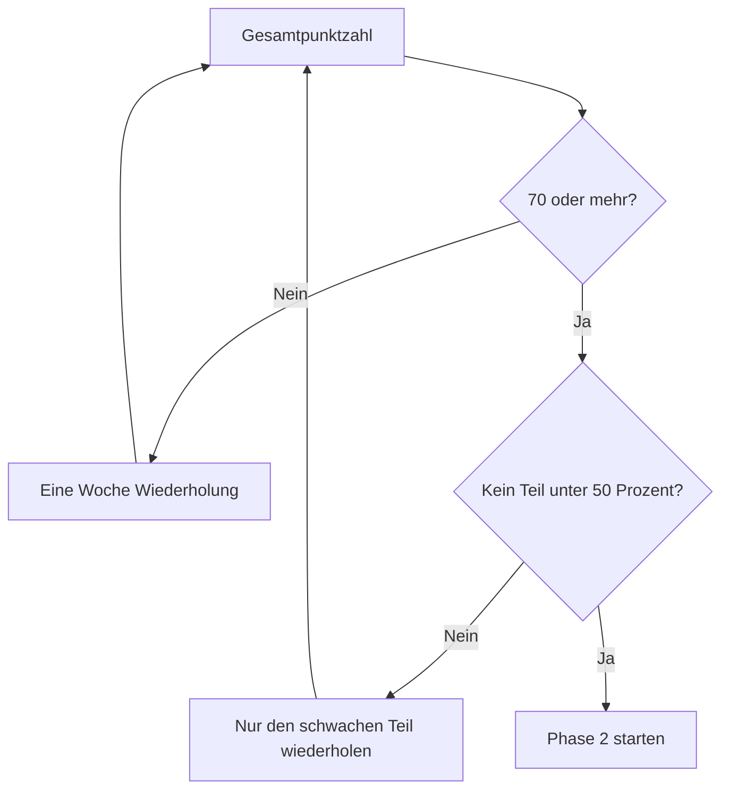

# Phase 1 · Assessment — Prüfung zum Phasenabschluss

> **Level:** B1 · **Focus:** a real four-skill test, scored out of 100, with the Phase-2 gate · **Time:** ~90 min in one sitting
> _After this module you have a number, not a feeling — and a precise list of what to redo._

This is the **week-8 checkpoint** the [52-Week Study Plan](#/plans/52-week-plan) promised. It is a
test, not a review: sit down with a timer, no dictionary, no notes, no pausing to look things up.
Then score yourself against the rubric and let the gate decide whether you start
[Phase 2](#/phase-2/overview) or spend a week on your weak modules.

**Rules:** 90 minutes total · no dictionary · no notes · write your answers before opening any
solution · be strict when scoring yourself. A generous score today costs you a month at B2.

## Objectives / Lernziele

- Sit a complete **four-skill test** under time pressure.
- Score yourself objectively out of **100**.
- Map every lost point to the **module that fixes it**.
- Make the **Phase-2 gate** decision honestly.

---

## Teil 1 · Grammatik & Sprachbausteine (25 Punkte · 20 Minuten)

**1.1 Wortstellung** (5 P — 1 pro Satz). Korrigiere den Fehler.

- a) Heute ich deploye den Service.
- b) Ich bleibe im Büro, weil ich muss den Release fertig machen.
- c) Die Tests sind rot, deshalb ich deploye nicht.
- d) Gestern ich bin ins Büro gegangen.
- e) Ich habe den Fehler gefunden nicht.

**1.2 Kasus & Artikel** (6 P). Setze den richtigen Artikel ein.

| Nr | Satz |
|---|---|
| a | Ich arbeite mit ___ neuen Framework. (das Framework) |
| b | Ich danke ___ Kollegin für das Review. (die Kollegin) |
| c | Wir deployen ___ Service heute Abend. (der Service) |
| d | Nach ___ Deployment machen wir einen Smoke-Test. (das Deployment) |
| e | Der Bug gehört ___ Backend-Team. (das Team) |
| f | Ich pushe den Code in ___ Repository. (das Repository, Bewegung) |

**1.3 Perfekt** (6 P). Schreibe den Satz im Perfekt.

- a) Ich behebe den Fehler.
- b) Der Server stürzt ab.
- c) Wir deployen den Service.
- d) Ich lade die Datei hoch.
- e) Das Problem passiert wieder.
- f) Sie schreibt den Test.

**1.4 Konnektoren** (4 P). Verbinde die Sätze mit dem Konnektor in Klammern.

- a) Ich komme später. Die Bahn hat Verspätung. (weil)
- b) Der Build ist rot. Wir deployen nicht. (deshalb)
- c) Ich habe den Bug gefunden. Ich kann ihn nicht beheben. (aber)
- d) Ich lese den Log. Ich finde die Ursache. (nachdem)

**1.5 Modalverben** (4 P). Ergänze das passende Modalverb.

- a) Ich ___ das Ticket heute übernehmen. *(bin in der Lage)*
- b) Wir ___ die Tests zuerst reparieren. *(es ist notwendig)*
- c) ___ ich den Prod-Zugang bekommen? *(Erlaubnis)*
- d) Ich ___ kurz das Problem erklären. *(höflicher Wunsch)*

---

## Teil 2 · Hören (20 Punkte · 15 Minuten)

Play each Hörtext **twice**, then answer. No transcript until you've scored yourself.

**2.1** (10 P — 2 pro Frage)

```hoertext
Guten Morgen. Kurze Info zum gestrigen Vorfall: Der Zahlungs-Service war gestern Abend von zwanzig Uhr bis kurz nach einundzwanzig Uhr nicht erreichbar. Die Ursache war ein Fehler in der neuen Konfiguration. Wir haben die alte Version wieder eingespielt, und seitdem läuft alles stabil. Der ausführliche Bericht kommt bis Donnerstag. Falls jemand noch Fragen hat, meldet euch bitte direkt bei mir.
```

- a) Welcher Service war betroffen?
- b) Wie lange war er nicht erreichbar?
- c) Was war die Ursache?
- d) Was hat das Team gemacht?
- e) Wann kommt der Bericht?

**2.2** (10 P — 2 pro Frage)

```hoertext
Hallo Huy, hier ist Frau Weber vom Plattform-Team. Sie hatten Zugang zur Produktionsumgebung beantragt. Grundsätzlich ist das kein Problem, aber ich brauche noch die Genehmigung von Ihrem Teamleiter. Könnten Sie ihm kurz Bescheid geben? Sobald die Genehmigung da ist, schalte ich Ihnen den Lesezugriff frei. Das dauert dann etwa einen Tag. Melden Sie sich gerne, wenn etwas unklar ist.
```

- a) Wer ruft an und aus welchem Team?
- b) Worum hat Huy gebeten?
- c) Was fehlt noch?
- d) Welchen Zugriff bekommt er — Lese- oder Schreibzugriff?
- e) Wie lange dauert die Freischaltung?

---

## Teil 3 · Lesen (20 Punkte · 20 Minuten)

> **Betreff: Änderung im Release-Prozess**
>
> Liebe Kolleginnen und Kollegen,
>
> ab dem 1. Oktober ändern wir unseren Release-Prozess. Bisher haben wir jeden Freitagnachmittag
> deployt. Das hat immer wieder zu Problemen geführt, weil am Wochenende niemand erreichbar war.
>
> Künftig deployen wir dienstags und donnerstags, jeweils um 10:00 Uhr. Freitags wird nur noch in
> dringenden Fällen deployt, und zwar ausschließlich nach Rücksprache mit dem Bereitschaftsdienst.
>
> Für jedes Release braucht ihr ab sofort zwei Freigaben: eine fachliche vom Product Owner und eine
> technische aus dem Code-Review. Ohne beide Freigaben lässt die Pipeline das Deployment nicht zu.
>
> Die neue Anleitung findet ihr im Wiki unter „Release-Prozess 2.0". Bei Fragen wendet euch bitte an
> das Plattform-Team.
>
> Viele Grüße
> Das Plattform-Team

**3.1 Richtig oder falsch?** (10 P — 2 pro Aussage)

| Nr | Aussage | R | F |
|---|---|:--:|:--:|
| a | Bisher wurde freitags deployt. | ☐ | ☐ |
| b | Ab Oktober wird gar nicht mehr freitags deployt. | ☐ | ☐ |
| c | Es sind künftig zwei Freigaben nötig. | ☐ | ☐ |
| d | Die Pipeline prüft die Freigaben automatisch. | ☐ | ☐ |
| e | Die neue Anleitung steht im Wiki. | ☐ | ☐ |

**3.2 Fragen** (6 P — 2 pro Frage). Antworte in einem vollständigen deutschen Satz.

- a) Warum war der alte Prozess ein Problem?
- b) An welchen Tagen wird künftig deployt?
- c) Wer gibt die fachliche Freigabe?

**3.3 Wortschatz** (4 P — 1 pro Wort). Was bedeuten diese Wörter im Text?

*die Freigabe · nach Rücksprache · künftig · zulassen*

---

## Teil 4 · Schreiben (20 Punkte · 20 Minuten)

**4.1 Status-Update** (8 P). Schreibe deinen Arbeitsstand: Gestern / Heute / Blocker. Mindestens
zwei Perfekt-Formen und ein Modalverb.

**4.2 E-Mail** (12 P). Schreibe eine **formelle** E-Mail (Sie) an Frau Weber vom Plattform-Team:

- Du brauchst Lesezugriff auf die Produktionsumgebung.
- Begründung: Fehleranalyse zum Vorfall von gestern.
- Bitte um Freischaltung bis Mittwoch.
- 4–6 Sätze, mit Betreff, Anrede und Gruß.

---

## Teil 5 · Sprechen (15 Punkte · 10 Minuten · 🎙 aufnehmen)

Record yourself. You score this from the recording, not from memory of how it felt.

**5.1 Selbstvorstellung** (5 P). 60 Sekunden, ohne Notizen: Name, Herkunft, Beruf, Stack, warum du
Deutsch lernst.

**5.2 Arbeitsbeschreibung** (5 P). 60 Sekunden: Was macht dein Service? Erkläre es einem
nicht-technischen Kollegen.

**5.3 Standup-Beitrag** (5 P). 30 Sekunden: Gestern / Heute / Blocker, frei gesprochen.

---

## 📊 Auswertung · Scoring

Add up all five parts. Maximum: **100 Punkte**.

| Teil | Max | Deine Punkte |
|---|---:|---:|
| 1 · Grammatik & Sprachbausteine | 25 | |
| 2 · Hören | 20 | |
| 3 · Lesen | 20 | |
| 4 · Schreiben | 20 | |
| 5 · Sprechen | 15 | |
| **Gesamt** | **100** | |

**Scoring the open parts.** Teil 4 and 5 have no single right answer, so score against these bands:

| Teil 4 · Schreiben | Punkte |
|---|---|
| Verbposition und Nebensätze durchgehend korrekt | 0–5 |
| Register konsequent (Sie in der Mail, du im Status) + vollständiger Rahmen | 0–4 |
| Wortschatz präzise, keine englischen Lücken | 0–3 |

| Teil 5 · Sprechen | Punkte |
|---|---|
| Flüssigkeit — kein Wechsel ins Englische, wenige lange Pausen | 0–6 |
| Verständlichkeit — Aussprache trägt, wird beim ersten Mal verstanden | 0–5 |
| Struktur — Sätze vollständig, Verb an der richtigen Stelle | 0–4 |

---

## 🚦 Das Phase-2-Gate



| Ergebnis | Bedeutung | Nächster Schritt |
|---|---|---|
| **85–100** | Sehr sicheres B1, teilweise schon B2 | [Phase 2](#/phase-2/overview) starten, Tempo erhöhen |
| **70–84** | Solides B1 — das Ziel dieser Phase | [Phase 2](#/phase-2/overview) starten |
| **55–69** | Grundlagen da, aber nicht automatisch | Eine Woche die schwachen Module, dann neu testen |
| **unter 55** | Zu früh für B2 | Phase 1 komplett wiederholen, Fokus auf Grammatik |

**Zusatzregel:** Auch bei ≥ 70 gilt — ist **ein Teil unter 50 %**, wiederhole zuerst dieses Modul.
Ein Loch in einer Fertigkeit wird in Phase 2 größer, nicht kleiner.

> **Dieselbe Punktzahl beantwortet noch eine zweite Frage.** Woche 8 ist auch der Moment, in dem du
> entscheidest, ob du das **Goethe-B1-Zertifikat** ablegst — kein Lernziel dieser Roadmap, aber oft
> ein Behördennachweis für Niederlassungserlaubnis oder Einbürgerung. Ab **70** hier ist B1 für dich
> eine Formsache, es fehlt nur die Formatroutine. Die drei Fragen, an denen die Entscheidung hängt,
> stehen in [Goethe B1 · Meilenstein Woche 8](#/exams/goethe-b1).

---

## 🔧 Fehler → Modul

Map every lost point to the thing that fixes it. This table is the real output of the assessment.

| Wo du Punkte verloren hast | Was du wiederholst |
|---|---|
| 1.1 Wortstellung | [Grammar](#/phase-1/grammar) §1 + [Übungsteil](#/phase-1/grammar-uebungen) Block A/B |
| 1.2 Kasus & Artikel | [Grammar](#/phase-1/grammar) §2–3 + [Vocabulary · Übungsteil](#/phase-1/vocabulary-uebungen) A1–B2 |
| 1.3 Perfekt | [Grammar](#/phase-1/grammar) §4 + [Übungsteil](#/phase-1/grammar-uebungen) B5, B12 |
| 1.4 Konnektoren | [Writing](#/phase-1/writing) §3 + [Übungsteil](#/phase-1/writing-uebungen) B1–B4 |
| 1.5 Modalverben | [Grammar](#/phase-1/grammar) §5 + [Übungsteil](#/phase-1/grammar-uebungen) B6 |
| Teil 2 Hören | [Listening · Übungsteil](#/phase-1/listening-uebungen) — alle fünf Hörtexte + Diktate |
| Teil 3 Lesen | [Reading · Übungsteil](#/phase-1/reading-uebungen) — Text 1 und 3 intensiv |
| Teil 4 Schreiben | [Writing · Übungsteil](#/phase-1/writing-uebungen) — Block B und C |
| Teil 5 Sprechen | [Speaking · Übungsteil](#/phase-1/speaking-uebungen) — B2–B6 + Redemittel |

Log every recurring error in the [Fehlerjournal](#/@journal) before you start the repeat week.

---

## ✅ Lösungen & Bewertung

```spoiler
### Teil 1 · Grammatik (25 P)

**1.1** (5 P) a) *Heute **deploye ich** den Service.* · b) *… weil ich den Release fertig machen
**muss**.* · c) *… deshalb **deploye ich** nicht.* · d) *Gestern **bin ich** ins Büro gegangen.* ·
e) *Ich habe den Fehler **nicht gefunden**.*

**1.2** (6 P) a) **dem** · b) **der** · c) **den** · d) **dem** · e) **dem** · f) **das**
(*in das Repository* = Bewegung → Akkusativ; *ins Repository* ist auch richtig)

**1.3** (6 P) a) *Ich **habe** den Fehler **behoben**.* · b) *Der Server **ist abgestürzt**.* ·
c) *Wir **haben** den Service **deployt**.* · d) *Ich **habe** die Datei **hochgeladen**.* ·
e) *Das Problem **ist** wieder **passiert**.* · f) *Sie **hat** den Test **geschrieben**.*
(je 1 P; halber Punkt Abzug bei falschem Hilfsverb)

**1.4** (4 P) a) *Ich komme später, **weil die Bahn Verspätung hat**.* · b) *Der Build ist rot,
**deshalb deployen wir** nicht.* · c) *Ich habe den Bug gefunden, **aber ich kann** ihn nicht
beheben.* · d) ***Nachdem ich den Log gelesen habe**, finde ich die Ursache.*

**1.5** (4 P) a) **kann** · b) **müssen** · c) **Darf** · d) **möchte**

### Teil 2 · Hören (20 P)

**2.1** a) **der Zahlungs-Service** · b) **von 20:00 bis kurz nach 21:00 — also gut eine Stunde** ·
c) **ein Fehler in der neuen Konfiguration** · d) **die alte Version wieder eingespielt** ·
e) **bis Donnerstag**

**2.2** a) **Frau Weber, Plattform-Team** · b) **um Zugang zur Produktionsumgebung** ·
c) **die Genehmigung vom Teamleiter** · d) **Lesezugriff** · e) **etwa einen Tag**

Item 2.2 d) is the trap: she says *Zugang* three times and *Lesezugriff* once. If you answered
"Zugang" without the *Lese-*, take 1 of 2 points — in a real workplace that difference decides
whether you can change production.

### Teil 3 · Lesen (20 P)

**3.1** a) **R** · b) **F** — freitags nur noch *in dringenden Fällen nach Rücksprache* ·
c) **R** · d) **R** (*Ohne beide Freigaben lässt die Pipeline das Deployment nicht zu*) · e) **R**

**3.2** a) *Weil freitags deployt wurde und am Wochenende niemand erreichbar war.* ·
b) *Dienstags und donnerstags um 10:00 Uhr.* · c) *Der Product Owner.*

**3.3** die Freigabe = **approval / sign-off** · nach Rücksprache = **after consultation** ·
künftig = **from now on / in future** · zulassen = **to permit / allow**

### Teil 4 · Schreiben (20 P)

**4.1 Musterlösung:**
> **Gestern:** Ich habe den Login-Bug behoben und den PR aufgemacht.
> **Heute:** Ich muss die Tests grün machen und die Migration testen.
> **Blocker:** Ich warte noch auf den Datenbank-Zugang.

**4.2 Musterlösung:**
> Betreff: Lesezugriff auf die Produktionsumgebung
>
> Sehr geehrte Frau Weber,
>
> für die Analyse des Vorfalls von gestern brauche ich Lesezugriff auf die Produktionsumgebung.
> Ohne die Logs aus Produktion kann ich die Ursache nicht sicher bestimmen.
>
> Könnten Sie mir den Zugriff bis Mittwoch freischalten? Falls Sie dafür eine Genehmigung von
> meinem Teamleiter brauchen, hole ich sie gern vorher ein.
>
> Mit freundlichen Grüßen
> Huy Nguyen

Punkte abziehen für: fehlender Betreff (−1), falsches Register (du statt Sie, −2), Großschreibung
direkt nach der Anrede-Kommas (−1), Verbposition-Fehler (je −1).

### Teil 5 · Sprechen (15 P)

Kein Mustertext — bewerte die Aufnahme mit den Bändern oben. Zwei harte Kriterien:

- Bist du **einmal** ins Englische gewechselt? → maximal 4 von 6 Punkten bei Flüssigkeit.
- Musstest du die Selbstvorstellung neu starten? → maximal 3 von 5 bei Struktur.

Beides klingt streng. Genau das ist der Punkt: in einem echten Vorstellungsgespräch gibt es keinen
zweiten Versuch.
```

---

## 🧾 Zusammenfassung · Summary

This is a **90-minute, 100-point test** across grammar, listening, reading, writing and speaking —
the week-8 checkpoint from the [52-Week Study Plan](#/plans/52-week-plan). The gate is **≥ 70 overall
and no single part below 50 %**; anything less means a targeted repeat week, guided by the
**Fehler → Modul** table rather than by feeling. Re-run this test monthly — the score is only useful
if you can compare it to the last one.

## 📇 Vokabel-Checkliste · Vocabulary checklist

| Deutsch | Artikel | Plural | English | VI (if hard) |
|---|---|---|---|---|
| Freigabe | die | Freigaben | approval / sign-off | phê duyệt |
| Genehmigung | die | Genehmigungen | authorization | sự cho phép |
| Vorfall | der | Vorfälle | incident | sự cố |
| Rücksprache | die | Rücksprachen | consultation | trao đổi trước |
| Lesezugriff | der | Lesezugriffe | read access | quyền đọc |
| Auswertung | die | Auswertungen | evaluation / scoring | đánh giá kết quả |
| bestehen | — | — | to pass (a test) | |
| zulassen | — | — | to permit / allow | cho phép |

→ Drill these and more in [Flashcards](#/@flashcards).

## 📝 Hausaufgabe · Homework

- [ ] Sit the **full 90-minute test** in one uninterrupted sitting.
- [ ] Score all five parts and write the total in the **Auswertung** table.
- [ ] Fill in the **Fehler → Modul** table for every lost point.
- [ ] Make the **gate decision** — and if it's "repeat", schedule the week now.
- [ ] Re-take this test in four weeks and compare the two scores.

## 📚 Empfohlene Ressourcen · Recommended resources

- **Level check:** free placement tests on goethe.de and telc.net.
- **Self-quiz:** the app's [Quizzes](#/@quiz) and [Flashcards](#/@flashcards).
- **Weak spots:** the **Fehler → Modul** table above.
- **Next (if you pass):** [Phase 2 · Overview](#/phase-2/overview).
- **Certificate decision:** [Goethe B1 · Meilenstein Woche 8](#/exams/goethe-b1) — whether the
  paperwork is worth a week of your time.
