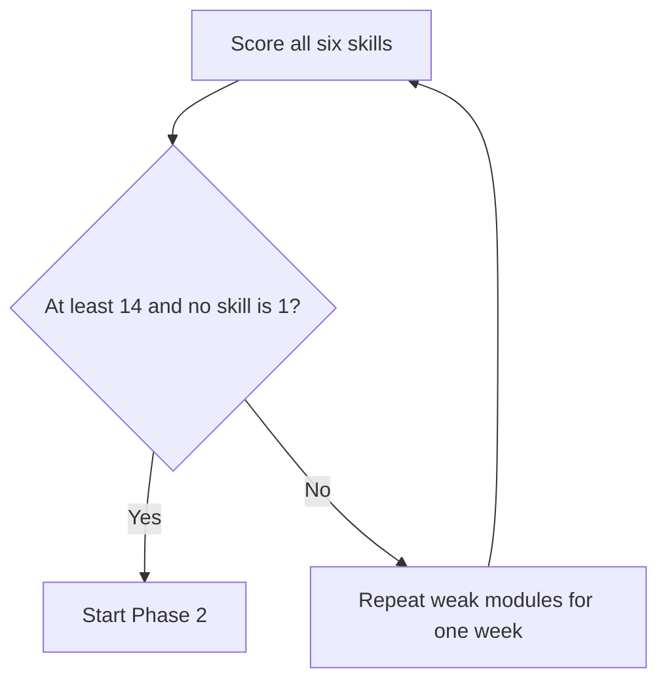

# Phase 1 · Assessment — Are You Ready for Phase 2?

> **Level:** B1 · **Focus:** a can-do checklist, a short self-test, a scoring rubric, the Phase-2 gate · **Time:** ~1 h
> _After this module you know objectively whether your B1 is solid enough to start B2 work._

Progress you don't measure is a feeling, not a fact. This monthly assessment turns "I think my German got better" into a **score** and a **decision**. Run it at the end of Phase 1 (and again monthly as you continue): tick the can-dos honestly, take the short self-test, score yourself against the rubric, and let the decision gate tell you whether to advance to [Phase 2 · Overview](#/phase-2/overview) or repeat your weak modules for a week.

## Objectives / Lernziele

- Check your B1 skills against a concrete **can-do** list.
- Take a short, mixed-skill **self-test**.
- Score yourself with the **rubric** and pass the **Phase-2 gate**.

## 1. Can-do checklist

Tick only what's true **without notes and reliably**:

- [ ] I can introduce myself as a developer in ~60 seconds.
- [ ] I can narrate yesterday/today in correct **Perfekt + modal verbs**.
- [ ] I put the verb in **position 2**, and at the **end** of Nebensätze, automatically.
- [ ] I can pick *der/die/das* for a new noun using ending rules.
- [ ] I can write a short **status update** and a simple **email**.
- [ ] I can follow the **gist** of DW slow news.
- [ ] I can read a simple **README** and guess unknown words from context.
- [ ] I review an **Anki** deck of 100+ words daily.

## 2. Short self-test

Do all four; time yourself (~30 min total):

1. **Write** 3 Nebensätze with *weil / dass / wenn* — verb at the end each time.
2. **Speak** a 60-second self-intro; record it and listen back.
3. **Listen** to one DW slow-news item and write **2 sentences** about it.
4. **Translate** into German: *"I have to test the migration before the deployment."*

> **Musterlösung (4):** *Ich muss vor dem Deployment die Migration testen.* — modal *muss* in position 2, infinitive *testen* at the end, *vor* + Dativ. Compare against [Phase 1 · Grammar](#/phase-1/grammar).

## 3. Scoring rubric

Score each skill 1–3, then add them up (max 18):

| Skill | Not yet (1) | Almost (2) | Solid B1 (3) |
|---|---|---|---|
| Grammar | verb order often wrong | mostly right, some slips | automatic V2 + verb-last |
| Speaking | freezes, switches to English | slow but stays in German | fluent self-intro + standup |
| Listening | lost after one sentence | gets gist of slow audio | gist + most details |
| Reading | stops at every word | reads with the 5-word rule | reads graded texts smoothly |
| Writing | word order breaks | short messages work | status + email are clean |
| Vocabulary | < 50 active words | ~100, patchy review | 100+, daily Anki habit |

## 4. The Phase-2 decision gate

**≥ 14 and no single 1** → you're ready: go to [Phase 2 · Overview](#/phase-2/overview). Otherwise, spend a week on the module behind each low score (e.g. a "1" in Grammar → redo [Phase 1 · Grammar](#/phase-1/grammar)), then re-test. Advancing on a shaky foundation just moves the pain to B2.

## 🧾 Zusammenfassung · Summary

Measure Phase 1 with three tools: a **can-do checklist**, a four-part **self-test**, and a 1–3 **rubric** across six skills. The **gate** is simple — total **≥ 14 with no skill at 1** means start [Phase 2 · Overview](#/phase-2/overview); anything lower means repeat the weakest [Phase 1](#/phase-1/overview) modules for a week and re-test. Re-run this assessment monthly to keep your progress honest.

## 📇 Vokabel-Checkliste · Vocabulary checklist

| Deutsch | Artikel | Plural | English | VI (if hard) |
|---|---|---|---|---|
| Selbsteinschätzung | die | Selbsteinschätzungen | self-assessment | tự đánh giá |
| Ergebnis | das | Ergebnisse | result / score | kết quả |
| Fähigkeit | die | Fähigkeiten | skill / ability | kỹ năng |
| Ziel | das | Ziele | goal | mục tiêu |
| bestehen | — | — | to pass (a test) | |

→ Drill these and more in [Flashcards](#/@flashcards).

## 📝 Hausaufgabe · Homework

- [ ] Complete the **can-do checklist** and the **4-part self-test** in one sitting.
- [ ] Fill in the **rubric** and compute your total out of 18.
- [ ] For every skill scored 1–2, note the module to revisit.
- [ ] Make the **gate decision**: advance to [Phase 2](#/phase-2/overview) or repeat one week.

## 📚 Empfohlene Ressourcen · Recommended resources

- **Level check:** free placement tests on goethe.de and telc.net.
- **Self-quiz:** the app's [Quizzes](#/@quiz) and [Flashcards](#/@flashcards).
- **Weak spots:** revisit any [Phase 1](#/phase-1/overview) module by score.
- **Next (if you pass):** [Phase 2 · Overview](#/phase-2/overview).
