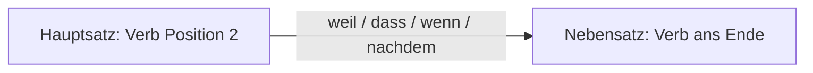
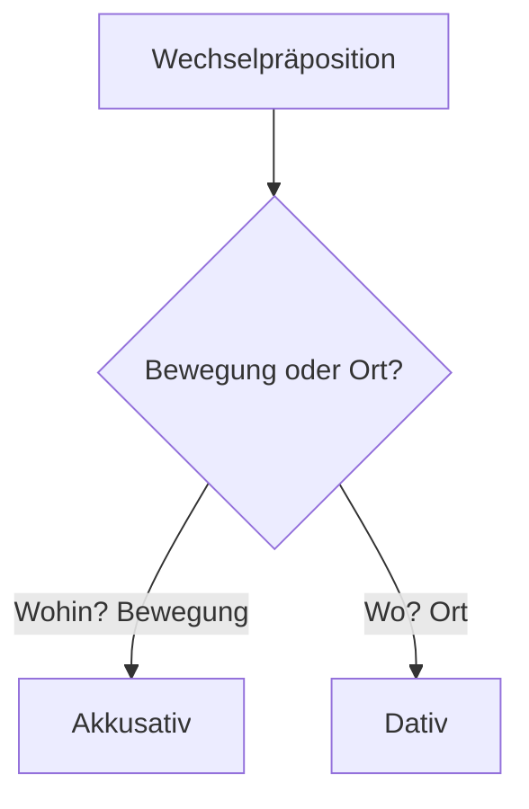

# Phase 1 · Grammar — The B1 Backbone

> **Level:** B1 · **Focus:** word order, the 4 cases, prepositions, Perfekt, modal verbs · **Time:** ~4–5 h
> _After this module you can build correct German sentences about your work — in the right order, with the right case endings, in past and present._

Grammar at B1 is not about memorizing rules — it's about **five high-leverage patterns**
that fix 80% of the mistakes engineers make. Master these and you'll *sound* controlled even
when your vocabulary is still growing. Every example below is from real developer life.

## Objectives / Lernziele

- Put the verb in the **right position** (main clause vs. subordinate clause).
- Use **Nominativ, Akkusativ, Dativ** (and recognize Genitiv) with correct articles.
- Pick the case after common **prepositions**, including the tricky *Wechselpräpositionen*.
- Talk about the past with **Perfekt** (`haben`/`sein` + Partizip II).
- Use **modal verbs** (`können, müssen, sollen, wollen, dürfen, möchten`) fluently.

## 1. Word order — the #1 fix

German main clauses are **Verb-Second (V2)**: whatever comes first, the *conjugated verb* is
always in position 2.

| Position 1 | **Verb (2)** | Mittelfeld | End |
|---|---|---|---|
| Ich | **deploye** | den Service heute | — |
| Heute | **deploye** | ich den Service | — |
| Den Service | **deploye** | ich heute | — |

🇩🇪 **Heute deploye ich den Service.** — *Today I'm deploying the service.*
Note: the subject *ich* moves after the verb when something else takes position 1. This
"inversion" is the single most common thing learners forget.

In **subordinate clauses** (Nebensätze), the conjugated verb goes to the **very end**:



🇩🇪 **Ich kann den Bug nicht fixen, _weil_ die Pipeline _rot ist_.**
*I can't fix the bug because the pipeline is red.* — after *weil*, `ist` jumps to the end.

Mid-field order follows **TeKaMoLo**: **Te**mporal (when) → **Ka**usal (why) → **Mo**dal
(how) → **Lo**kal (where).

🇩🇪 **Ich arbeite _heute_ _wegen des Releases_ _konzentriert_ _im Büro_.**
*Today, because of the release, I'm working in a focused way at the office.*

> Recall this Nebensatz rule — later modules link back to it instead of repeating it.

## 2. The four cases & articles

A case marks a noun's **job** in the sentence. Learn this table cold:

| Case | Job | masc. | fem. | neut. | plural |
|------|-----|:----:|:----:|:-----:|:------:|
| **Nominativ** | subject | der | die | das | die |
| **Akkusativ** | direct object | **den** | die | das | die |
| **Dativ** | indirect object | **dem** | **der** | **dem** | **den (+n)** |
| **Genitiv** | possession | des (+s) | der | des (+s) | der |

🇩🇪 **Der Entwickler (Nom.) gibt dem Kollegen (Dat.) den Zugang (Akk.).**
*The developer gives the colleague the access.* — one sentence, three cases.

**Engineer's shortcut:** most verbs take Akkusativ; a small, learnable set takes **Dativ**
(*helfen, danken, gehören, antworten, folgen*). "Ich **danke dir**", "das **gehört dem
Team**".

## 3. Prepositions choose the case

| Always Akkusativ | Always Dativ | Wechsel (Akk. *or* Dat.) |
|---|---|---|
| durch, für, gegen, ohne, um | aus, bei, mit, nach, seit, von, zu | an, auf, in, über, unter, vor, hinter, neben, zwischen |

For **Wechselpräpositionen**: **motion → Akkusativ** (wohin?), **location → Dativ** (wo?).

🇩🇪 **Ich pushe den Code _in das_ Repository.** (motion, wohin? → Akk.)
🇩🇪 **Der Code liegt _in dem_ (im) Repository.** (location, wo? → Dat.)



```audio
Ich lege die Konfiguration in den Ordner. Die Datei liegt jetzt in dem Ordner.
```

## 4. Talking about the past — Perfekt

In spoken German, the **Perfekt** is the everyday past tense: **`haben`/`sein` + Partizip II**.

| Verb type | Partizip II | Example |
|---|---|---|
| regular | ge-…-t | machen → **gemacht** |
| irregular | ge-…-en | schreiben → **geschrieben** |
| separable | …-ge-… | hochladen → **hochgeladen** |
| -ieren / anglicisms | no *ge-* | deployen → **deployt**, testen → getestet |

Use **`sein`** for movement/change of state (*gehen, kommen, laufen, werden, passieren*),
otherwise **`haben`**.

🇩🇪 **Ich _habe_ den Fehler _gefunden_ und _habe_ einen Fix _gepusht_.**
🇩🇪 **Der Server _ist_ um 3 Uhr _abgestürzt_.** *(crash = change of state → sein)*

> **Präteritum** exists too, but at B1 you actively use it mainly for `sein/haben/modals`
> (war, hatte, konnte, musste) and read it in written/news German. Full Präteritum drilling
> comes in [Phase 2 · Grammar](#/phase-2/grammar).

## 5. Modal verbs — the engineer's workhorses

Modal verb is conjugated in position 2; the **main verb goes to the end as an infinitive**.

| Modal | Meaning | Standup-ready example |
|---|---|---|
| können | can/be able | Ich **kann** das heute **übernehmen**. |
| müssen | must/have to | Wir **müssen** die Tests zuerst **reparieren**. |
| sollen | should (told to) | Ich **soll** den PR bis Freitag **reviewen**. |
| wollen | want to | Wir **wollen** auf Kafka **umsteigen**. |
| dürfen | be allowed | **Darf** ich den Prod-Zugang **bekommen**? |
| möchten | would like (polite) | Ich **möchte** kurz das Problem **erklären**. |

🇩🇪 **Ich muss vor dem Deployment noch die Migration testen.**
*I have to test the migration before the deployment.*

**Politeness bonus (Konjunktiv II preview):** `könnten`, `würden`, `hätten` soften requests.
🇩🇪 **_Könntest_ du bitte den Branch _reviewen_?** — far friendlier than "Review den Branch."
Full Konjunktiv II is drilled in [Phase 2 · Grammar](#/phase-2/grammar).

### Real scene — a Berlin scale-up

At a company like **N26** or **Zalando**, a standup sentence you'll say every day combines
all five patterns: *"Gestern **habe** ich den Login-Bug **behoben**, heute **muss** ich die
Tests **grün machen**, **weil** wir morgen **deployen** **wollen**."* — Perfekt + modal +
Nebensatz + word order, in one breath. That's the whole module working together.

---

## 🧾 Zusammenfassung · Summary

Five patterns carry B1: **(1)** verb-second in main clauses and **verb-last** in Nebensätze;
**(2)** the four **cases** and their article table; **(3)** **prepositions** selecting the
case (motion=Akk., location=Dat.); **(4)** **Perfekt** with `haben`/`sein` for the spoken
past; **(5)** **modal verbs** with the infinitive at the end. Together they let you describe
your work accurately. We reference these rules throughout the handbook rather than repeating
them.

## 📇 Vokabel-Checkliste · Vocabulary checklist

| Deutsch | Artikel | Plural | English | VI (if hard) |
|---|---|---|---|---|
| Hauptsatz | der | Hauptsätze | main clause | mệnh đề chính |
| Nebensatz | der | Nebensätze | subordinate clause | mệnh đề phụ |
| Fall | der | Fälle | (grammatical) case | cách (ngữ pháp) |
| Fehler | der | Fehler | bug / error | |
| Bereitstellung | die | Bereitstellungen | deployment | |
| übernehmen | — | — | to take over (a task) | |
| beheben | — | — | to fix (an error) | |

→ Drill these and more in [Flashcards](#/@flashcards).

## 🗣️ Sprechübung · Speaking practice

1. Say your **yesterday/today** in Perfekt + modal: *"Gestern habe ich …, heute muss ich …"*.
2. Turn 3 commands into polite requests with *könntest du …?*
3. Describe where your code lives vs. where it goes (Wechselpräposition): *"Der Code liegt
   im …, ich pushe ihn in den …"*. Record yourself and compare with the 🔊 below.

```audio
Gestern habe ich den Login-Bug behoben. Heute muss ich die Tests grün machen, weil wir morgen deployen wollen.
```

## ❓ Mini-Quiz

1. Fix the order: *"Heute ich deploye den Service."*
2. Case after *mit*? → *"Ich arbeite mit ___ neuen Framework."* (der/das/dem?)
3. Perfekt of *abstürzen*: *"Der Server ___ gestern ___."* (haben/sein?)
4. Move the verb: *"Ich bleibe im Büro, weil ich den Release ___ (fertig machen)."*

> **Lösungen:** 1) *Heute **deploye ich** den Service.* (verb pos. 2) · 2) **dem** (mit + Dativ,
> das Framework → dem) · 3) *ist … abgestürzt* (change of state → sein) · 4) *…weil ich den
> Release **fertig mache**.* (verb to the end). Full quiz: [Quizzes](#/@quiz).

> 🏋️ **Now drill it.** The full workbook — **36 exercises** with answers and explanations — is in
> [Phase 1 · Grammar · Übungsteil](#/phase-1/grammar-uebungen). Do it before moving on; this module
> is the one everything else in Phase 1 leans on.

## 📝 Hausaufgabe · Homework

- [ ] Write **8 sentences** about your current project: 4 in Perfekt, 4 with a modal verb.
- [ ] Write **3 Nebensätze** with *weil / dass / wenn* and check the verb is at the end.
- [ ] Label the case of every noun in 3 of your sentences (Nom./Akk./Dat.).
- [ ] Do the [Phase 1 · Grammar Basics quiz](#/@quiz) — aim for ≥ 4/5.

## 📚 Empfohlene Ressourcen · Recommended resources

- **Grammar reference:** mein-deutschbuch.de (cases, prepositions), deutsch.lingolia.com.
- **Practice:** Schubert-Verlag online B1 exercises (schubert-verlag.de).
- **Video:** Deutsch mit Marija & Lingoni German — word order and cases playlists.
- **Next:** [Phase 1 · Vocabulary](#/phase-1/vocabulary) → then [Phase 1 · Speaking](#/phase-1/speaking).
