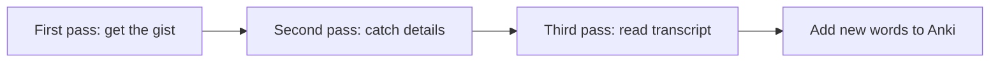

# Phase 1 · Listening — Train Your Ear

> **Level:** B1 · **Focus:** gist-then-detail strategy, a weekly routine, the best B1 resources · **Time:** ~30 min/day
> _After this module you have a repeatable weekly listening routine and know exactly which resources to use._

Listening is the skill Vietnamese learners often neglect, then panic about in a real standup. The problem is rarely your vocabulary — it's **speed and connected speech**. You fix it not by "listening more" vaguely, but with a **method** (gist first, detail later) and a small set of B1-right **resources** you return to every week. This module gives you both, so passive minutes on your commute turn into real progress.

## Objectives / Lernziele

- Listen in two passes: **gist first, then detail**.
- Tell **extensive** (flow) from **intensive** (study) listening and use both.
- Pick the right resource for your level and moment.
- Run a simple **weekly listening routine** you can keep.

## 1. Gist first, detail later

Beginners try to catch every word and drown by the second sentence. Trained listeners get the **big picture first**, then zoom in:



On the first pass ask only: *What is this about? Who is speaking? Happy or worried?* On the second pass catch numbers, names, and key verbs. Only on the third pass open the transcript and mine new words for your [Anki deck](#/phase-1/vocabulary).

## 2. Extensive vs intensive listening

Both matter, for different reasons:

| Type | What it is | When |
|---|---|---|
| **Extensive** | lots of easy input, no stopping | commute, chores, walks |
| **Intensive** | short clip, replay, transcript | focused evening study |

Extensive listening builds your ear for **rhythm and flow**; intensive listening builds **precision**. Do extensive daily and intensive 2–3× per week. Intensive clips double as **shadowing** material for [Phase 1 · Speaking](#/phase-1/speaking).

## 3. Your B1 resource menu

Stick to these — they're pitched right for B1 and all are free or freemium:

| Resource | Type | Best for |
|---|---|---|
| **Easy German** (YouTube) | street interviews with subtitles | real spoken German, gist practice |
| **Nicos Weg** (Deutsche Welle) | A1–B1 video course, subtitled | structured, story-based listening |
| **Coffee Break German** | podcast, explained in English | commute, understanding *why* |
| **DW – Langsam gesprochene Nachrichten** | slow news, daily | news vocabulary, clear articulation |

Start extensive with **Easy German** and **Coffee Break German**; go intensive with **Nicos Weg** episodes and the **slow news**. Don't chase new channels every week — depth beats novelty.

🇩🇪 **Ich höre jeden Tag Deutsch — im Zug, beim Kochen und vor dem Schlafen.** — *I listen to German every day — on the train, while cooking, and before sleep.*

```audio
Willkommen zu den langsam gesprochenen Nachrichten. Heute geht es um Technik, Arbeit und das Wetter in Deutschland.
```

## 4. A weekly listening routine

Anchor listening to things you already do so it survives busy weeks:

| Day | Extensive (commute/chores) | Intensive (evening, ~15 min) |
|---|---|---|
| Mon | Coffee Break German | — |
| Tue | Easy German video | Nicos Weg episode + transcript |
| Wed | Coffee Break German | — |
| Thu | Easy German video | DW slow news, 3 passes |
| Fri | any podcast above | shadow one clip (see Speaking) |
| Sat | free choice | longer Nicos Weg + notes |
| Sun | light or rest | review the week's new words |

Total: ~30 minutes a day, most of it in dead time you were wasting anyway.

## 5. Active-listening technique

Passive hours help, but **active** minutes transform you. During an intensive session:

1. **Predict** — read the title, guess 3 words you'll hear.
2. **Chunk** — pause after each sentence and repeat it aloud.
3. **Transcribe a line** — write one sentence you heard, then check it against the transcript.
4. **Harvest** — add 3–5 new words (with article + plural) to [Flashcards](#/@flashcards).

That loop turns "I listened" into "I learned".

## 🧾 Zusammenfassung · Summary

Ear training is **method + routine**, not just volume. Listen **gist-first, detail-later**, mix **extensive** flow with **intensive** study, and rotate a small resource set: **Easy German**, **Nicos Weg**, **Coffee Break German**, and **DW – Langsam gesprochene Nachrichten**. Anchor ~30 min/day to your commute and chores, and harvest new words into [Flashcards](#/@flashcards). Reuse intensive clips for shadowing in [Phase 1 · Speaking](#/phase-1/speaking).

## 📇 Vokabel-Checkliste · Vocabulary checklist

| Deutsch | Artikel | Plural | English | VI (if hard) |
|---|---|---|---|---|
| Nachricht | die | Nachrichten | (piece of) news / message | tin tức |
| Folge | die | Folgen | episode | tập (podcast) |
| Untertitel | der | Untertitel | subtitle | phụ đề |
| Hörverstehen | das | — | listening comprehension | nghe hiểu |
| Sendung | die | Sendungen | broadcast / show | |
| verstehen | — | — | to understand | |

→ Drill these and more in [Flashcards](#/@flashcards).

## 🗣️ Sprechübung · Speaking practice

1. In German, describe your listening routine: *"Jeden Tag höre ich …, am Wochenende …"*.
2. After one clip, summarize it in **2 German sentences** (gist only).
3. Shadow the audio below, then say where and when you listen most.

```audio
Am Montag höre ich einen Podcast im Zug. Am Abend sehe ich ein Video mit Untertiteln und wiederhole jeden Satz.
```

## ❓ Mini-Quiz

1. What question do you ask on the **first** listening pass?
2. Which resource is best for **structured, subtitled** stories at A1–B1?
3. Extensive or intensive: replaying a short clip with the transcript?

> **Lösungen:** 1) *What is it about?* (the gist) · 2) **Nicos Weg** (Deutsche Welle) · 3) **Intensive**.

## 📝 Hausaufgabe · Homework

- [ ] Do **7 days** of extensive listening (~20 min/day) on your commute.
- [ ] Run **3 intensive sessions** with the gist → detail → transcript passes.
- [ ] Add **15 new words** from listening to your [Flashcards](#/@flashcards).
- [ ] Pick one clip and shadow it for [Speaking](#/phase-1/speaking) practice.

## 📚 Empfohlene Ressourcen · Recommended resources

- **Video:** Easy German (YouTube), Nicos Weg (Deutsche Welle).
- **Podcasts:** Coffee Break German, Easy German Podcast.
- **News (slow):** DW – Langsam gesprochene Nachrichten.
- **Next:** [Phase 1 · Reading](#/phase-1/reading) to pair your ears with your eyes.
