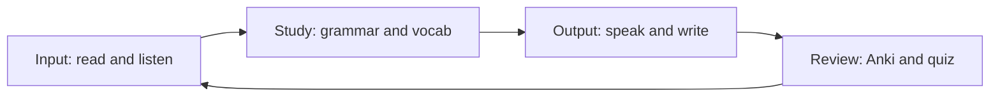
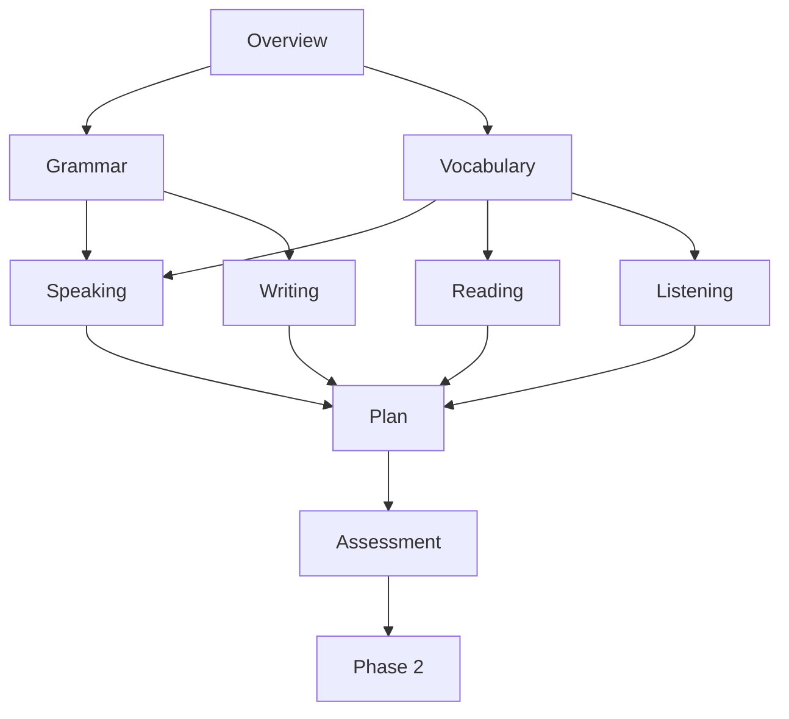

# Phase 1 · Overview — Strengthen Your B1

> **Level:** B1 · **Focus:** honest self-diagnosis, study method, the Phase-1 map · **Time:** ~1 h to plan, ~8 weeks to complete
> _After this module you know exactly where your B1 really stands and how to spend the next eight weeks._

You already ship code in English every day. Phase 1 makes your German catch up to your engineering brain. The goal here is **not** new grammar you've never seen — it's turning shaky, half-remembered B1 into something **automatic**: word order you don't have to think about, cases you get right under pressure, and enough everyday + tech vocabulary to survive a standup. This overview is your map and your honesty mirror. Read it once, plan, then start with [Phase 1 · Grammar](#/phase-1/grammar).

## Objectives / Lernziele

- Diagnose your real B1 level honestly, skill by skill.
- Know what **"solid B1"** looks like for a working developer.
- Pick a study rhythm you can actually keep for eight weeks.
- Navigate the nine Phase-1 modules in a sensible order.

## 1. Who this phase is for

You've passed (or could pass) a B1 test, but in a real German conversation you freeze, translate in your head, and reach for English. That's normal — B1 is the level where **passive knowledge** is far ahead of **active fluency**. Phase 1 closes that gap for *your* world: dailies, tickets, README files, and small talk with a Kollege. If you can't yet read a B1 sentence without stopping, do a quick A2 refresher first; if news German already feels easy, skim Phase 1 and jump to [Phase 2 · Overview](#/phase-2/overview).

## 2. Honest B1 self-diagnosis

Be brutally honest — tick the column that's true **today**, not on a good day.

| I can… | Rarely | Sometimes | Reliably |
|---|:--:|:--:|:--:|
| introduce myself and my job in German | ☐ | ☐ | ☐ |
| put the verb in position 2 without thinking | ☐ | ☐ | ☐ |
| send the verb to the end after *weil / dass* | ☐ | ☐ | ☐ |
| talk about yesterday in **Perfekt** | ☐ | ☐ | ☐ |
| pick *der / die / das* for a new noun | ☐ | ☐ | ☐ |
| follow slow German news for the gist | ☐ | ☐ | ☐ |
| write a short status message in German | ☐ | ☐ | ☐ |

Mostly "Rarely"? Slow down and drill. Mostly "Sometimes"? You're the target reader — Phase 1 will push you to "Reliably".

## 3. What "success" looks like at the end of Phase 1

By week 8 you should comfortably:

- describe your daily dev work in correct **Perfekt + modal verbs** (see [Phase 1 · Grammar](#/phase-1/grammar));
- hold a **60-second self-introduction** as a developer without notes;
- read a simple German README or a *nachrichtenleicht* article and guess unknown words from context;
- write a short **status update** and a simple email;
- run an active **Anki** deck of 100+ everyday and IT words.

That's roughly **1,500–2,500 active words** and automatic B1 sentence structure — the launchpad for B2.

## 4. How to study this phase

Learning a language is a loop, not a reading list. Every week you cycle **input → study → output → review**:



Input without output stays passive; output without review repeats the same mistakes. The [Phase 1 · Plan](#/phase-1/plan) turns this loop into a concrete daily schedule.

## 5. The Phase-1 map



Work the modules in this order:

1. [Grammar](#/phase-1/grammar) — the B1 backbone (do this first).
2. [Vocabulary](#/phase-1/vocabulary) — gender rules, Komposita, your Anki deck.
3. [Speaking Practice](#/phase-1/speaking) — pronunciation, self-intro, standups.
4. [Listening Resources](#/phase-1/listening) — a weekly ear-training routine.
5. [Reading Materials](#/phase-1/reading) — graded news + skimming a README.
6. [Writing Exercises](#/phase-1/writing) — Slack messages, status, a simple email.
7. [Weekly Milestones & Daily Plan](#/phase-1/plan) — your 8-week schedule.
8. [Monthly Assessment](#/phase-1/assessment) — the gate to Phase 2.

## 🧠 Systems-Check (Foundations)

Phase 1 through the lens of [German as a System](#/foundations/german-as-a-system) and
[Your Learning System](#/foundations/learning-system) — know your machine before you run it:

| Systems view | Phase 1 |
|---|---|
| **Fokus-Subsystem** | the **case hub** + the three verb-position rules — run them until they're automatic |
| **Erwarteter Engpass** | retrieval speed: you *know* the rules but translate in your head — output is the constraint from day one |
| **Hebel** | **Regeln (#3)**: non-negotiable daily minimums — 20 Anki cards + one 3-minute recording; protect the streak, not the mood |
| **P1-Fehler** | verb position (V2 / Verb-Ende) · bare verbs stored without signatures (`warten auf + Akk`) |
| **Gate zu Phase 2** | case table 100 % from memory · 60-second self-intro without notes · [Assessment](#/phase-1/assessment) passed |

Log every correction in the [Fehlerjournal](#/@journal) from week 1 — recurring errors are
flaky tests, and they get a targeted drill.

## 🧾 Zusammenfassung · Summary

Phase 1 converts passive B1 into **automatic** B1 for a working developer. Diagnose honestly, aim at concrete outcomes (self-intro, Perfekt narration, reliable word order, 100+ Anki words), and run the **input → study → output → review** loop for eight weeks. Start with [Phase 1 · Grammar](#/phase-1/grammar) and finish at the [Assessment](#/phase-1/assessment).

## 📇 Vokabel-Checkliste · Vocabulary checklist

| Deutsch | Artikel | Plural | English | VI (if hard) |
|---|---|---|---|---|
| Ziel | das | Ziele | goal / objective | mục tiêu |
| Fortschritt | der | Fortschritte | progress | tiến bộ |
| Wortschatz | der | Wortschätze | vocabulary | vốn từ |
| Gewohnheit | die | Gewohnheiten | habit | thói quen |
| Woche | die | Wochen | week | |
| Übung | die | Übungen | exercise / practice | |

→ Drill these and more in [Flashcards](#/@flashcards).

## 🗣️ Sprechübung · Speaking practice

1. Say out loud, in German, **one** goal for these 8 weeks: *"In acht Wochen möchte ich …"*.
2. Read the audio line below, then say your own version with your real job title.

```audio
Ich bin Backend-Entwickler und lerne Deutsch, um in Deutschland zu arbeiten. In acht Wochen möchte ich mein B1 festigen.
```

## ❓ Mini-Quiz

1. Name the four-step study loop of this phase.
2. Which module should you do **first** in Phase 1?
3. True or false: "solid B1" here means learning brand-new grammar you've never seen.

> **Lösungen:** 1) Input → Study → Output → Review · 2) [Grammar](#/phase-1/grammar) · 3) False — it means making existing B1 *automatic*.

## 🏋️ Übungsteil · Diagnose yourself (9 Aufgaben)

Light block — this module is a map, not a lesson. But answer these honestly before you start.

**Ü1.** Fill in the **self-diagnosis table** in §2 above. Every row, today's honest answer.

**Ü2.** Count your "Reliably" ticks: ___ / 7. Fewer than 3 → slow down and drill; 3–5 → you're the
target reader; 6–7 → skim Phase 1 and go to [Phase 2](#/phase-2/overview).

**Ü3.** Which **two** rows did you mark lowest? Name the module that fixes each.

| Schwäche | Modul |
|---|---|
| | |
| | |

**Ü4.** Write your Phase-1 goal in German: *"In acht Wochen kann ich ______."*

**Ü5.** Say it out loud. Does the verb sit in position 2? Check against
[Grammar](#/phase-1/grammar) §1.

**Ü6.** How many hours per week can you **realistically** give this? Be pessimistic — write the
number you can hit in a bad week: ___ h.

**Ü7.** Which of the six skills is your **bottleneck** right now? (Usually the one you avoid.)

**Ü8.** Open the [Fehlerjournal](#/@journal) and add your first entry: one mistake you know you make
repeatedly.

**Ü9.** Bookmark ★ the three modules you'll do first.

> **Lösungen:** Ü2 is the only one with a fixed reading — the rest are your own diagnosis. If Ü7 and
> Ü6 conflict (your bottleneck is speaking but you only planned reading time), fix the schedule in
> [Plan](#/phase-1/plan) before you start week 1.

## 📝 Hausaufgabe · Homework

- [ ] Fill in the **self-diagnosis** table above honestly.
- [ ] Write your one-line goal for Phase 1 ("In acht Wochen kann ich …").
- [ ] Open the [Weekly Milestones & Daily Plan](#/phase-1/plan) and block study time in your calendar.
- [ ] Bookmark [Grammar](#/phase-1/grammar) as your next module.

## 📚 Empfohlene Ressourcen · Recommended resources

- **Placement check:** the free level tests on goethe.de and telc.net.
- **SRS:** [Anki](#/@flashcards) — set up your personal IT deck this week.
- **Community:** r/German and r/cscareerquestionsEU for realistic expectations.
- **Next:** [Phase 1 · Grammar](#/phase-1/grammar).
