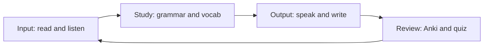

# Phase 1 · Plan — Weekly Milestones & Daily Rhythm

> **Level:** B1 · **Focus:** an 8-week milestone plan and a repeatable daily schedule · **Time:** ~2 h/day for 8 weeks
> _After this module you have a concrete week-by-week plan and a daily rhythm you can actually keep._

Motivation fades; **systems** last. This module turns the whole of Phase 1 into a schedule: eight weekly milestones so you always know *what* to hit, and a Monday–Sunday rhythm so you never wonder *when* to study. The plan assumes about two hours a day, most of it in dead time (commute, chores) plus one focused evening block. Adjust the volume, keep the **shape**.

## Objectives / Lernziele

- Follow **8 weekly milestones** from grammar to assessment.
- Run a **daily rhythm**: morning 30 min, afternoon 30 min, evening 1–2 h.
- Keep the **input → study → output → review** loop turning every week.

## 1. The weekly cycle

Each week runs the same loop, just with new material:

## 2. Weekly milestones (weeks 1–8)

| Week | Focus module | Milestone (done = ✅) |
|:--:|---|---|
| 1 | [Grammar](#/phase-1/grammar): word order + cases | 8 correct sentences about your project |
| 2 | [Grammar](#/phase-1/grammar): Perfekt + modals | narrate yesterday/today in Perfekt |
| 3 | [Vocabulary](#/phase-1/vocabulary): gender/plural + Anki | 100-card IT deck started, daily review |
| 4 | [Speaking](#/phase-1/speaking): sounds + self-intro | record a smooth 60-sec self-intro |
| 5 | [Listening](#/phase-1/listening): routine + Nicos Weg | finish a Nicos Weg B1 section |
| 6 | [Reading](#/phase-1/reading): graded news + README | read 4 graded articles, skim 1 README |
| 7 | [Writing](#/phase-1/writing): chat + status + email | write a German status for 5 days |
| 8 | Consolidate | pass the [Monthly Assessment](#/phase-1/assessment) |

Grammar leads because everything else stands on it; weeks 4–7 rotate the four skills; week 8 is the gate.

## 3. Daily rhythm (Mon–Sun)

Anchor each block to something you already do. **Anki every morning** is non-negotiable — it's the spine of the whole plan.

| Day | Morning 30 | Afternoon 30 | Evening 1–2 h |
|:--:|---|---|---|
| Mon | Anki review | podcast on commute | grammar module + exercises |
| Tue | Anki | Easy German video | speaking: shadowing + self-intro |
| Wed | Anki | graded article (Top-Thema) | writing: status + connectors |
| Thu | Anki | Coffee Break German | grammar drills + [quiz](#/@quiz) |
| Fri | Anki | DW slow news | review the week + record speaking |
| Sat | Anki | skim heise.de headlines | longer listening + note new words |
| Sun | light Anki | rest / optional | plan next week + [checklist](#/@checklist) |

Two hours sounds like a lot, but morning + afternoon (~1 h) is dead time you already have; only the evening block asks for real focus.

## 🧾 Zusammenfassung · Summary

Phase 1 fits into **8 weekly milestones** (grammar first, four skills in the middle, assessment last) and a **daily rhythm** of morning Anki, an afternoon commute-listen or read, and one focused evening block. Every week runs the **input → study → output → review** loop. Keep the shape even when life shrinks the hours; track it with the [Weekly Study Checklist](#/@checklist).

## 📇 Vokabel-Checkliste · Vocabulary checklist

| Deutsch | Artikel | Plural | English | VI (if hard) |
|---|---|---|---|---|
| Zeitplan | der | Zeitpläne | schedule | lịch trình |
| Meilenstein | der | Meilensteine | milestone | cột mốc |
| Alltag | der | — | daily routine | thường nhật |
| Wochenende | das | Wochenenden | weekend | |
| planen | — | — | to plan | |

→ Drill these and more in [Flashcards](#/@flashcards).

## 📝 Hausaufgabe · Homework

- [ ] Copy the **daily rhythm** into your calendar as recurring blocks.
- [ ] Set a **week-1 milestone** date and start [Grammar](#/phase-1/grammar) today.
- [ ] Turn on the [Weekly Study Checklist](#/@checklist) and tick it nightly.
- [ ] Schedule your [Monthly Assessment](#/phase-1/assessment) for the end of week 8.

## 📚 Empfohlene Ressourcen · Recommended resources

- **Tracking:** the app's [Weekly Study Checklist](#/@checklist) and [Flashcards](#/@flashcards).
- **SRS discipline:** Anki daily reviews (your morning anchor).
- **Modules to schedule:** all nine [Phase 1](#/phase-1/overview) lessons in order.
- **Next:** [Phase 1 · Assessment](#/phase-1/assessment) at the end of week 8.
