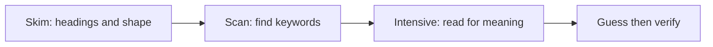

# Phase 1 · Reading — Read Without Drowning

> **Level:** B1 · **Focus:** skim-scan-intensive strategy, graded news, skimming a German README · **Time:** ~20–30 min/day
> _After this module you can read a simple German article or README for meaning without looking up every word._

Reading is your **highest-leverage** skill as a developer: you already read English docs all day, and German technical text is full of English loanwords and cognates that hand you free comprehension. The trap at B1 is the **dictionary reflex** — stopping at every unknown word until you lose the thread. This module trades that reflex for a **strategy** (skim → scan → intensive) and points you at graded news plus the one text you'll meet on day one at a German job: a README.

## Objectives / Lernziele

- Read in three gears: **skim, scan, intensive**.
- **Guess** unknown words from context instead of stopping.
- Use graded news (**nachrichtenleicht**, **DW Top-Thema**) at the right level.
- **Skim a German README** and extract the setup steps.

## 1. Three reading gears

Don't read every text the same way. Match the gear to your goal:



- **Skim** — read the title, headings, first sentences. Goal: *what is this about?*
- **Scan** — hunt for specific keywords (a version number, a command, a name).
- **Intensive** — read a chosen paragraph closely for full meaning.

Most reading is skim + scan; you go intensive only where it matters.

## 2. The 5-word rule — don't drown

Set a limit: on a first read, **guess** unknown words from context; look up **at most five per text**, and only ones that block meaning. German helps you here:

- **Cognates:** *das Haus* (house), *die Maus* (mouse), *das System*, *die Analyse*.
- **Tech loanwords:** *der Server*, *das Deployment*, *das Repository*, *committen*.
- **Komposita:** decode long words right-to-left — recall the trick from [Phase 1 · Vocabulary](#/phase-1/vocabulary).

🇩🇪 **Die Anwendung stürzt beim Start ab, weil eine Umgebungsvariable fehlt.** — *The application crashes at startup because an environment variable is missing.* Even if *Umgebungsvariable* is new, *Umgebung* + *Variable* + context gives it to you.

## 3. Graded news resources

Real news is too fast at B1. Use **simplified** news that's written for learners:

| Resource | What it is | Best for |
|---|---|---|
| **nachrichtenleicht** | weekly news in simple language, with a glossary | current events without overwhelm |
| **DW – Top-Thema** | B1 news articles with audio, vocab and exercises | reading + listening + word lists together |

Read one short article, 3× per week. **Top-Thema** is ideal because each piece bundles the article, an audio version, a glossary, and exercises — a complete B1 reading workout.

```audio
Ein deutsches Unternehmen sucht neue Entwickler. Viele Firmen brauchen Fachkräfte in der IT.
```

## 4. Skimming a German README

At a German company (say a GitLab-using Mittelstand or a Berlin scale-up like idealo), the README may be in German. You don't read it word-for-word — you **scan for the setup steps**. Here's a typical section:

```
## Installation
Voraussetzungen: Java 17, Docker, PostgreSQL.
1. Repository klonen.
2. Umgebungsvariablen in der Datei `.env` setzen.
3. Mit `docker compose up` die Container starten.
4. Die Anwendung ist unter http://localhost:8080 erreichbar.
```

Decode the load-bearing words and you're productive:

| German | English |
|---|---|
| Voraussetzungen | prerequisites |
| klonen | to clone |
| Umgebungsvariablen | environment variables |
| setzen | to set |
| starten | to start |
| erreichbar | reachable / available |

Notice: the commands and tool names stay in English — you only decode the connective German around them.

## 5. Build a reading habit

Reading grows almost passively if you **anchor** it:

1. **Morning:** skim the headlines on heise.de or Golem.de — just the titles count.
2. **3× a week:** one Top-Thema or nachrichtenleicht article, intensive.
3. **At work:** whenever you hit German text, skim before you translate.
4. **Harvest:** 3–5 new words per text into [Flashcards](#/@flashcards).

Skimming tech headlines is low effort and keeps you around real vocabulary; you'll read full articles comfortably in [Phase 2 · Reading](#/phase-2/reading).

## 🧾 Zusammenfassung · Summary

Read in three gears — **skim** for the topic, **scan** for keywords, **intensive** for the paragraphs that matter — and resist the dictionary reflex with the **5-word rule**, leaning on cognates, tech loanwords, and right-to-left **Komposita** decoding. Practice on graded news (**nachrichtenleicht**, **DW Top-Thema**) and on real **README** files, where you decode only the German around English commands. Harvest new words into [Flashcards](#/@flashcards).

## 📇 Vokabel-Checkliste · Vocabulary checklist

| Deutsch | Artikel | Plural | English | VI (if hard) |
|---|---|---|---|---|
| Voraussetzung | die | Voraussetzungen | prerequisite | điều kiện tiên quyết |
| Umgebungsvariable | die | Umgebungsvariablen | environment variable | biến môi trường |
| Anleitung | die | Anleitungen | guide / instructions | hướng dẫn |
| Überschrift | die | Überschriften | heading / title | tiêu đề |
| Unternehmen | das | Unternehmen | company | doanh nghiệp |
| erreichbar | — | — | reachable / available | |

→ Drill these and more in [Flashcards](#/@flashcards).

## 🗣️ Sprechübung · Speaking practice

1. After skimming an article, say its topic in **one German sentence**: *"In dem Artikel geht es um …"*.
2. Read the README steps above aloud, then explain step 2 in your own words.
3. Read the audio line, then say which German tech site you'll skim daily.

```audio
In dem Artikel geht es um die IT-Branche in Deutschland. Viele Unternehmen suchen Fachkräfte und bieten gute Bedingungen.
```

## ❓ Mini-Quiz

1. Which gear do you use to find a version number fast — skim, scan, or intensive?
2. What does *Voraussetzungen* mean in a README?
3. How many words should you look up on a first read, at most?

> **Lösungen:** 1) **Scan** · 2) **prerequisites** · 3) at most **five**, only meaning-blocking ones.

## 📝 Hausaufgabe · Homework

- [ ] Read **3 graded articles** this week (Top-Thema or nachrichtenleicht), intensive.
- [ ] Skim tech headlines on heise.de or Golem.de on **5 days** — titles only.
- [ ] Skim one German (or auto-translated) README and list its **setup steps**.
- [ ] Add **15 new words** from your reading to [Flashcards](#/@flashcards).

## 📚 Empfohlene Ressourcen · Recommended resources

- **Graded news:** nachrichtenleicht; DW – Top-Thema (article + audio + exercises).
- **Tech headlines:** heise.de, Golem.de, t3n.de (skim titles daily).
- **Dictionaries:** dict.leo.org, DWDS.de, Linguee for context.
- **Next:** [Phase 1 · Writing](#/phase-1/writing) to start producing German yourself.
