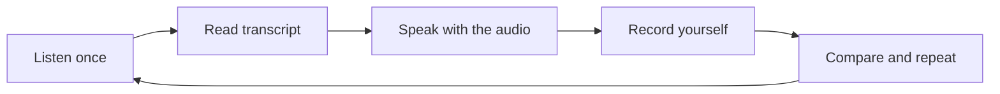

# Phase 1 · Speaking — Find Your German Voice

> **Level:** B1 · **Focus:** pronunciation foundations, self-introduction, describing your job, surviving a standup · **Time:** ~3–4 h + daily shadowing
> _After this module you can introduce yourself, explain what you do, and get through a slow standup without switching to English._

Speaking is where B1 developers feel most exposed — you understand plenty, but your mouth freezes. Two things fix that fast: **clean pronunciation of a handful of German-specific sounds** (so people understand you the first time), and a few **memorized building blocks** (self-intro, job description, standup phrases) that you can produce without thinking. Then you drill with **shadowing**. Grammar for these sentences lives in [Phase 1 · Grammar](#/phase-1/grammar) — here we make them *speakable*.

## Objectives / Lernziele

- Pronounce the tricky German sounds: **ch, r, ü/ö, ei vs ie, w/v/z, sch/st/sp**, final **-e**.
- Deliver a **60-second self-introduction** as a developer.
- Describe your **job and stack** in a few clean sentences.
- Use survival phrases to **slow down** a standup and stay in German.

## 1. Pronunciation foundations

These are the sounds that mark a German accent as "good" or "still English". Practice each with the examples, using forvo.com or the 🔊 in this app to compare.

| Sound | How to make it | Examples |
|---|---|---|
| **ch** (after a/o/u) | hard, from the throat ("ach") | die Sprache, auch, das Buch |
| **ch** (after e/i/cons.) | soft ("ich") | ich, nicht, die Technik |
| **r** | uvular, back of throat | der Rechner, rot, richtig |
| **ü** | say "ee" with rounded lips | über, die Tür, für |
| **ö** | say "e" with rounded lips | schön, können, hören |
| **ei** | like English "eye" | eins, die Zeit, klein |
| **ie** | like English "ee" | die, vier, wie |
| **w** | like English **v** | wir, die Woche, wann |
| **v** | like English **f** | der Vater, vier, von |
| **z** | like "ts" | die Zeit, zwei, zusammen |
| **sch / st- / sp-** | "sh" / "sht" / "shp" | schön · der Stack, stehen · sprechen, das Spiel |
| final **-e** | soft schwa "uh" | die Sprache, die Aufgabe, ich habe |

**ei vs ie shortcut:** pronounce the **second** vowel's *English* letter-name. *ei* → second letter "i" → "eye" (*ein* = "eyen"); *ie* → second letter "e" → "ee" (*die* = "dee"). VI: đọc theo tên chữ cái thứ hai trong tiếng Anh.

```audio
Ich spreche langsam und deutlich. Die Sprache ist wichtig. Zwei Server stehen im Rechenzentrum.
```

## 2. Self-introduction as a developer

Memorize this skeleton and swap in your details. Keep it to ~40 words — that's about 60 seconds spoken slowly.

🇩🇪 **Hallo, ich heiße Huy. Ich komme aus Vietnam und arbeite als Backend-Entwickler. Ich programmiere hauptsächlich mit Java und Spring Boot. Zurzeit lerne ich Deutsch, um in Deutschland als Softwareentwickler zu arbeiten.**
*Hi, my name is Huy. I'm from Vietnam and I work as a backend developer. I mainly program with Java and Spring Boot. Right now I'm learning German to work in Germany as a software engineer.*

The `um … zu` ("in order to") construction is your goal-sentence; the verb goes to the end.

## 3. Describing your job and stack

Follow up your intro with 2–3 sentences about what you actually build. Use present tense and your real tools:

🇩🇪 **Ich entwickle Microservices und REST-Schnittstellen. Ich arbeite viel mit Docker, Kubernetes und PostgreSQL. In meinem Team benutzen wir Git und machen Code-Reviews.**
*I develop microservices and REST interfaces. I work a lot with Docker, Kubernetes and PostgreSQL. In my team we use Git and do code reviews.*

Note the workplace default: teach yourself **Sie** for strangers, but most dev teams say *"Wir sind hier alle per du"* — so **du** is normal with your team.

## 4. Surviving a slow standup

You don't need to be fast — you need to **stay in German** and control the pace. Keep these phrases ready:

| Situation | Say this |
|---|---|
| Didn't catch it | **Könntest du das bitte wiederholen?** |
| Too fast | **Entschuldigung, etwas langsamer bitte.** |
| Missing a word | **Wie sagt man … auf Deutsch?** |
| Check understanding | **Habe ich das richtig verstanden: …?** |
| Your turn | **Gestern habe ich …, heute mache ich …, keine Blocker.** |

Your standup turn combines **Perfekt + modal + Nebensatz** — recall the pattern from [Phase 1 · Grammar](#/phase-1/grammar) instead of rebuilding it here. For a full worked scene, see the [Dialogue — Daily Standup](#/dialogues/standup).

🇩🇪 **Gestern habe ich den Login-Bug behoben. Heute möchte ich die Tests grün machen. Ich habe keine Blocker.**
*Yesterday I fixed the login bug. Today I'd like to get the tests green. I have no blockers.*

## 5. The shadowing method

Shadowing = listening to a native line and speaking it **at the same time**, copying rhythm and melody. It's the single most effective speaking drill:



Do 5–10 minutes daily on short clips from [Phase 1 · Listening](#/phase-1/listening) (Easy German is ideal because it has subtitles). Record on your phone and compare — your ear improves faster than your memory of "how it should sound".

## 🧾 Zusammenfassung · Summary

Clean speaking rests on **sounds + blocks + drill**. Master the German-specific sounds (**ch, r, ü/ö, ei vs ie, w/v/z, sch/st/sp**, final **-e**) so you're understood; memorize a **self-intro** and a **job description**; keep **standup survival phrases** ready to control the pace and stay in German. Then improve daily with **shadowing**. The grammar behind your standup turn lives in [Phase 1 · Grammar](#/phase-1/grammar).

## 📇 Vokabel-Checkliste · Vocabulary checklist

| Deutsch | Artikel | Plural | English | VI (if hard) |
|---|---|---|---|---|
| Aussprache | die | Aussprachen | pronunciation | phát âm |
| Entwickler | der | Entwickler | developer | |
| Vorstellung | die | Vorstellungen | introduction | giới thiệu |
| Team | das | Teams | team | |
| Blocker | der | Blocker | blocker (dev slang) | |
| wiederholen | — | — | to repeat | |

→ Drill these and more in [Flashcards](#/@flashcards).

## 🗣️ Sprechübung · Speaking practice

1. Record your **60-second self-introduction**; compare rhythm with the audio below.
2. Describe your stack in 3 sentences, then say the same about a colleague using **er/sie**.
3. Shadow the audio line 5 times, matching the melody, not just the words.

```audio
Hallo, ich heiße Huy. Ich arbeite als Backend-Entwickler und programmiere mit Java und Spring Boot. Ich lerne Deutsch, um in Deutschland zu arbeiten.
```

## ❓ Mini-Quiz

1. How do you pronounce *w* in **wir** and *v* in **von**?
2. *ei* or *ie* — which sounds like English "ee"?
3. Give a polite phrase to ask someone to slow down.
4. In *"um in Deutschland zu arbeiten"*, where does the verb go?

> **Lösungen:** 1) *w* = English **v**, *v* = English **f** · 2) **ie** ("ee"); *ei* = "eye" · 3) *Entschuldigung, etwas langsamer bitte.* · 4) to the **end** (*… zu arbeiten*).

## 📝 Hausaufgabe · Homework

- [ ] Record and re-record your self-intro until it's smooth (≤ 60 s, no notes).
- [ ] Shadow one Easy German clip for **5 minutes**, five days this week.
- [ ] Practice the 5 standup survival phrases out loud until automatic.
- [ ] Look up 5 hard words on forvo.com and copy the native pronunciation.

## 📚 Empfohlene Ressourcen · Recommended resources

- **Pronunciation:** forvo.com, YouGlish (German), and the 🔊 TTS in this app.
- **Shadowing source:** Easy German (YouTube) — subtitled street German.
- **Explainers:** Deutsch mit Marija and Lingoni German pronunciation playlists.
- **Next:** [Phase 1 · Listening](#/phase-1/listening) for your shadowing material.
