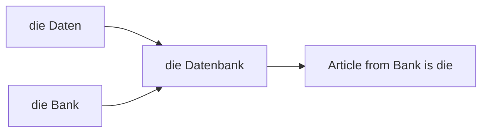

# Phase 1 · Vocabulary — Words That Stick

> **Level:** B1 · **Focus:** gender & plural shortcuts, Komposita decoding, a personal Anki system · **Time:** ~3–4 h + daily review
> _After this module you can guess a new noun's article, break long German words apart, and build a deck that actually sticks._

At B1 your grammar is often ahead of your **vocabulary** — you know how to build a sentence but run out of words to put in it. The fix isn't memorizing giant lists; it's three habits: **guessing gender from word endings**, **decoding compound nouns** instead of fearing them, and **capturing words you actually meet** into a spaced-repetition deck. This module gives you all three, plus the core everyday and tech words a backend developer needs first.

## Objectives / Lernziele

- Predict *der / die / das* from a noun's ending in most cases.
- Choose the right plural pattern for everyday and tech nouns.
- Decode any **compound noun** (Komposita) and find its gender.
- Run a simple, sustainable **Anki** workflow for IT German.

## 1. Gender shortcut rules

You can't always know the article, but endings predict it **most** of the time. Learn these high-frequency signals:

| Ending | Usually | Examples |
|---|:--:|---|
| **-ung** | die | die Anwendung, die Lösung, die Anforderung |
| **-heit / -keit** | die | die Sicherheit, die Möglichkeit, die Verfügbarkeit |
| **-ion / -tät / -ik** | die | die Version, die Qualität, die Logik |
| **-ei** | die | die Datei, die Bäckerei |
| **-er** (agent/tool) | der | der Server, der Rechner, der Nutzer, der Fehler |
| **-ment** | das | das Deployment, das Dokument, das Argument |
| **-chen / -lein** | das | das Häkchen, das Fenster*chen* |

🇩🇪 **Die Anwendung braucht eine neue Version.** — *The application needs a new version.* Both nouns are *die*, predictable from *-ung* and *-ion*.

> Rule of thumb: when in doubt, tools and "doers" ending in **-er** are usually **der**; abstract nouns in **-ung/-keit/-ion** are **die**. Still, always **learn the article with the word** — never store a bare noun.

## 2. Plural patterns

German plurals look chaotic but cluster into a few types. Tech and foreign words love the **-s** plural:

| Type | Marker | Example |
|---|:--:|---|
| many masc./neut. | **-e** | der Termin → die Termine |
| die-nouns in -ung/-heit/-ion | **-en** | die Anwendung → die Anwendungen |
| masc./neut. in -er/-el/-en | **no change** | der Server → die Server, der Rechner → die Rechner |
| foreign / tech words | **-s** | das Deployment → die Deployments, der Bug → die Bugs, die App → die Apps |
| some masc. (umlaut) | **⸚-e** | der Fall → die Fälle |

🇩🇪 **Wir haben heute zwei Deployments und drei Bugs.** — *We have two deployments and three bugs today.* Anglicisms take **-s**, just like in English.

## 3. Decoding Komposita — the last word wins

German builds long words by gluing nouns together. The **last** noun carries the **meaning and the gender**; everything before it just describes. So you never memorize the long word — you read it right-to-left.



🇩🇪 **die Datenbank** = *Daten* (data) + *Bank* → article from **Bank** = **die**.
🇩🇪 **die Benutzeroberfläche** = *Benutzer* + *Oberfläche* → **die** (the UI / surface).
🇩🇪 **die Programmiersprache** = *programmieren* + *Sprache* → **die** (programming language).
🇩🇪 **das Betriebssystem** = *Betrieb* + *System* → **das** (operating system). VI: đọc từ phải sang trái.

Split a scary word at its seams, translate the last part first, and it stops being scary.

```audio
Die Benutzeroberfläche ist neu, aber die Datenbank und das Betriebssystem sind gleich geblieben.
```

## 4. Core everyday words

The workplace runs on a small set of everyday nouns. Own these first:

| Deutsch | Artikel | Plural | English |
|---|---|---|---|
| Termin | der | Termine | appointment / deadline |
| Besprechung | die | Besprechungen | meeting |
| Aufgabe | die | Aufgaben | task |
| Frage | die | Fragen | question |
| Lösung | die | Lösungen | solution |
| Kollege | der | Kollegen | colleague |

## 5. Foundational tech words

These bridge your English tech knowledge into German. Note how many are transparent once you know the article:

| Deutsch | Artikel | Plural | English | VI (if hard) |
|---|---|---|---|---|
| Anwendung | die | Anwendungen | application | |
| Rechner | der | Rechner | computer / machine | máy tính |
| Datei | die | Dateien | file | tệp tin |
| Ordner | der | Ordner | folder | thư mục |
| Datenbank | die | Datenbanken | database | |
| Schnittstelle | die | Schnittstellen | interface / API | giao diện lập trình |
| Anforderung | die | Anforderungen | requirement | |
| Speicher | der | Speicher | memory / storage | bộ nhớ |

🇩🇪 **Die Schnittstelle liest die Anforderung aus der Datenbank.** — *The interface reads the requirement from the database.*

## 6. Your Anki workflow

Don't collect words in a notebook you never reopen. Use spaced repetition:

1. **One deck**, name it *IT-Deutsch*.
2. **Capture in the wild:** met a word in a standup, on heise.de, or in this handbook? Add it the same day.
3. **Card format:** front = an English gloss or a German sentence with a blank; back = the German word **with article + plural** and one real example sentence.
4. **Dose:** ~10 new cards/day, review **every** day (~15 min). Consistency beats volume.
5. Never add a noun without its **der/die/das + plural** — that's the whole point.

The app's [Flashcards](#/@flashcards) mirror this system, so you can drill on the go.

## 🧾 Zusammenfassung · Summary

Vocabulary at B1 is three habits, not one big list: **guess gender from endings** (-ung/-heit/-keit/-ion → *die*, tool-**-er** → *der*, -ment/-chen → *das*), **choose plurals** (tech/foreign words love **-s**), and **decode Komposita** right-to-left (the last noun sets meaning and gender). Capture real words into an **Anki** deck with article + plural + example, and review daily. Drill everything in [Flashcards](#/@flashcards).

## 📇 Vokabel-Checkliste · Vocabulary checklist

| Deutsch | Artikel | Plural | English | VI (if hard) |
|---|---|---|---|---|
| Anwendung | die | Anwendungen | application | |
| Schnittstelle | die | Schnittstellen | interface / API | giao diện lập trình |
| Datenbank | die | Datenbanken | database | |
| Datei | die | Dateien | file | tệp tin |
| Anforderung | die | Anforderungen | requirement | |
| Benutzeroberfläche | die | Benutzeroberflächen | user interface | giao diện người dùng |
| Betriebssystem | das | Betriebssysteme | operating system | hệ điều hành |
| Speicher | der | Speicher | memory / storage | bộ nhớ |

→ Drill these and more in [Flashcards](#/@flashcards).

## 🗣️ Sprechübung · Speaking practice

1. Pick 5 tech nouns above and say each with its article and plural: *"der Ordner, die Ordner …"*.
2. Break three compound words into parts aloud and name the gender of each.
3. Read the passage below, then describe your own project's stack in one sentence.

```audio
In meinem Projekt benutze ich eine Datenbank, mehrere Schnittstellen und einen Server. Die Anwendung läuft in einem Container.
```

## ❓ Mini-Quiz

1. Article for *Konfiguration*? Why?
2. Plural of *das Feature* and *der Server*?
3. What gender is *die Programmier**sprache*** and which part decides it?
4. Where do you store a new noun — bare, or how?

> **Lösungen:** 1) **die** (ending -ion) · 2) *die Features* (foreign → -s) and *die Server* (no change, -er) · 3) **die**, from *Sprache*, the last word · 4) always **with article + plural**, ideally + an example sentence.

> 🏋️ **Now drill it.** The full workbook — **27 exercises** on gender prediction, plurals, Komposita
> and collocations — is in [Phase 1 · Vocabulary · Übungsteil](#/phase-1/vocabulary-uebungen).

## 📝 Hausaufgabe · Homework

- [ ] Create the *IT-Deutsch* Anki deck and add **20 cards** with article + plural + example.
- [ ] Decode **5 long compound words** from your codebase's German docs, right-to-left.
- [ ] Predict the article of **10 new nouns** by ending, then verify in a dictionary.
- [ ] Do a [Flashcards](#/@flashcards) session and note words you missed.

## 📚 Empfohlene Ressourcen · Recommended resources

- **SRS:** Anki + the "Master German Vocabulary A1–C1" decks; keep your personal IT deck.
- **Dictionaries (article + plural):** dict.leo.org, DWDS.de, Duden.de.
- **Context examples:** Linguee, Reverso Context.
- **Next:** [Phase 1 · Speaking](#/phase-1/speaking) to put these words in your mouth.
