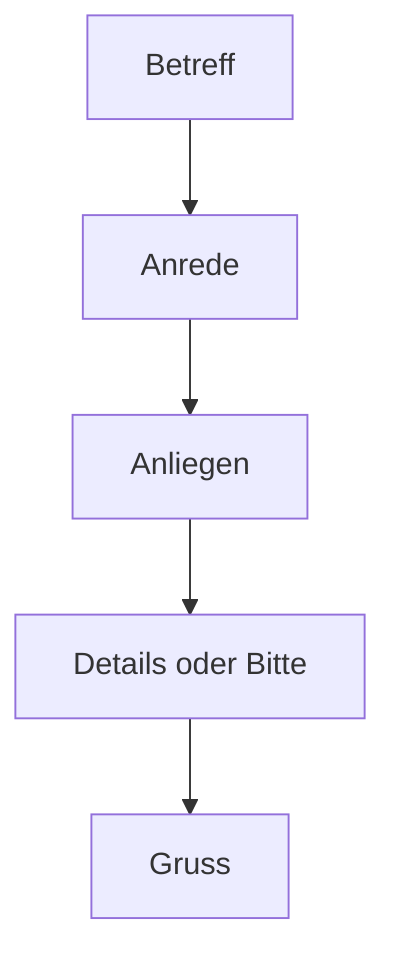

# Phase 1 · Writing — Clear, Short Messages

> **Level:** B1 · **Focus:** Slack/Teams messages, status updates, a simple email, connectors · **Time:** ~3 h + daily writing
> _After this module you can write a chat message, a daily status, and a simple email in correct, natural German._

Writing is where you **consolidate** everything else: you have time to place the verb correctly, choose the case, and pick the right connector. As a developer you don't need essays — you need **short, clear, professional** messages: a quick Slack ping, a written standup update, a simple email. This module gives you the building blocks and the **connectors** that glue sentences together, then drills them. The word-order rules behind it all live in [Phase 1 · Grammar](#/phase-1/grammar) — here we apply them.

## Objectives / Lernziele

- Write natural **Slack/Teams** messages in team-*du* style.
- Produce a written **status update** in Perfekt.
- Structure a simple **email** with the right Anrede and Gruß.
- Use core **connectors** (*und, aber, weil, deshalb, dann*) with correct word order.

## 1. Chat messages (Slack / Teams)

Team chat is informal **du**, short, and friendly. A quick emoji is fine. Keep it to one or two sentences:

🇩🇪 **Hi zusammen, ich bin 5 Minuten später im Daily — ich muss noch schnell etwas mergen.** 🙏
*Hi everyone, I'll be 5 minutes late to the daily — I just need to quickly merge something.*

🇩🇪 **Kannst du bitte kurz auf meinen PR schauen? Ist nicht dringend.**
*Can you take a quick look at my PR? It's not urgent.*

Soften requests with *bitte* and *kurz*; recall the polite *könntest du …?* from [Phase 1 · Grammar](#/phase-1/grammar).

## 2. Written status update

The written form of your standup — used in async teams. Keep it scannable, narrate yesterday in **Perfekt**:

🇩🇪 **Gestern:** Login-Bug **behoben** und den PR **aufgemacht**.
🇩🇪 **Heute:** die Tests grün machen und die Migration **testen**.
🇩🇪 **Blocker:** keine.

That's Perfekt (*behoben, aufgemacht*) + infinitive plans — the same machinery as the spoken standup in [Phase 1 · Speaking](#/phase-1/speaking).

## 3. Connectors — the glue

Connectors join your ideas, but they affect **word order** differently. This table is the heart of the module:

| Connector | Meaning | Effect on word order |
|---|---|---|
| **und** | and | none (coordinating) |
| **aber** | but | none (coordinating) |
| **denn** | because | none (coordinating) |
| **weil** | because | verb goes to the **end** (Nebensatz) |
| **deshalb** | therefore | verb stays **position 2** (inversion) |
| **dann** | then | verb stays **position 2** (inversion) |

🇩🇪 **Ich habe den Bug gefunden, _aber_ ich kann ihn noch nicht beheben.** — *und/aber/denn* don't move the verb.
🇩🇪 **Die Pipeline ist rot, _deshalb_ deploye ich heute nicht.** — *deshalb* takes position 1, so the verb *deploye* comes next, then *ich*.
🇩🇪 **Ich deploye heute nicht, _weil_ die Pipeline rot _ist_.** — *weil* sends *ist* to the very end.

For the full Nebensatz rule, see [Phase 1 · Grammar](#/phase-1/grammar) — don't memorize it twice.

## 4. A simple email

Emails are more formal — often **Sie**. Learn the fixed frame; only the middle changes:



| Part | Formal (Sie) | Informal (du) |
|---|---|---|
| Anrede | Sehr geehrte Frau Weber, | Hallo Anna, |
| Opening | ich habe eine kurze Frage zu … | kurze Frage zu … |
| Closing | Mit freundlichen Grüßen | Viele Grüße / VG |

🇩🇪 **Betreff: Frage zur Deployment-Pipeline**
**Hallo Herr Weber,**
**ich habe eine kurze Frage zur Pipeline. Können wir das morgen um 10 Uhr kurz besprechen?**
**Viele Grüße**
**Huy**

*Subject: Question about the deployment pipeline. Hi Mr Weber, I have a quick question about the pipeline. Can we discuss it briefly tomorrow at 10? Best regards, Huy.*

```audio
Hallo Herr Weber, ich habe eine kurze Frage zur Pipeline. Können wir das morgen um zehn Uhr besprechen? Viele Grüße, Huy.
```

## 5. Exercises

Write these out — actually type them, don't just read:

1. **Chat:** tell your team you'll be 10 minutes late and why (one sentence, *du*).
2. **Status:** write yesterday/today/blockers for your real work in Perfekt.
3. **Connectors:** join each pair with *weil*, then rewrite with *deshalb* — watch the verb move.
4. **Email:** write a 4-line email asking a colleague to review your PR by Friday.

## 🧾 Zusammenfassung · Summary

Professional writing at B1 is **short and structured**: informal **du** chat messages, a scannable **status update** narrated in Perfekt, and a simple **email** with a fixed Anrede–Anliegen–Gruß frame (Sie by default). The key skill is **connectors**: *und/aber/denn* leave word order alone, *weil* sends the verb to the end, and *deshalb/dann* trigger inversion. The underlying rules live in [Phase 1 · Grammar](#/phase-1/grammar); advanced emails come in [Phase 4 · Writing](#/phase-4/writing).

## 📇 Vokabel-Checkliste · Vocabulary checklist

| Deutsch | Artikel | Plural | English | VI (if hard) |
|---|---|---|---|---|
| Nachricht | die | Nachrichten | message | tin nhắn |
| Betreff | der | Betreffe | subject line | dòng chủ đề |
| Anrede | die | Anreden | salutation | lời chào đầu thư |
| Gruß | der | Grüße | greeting / sign-off | |
| Anliegen | das | Anliegen | request / concern | mối quan tâm, việc cần |
| besprechen | — | — | to discuss | |

→ Drill these and more in [Flashcards](#/@flashcards).

## 🗣️ Sprechübung · Speaking practice

1. Read your email draft aloud — does it sound polite and clear?
2. Say the same status update you wrote, out loud, in Perfekt.
3. Read the audio line, then dictate your own 3-line email to a colleague.

```audio
Hallo zusammen, ich bin heute fünf Minuten später im Daily. Gestern habe ich den Bug behoben, heute teste ich die Migration. Keine Blocker.
```

## ❓ Mini-Quiz

1. After *weil*, where does the conjugated verb go?
2. Fix: *"Die Tests sind rot, deshalb ich deploye nicht."*
3. Formal sign-off for an email to *Frau Weber*?
4. *du* or *Sie* for a quick team-chat message?

> **Lösungen:** 1) to the **end** of the clause · 2) *… deshalb **deploye ich** nicht.* (verb position 2) · 3) *Mit freundlichen Grüßen* · 4) **du** (team chat is informal).

## 📝 Hausaufgabe · Homework

- [ ] Write your **daily status** in German for **5 days** (yesterday/today/blockers).
- [ ] Write **6 sentences** using *weil*, *deshalb*, and *aber* — 2 each.
- [ ] Write **one email**: formal (Sie) *and* an informal (du) version of the same request.
- [ ] Do the [Grammar Basics quiz](#/@quiz) to check your word order.

## 📚 Empfohlene Ressourcen · Recommended resources

- **Connectors & word order:** mein-deutschbuch.de, deutsch.lingolia.com.
- **Practice:** Schubert-Verlag online B1 exercises (schubert-verlag.de).
- **Dictionaries:** dict.leo.org, DWDS.de; Reverso Context for phrasing.
- **Next:** [Phase 1 · Plan](#/phase-1/plan) to schedule all this into your week.
