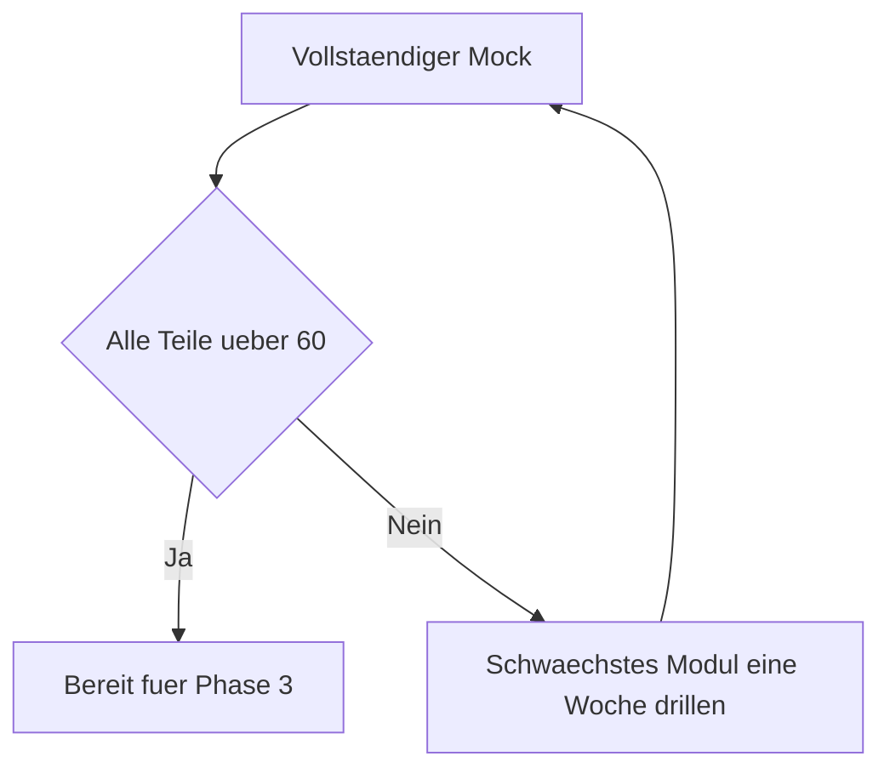

# Phase 2 · Assessment — telc B2 Mock & the Gate to Phase 3

> **Level:** B2 · **Focus:** a telc B2 mock rubric, a can-do checklist, and the gate into Phase 3 · **Time:** ~3 h for a full mock
> _After this module you can run a realistic telc B2 self-assessment and decide honestly whether you're ready for Phase 3._

You don't graduate Phase 2 by finishing the chapters — you graduate by **proving B2 under exam conditions**. This module gives you a scored mock structure, a can-do checklist to spot weak skills, and a clear gate so you move on when you're genuinely ready, not just tired of B2. Be strict with yourself here; the exam room will be.

## Objectives / Lernziele

- Run a **full telc B2 mock** with the right timing and weighting.
- Score yourself against a simple **rubric**.
- Check off **can-do** statements across all skills.
- Apply the **gate criteria** to decide on [Phase 3](#/phase-3/overview).

## 1. The telc B2 mock — structure & timing

Simulate the real thing: one sitting, a timer, no dictionary. The exam has a written part and a **paired oral** (see [Speaking](#/phase-2/speaking) for the oral detail).

| Part | Task | Time |
|---|---|---|
| Leseverstehen + Sprachbausteine | reading + language elements | ~90 min |
| Hörverstehen | listening | ~20 min |
| Schriftlicher Ausdruck | the letter (~150–200 words) | ~30 min |
| Mündlicher Ausdruck | presentation + discussion + plan together | ~15 min (paired) |

Use a telc.net *Übungstest* (model test) for authentic items — don't invent your own.

## 2. Scoring rubric

Mark each part out of 100 and average. Below ~60 in any part = that skill is your priority for the coming week.

| Score | Meaning | Action |
|---|---|---|
| 80–100 | solid B2 | maintain |
| 60–79 | passing B2 | polish |
| 45–59 | approaching | targeted drilling |
| < 45 | not yet B2 | repeat the chapter |



## 3. Can-do checklist

Tick honestly — "mostly" does not count as done.

- [ ] I can **give my opinion and defend it** with reasons and examples (see [Speaking](#/phase-2/speaking)).
- [ ] I can **agree/disagree politely** in a discussion.
- [ ] I can form **Passiv** and **Konjunktiv II** correctly (see [Grammar](#/phase-2/grammar)).
- [ ] I can **write a formal email and a ~180-word letter** hitting all content points (see [Writing](#/phase-2/writing)).
- [ ] I can **follow a normal-speed** DW/podcast segment and summarise it.
- [ ] I can **read a t3n.de/heise.de article** and extract the argument.
- [ ] I can **plan something together** (telc Teil 3) with proposals and compromise.

## 4. The gate to Phase 3

Move on **only** when: every mock part is **≥ 60**, you've ticked **all** can-do boxes, and you can hold a **5-minute spontaneous discussion** without switching to English. If not, repeat your weakest module for a week (§2 flow) and re-mock. Phase 3 shifts into the **technical register** — dense IT German, docs, and standups — and assumes this B2 base is solid. See what's next in [Phase 3 · Overview](#/phase-3/overview).

```audio
Ich habe den Übungstest gemacht. Beim Hörverstehen war ich sicher, aber beim Schreiben brauche ich noch Übung. Deshalb wiederhole ich diese Woche den Brief, bevor ich mit Phase drei beginne.
```

---

## 🧾 Zusammenfassung · Summary

Graduate Phase 2 by **proving B2**, not by finishing pages. Run a full **telc B2 mock** (reading+Sprachbausteine ~90 min, listening ~20 min, writing ~30 min, paired oral ~15 min), score each part out of 100, and treat anything **under 60** as next week's priority. Clear the **gate** — all parts ≥ 60, every can-do box ticked, a 5-minute spontaneous discussion in German — before starting [Phase 3](#/phase-3/overview), which raises the bar into technical German.

## 📇 Vokabel-Checkliste · Vocabulary checklist

| Deutsch | Artikel | Plural | English | VI (if hard) |
|---|---|---|---|---|
| Prüfung | die | Prüfungen | exam | kỳ thi |
| Bewertung | die | Bewertungen | assessment / grading | sự đánh giá |
| Hörverstehen | das | — | listening comprehension | |
| Leseverstehen | das | — | reading comprehension | |
| bestehen | — | — | to pass (an exam) | thi đỗ |

→ Drill these and more in [Flashcards](#/@flashcards).

## 📝 Hausaufgabe · Homework

- [ ] Complete **one full timed telc B2 mock** in a single sitting.
- [ ] Score every part with the **rubric** and note your weakest skill.
- [ ] Fill the **can-do checklist** honestly.
- [ ] Decide: pass the **gate** to [Phase 3](#/phase-3/overview), or drill one module and re-mock.

## 📚 Empfohlene Ressourcen · Recommended resources

- **Mock material:** telc.net free B2 *Übungstest*; *So geht's noch besser* (telc trainer).
- **Self-study spine:** *Aspekte neu B2* (Klett), *Sicher! B2* (Hueber) review units.
- **Feedback:** r/German, Engineering Kiosk Discord for a speaking-partner mock.
- **Next:** [Phase 3 · Overview](#/phase-3/overview) — German for Software Engineers.
