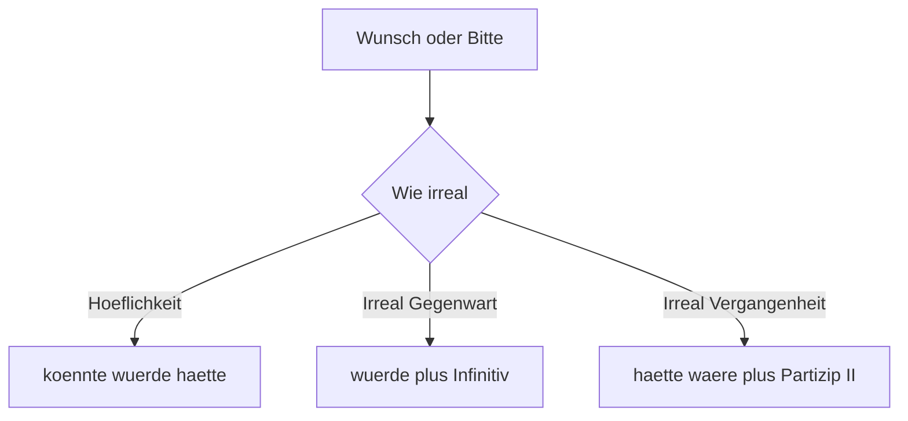
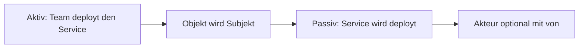

# Phase 2 · Grammar — The B2 Toolkit

> **Level:** B2 · **Focus:** Konjunktiv II, Passiv, relative clauses, Nominalisierung, two-part connectors, participles, verbs + prepositions, n-declension · **Time:** ~6–7 h
> _After this module you can hypothesize, stay diplomatically polite, describe processes impersonally, and pack a whole idea into one dense clause — the grammar that makes you *sound* B2._

Phase 1 gave you the backbone: word order, the four cases, Perfekt, modals. Do **not** re-learn those here — recall them in [Phase 1 · Grammar](#/phase-1/grammar). B2 grammar is about **nuance and density**: saying what *would* happen, what *gets done* (by nobody in particular), and compressing a subordinate idea into a single adjective. You meet these structures every day in code reviews, RFCs, incident post-mortems, and architecture discussions.

## Objectives / Lernziele

- Form and use **Konjunktiv II** (present *and* past) for politeness and hypotheticals.
- Build the **Passiv** in every tense, with modal verbs, and swap it for the **man**-alternative.
- Write **relative clauses**, including **was / wo**, and turn verbs into nouns (**Nominalisierung**).
- Link ideas with **two-part connectors** (*entweder…oder, nicht nur…sondern auch, je…desto*).
- Use **Partizip I / II as adjectives**, master **verbs + fixed prepositions**, and the **n-declension**.

## 1. Konjunktiv II — polite requests & the irreal

Konjunktiv II is the *what-if* mood. Its everyday form is **`würde` + infinitive**; a handful of high-frequency verbs keep their own short forms, which sound more educated.

| Indikativ | Konjunktiv II | Use |
|---|---|---|
| ich habe | ich **hätte** | *if I had…* |
| ich bin | ich **wäre** | *I would be…* |
| ich kann | ich **könnte** | *I could…* |
| ich muss | ich **müsste** | *I would have to…* |
| ich mache | ich **würde machen** | default for all other verbs |

🇩🇪 **Könntest** du bitte den PR **reviewen**? — *Could you please review the PR?* (softer than the imperative — recall the politeness preview in [Phase 1 · Grammar](#/phase-1/grammar))
🇩🇪 An deiner Stelle **würde** ich zuerst die Logs **prüfen**. — *In your place I'd check the logs first.*

**Past Konjunktiv II** = **`hätte` / `wäre` + Partizip II**. Use it for hindsight and regret — the language of every post-mortem.

🇩🇪 Wenn wir mehr Tests **geschrieben hätten**, **wäre** der Bug nicht in Produktion **gegangen**.
*If we had written more tests, the bug wouldn't have gone to production.*



```audio
Könntest du mir kurz helfen? An deiner Stelle würde ich den Cache leeren. Wenn wir das früher bemerkt hätten, wäre der Ausfall kürzer gewesen.
```

## 2. Passiv — the process voice

German docs love the **Passiv** because the *action* matters, not who does it. Form: **`werden` + Partizip II**. The Akkusativ object of the active sentence becomes the subject.

| Tense | Active | Passive |
|---|---|---|
| Präsens | Das Team **deployt** den Service. | Der Service **wird** deployt. |
| Präteritum | Man **testete** die API. | Die API **wurde** getestet. |
| Perfekt | Wir **haben** es **gemergt**. | Es **ist** gemergt **worden**. |
| + Modal | Wir **müssen** es **prüfen**. | Es **muss** geprüft **werden**. |

Note the Perfekt uses **worden** (not *geworden*), and the modal Passiv puts **werden** at the very end. When you *do* want to name the actor, add **von + Dativ**: *Der Bug wurde **von einem Praktikanten** eingebaut.*

The lazy, spoken alternative is **man** (*one / you / they*): *Man deployt freitags nicht.* — same meaning, active grammar, no `werden`.



## 3. Relative clauses & Nominalisierung

A **relative clause** describes a noun; its verb goes to the **end** (a Nebensatz — see [Phase 1 · Grammar](#/phase-1/grammar)). The relative pronoun copies the noun's **gender/number**, but takes its **case from its own clause**.

| | masc. | fem. | neut. | plural |
|---|:---:|:---:|:---:|:---:|
| Nom. | der | die | das | die |
| Akk. | den | die | das | die |
| Dat. | dem | der | dem | denen |

🇩🇪 Der Service, **der** ständig abstürzt, läuft jetzt stabil. *(Nom. — subject of its clause)*
🇩🇪 Das Ticket, **das** ich gestern zugewiesen bekam, ist erledigt. *(Akk.)*

Use **was** after neuter indefinites (*etwas, nichts, alles, das*) and **wo** for places: *Alles, **was** wir deployen, wird geloggt.* · *Das Repo, **wo** der Fehler liegt, ist alt.*

**Nominalisierung** turns a verb into a noun so you can write dense, formal German. Most become **das** + capital letter, or a **die -ung** noun.

| Verb | Nominalisierung | English |
|---|---|---|
| entwickeln | **die Entwicklung** | development |
| bereitstellen | **die Bereitstellung** | deployment |
| testen | **das Testen** | testing |
| lösen | **die Lösung** | solution |

🇩🇪 Nach **der Bereitstellung** prüfen wir die Metriken. — *After the deployment we check the metrics.*

## 4. Two-part connectors (mehrteilige Konnektoren)

These paired connectors let you balance and contrast ideas like an architect weighing options.

| Connector | Meaning | Example |
|---|---|---|
| entweder … oder | either … or | **Entweder** wir refactoren **oder** wir schreiben neu. |
| nicht nur … sondern auch | not only … but also | Redis ist **nicht nur** schnell, **sondern auch** einfach. |
| sowohl … als auch | both … and | Wir nutzen **sowohl** Docker **als auch** Kubernetes. |
| weder … noch | neither … nor | Der Test ist **weder** grün **noch** rot — er hängt. |
| je … desto | the more … the more | **Je** mehr Microservices, **desto** komplexer das Deployment. |
| zwar … aber | admittedly … but | Es ist **zwar** langsam, **aber** korrekt. |

Watch the word order with **je … desto**: *je* introduces a Nebensatz (verb last), *desto* triggers inversion. 🇩🇪 **Je** länger die Pipeline **läuft**, **desto** mehr Ressourcen **braucht** sie.

## 5. Participles, verbs + prepositions, n-declension

**Partizip I** (`Infinitiv + d`) = something *ongoing/active*; **Partizip II** = *completed/passive*. Both can sit before a noun and take **adjective endings**.

🇩🇪 der **laufende** Prozess *(the running process)* · die **gelöste** Aufgabe *(the solved task)*

**Verbs with fixed prepositions** must be memorised as a unit — the preposition is not logical, and it fixes the case. Keep a personal list.

| Verb + prep | Case | English |
|---|---|---|
| warten **auf** | Akk. | to wait for |
| sich beschäftigen **mit** | Dat. | to deal with |
| abhängen **von** | Dat. | to depend on |
| sich kümmern **um** | Akk. | to take care of |
| teilnehmen **an** | Dat. | to take part in |

🇩🇪 Ich **warte auf** das Code-Review. · Der Build **hängt von** der Datenbank **ab**.

Finally, the **n-declension**: a small group of masculine nouns add **-(e)n** in *every* case except Nominativ singular. You meet them constantly at work.

🇩🇪 Ich helfe **dem Kollegen** (not *Kollege*). · Wir sprechen mit **dem Kunden**. · der Name → des **Namens**.

---

## 🧾 Zusammenfassung · Summary

B2 grammar adds five power tools on top of the B1 backbone: **(1) Konjunktiv II** (`würde/könnte/hätte/wäre` + past forms) for politeness and hypotheticals; **(2) Passiv** in all tenses, with modals, plus the **man**-alternative; **(3) relative clauses** (incl. *was/wo*) and **Nominalisierung** for dense sentences; **(4) two-part connectors** to balance arguments; **(5) participles as adjectives, verbs + fixed prepositions, and the n-declension**. Master these and your German stops merely describing and starts *arguing, hedging, and abstracting*. We reuse these throughout Phase 2 — especially in [Speaking](#/phase-2/speaking) and [Writing](#/phase-2/writing).

## 📇 Vokabel-Checkliste · Vocabulary checklist

| Deutsch | Artikel | Plural | English | VI (if hard) |
|---|---|---|---|---|
| Konjunktiv | der | Konjunktive | subjunctive mood | thức giả định |
| Passiv | das | — | passive voice | thể bị động |
| Relativsatz | der | Relativsätze | relative clause | mệnh đề quan hệ |
| Nominalisierung | die | Nominalisierungen | nominalisation | danh từ hóa |
| Bereitstellung | die | Bereitstellungen | deployment | |
| Lösung | die | Lösungen | solution | |
| Anforderung | die | Anforderungen | requirement | |
| Zusammenhang | der | Zusammenhänge | context / connection | mối liên hệ |

→ Drill these and more in [Flashcards](#/@flashcards).

## 🗣️ Sprechübung · Speaking practice

1. Soften three imperatives into Konjunktiv II requests (*Könntest du …?, Würdest du …?*).
2. Turn three active sentences about your pipeline into **Passiv**: *"Der Code wird … deployt."*
3. Argue a trade-off with **je … desto** and **nicht nur … sondern auch**. Record yourself and compare with the 🔊 below.

```audio
Der Service wird jeden Tag automatisch deployt. Wenn wir mehr Tests geschrieben hätten, wäre der Fehler nicht passiert. Je mehr Microservices wir haben, desto wichtiger ist das Monitoring.
```

## ❓ Mini-Quiz

1. Make polite: *"Gib mir den Zugang."* → *"___ du mir bitte den Zugang ___?"*
2. Passiv Perfekt of *"Wir haben den Bug behoben."* → *"Der Bug ___ ___ ___."*
3. Fill the relative pronoun: *"Der Server, ___ gestern abgestürzt ist, läuft wieder."*
4. Complete: *"___ mehr Logs, ___ leichter das Debugging."*
5. n-declension: *"Ich habe dem ___ (der Kollege) geholfen."*

> **Lösungen:** 1) *Könntest … geben* · 2) *ist behoben worden* · 3) *der* (Nom., masc.) · 4) *Je … desto* · 5) *Kollegen*. Full quiz: [Quizzes](#/@quiz).

## 📝 Hausaufgabe · Homework

- [ ] Rewrite **5 sentences** from your last stand-up into the **Passiv**.
- [ ] Write **3 past-Konjunktiv-II** sentences about a real incident (*"Wenn …, wäre/hätte …"*).
- [ ] Write **4 relative clauses** describing components in your architecture.
- [ ] List **10 verbs + fixed prepositions** you actually use at work; add them to [Flashcards](#/@flashcards).
- [ ] Do the [Grammar quiz](#/@quiz) — aim for ≥ 4/5.

## 📚 Empfohlene Ressourcen · Recommended resources

- **Grammar reference:** mein-deutschbuch.de (Konjunktiv II, Passiv), deutsch.lingolia.com (Relativsätze).
- **Practice:** Schubert-Verlag online B2 exercises (schubert-verlag.de).
- **Textbook:** *Aspekte neu B2* (Klett) and *Sicher! B2* (Hueber) — Passiv & Konjunktiv chapters.
- **Video:** Deutsch mit Marija — Passiv & Konjunktiv II playlists.
- **Next:** [Phase 2 · Vocabulary](#/phase-2/vocabulary) → then [Phase 2 · Speaking](#/phase-2/speaking).
