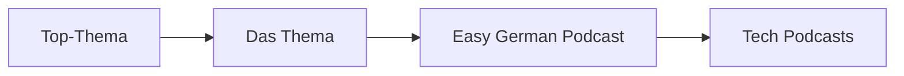
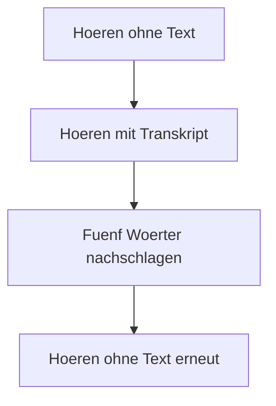

# Phase 2 · Listening — Normal Speed at Last

> **Level:** B2 · **Focus:** normal-speed input — DW Top-Thema / Das Thema, Easy German Podcast, first tech podcasts · **Time:** ~30–45 min daily
> _After this module you can follow normal-speed German talks and podcasts, and you have a concrete daily listening routine._

In Phase 1 you leaned on *langsam gesprochen* (slowed-down) audio. B2 is where you **take the training wheels off** and listen at native speed. It feels uncomfortable for two weeks and then it clicks — the brain adapts to the tempo. The trick is choosing input at the right difficulty and listening *actively*, not as background noise. This module gives you a graded ladder of resources and a technique to squeeze learning out of every clip.

## Objectives / Lernziele

- Move from slowed-down to **normal-speed** German without panicking.
- Use **DW Top-Thema and Das Thema** as your core graded news source.
- Fold the **Easy German Podcast** into your commute.
- Start your **first German tech podcasts** (programmier.bar, Engineering Kiosk).
- Apply the **intensive vs. extensive** listening technique deliberately.

## 1. The B2 listening ladder

Climb this ladder over the phase; do not jump to the top rung too early.

| Rung | Resource | Speed | Support |
|---|---|---|---|
| 1 | DW *Top-Thema* | near-normal | transcript + glossary |
| 2 | DW *Das Thema* | normal | video + subtitles |
| 3 | Easy German Podcast | normal, clear | member transcript |
| 4 | programmier.bar / Engineering Kiosk | fast, real | show notes only |



## 2. DW Top-Thema & Das Thema — your core

**Deutsche Welle** produces free, level-graded material for exactly your stage. **Top-Thema** gives a ~2-minute news story with a full **transcript** and a **Glossar** of hard words. **Das Thema** goes deeper with video. Both are ideal because you can *read while you listen*, then listen again without the text.

🇩🇪 Typical Top-Thema opener: **"In dieser Woche geht es um ein Thema aus der Technik."** *This week it's about a topic from technology.*

```audio
Willkommen bei Top-Thema mit Vokabeln. Heute geht es um künstliche Intelligenz in deutschen Unternehmen und die Frage, welche Jobs sich verändern.
```

## 3. Easy German Podcast

The **Easy German Podcast** is two hosts chatting in clear, authentic German about everyday and cultural topics — perfect bridge material. Members get transcripts and vocab lists. Use it for **extensive** listening: don't stop for every word, just ride the flow and catch the gist. Twenty minutes on your commute counts.

## 4. First German tech podcasts

Now bring in your professional world. These are fast and unscripted — you won't catch everything, and that's fine. Listen for the **cognates and IT terms** you already know (der Container, das Deployment, die Pipeline) and let them anchor you.

| Podcast | Focus | Note |
|---|---|---|
| **programmier.bar** | dev topics, interviews | flagship German dev podcast |
| **Engineering Kiosk** | backend, career, architecture | great for your Java/backend world |
| **Working Draft** | web, but broad dev culture | fast, casual |
| **heise show / Golem.de-Podcast** | tech news & debate | ties into your [Reading](#/phase-2/reading) |

## 5. Intensive vs. extensive listening

Use two modes on purpose — mixing them is why passive listening fails.

- **Extensive** (breadth): long, relaxed, gist-only. Podcasts on the commute. Goal: tempo tolerance.
- **Intensive** (depth): short clip, replayed. Do this cycle on one Top-Thema per day:
  1. Listen once, **no text** — grab the gist.
  2. Listen again **with transcript** — mark unknown words.
  3. Look up 5 words (dict.leo.org), add to [Flashcards](#/@flashcards).
  4. Listen a third time, **no text** — notice how much more you catch.



---

## 🧾 Zusammenfassung · Summary

B2 listening means **normal speed**. Climb the ladder — **DW Top-Thema → Das Thema → Easy German Podcast → tech podcasts** (programmier.bar, Engineering Kiosk) — and combine **extensive** listening (long, relaxed, on the commute) with a daily **intensive** cycle (listen, transcript, look up 5 words, listen again). The discomfort of native speed passes in about two weeks. Feed new words straight into [Flashcards](#/@flashcards) and pair this with [Reading](#/phase-2/reading).

## 📇 Vokabel-Checkliste · Vocabulary checklist

| Deutsch | Artikel | Plural | English | VI (if hard) |
|---|---|---|---|---|
| Nachrichten | die | (nur Plural) | news | tin tức |
| Sendung | die | Sendungen | (broadcast) episode | chương trình |
| Folge | die | Folgen | episode | tập |
| Untertitel | der | Untertitel | subtitle | phụ đề |
| Zusammenhang | der | Zusammenhänge | context | bối cảnh |
| Aussprache | die | Aussprachen | pronunciation | |

→ Drill these and more in [Flashcards](#/@flashcards).

## 🗣️ Sprechübung · Speaking practice

1. After one Top-Thema, **summarise it aloud** in 4 sentences — use *In der Sendung geht es um …*.
2. Shadow (repeat right after the speaker) 30 seconds of Easy German to copy the melody.
3. Note one tech term from a podcast and **use it in your own sentence**. Compare with the 🔊 below.

```audio
In der Sendung geht es um Cloud-Technologie in Deutschland. Der Experte sagt, dass viele Firmen ihre Systeme in die Cloud verlagern, aber der Datenschutz bleibt eine große Herausforderung.
```

## ❓ Mini-Quiz

1. Which DW format includes a transcript + glossary and is ~2 minutes?
2. Extensive or intensive: replaying a short clip and looking up words?
3. Name one German tech podcast good for backend engineers.
4. Roughly how long until native speed stops feeling overwhelming?
5. What should you do with the 5 new words per clip?

> **Lösungen:** 1) *Top-Thema* · 2) *intensive* · 3) e.g. *Engineering Kiosk* (or programmier.bar) · 4) about **two weeks** · 5) add them to [Flashcards](#/@flashcards)/Anki. Full quiz: [Quizzes](#/@quiz).

> 🎧 **Now actually listen.** [Phase 2 · Listening · Übungsteil](#/phase-2/listening-uebungen)
> has **five normal-speed Hörtexte** you can play right here, plus note-taking drills, two Diktate
> and stance-detection exercises.

## 📝 Hausaufgabe · Homework

- [ ] Do the **intensive 3-listen cycle** on 5 Top-Thema episodes this week.
- [ ] Listen to **2 full Easy German Podcast** episodes extensively.
- [ ] Sample **1 tech podcast** episode; note 5 IT words you recognised.
- [ ] Add all new words to your [Flashcards](#/@flashcards) deck.

## 📚 Empfohlene Ressourcen · Recommended resources

- **Graded news:** Deutsche Welle — *Top-Thema* and *Das Thema* (free transcripts).
- **Bridge:** Easy German Podcast (Spotify/Apple; membership adds transcripts).
- **Tech podcasts:** programmier.bar, Engineering Kiosk, Working Draft, heise show, Golem.de-Podcast.
- **Dictionary:** dict.leo.org, DWDS.de for the words you catch.
- **Next:** [Phase 2 · Reading](#/phase-2/reading).
