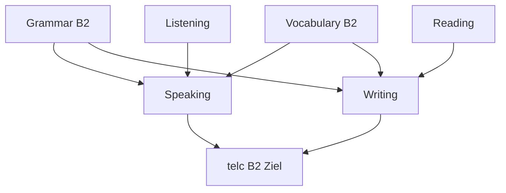

# Phase 2 · Overview — Reaching B2

> **Level:** B2 · **Focus:** the B1→B2 jump, opinions, Passiv/Konjunktiv, real German media · **Time:** ~1 h to read + plan
> _After this module you know exactly what B2 demands, which sub-skills to build, and how the Phase 2 chapters fit together._

You survived B1: you can describe your work, ask questions, and get through a stand-up. **B2 is a different animal.** It is the level most German employers quietly expect for a "German-speaking team", and it is the gate to the [telc B2](#/phase-2/assessment) certificate. The core shift is from *describing* to *arguing*: you will express opinions, defend them politely, understand normal-speed speech, and read real tech journalism. This overview maps the whole phase so you always know why you are doing each exercise.

## Objectives / Lernziele

- Understand what the **B2 "independent user"** can do — and how it differs from B1.
- See the **five shifts** that define this phase.
- Know how the eight Phase 2 chapters connect and in what order to work them.
- Commit to the **telc B2** target and the gate into [Phase 3](#/phase-3/overview).

## 1. What B2 actually means

The Common European Framework describes B2 as the **independent user**. Concretely:

| Skill | B1 (you now) | B2 (your target) |
|---|---|---|
| Speaking | describe tasks, simple opinions | **argue and defend** a viewpoint spontaneously |
| Listening | slow, clear speech | **normal-speed** talks, podcasts, discussions |
| Reading | short factual texts | **opinion pieces** and real tech articles |
| Writing | short messages | structured **argumentative** texts & formal emails |
| Grammar | cases, Perfekt, modals | **Passiv, Konjunktiv II, Nominalisierung** |

## 2. The five shifts from B1 to B2

1. **Grammar density** — Passiv, Konjunktiv II, relative clauses ([Grammar](#/phase-2/grammar)).
2. **Abstract vocabulary** — opinions, argumentation, Konnektoren ([Vocabulary](#/phase-2/vocabulary)).
3. **Real-speed input** — DW Top-Thema, Easy German, first tech podcasts ([Listening](#/phase-2/listening)).
4. **Authentic reading** — heise.de and t3n.de with a decoding strategy ([Reading](#/phase-2/reading)).
5. **Productive output** — defending opinions ([Speaking](#/phase-2/speaking)) and the telc B2 letter ([Writing](#/phase-2/writing)).

## 3. How Phase 2 fits together

Grammar and vocabulary feed every skill; the four skills feed the exam. Work them in a loop, not a line.



## 4. Your target: telc B2

The **telc B2** exam has a written part (reading + language elements ~90 min, listening ~20 min, writing ~30 min) and a **paired oral exam** (~15 min: a short presentation, a discussion, and planning something together). It is offered digital, hybrid, or on paper. Everything in Phase 2 is built backwards from these tasks — see the full mock and the gate to Phase 3 in [Assessment](#/phase-2/assessment). Follow the week-by-week schedule in [Plan](#/phase-2/plan).

```audio
Willkommen in Phase zwei. Auf B2 lernen wir, unsere Meinung zu sagen und zu begründen. Am Ende steht die telc-Prüfung.
```

---

## 🧾 Zusammenfassung · Summary

Phase 2 lifts you from **describing (B1) to arguing (B2)**. Five shifts drive it: denser grammar (Passiv/Konjunktiv II), abstract and opinion vocabulary, normal-speed listening, authentic tech reading, and structured written/spoken output. All eight chapters feed one target — **telc B2** — which in turn is the gate into [Phase 3](#/phase-3/overview). Read this overview once, then let [Plan](#/phase-2/plan) drive your weeks.

## 📇 Vokabel-Checkliste · Vocabulary checklist

| Deutsch | Artikel | Plural | English | VI (if hard) |
|---|---|---|---|---|
| Fortschritt | der | Fortschritte | progress | tiến bộ |
| Meinung | die | Meinungen | opinion | |
| Ziel | das | Ziele | goal / target | |
| Fähigkeit | die | Fähigkeiten | ability / skill | năng lực |
| Prüfung | die | Prüfungen | exam | |

→ Drill these and more in [Flashcards](#/@flashcards).

## 📝 Hausaufgabe · Homework

- [ ] Read this overview and skim all eight Phase 2 chapter titles in the sidebar.
- [ ] Book a diagnostic: take one free telc B2 model listening test on telc.net.
- [ ] Open [Plan](#/phase-2/plan) and block **weeks 9–20** in your calendar.
- [ ] Set your target exam date and add it to [Bookmarks](#/@bookmarks).

## 📚 Empfohlene Ressourcen · Recommended resources

- **Exam board:** telc.net — download the free B2 *Übungstest* (model test).
- **Textbook:** *Aspekte neu B2* (Klett) as your Phase 2 spine.
- **Overview video:** Easy German — "What is B2?" style explainers.
- **Next:** start with [Phase 2 · Grammar](#/phase-2/grammar).
