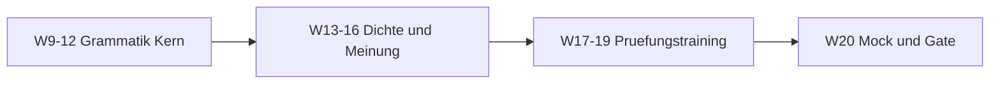

# Phase 2 · Plan — Weekly Milestones & Daily Rhythm

> **Level:** B2 · **Focus:** weeks 9–20 milestones + a repeatable Mon–Sun daily plan · **Time:** ~45–60 min/day, 6 days/week
> _After this module you have a concrete week-by-week and day-by-day schedule to take you from B1 to telc-B2-ready._

Phase 2 is a **12-week block (weeks 9–20)** of the roadmap. Progress at B2 comes from **daily consistency**, not weekend cramming — 45–60 focused minutes a day beats one long Sunday session. This plan sequences the eight Phase 2 chapters into weekly milestones and gives you a fixed daily template so you never waste energy deciding *what* to study.

## Objectives / Lernziele

- Follow a **week-by-week milestone** map for weeks 9–20.
- Run a **fixed daily routine** (Mon–Sun) that touches every skill weekly.
- Balance **input** (listening/reading) and **output** (speaking/writing) each week.
- Arrive at [Assessment](#/phase-2/assessment) genuinely telc-B2-ready.

## 1. Weekly milestones (weeks 9–20)

Each week has a grammar/vocab focus plus a skill deliverable. Build on the previous week — don't skip.

| Week | Grammar/Vocab focus | Skill deliverable |
|---|---|---|
| 9 | Konjunktiv II (present) | 3 polite emails |
| 10 | Konjunktiv II (past) | incident post-mortem aloud |
| 11 | Passiv (all tenses) | rewrite stand-up in Passiv |
| 12 | Passiv + modals, *man* | 1 argumentative text |
| 13 | Relative clauses, was/wo | describe your architecture |
| 14 | Nominalisierung | summarise 1 heise.de article |
| 15 | Two-part connectors | Teil-1 presentation recorded |
| 16 | Abstract & opinion vocab | opinion discussion role-play |
| 17 | Konnektoren + word order | timed telc letter |
| 18 | Participles, verbs+prep. | Teil-3 planning role-play |
| 19 | n-declension + review | full mock written part |
| 20 | Consolidation | full mock oral + [Assessment](#/phase-2/assessment) |



## 2. The daily plan (Mon–Sun)

Rotate a **skill of the day** on top of two daily constants (vocabulary review + a little listening). Sunday is light review, not a marathon.

| Day | Focus (25–35 min) | Constant (15 min) |
|---|---|---|
| Mo | Grammar drill ([Grammar](#/phase-2/grammar)) | Anki + 1 Top-Thema |
| Di | Listening — intensive cycle ([Listening](#/phase-2/listening)) | Anki + 1 podcast |
| Mi | Writing — one text ([Writing](#/phase-2/writing)) | Anki + 1 Top-Thema |
| Do | Reading — 1–2 articles ([Reading](#/phase-2/reading)) | Anki + Easy German |
| Fr | Speaking — record + shadow ([Speaking](#/phase-2/speaking)) | Anki + 1 podcast |
| Sa | Weak-spot repair + mock task | Anki review |
| So | Light review + [Checklist](#/@checklist) | Anki (light) |

## 3. Keep the balance

Each week must include **both** input and output. A common trap is endless passive input (comfortable) with no speaking or writing (uncomfortable but where B2 is proven). If a week slips, protect **Friday speaking** and **Wednesday writing** first — they are the exam's productive halves. Track everything in the [Weekly Study Checklist](#/@checklist) and star tricky items in [Bookmarks](#/@bookmarks).

```audio
Jeden Tag lerne ich eine Stunde Deutsch. Montags mache ich Grammatik, freitags spreche ich laut. Am Wochenende wiederhole ich nur kurz. Schritt für Schritt komme ich auf B2.
```

---

## 🧾 Zusammenfassung · Summary

Phase 2 runs **weeks 9–20**: grammar core (9–12), density and opinion (13–16), and exam training (17–19), closing with a full mock and the gate in week 20. Layer a **fixed daily routine** — a rotating skill of the day over daily Anki plus listening — and guard the **output days** (speaking, writing) when time is tight. Consistency of 45–60 min/day, six days a week, is what actually moves the needle. Log it in the [Checklist](#/@checklist).

## 📝 Hausaufgabe · Homework

- [ ] Copy the **weekly milestone table** into your calendar for weeks 9–20.
- [ ] Set a fixed **daily study time** and protect it like a meeting.
- [ ] Pick your **skill-of-the-day** anchors (Mo–Fr) and add reminders.
- [ ] Book your **telc B2 exam date** near week 20+ on telc.net.

## 📚 Empfohlene Ressourcen · Recommended resources

- **Tracking:** the app's [Weekly Study Checklist](#/@checklist) and [Bookmarks](#/@bookmarks).
- **Spine textbook:** *Aspekte neu B2* (Klett) — chapter-per-fortnight pace.
- **Daily input:** Deutsche Welle *Top-Thema*; Easy German Podcast.
- **Next:** run week 9 from [Phase 2 · Grammar](#/phase-2/grammar); review readiness in [Assessment](#/phase-2/assessment).
