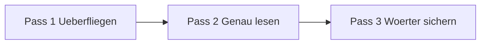

# Phase 2 · Reading — Opinion Pieces & Real Tech Media

> **Level:** B2 · **Focus:** opinion pieces and first authentic tech media (heise.de, t3n.de) with a decoding strategy · **Time:** ~30 min daily
> _After this module you can read a real German tech article and an opinion piece without translating every word, using a repeatable decoding strategy._

Reading is your **secret weapon** as a developer: German tech media is high-quality, free, and full of the exact vocabulary you'll use at work. The catch is that a heise.de article is written for natives — long sentences, monster compound nouns, and assumed context. You don't beat that with a dictionary; you beat it with a **strategy**. This module teaches how to skim, decode compounds, and read for argument, then points you at the two best entry-level tech sources.

## Objectives / Lernziele

- Apply a **three-pass decoding strategy** to any authentic text.
- **Break down compound nouns** instead of looking them up whole.
- Read the two best **first tech sources** (heise.de, t3n.de) at your level.
- Recognise the structure of a German **opinion piece** (Kommentar).
- Build a **daily reading habit** that feeds vocabulary and grammar.

## 1. The decoding strategy — three passes

Never read an authentic article linearly on the first pass. Work it in three:



| Pass | Goal | How |
|---|---|---|
| 1 · Skim | get the gist | read title, subhead, first line of each paragraph |
| 2 · Close read | understand argument | read fully, **guess** unknown words from context |
| 3 · Harvest | keep vocabulary | look up only 5–8 words, add to [Flashcards](#/@flashcards) |

The discipline is in Pass 2: **guess before you look up.** Most words are guessable from context or from parts you know.

## 2. Cracking compound nouns

German glues nouns together; the **last** noun carries the gender and core meaning, the earlier parts modify it. Split at the seams and it decodes itself.

| Compound | Split | Meaning |
|---|---|---|
| die **Datenschutz**verordnung | Daten + Schutz + Verordnung | data + protection + regulation |
| die **Anwendungs**entwicklung | Anwendung + Entwicklung | application development |
| der **Sicherheits**vorfall | Sicherheit + Vorfall | security incident |
| die **Benutzer**freundlichkeit | Benutzer + Freundlichkeit | user-friendliness |

🇩🇪 **Die Softwarearchitekturentscheidung** = Software + Architektur + Entscheidung → *the software architecture decision*. Read right-to-left: it's a **Entscheidung** (decision), about **Architektur**, of **Software**.

## 3. Your first tech sources: heise.de & t3n.de

Both are approved, high-quality, and free. Start with **t3n.de** (a touch more accessible, startup/product angle) and graduate to **heise.de** (deeper, more technical, the German dev institution). Read one article every workday on a topic you already understand in English — your domain knowledge carries you over the language gaps.

```audio
Laut einem Bericht auf heise online setzen immer mehr deutsche Unternehmen auf Cloud-Lösungen. Kritiker warnen jedoch vor der Abhängigkeit von großen Anbietern.
```

> Tip: read about something you already know (Docker, Kafka, PostgreSQL). Familiar content means you can **infer** the German, which is exactly the B2 reading skill the exam tests.

## 4. Reading an opinion piece (Kommentar)

Exam reading and real journalism both include the **Kommentar** — an argued opinion, not neutral news. It follows a predictable shape, and spotting the shape is half the comprehension.

| Part | German cue | Function |
|---|---|---|
| These | *Es ist höchste Zeit, dass …* | the author's claim |
| Argument | *Denn …, Schließlich …* | supporting reasons |
| Gegenargument | *Zwar …, Natürlich …* | concession to the other side |
| Fazit | *Deshalb …, Unterm Strich …* | conclusion |

Watch for **opinion signals**: *offensichtlich* (obviously), *fraglich* (questionable), *zweifellos* (undoubtedly). They tell you where the author stands — and they're the same Redemittel you use in [Writing](#/phase-2/writing).

## 5. Build the habit

Consistency beats intensity. A 15-minute daily read compounds; a 3-hour Sunday session doesn't. Bookmark two sources, read one article each morning with coffee, harvest 5 words, done. Track it in the [Weekly Study Checklist](#/@checklist).

---

## 🧾 Zusammenfassung · Summary

Authentic German reading is a **strategy, not a dictionary marathon**. Use three passes — **skim, close-read (guessing first), harvest 5–8 words** — and defeat compound nouns by **splitting them and reading right-to-left**. Start on **t3n.de**, graduate to **heise.de**, and always pick topics you already know in English so your domain knowledge carries the language. Learn the **Kommentar** shape (These → Argument → Gegenargument → Fazit) because it appears in both the exam and [Writing](#/phase-2/writing). Fifteen minutes daily wins.

## 📇 Vokabel-Checkliste · Vocabulary checklist

| Deutsch | Artikel | Plural | English | VI (if hard) |
|---|---|---|---|---|
| Bericht | der | Berichte | report / article | bài báo cáo |
| Überschrift | die | Überschriften | headline | tiêu đề |
| Kommentar | der | Kommentare | opinion piece / comment | bài bình luận |
| These | die | Thesen | thesis / claim | luận điểm |
| Datenschutz | der | — | data protection | bảo vệ dữ liệu |
| Anbieter | der | Anbieter | provider / vendor | nhà cung cấp |
| Vorfall | der | Vorfälle | incident | sự cố |

→ Drill these and more in [Flashcards](#/@flashcards).

## 🗣️ Sprechübung · Speaking practice

1. After reading one article, **summarise its thesis aloud**: *"In dem Artikel geht es um … Der Autor meint, dass …"*.
2. Pick one compound noun and **explain its parts** in German.
3. State whether you agree with the Kommentar and why. Compare with the 🔊 below.

```audio
In dem Artikel geht es um Datenschutz in der Cloud. Der Autor meint, dass deutsche Firmen zu abhängig von amerikanischen Anbietern sind. Ich stimme teilweise zu, aber die Alternativen sind oft teurer.
```

## ❓ Mini-Quiz

1. What do you do in Pass 2 *before* reaching for a dictionary?
2. Split *der Sicherheitsvorfall* into its parts.
3. Which source is the more accessible starting point: heise.de or t3n.de?
4. Name the four parts of a Kommentar in order.
5. Why pick articles on topics you already know?

> **Lösungen:** 1) **guess** the word from context · 2) *Sicherheit + Vorfall* (security incident) · 3) *t3n.de* · 4) *These → Argument → Gegenargument → Fazit* · 5) domain knowledge lets you **infer** the German. Full quiz: [Quizzes](#/@quiz).

> 📖 **Now read.** [Phase 2 · Reading · Übungsteil](#/phase-2/reading-uebungen) has **three
> authentic-style texts** in the file — a news report, a Kommentar and a technical doc — with
> compound cracking and argument-structure analysis.

## 📝 Hausaufgabe · Homework

- [ ] Read **5 articles** this week (mix of t3n.de and heise.de); harvest 5 words each.
- [ ] Decode **8 compound nouns** by splitting them into parts.
- [ ] Find one **Kommentar** and label its These, Argument, Gegenargument, Fazit.
- [ ] Add the week's words to [Flashcards](#/@flashcards) and log reading in [Checklist](#/@checklist).

## 📚 Empfohlene Ressourcen · Recommended resources

- **Tech media:** heise.de, t3n.de (start here), Golem.de, Informatik Aktuell, entwickler.de.
- **Reading strategy & grammar:** mein-deutschbuch.de; DWDS.de for compound breakdowns.
- **Exam-style reading:** *Aspekte neu B2* (Klett) Lesen sections; telc.net model test.
- **Dictionaries:** Linguee & Reverso Context to see words in real sentences.
- **Next:** [Phase 2 · Writing](#/phase-2/writing).
