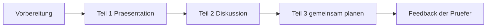

# Phase 2 · Speaking — Opinions & the telc B2 Oral

> **Level:** B2 · **Focus:** expressing & defending opinions, polite (dis)agreement, the telc B2 paired oral exam · **Time:** ~4–5 h
> _After this module you can give a short talk, disagree without offending, and handle all three parts of the telc B2 oral exam._

At B2 nobody cares whether you can name a for-loop in German — they care whether you can **hold your ground in a discussion**. This module turns the opinion vocabulary from [Vocabulary](#/phase-2/vocabulary) and the polite forms from [Grammar](#/phase-2/grammar) into spoken fluency, then walks you through the exact structure of the telc B2 oral exam so it holds no surprises. Practise out loud — reading these phrases silently does nothing.

## Objectives / Lernziele

- Express and **defend an opinion** with reasons and examples.
- **Agree and disagree politely** — the German way, direct but respectful.
- Deliver a short **B2 presentation** (telc Teil 1) with a clear structure.
- Handle a **discussion** (Teil 2) and **plan something together** (Teil 3).
- Use **fillers and repair phrases** to buy thinking time without going silent.

## 1. Express & defend an opinion

The B2 formula is **Opinion → Reason → Example → (mini-)Conclusion**. Never stop at the opinion.

🇩🇪 **Meiner Meinung nach** sollten wir auf Kubernetes umsteigen. **Denn** unsere Last schwankt stark, **zum Beispiel** an Black-Friday-Tagen. **Deshalb** brauchen wir automatische Skalierung.
*In my opinion we should switch to Kubernetes. Because our load fluctuates a lot, for example on Black Friday. That's why we need auto-scaling.*

Notice the Konnektoren doing the work — recall their word-order groups in [Vocabulary](#/phase-2/vocabulary).

## 2. Agreeing & disagreeing politely

German workplace culture values **klare, direkte Kommunikation** (see the culture note in the style guide), but tone still matters. These phrases keep you direct *and* collegial.

| Function | Phrase | English |
|---|---|---|
| agree | **Da stimme ich dir zu.** | I agree with you. |
| agree partly | **Da hast du teilweise recht, aber …** | You're partly right, but … |
| disagree softly | **Das sehe ich anders.** | I see that differently. |
| disagree + reason | **Ich bin nicht ganz überzeugt, weil …** | I'm not fully convinced, because … |
| propose | **Wie wäre es, wenn wir …?** | How about we …? |

🇩🇪 **Das sehe ich anders** — ein Monolith wäre hier einfacher zu betreiben.
*I see that differently — a monolith would be easier to operate here.* (note the Konjunktiv II **wäre**.)

```audio
Da hast du teilweise recht, aber ich bin nicht ganz überzeugt. Ein Monolith wäre am Anfang einfacher. Wie wäre es, wenn wir klein anfangen?
```

## 3. The telc B2 oral exam — the map

The oral exam is **paired** (two candidates) and lasts about **15 minutes** with short preparation time. It has three parts.



## 4. Teil 1 — the short presentation

You get a topic (often a everyday or workplace theme) and present your view for **1–2 minutes**. Use a fixed skeleton so nerves never derail you:

1. **Einleitung:** *"Ich möchte heute über … sprechen."*
2. **Meine Meinung:** *"Meiner Meinung nach …"* + two reasons.
3. **Beispiel:** *"Aus meiner Erfahrung als Entwickler …"*
4. **Schluss:** *"Zusammenfassend würde ich sagen, dass …"*

🇩🇪 Theme *Homeoffice*: **Ich möchte heute über Homeoffice sprechen. Meiner Meinung nach ist es produktiv, weil ich mich besser konzentrieren kann. Aus meiner Erfahrung als Entwickler laufen Code-Reviews auch remote gut. Zusammenfassend würde ich sagen, dass ein hybrides Modell ideal ist.**

## 5. Teil 2 & Teil 3 — discussion and planning

**Teil 2 (Diskussion):** you and your partner exchange views on the theme. Your job is to **react**, not monologue — agree, push back, ask back. Use the phrases from §2 and always add a reason. Keep the ball moving: *"Und wie siehst du das?"*

**Teil 3 (gemeinsam etwas planen):** you jointly plan something concrete — a team event, a training day, a small project. This is **negotiation language**: make proposals, react to your partner's, reach agreement.

| Move | Phrase |
|---|---|
| propose | **Ich schlage vor, dass wir …** |
| react | **Das klingt gut, aber …** |
| compromise | **Können wir uns auf … einigen?** |
| decide | **Gut, dann machen wir das so.** |

**Fluency > perfection.** When you need a second, don't freeze — use a filler: *Also …, Na ja …, Lass mich kurz überlegen …, Wie soll ich sagen …*. If you make an error, repair it out loud: *Ich meine …, genauer gesagt …*. Examiners reward flow and self-correction over robotic accuracy.

---

## 🧾 Zusammenfassung · Summary

B2 speaking is **argue, react, negotiate**. Use the **Opinion → Reason → Example → Conclusion** formula, agree/disagree politely (*Da stimme ich dir zu / Das sehe ich anders*), and rehearse the telc B2 oral as three moves: a **1–2 min presentation** (Teil 1), a **reactive discussion** (Teil 2), and **planning something together** (Teil 3). Fillers and out-loud repair keep you fluent under pressure. Drill dialogues in the [Standup dialogue](#/dialogues/standup) and prep with [Assessment](#/phase-2/assessment).

## 📇 Vokabel-Checkliste · Vocabulary checklist

| Deutsch | Artikel | Plural | English | VI (if hard) |
|---|---|---|---|---|
| Präsentation | die | Präsentationen | presentation | |
| Diskussion | die | Diskussionen | discussion | |
| Vorschlag | der | Vorschläge | proposal / suggestion | đề xuất |
| Erfahrung | die | Erfahrungen | experience | |
| Standpunkt | der | Standpunkte | standpoint / position | lập trường |
| Kompromiss | der | Kompromisse | compromise | |

→ Drill these and more in [Flashcards](#/@flashcards).

## 🗣️ Sprechübung · Speaking practice

1. **Teil 1 solo:** give a 90-second talk on *"Remote-Arbeit für Entwickler"* using the four-step skeleton.
2. **Teil 2 role-play:** disagree politely with the statement *"Microservices sind immer besser als Monolithen."*
3. **Teil 3 role-play:** plan a team learning-day — propose, react, agree. Record and compare with the 🔊 below.

```audio
Ich schlage vor, dass wir einen Lerntag zu Kubernetes machen. Das klingt gut, aber vielleicht ist ein halber Tag genug. Können wir uns auf einen Freitagnachmittag einigen? Gut, dann machen wir das so.
```

## ❓ Mini-Quiz

1. Complete the opinion formula after "Opinion": Reason → ___ → Conclusion.
2. Give a phrase to disagree *politely*.
3. How long is the telc B2 Teil 1 presentation, roughly?
4. Which telc part is "plan something together"?
5. Name two German fillers to buy time.

> **Lösungen:** 1) *Example (Beispiel)* · 2) e.g. *Das sehe ich anders / Ich bin nicht ganz überzeugt, weil …* · 3) about **1–2 minutes** · 4) **Teil 3** · 5) e.g. *Also …, Na ja …*. Full quiz: [Quizzes](#/@quiz).

> 🎙 **Now practise it.** [Phase 2 · Speaking · Übungsteil](#/phase-2/speaking-uebungen) drills
> all three parts of the telc B2 oral, with a **30-phrase Redemittel table** and timed recordings.

## 📝 Hausaufgabe · Homework

- [ ] Record a **2-minute presentation** on a work topic; listen back for filler overuse.
- [ ] Write **8 polite (dis)agreement** lines and say them aloud.
- [ ] Do one **Teil 3 planning** role-play with a tandem partner or self-dialogue.
- [ ] Shadow one **Easy German** street-interview clip for pronunciation.

## 📚 Empfohlene Ressourcen · Recommended resources

- **Exam prep:** telc.net oral model tasks; *So geht's noch besser* (telc trainer).
- **Speaking input:** Easy German (YouTube) — real reactions & discussion phrases.
- **Tandem:** r/German, r/germany, Engineering Kiosk Discord for practice partners.
- **Pronunciation:** forvo.com and YouGlish (German); the 🔊 TTS in this app.
- **Next:** [Phase 2 · Listening](#/phase-2/listening).
