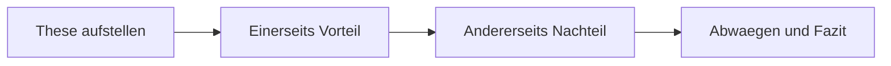

# Phase 2 · Vocabulary — Abstraction & Argument

> **Level:** B2 · **Focus:** abstract vocabulary, opinion & argumentation language, Konnektoren, growing IT lexicon · **Time:** ~4–5 h
> _After this module you can state an opinion, weigh two sides, connect arguments smoothly, and name more of your daily engineering world in German._

At B1 you learned the *things* — der Server, das Ticket, die Datenbank. B2 vocabulary is about the *invisible* layer: abstraction, opinion, and logical glue. You stop saying "Ist gut" and start saying "Meiner Meinung nach ist der Ansatz sinnvoll, weil er die Komplexität reduziert." This module gives you the phrase banks that power [Speaking](#/phase-2/speaking) and [Writing](#/phase-2/writing), plus a strategy to grow vocabulary faster than you forget it.

## Objectives / Lernziele

- Recognise and build **abstract nouns** (die *-ung*, die *-heit/-keit*, das *-en*).
- Deploy an **opinion toolkit** (*meiner Meinung nach, ich bin der Ansicht, dass …*).
- Balance two sides with **einerseits / andererseits** and concession language.
- Use **Konnektoren** (*deshalb, trotzdem, allerdings, dennoch*) with correct word order.
- Grow your **IT vocabulary** for architecture, quality, and incidents.

## 1. Abstract nouns — the B2 register

German builds abstraction with predictable suffixes. Learn the pattern and you can *derive* hundreds of words instead of memorising them one by one (link this to **Nominalisierung** in [Grammar](#/phase-2/grammar)).

| Suffix | Gender | From | Example |
|---|---|---|---|
| **-ung** | die | verb | entwickeln → die **Entwicklung** |
| **-heit / -keit** | die | adjective | sicher → die **Sicherheit**, komplex → die **Komplexität** |
| **-ismus** | der | concept | agil → der **Agilismus** (rare) / der Mechanismus |
| **das + -en** | das | infinitive | testen → das **Testen** |

🇩🇪 Die **Skalierbarkeit** und die **Wartbarkeit** eines Systems sind wichtiger als die **Geschwindigkeit**.
*The scalability and maintainability of a system matter more than the speed.*

## 2. The opinion toolkit

These phrases are the single highest-leverage vocabulary in Phase 2 — you will say them in every discussion and write them in every argumentative text.

| Function | Phrase | English |
|---|---|---|
| state opinion | **Meiner Meinung nach** … | In my opinion … |
| state opinion | **Ich bin der Ansicht, dass** … | I take the view that … |
| soften | **Ich würde sagen, dass** … | I'd say that … |
| give reason | **Das liegt daran, dass** … | That's because … |
| example | **Zum Beispiel** … / **Etwa** … | For example … |
| conclude | **Alles in allem** … | All in all … |

```audio
Meiner Meinung nach sollten wir zuerst refactoren. Das liegt daran, dass die Wartbarkeit sonst leidet. Alles in allem ist das die sicherere Lösung.
```

## 3. Weighing two sides

B2 examiners reward you for showing **both** sides before you decide. Memorise this frame:

🇩🇪 **Einerseits** spart der Monolith Zeit, **andererseits** skaliert er schlecht.
*On one hand the monolith saves time, on the other hand it scales poorly.*

Concession language lets you agree-but: **zwar … aber**, **trotzdem** (nevertheless), **dennoch** (yet), **allerdings** (however, mild). 🇩🇪 Kubernetes ist mächtig; **allerdings** ist die Lernkurve steil.



## 4. Konnektoren & word order

Konnektoren glue arguments — but each type moves the verb differently. Group them by behaviour, not by meaning.

| Type | Examples | Effect on verb |
|---|---|---|
| coordinating | und, aber, oder, denn, sondern | no change (position 0) |
| adverbial | deshalb, trotzdem, dennoch, außerdem | **inversion** (verb stays 2nd, subject moves) |
| subordinating | weil, obwohl, damit, sodass | **verb to the end** (Nebensatz) |

🇩🇪 Der Test war rot, **deshalb konnte** ich nicht deployen. *(adverbial → inversion)*
🇩🇪 Ich konnte nicht deployen, **weil** der Test rot **war**. *(subordinating → verb last — see [Phase 1 · Grammar](#/phase-1/grammar))*

## 5. Growing IT vocabulary

Extend beyond the B1 nouns into the abstract IT layer you meet in reviews and post-mortems. Keep a personal Anki deck and add five words a day.

| Deutsch | English | In a sentence |
|---|---|---|
| die Schnittstelle | interface / API | Die **Schnittstelle** ist gut dokumentiert. |
| die Abhängigkeit | dependency | Wir reduzieren die **Abhängigkeiten**. |
| die Skalierbarkeit | scalability | Die **Skalierbarkeit** ist begrenzt. |
| der Ausfall | outage | Der **Ausfall** dauerte zehn Minuten. |
| die Wartung | maintenance | Die **Wartung** läuft nachts. |
| der Engpass | bottleneck | Die Datenbank ist der **Engpass**. |

---

## 🧾 Zusammenfassung · Summary

B2 vocabulary moves you into **abstraction and argument**. Build abstract nouns with **-ung / -heit / -keit**; state opinions with **meiner Meinung nach / ich bin der Ansicht, dass**; weigh sides with **einerseits … andererseits** and concede with **trotzdem / allerdings**; and connect ideas with **Konnektoren**, remembering that adverbial ones cause inversion while subordinating ones send the verb to the end. Keep growing a personal IT deck. This lexicon is the raw material for [Speaking](#/phase-2/speaking) and [Writing](#/phase-2/writing).

## 📇 Vokabel-Checkliste · Vocabulary checklist

| Deutsch | Artikel | Plural | English | VI (if hard) |
|---|---|---|---|---|
| Ansicht | die | Ansichten | view / opinion | quan điểm |
| Schnittstelle | die | Schnittstellen | interface / API | giao diện |
| Abhängigkeit | die | Abhängigkeiten | dependency | sự phụ thuộc |
| Skalierbarkeit | die | — | scalability | khả năng mở rộng |
| Wartbarkeit | die | — | maintainability | khả năng bảo trì |
| Engpass | der | Engpässe | bottleneck | nút thắt cổ chai |
| Ausfall | der | Ausfälle | outage / failure | sự cố ngừng hoạt động |
| Vorteil | der | Vorteile | advantage | |

→ Drill these and more in [Flashcards](#/@flashcards).

## 🗣️ Sprechübung · Speaking practice

1. State an opinion about microservices using **meiner Meinung nach** + a reason with **weil**.
2. Weigh a tool with **einerseits … andererseits**, then decide.
3. Chain three sentences using **deshalb**, **trotzdem**, and **außerdem** — mind the inversion. Record and compare with the 🔊 below.

```audio
Einerseits sind Microservices flexibel, andererseits erhöhen sie die Komplexität. Meiner Meinung nach lohnt sich der Aufwand trotzdem, weil das Team unabhängig arbeiten kann.
```

## ❓ Mini-Quiz

1. Turn *sicher* into a noun (with article).
2. Which connector needs the verb at the end: *trotzdem* or *obwohl*?
3. Fill: *"Der Test war rot, ___ konnte ich nicht deployen."* (deshalb / weil)
4. Give one German phrase to introduce a personal opinion.
5. Translate *bottleneck* (with article).

> **Lösungen:** 1) *die Sicherheit* · 2) *obwohl* (subordinating) · 3) *deshalb* (adverbial → inversion) · 4) e.g. *Meiner Meinung nach …* · 5) *der Engpass*. Full quiz: [Quizzes](#/@quiz).

> 🏋️ **Now drill it.** [Phase 2 · Vocabulary · Übungsteil](#/phase-2/vocabulary-uebungen)
> trains deriving abstract nouns instead of memorizing them, plus the full opinion toolkit you need
> for the telc oral.

## 📝 Hausaufgabe · Homework

- [ ] Derive **10 abstract nouns** from verbs/adjectives you use at work; note the article.
- [ ] Write a **6-sentence opinion** on a tech choice using the opinion toolkit + einerseits/andererseits.
- [ ] Add **15 IT words** to your personal Anki/[Flashcards](#/@flashcards) deck.
- [ ] Sort **10 Konnektoren** into the three word-order groups.

## 📚 Empfohlene Ressourcen · Recommended resources

- **Dictionaries:** dict.leo.org, DWDS.de, Reverso Context (see phrases in real sentences).
- **SRS:** Anki + the "Master German Vocabulary A1–C1" deck; keep a personal IT deck.
- **Grammar of connectors:** deutsch.lingolia.com (Konnektoren), mein-deutschbuch.de.
- **Textbook:** *Aspekte neu B2* (Klett) — Redemittel boxes for opinions.
- **Next:** [Phase 2 · Speaking](#/phase-2/speaking).
