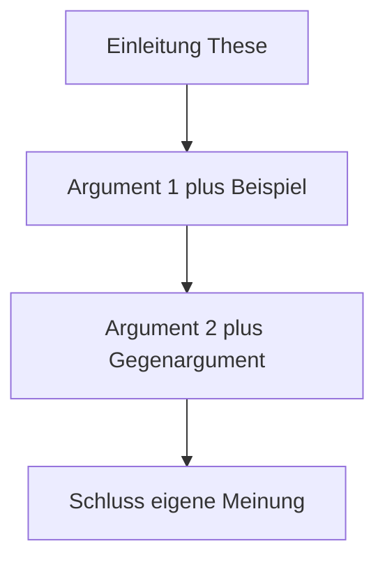

# Phase 2 · Writing — Formal Email, Argument & the telc B2 Letter

> **Level:** B2 · **Focus:** formal email, argumentative/opinion text, the telc B2 letter (~150–200 words) · **Time:** ~4–5 h
> _After this module you can write a correct formal German email, an argued opinion text, and the telc B2 letter within the time limit._

Writing is where all your B2 grammar and vocabulary get *graded on paper*. The good news: German written tasks are **structured and predictable**. Learn three templates — the formal email, the argumentative text, and the telc B2 letter — and you can walk into the exam and out into the workplace with the same toolkit. This module gives you each template, the connectors that hold them together, and a self-check list to catch your habitual mistakes.

## Objectives / Lernziele

- Write a **formal email** with correct Anrede, register (Sie), and Grußformel.
- Structure an **argumentative/opinion text** (Einleitung → Argumente → Schluss).
- Produce the **telc B2 letter** (~150–200 words) inside the time limit.
- Choose the right **written connectors** and keep the register formal.
- Self-check with a **fehler-catching checklist** before you submit.

## 1. The formal email

At work you default to **Sie** with people you don't know (recall the Sie/du note in [Grammar](#/phase-2/grammar)). A formal email has fixed furniture:

| Slot | Formal (Sie) | English |
|---|---|---|
| Betreff | *Frage zur Deployment-Pipeline* | subject line |
| Anrede | *Sehr geehrte Frau Weber,* | Dear Ms Weber, |
| Opener | *ich schreibe Ihnen, weil …* | I'm writing because … |
| Request | *Könnten Sie mir bitte …?* | Could you please …? (Konjunktiv II) |
| Close | *Mit freundlichen Grüßen* | Kind regards |

Note: after the Anrede comma, the next line starts **lowercase**. Use **Konjunktiv II** for polite requests — it is the difference between sounding demanding and sounding professional.

🇩🇪 **Sehr geehrtes Team, ich schreibe Ihnen, weil der Build seit heute Morgen fehlschlägt. Könnten Sie bitte die Logs prüfen? Mit freundlichen Grüßen, …**

```audio
Sehr geehrte Frau Weber, ich schreibe Ihnen, weil ich eine Frage zur Deployment-Pipeline habe. Könnten Sie mir bitte den Zugang zum Staging-System freischalten? Mit freundlichen Grüßen, Huy Cu.
```

## 2. The argumentative / opinion text

This is the exam's flagship and a real skill for RFCs and design docs. Structure it in three blocks:



1. **Einleitung:** name the topic and your thesis — *"In diesem Text geht es um … Ich bin der Ansicht, dass …"*.
2. **Hauptteil:** 2–3 arguments, each with a **reason** and an **example**; concede the other side once (*Zwar …, aber …*).
3. **Schluss:** restate your position — *"Zusammenfassend …"*.

Pull the Redemittel straight from [Vocabulary](#/phase-2/vocabulary): *einerseits/andererseits, meiner Meinung nach, deshalb, trotzdem*.

## 3. The telc B2 letter (~150–200 words)

The telc B2 writing task gives you a short prompt (an email or a forum post) and asks you to respond in **~150–200 words** in about **30 minutes**. You must hit **all the content points** in the prompt — examiners tick them off. Plan for 3–4 minutes, write for ~22, check for ~4.

| Move | Phrase bank |
|---|---|
| refer to prompt | *Ich habe Ihre E-Mail / Ihren Beitrag gelesen …* |
| structure | *Erstens …, zweitens …, außerdem …* |
| give opinion | *Ich finde / Meiner Meinung nach …* |
| suggest | *Ich schlage vor, dass …* |
| close | *Ich freue mich auf Ihre Antwort. Mit freundlichen Grüßen* |

**Hit every content point.** If the prompt has four bullet points, your letter needs four visible answers — missing one costs more than a grammar slip.

## 4. Written connectors & register

Written German is denser than spoken. Prefer subordinating connectors and Passiv (see [Grammar](#/phase-2/grammar)) for a formal tone.

| Function | Written connector | Example |
|---|---|---|
| reason | *da* (formal *weil*) | *…, da die Last steigt.* |
| contrast | *jedoch, allerdings* | *Das ist teuer; jedoch skaliert es gut.* |
| consequence | *folglich, somit* | *…, folglich müssen wir refactoren.* |
| addition | *darüber hinaus* | *Darüber hinaus sinkt die Wartbarkeit.* |

Keep it formal: no *super, mega, ok, cool*; avoid contractions like *gibt's*; write out *zum Beispiel*, not *z. B.*, in exam prose.

## 5. Self-check before you submit

Run this 60-second checklist on every text — these are the errors that cost B2 candidates the most points:

- **Verb position:** position 2 in main clauses, **end** in Nebensätze?
- **Case endings** after prepositions and in adjectives correct?
- **Groß-/Kleinschreibung:** all nouns capitalised?
- **Content points** all covered (for the letter)?
- **Register** consistent Sie, formal connectors, no slang?

---

## 🧾 Zusammenfassung · Summary

B2 writing rests on **three templates**: the **formal email** (Sehr geehrte…, Sie, Konjunktiv II requests, Mit freundlichen Grüßen), the **argumentative text** (Einleitung → Argumente with examples and one concession → Schluss), and the **telc B2 letter** (~150–200 words, ~30 min, hitting **every content point**). Use written connectors (*da, jedoch, folglich, darüber hinaus*), keep the register formal, and run the **5-point self-check** before submitting. These templates double as workplace emails and design-doc prose.

## 📇 Vokabel-Checkliste · Vocabulary checklist

| Deutsch | Artikel | Plural | English | VI (if hard) |
|---|---|---|---|---|
| Anrede | die | Anreden | salutation | lời chào đầu thư |
| Betreff | der | Betreffe | subject line | dòng chủ đề |
| Grußformel | die | Grußformeln | closing formula | lời chào cuối thư |
| Stellungnahme | die | Stellungnahmen | statement of opinion | bài nêu quan điểm |
| Empfänger | der | Empfänger | recipient | người nhận |
| Absender | der | Absender | sender | người gửi |
| Anliegen | das | Anliegen | request / concern | mối quan tâm |

→ Drill these and more in [Flashcards](#/@flashcards).

## 🗣️ Sprechübung · Speaking practice

1. Read your formal email **aloud** — does the Sie-register sound consistent?
2. Say your argumentative thesis and two arguments before you write them.
3. Dictate your telc letter opener from memory. Compare with the 🔊 below.

```audio
Sehr geehrte Damen und Herren, ich habe Ihre E-Mail gelesen und möchte gerne Stellung nehmen. Erstens finde ich den Vorschlag sinnvoll. Zweitens schlage ich vor, dass wir einen Termin vereinbaren. Ich freue mich auf Ihre Antwort.
```

## ❓ Mini-Quiz

1. What case/mood makes a request polite in a formal email?
2. After *"Sehr geehrte Frau Weber,"* the next word is capital or lowercase?
3. How many words should the telc B2 letter be, roughly?
4. Name the three blocks of an argumentative text.
5. Give a formal written synonym for *weil*.

> **Lösungen:** 1) **Konjunktiv II** (*Könnten Sie …?*) · 2) **lowercase** · 3) **~150–200 words** · 4) *Einleitung → Hauptteil (Argumente) → Schluss* · 5) *da*. Full quiz: [Quizzes](#/@quiz).

## 📝 Hausaufgabe · Homework

- [ ] Write **one formal email** to a colleague requesting access, using Konjunktiv II.
- [ ] Write a **~180-word argumentative text**: *"Sollten Teams remote arbeiten?"*.
- [ ] Do **one timed telc B2 letter** (30 min) from a telc.net model prompt; hit all points.
- [ ] Run the **5-point self-check** and mark your top recurring error.

## 📚 Empfohlene Ressourcen · Recommended resources

- **Exam prep:** telc.net model writing tasks; *So geht's noch besser* (telc trainer).
- **Redemittel & structure:** *Aspekte neu B2* (Klett) writing units; mein-deutschbuch.de (Brief schreiben).
- **Correction:** post drafts to r/German for feedback; Reverso Context for phrasing.
- **Grammar backup:** [Phase 2 · Grammar](#/phase-2/grammar) (Passiv, Konjunktiv II).
- **Next:** [Phase 2 · Plan](#/phase-2/plan) and [Phase 2 · Assessment](#/phase-2/assessment).
