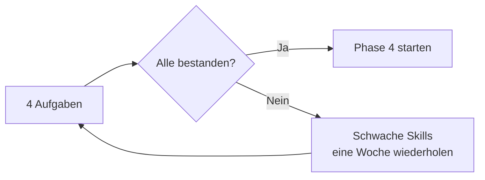

# Phase 3 · Assessment — Monthly Check

> **Level:** B2 · **Focus:** proving you can use technical German across all four skills before Phase 4 · **Time:** ~2 h
> _After this assessment you know objectively whether your technical German is at a solid B2+ — and exactly what to repeat if not._

Phase 3 is only "done" when you can **do the job in German**, not just recognize the rules. This assessment mixes a **self-check rubric** with four **practical tasks** — one per skill — plus a short alignment to the **telc B2 / Goethe C1** exam formats you are ultimately heading toward. Be honest: this check exists to protect Phase 4, not to flatter you.

## Objectives / Lernziele

- Rate yourself against **can-do statements** for the technical register.
- Complete **four practical tasks** (speak, write, read, listen) and self-grade them.
- Decide **pass or iterate** with a clear threshold before moving to Phase 4.

## 1. Self-check rubric — can-do statements

Rate each **1–4** (1 = not yet, 4 = confident). Aim for **≥ 3** on every row.

| Can-do statement | 1–4 |
|---|---|
| I can rewrite a spoken sentence into **Nominalstil / Passiv**. | |
| I can name my whole stack with **article + plural**. | |
| I can **decompose any Kompositum** and give the head article. | |
| I can **explain my architecture** for 2 minutes without freezing. | |
| I can follow a **dev podcast** and summarize it in German. | |
| I can read a **heise/Informatik Aktuell** paragraph and unpack it. | |
| I can write a **commit, ticket, README and ADR** in German. | |

## 2. Practical assessment tasks

Do all four in one sitting; time yourself.

| Skill | Task | Pass bar |
|---|---|---|
| **Sprechen** | 2-min recorded architecture walkthrough of your service. | Clear data flow, structuring connectors, understandable. |
| **Schreiben** | Write a fresh **ADR** for a real decision. | Correct headings, Passiv + Nominalstil, one *sodass/indem*. |
| **Lesen** | Read one heise Developer article; write 5 German summary sentences. | Gist correct; ≥ 3 Komposita decomposed right. |
| **Hören** | One Engineering Kiosk / programmier.bar episode; note 10 mined terms + gist. | Gist correct; terms with article + plural. |



## 3. Exam alignment & threshold

You are working toward **telc B2** (reading + language elements ~90 min, listening ~20 min, writing ~30 min, paired oral ~15 min) and later **Goethe-Zertifikat C1** (Lesen ~70, Hören ~40, Schreiben ~65, Sprechen ~15; each module /100, **≥ 60 to pass**). This month's tasks mirror those formats in miniature.

**Threshold to advance:** all rubric rows **≥ 3** *and* all four practical tasks passed. Otherwise, repeat the weakest one or two skills for a week (see the [Plan](#/phase-3/plan)) and re-test — German firms value **Struktur und Klarheit**, so build the habit now.

```audio
Ich bewerte heute meinen Fortschritt. Ich erkläre meine Architektur, schreibe eine Entscheidung auf und fasse einen Artikel zusammen. Danach weiß ich, ob ich bereit für die nächste Phase bin.
```

---

## 🧾 Zusammenfassung · Summary

This monthly check proves you can **use** technical German, not just recognize it. Score the **7 can-do statements** (target ≥ 3 each) and complete **four practical tasks** — a spoken architecture walkthrough, a written ADR, a read-and-summarize, and a listen-and-mine. The tasks mirror **telc B2 / Goethe C1** formats. Advance to Phase 4 only when **every rubric row ≥ 3 and all four tasks pass**; otherwise repeat the weakest skill for a week and re-test.

## 📇 Vokabel-Checkliste · Vocabulary checklist

| Deutsch | Artikel | Plural | English | VI (if hard) |
|---|---|---|---|---|
| Bewertung | die | Bewertungen | assessment / rating | đánh giá |
| Fortschritt | der | Fortschritte | progress | tiến bộ |
| Schwäche | die | Schwächen | weakness | điểm yếu |
| Prüfung | die | Prüfungen | exam / test | kỳ thi |
| Schwelle | die | Schwellen | threshold | ngưỡng |
| bestehen | — | — | to pass (an exam) | vượt qua |

→ Drill in [Flashcards](#/@flashcards).

## 🗣️ Sprechübung · Speaking practice

1. Do the **2-minute architecture walkthrough** (Task 1) and grade it against the pass bar.
2. State your result aloud: *"Ich habe … bestanden, aber bei … muss ich noch üben."*

```audio
Meine Architektur kann ich schon gut erklären, aber beim Hörverstehen brauche ich noch mehr Übung. Deshalb wiederhole ich diese Woche die Podcast-Aufgaben.
```

## ❓ Mini-Quiz

1. What are the two conditions to advance to Phase 4?
2. Which telc B2 parts does the writing task mirror?
3. What do you do if one skill fails?

> **Lösungen:** 1) **Every rubric row ≥ 3** *and* **all four practical tasks passed**. · 2) The telc B2 **Schreiben** (~30 min) part — and the ADR trains the structured writing the exam rewards. · 3) **Repeat that skill for one week** (see [Plan](#/phase-3/plan)) and **re-test**. More: [Quizzes](#/@quiz).

## 📝 Hausaufgabe · Homework

- [ ] Complete the **7-row rubric** honestly and note every row below 3.
- [ ] Do **all four practical tasks** and self-grade against the pass bars.
- [ ] For each weak skill, schedule a **repeat week** in your [Plan](#/phase-3/plan).
- [ ] If you passed, open [Phase 4 · Overview](#/phase-4/overview) and set your next goal.

## 📚 Empfohlene Ressourcen · Recommended resources

- **Exam formats:** telc (telc.net), Goethe-Institut (goethe.de).
- **Exam prep:** *So geht's noch besser* (telc trainer), *Sicher! B2/C1* (Hueber), Schubert-Verlag.
- **Re-test material:** [Quizzes](#/@quiz) · [Flashcards](#/@flashcards) · [Weekly Checklist](#/@checklist).
- **Next:** [Phase 4 — Professional Communication](#/phase-4/overview).
