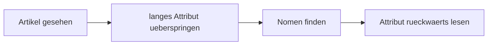

# Phase 3 · Grammar — The Technical & Written Register

> **Level:** B2 → C1 · **Focus:** Nominalstil, Passiv & „man", Funktionsverbgefüge, Partizipialattribute, precise connectors · **Time:** ~4–5 h
> _After this module your German reads like an engineer wrote it — dense, precise, actor-neutral — and you can decode the compressed sentences in real German docs._

Written technical German *feels* different from the spoken B2 you built earlier. Documentation, ADRs and tickets **compress information**: verbs turn into nouns, the actor vanishes, and a whole relative clause gets packed in front of the noun. This module teaches the **five moves** that produce that register. We build on — and do not repeat — the Nebensatz/word-order rules from [Phase 1 · Grammar](#/phase-1/grammar) and the Passiv, Präteritum and relative clauses from [Phase 2 · Grammar](#/phase-2/grammar). Here we put them to work on code and architecture.

## Objectives / Lernziele

- Convert verb-heavy sentences into **Nominalstil** for docs and specs.
- Use **Vorgangspassiv** and **man** to describe processes where the actor is irrelevant.
- Deploy common **Funktionsverbgefüge** (*zur Verfügung stellen, in Betrieb nehmen*).
- Read and build **erweiterte Partizipialattribute** (*die vom Client gesendete Anfrage*).
- Connect ideas precisely with **sodass, indem, während, wohingegen**.

## 1. Nominalstil — verbs become nouns

Technical German prefers **nouns over verbs**. The *Nominalstil* packs an action into a noun phrase; it is what makes documentation short and precise (and, admittedly, sometimes hard to read). The trick: a whole Nebensatz collapses into **preposition + noun**.

| Verbalstil (spoken) | Nominalstil (written/technical) |
|---|---|
| Wir **stellen** den Service **bereit**. | die **Bereitstellung** des Service |
| Nachdem wir die Daten **migriert haben**, … | **nach der Migration** der Daten … |
| Weil das System **ausgefallen ist**, … | **wegen des Systemausfalls** … |
| Wenn man den Dienst **neu startet**, … | **beim Neustart** des Dienstes … |

🇩🇪 **Nach dem Deployment der neuen Version wird ein automatischer Integrationstest ausgeführt.**
*After the new version is deployed, an automatic integration test runs.*

> **Do not over-nominalize speech.** In a Daily you say *"Ich habe deployt"*, **not** *"Die Durchführung des Deployments erfolgte durch mich."* Nominalstil is for the **written** register.

## 2. Passiv & „man" — the actor disappears

In a process description, *who* does it is usually irrelevant. German removes the actor with the **Vorgangspassiv** (`werden` + Partizip II) or the impersonal **man**. (Recall the Passiv mechanics from [Phase 2 · Grammar](#/phase-2/grammar) — here we focus on *when* to reach for it.)

| Aktiv | Passiv | „man" |
|---|---|---|
| Der Server **verarbeitet** die Anfrage. | Die Anfrage **wird verarbeitet**. | **Man verarbeitet** die Anfrage. |

- **Passiv + modal:** the modal takes position 2, `werden` goes last as an infinitive. 🇩🇪 **Die Migration muss vor dem Release durchgeführt werden.**
- **Zustandspassiv** (`sein` + Partizip II) = a resulting *state*, not the process: *Der Dienst **ist** bereit**gestellt*** (it is up) vs. *Der Dienst **wird** bereit**gestellt*** (it is being deployed).
- **„man"** is lighter and common in how-to guides: 🇩🇪 **Zuerst klont man das Repository, dann installiert man die Abhängigkeiten.**

```audio
Die Anfrage wird vom Gateway authentifiziert, an den zuständigen Service weitergeleitet und in der Datenbank gespeichert. Anschließend wird eine Antwort an den Client zurückgegeben.
```

## 3. Funktionsverbgefüge — fixed verb + noun combos

A **Funktionsverbgefüge (FVG)** is a fixed pair: a "light" verb plus a noun that carries the real meaning. They sound formal and are everywhere in technical and business German. Learn them as whole chunks.

| Funktionsverbgefüge | Meaning | Plain verb |
|---|---|---|
| **zur Verfügung stellen** | to provide / make available | bereitstellen |
| **in Betrieb nehmen** | to put into operation / go live | starten |
| **außer Betrieb nehmen** | to take out of service | abschalten |
| **eine Entscheidung treffen** | to make a decision | (sich) entscheiden |
| **in Frage stellen** | to call into question | bezweifeln |
| **zur Anwendung kommen** | to be applied | angewendet werden |
| **Berücksichtigung finden** | to be taken into account | berücksichtigt werden |

🇩🇪 **Das neue Monitoring-Dashboard wird nächste Woche in Betrieb genommen.** *…goes live next week.*
🇩🇪 **Wir stellen dem Frontend-Team eine dokumentierte REST-Schnittstelle zur Verfügung.** *We provide the frontend team a documented REST API.*

## 4. Erweiterte Partizipialattribute — attributes before the noun

German can pack an entire relative clause **in front of** the noun using a participle. It is dense but ubiquitous in docs. Build it by compressing a relative clause:

- die Anfrage, **die vom Client gesendet wurde** → **die vom Client gesendete Anfrage** *(Partizip II, passive/finished)*
- der Dienst, **der gerade läuft** → **der gerade laufende Dienst** *(Partizip I, active/ongoing)*
- die Störung, **die noch zu beheben ist** → **die noch zu behebende Störung** *("zu" + Partizip I = necessity)*

| Type | Formation | Example | Sense |
|---|---|---|---|
| Partizip I | Infinitiv + **d** | der **laufende** Prozess | active / ongoing |
| Partizip II | ge-…-t / ge-…-en | die **deployte** Version | passive / completed |
| „zu" + Partizip I | zu + …**d** | die **zu behebende** Störung | must / to-be-done |

**Reading strategy:** when you see `der/die/das` followed by a long chunk *before* the noun, find the **noun first**, then read the attribute backwards.



🇩🇪 **die vom Load Balancer auf drei Replikate verteilte Last** = *the load distributed by the load balancer across three replicas.* Find *Last* first, then unpack.

## 5. Precise connectors — sodass, indem, während, wohingegen

At B2/C1 you connect ideas more precisely than with *weil / und / aber*. All of the following are **subordinating**, so the verb goes to the end (recall [Phase 1 · Grammar](#/phase-1/grammar)).

| Connector | Function | Example |
|---|---|---|
| **sodass** | consequence / result | Wir cachen die Antworten, **sodass** die Latenz **sinkt**. |
| **indem** | means / method (how?) | Wir erhöhen den Durchsatz, **indem** wir horizontal **skalieren**. |
| **während** | contrast *or* simultaneity | **Während** Redis im RAM **hält**, schreibt Postgres auf die Platte. |
| **wohingegen** | strong contrast | REST ist zustandslos, **wohingegen** eine Session Zustand **hält**. |
| **sofern** | condition (provided that) | **Sofern** die Tests grün **sind**, wird deployt. |

*indem* is the workhorse of ADRs and postmortems — it answers **wie? / wodurch?**

🇩🇪 **Wir reduzieren die Kopplung, indem wir asynchron über RabbitMQ kommunizieren, sodass ein Ausfall des Consumers den Producer nicht blockiert.**
*We reduce coupling by communicating asynchronously via RabbitMQ, so that a consumer outage does not block the producer.*

### Everything in one ADR sentence

> **Zur Reduzierung der Latenz wird ein Redis-Cache eingeführt, wobei häufig gelesene, selten geänderte Daten für 60 Sekunden zwischengespeichert werden, sodass die Datenbank entlastet wird.**

That single sentence uses **Nominalstil** (*zur Reduzierung*), **Passiv** (*wird eingeführt / zwischengespeichert / entlastet*), a **Partizipialattribut** (*häufig gelesene, selten geänderte Daten*) and two **connectors** (*wobei, sodass*). That is the entire module working together — and exactly how you will write in [Phase 3 · Writing](#/phase-3/writing).

---

## 🧾 Zusammenfassung · Summary

Five moves define technical German: **(1) Nominalstil** collapses Nebensätze into *preposition + noun*; **(2) Passiv & „man"** remove the irrelevant actor from process descriptions; **(3) Funktionsverbgefüge** like *zur Verfügung stellen* and *in Betrieb nehmen* give a formal, chunked feel; **(4) erweiterte Partizipialattribute** pack a relative clause in front of the noun — read the noun first, then backwards; **(5) precise connectors** (*sodass, indem, während, wohingegen*) express result, method and contrast, verb-to-the-end. Use these in **writing and reading**; keep speech simpler.

## 📇 Vokabel-Checkliste · Vocabulary checklist

| Deutsch | Artikel | Plural | English | VI (if hard) |
|---|---|---|---|---|
| Nominalstil | der | — | nominal style | |
| Vorgangspassiv | das | — | dynamic/process passive | thể bị động (tiến trình) |
| Funktionsverbgefüge | das | Funktionsverbgefüge | light-verb construction | cụm động từ chức năng |
| Partizipialattribut | das | Partizipialattribute | participial attribute | |
| Konnektor | der | Konnektoren | connector / conjunction | từ nối |
| Bereitstellung | die | Bereitstellungen | provisioning / deployment | |
| Neustart | der | Neustarts | restart | |
| Entlastung | die | Entlastungen | relief / offloading | giảm tải |

→ Drill these in [Flashcards](#/@flashcards).

## 🗣️ Sprechübung · Speaking practice

1. Take three spoken sentences about your service and **nominalize** them (verb → noun phrase).
2. Describe a request lifecycle **in Passiv only**: *"Die Anfrage wird … , dann wird … , schließlich wird …"*.
3. Justify one design decision using **indem** and **sodass** in a single sentence.

```audio
Zur Verbesserung der Ausfallsicherheit wird jeder Dienst in mehreren Replikaten betrieben, sodass ein einzelner Ausfall den Betrieb nicht unterbricht.
```

## ❓ Mini-Quiz

1. Nominalize: *"Nachdem der Service neu gestartet wurde, läuft er wieder."* → *"**___** läuft er wieder."*
2. Turn into Passiv: *"Man testet die Migration vor dem Release."*
3. Compress to a Partizipialattribut: *der Prozess, **der gerade läuft*** → *der **___** Prozess*.
4. Choose the connector: *"Wir senken die Latenz, **___** wir die Antworten cachen."* (indem / sodass?)

> **Lösungen:** 1) *Nach dem **Neustart** des Service …* · 2) *Die Migration **wird** vor dem Release **getestet**.* · 3) *der gerade **laufende** Prozess* (Partizip I). · 4) **indem** (it answers *how?*; *sodass* would express the result). Full drills: [Quizzes](#/@quiz).

> 🏋️ **Jetzt üben.** [Phase 3 · Grammar · Übungsteil](#/phase-3/grammar-uebungen) — 58 Aufgaben
> zu Nominalstil, Passiv, Funktionsverbgefügen, Partizipialattributen und den präzisen Konnektoren.

## 📝 Hausaufgabe · Homework

- [ ] Rewrite **5 spoken sentences** about your project into **Nominalstil**.
- [ ] Describe your CI/CD pipeline in **6 Passiv sentences** (*Der Code wird gebaut, getestet, …*).
- [ ] Find **3 Partizipialattribute** in a real German doc (see [Reading](#/phase-3/reading)) and expand each back into a relative clause.
- [ ] Write **2 sentences** using *sodass* and *indem*, then check the verb is at the end.

## 📚 Empfohlene Ressourcen · Recommended resources

- **Grammar reference:** mein-deutschbuch.de (Nominalisierung, Passiv, Partizipialattribute), deutsch.lingolia.com.
- **Practice:** Schubert-Verlag online B2/C1 exercises (schubert-verlag.de).
- **Textbook:** *Aspekte neu B2/C1* (Klett) — chapters on Passiv and Nominalstil.
- **Apply it:** [Phase 3 · Reading](#/phase-3/reading) to *decode* this register, then [Phase 3 · Writing](#/phase-3/writing) to *produce* it.
