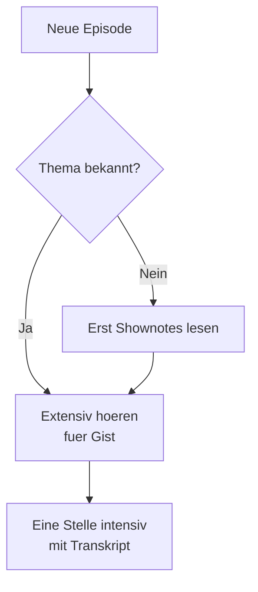

# Phase 3 · Listening — German Dev Podcasts & Talks

> **Level:** B2 → C1 · **Focus:** following fast technical German in podcasts and conference talks · **Time:** ~3 h setup + daily listening
> _After this module you can follow a German dev podcast at near-native speed, catch the technical anchors, and turn passive listening into active vocabulary._

Technical podcasts are the single best input for the German you will hear at work: real developers, real speed, real anglicisms mixed into German grammar. The problem is exactly that speed. This module gives you the **three core podcasts**, a **strategy for fast speech**, and a **routine** that converts listening into words you can actually use. Pair it with the vocabulary you built in [Phase 3 · Vocabulary](#/phase-3/vocabulary) — knowing the terms first is what makes fast audio suddenly click.

## Objectives / Lernziele

- Choose the **right podcast** for your level and goal.
- Use **anglicism anchors** and **prediction** to follow speech faster than you can parse it.
- Run an **intensive + extensive** listening routine that builds vocabulary.
- Recognize the **filler words and discourse markers** that native devs lean on.

## 1. The three core dev podcasts

| Podcast | Focus | Speed / level | How to use it |
|---|---|---|---|
| **programmier.bar** | broad software topics, guest interviews, "News" episodes | fast, B2+ | Start with a topic you know (e.g. Spring, Docker) so context carries you. |
| **Working Draft** | web & engineering practice, weekly | fast, B2+ | Good for shorter, focused discussions; note recurring vocab. |
| **Engineering Kiosk** | backend, architecture, career, ops | fast, B2/C1 | Closest to *your* backend world — architecture, databases, DevOps. |

Also useful for slightly slower, news-style tech German: the **heise show**, the **Golem.de-Podcast**, and the **t3n-Podcast**. Start there on low-energy days.

> **Level ladder:** if these feel too fast at first, warm up with **Deutsche Welle — Langsam gesprochene Nachrichten** and **Top-Thema** (slow, transcripted) to train your ear, then step up to Engineering Kiosk.

## 2. Strategy for fast technical German

You cannot parse every word at podcast speed — and you do not need to. Follow **meaning**, not every syllable.

- **Anglicism anchors.** German devs keep English terms: *Deployment, Container, Pull Request, Latency*. These are islands you already understand — hang the surrounding German on them.
- **Predict, then confirm.** Before a sentence ends, guess where it is going; German's verb-final Nebensatz means the *key verb comes last*, so hold the sentence open (recall [Phase 1 · Grammar](#/phase-1/grammar)).
- **Chunk, don't spell.** Hear *"zur Verfügung stellen"* as one unit, not three words (see the Funktionsverbgefüge in [Grammar](#/phase-3/grammar)).
- **Tolerate 30% loss.** Comprehension is a curve, not a switch. Getting the gist *is* success.



## 3. A weekly listening routine

Split listening into two modes and do both every week:

| Mode | Goal | How |
|---|---|---|
| **Extensiv** | volume, ear training, gist | 20–30 min/day while commuting; no pausing. |
| **Intensiv** | precision, vocabulary | Pick **5 minutes**, replay 3×, then read the shownotes/transcript and mine 10 terms. |

Feed the 10 mined terms straight into [Flashcards](#/@flashcards) with article + plural. **Shadowing** (repeat aloud 1–2 s behind the speaker) turns listening into pronunciation practice and connects it to [Phase 3 · Speaking](#/phase-3/speaking).

```audio
In der heutigen Folge sprechen wir über Microservices und die Frage, wann sich der Umstieg vom Monolithen wirklich lohnt. Unser Gast berichtet aus der Praxis bei einem großen deutschen Online-Händler.
```

## 4. Discourse markers & fillers to recognize

Native speech is full of small words that carry rhythm, not new content. Recognizing them lets your brain skip ahead to the meaning.

| Marker | Rough function | English feel |
|---|---|---|
| **genau** | confirming / "exactly" | right, exactly |
| **quasi / sozusagen** | "so to speak", hedging | kind of, as it were |
| **im Prinzip / im Grunde** | "basically" | basically |
| **halt / eben** | softener (very common) | just / you know |
| **beziehungsweise (bzw.)** | "or rather / respectively" | or rather |
| **das heißt (d. h.)** | "that means / i.e." | i.e. |

🇩🇪 **Wir deployen das quasi automatisch, also im Prinzip läuft die Pipeline durch, und genau, dann ist es live.** — strip the fillers and the message is simply: *the pipeline runs automatically, then it's live.*

---

## 🧾 Zusammenfassung · Summary

Dev podcasts are your best pipeline to workplace German. Pick by level and topic: **Engineering Kiosk** for backend/architecture, **programmier.bar** and **Working Draft** for breadth; warm up with slower DW news if needed. Follow **meaning, not every word**: lean on **anglicism anchors**, **predict** the verb-final ending, and **tolerate loss**. Run **extensive** (daily, no pausing) plus **intensive** (5 min, replay, mine 10 words) listening, and learn to hear **fillers** (*genau, quasi, im Prinzip*) as rhythm you can skip.

## 📇 Vokabel-Checkliste · Vocabulary checklist

| Deutsch | Artikel | Plural | English | VI (if hard) |
|---|---|---|---|---|
| Folge | die | Folgen | episode | tập |
| Moderator / Moderatorin | der / die | Moderatoren / -nen | host | người dẫn |
| Shownotes | die (pl.) | — | show notes | |
| Umstieg | der | Umstiege | switch / migration | sự chuyển đổi |
| Praxis | die | Praxen | practice / real world | thực tế |
| Gehörtraining | das | — | ear training | luyện nghe |

→ Add mined terms to [Flashcards](#/@flashcards).

## 🗣️ Sprechübung · Speaking practice

1. **Shadow** 60 seconds of any dev-podcast clip — repeat 1–2 seconds behind the speaker.
2. **Summarize** one episode in 5 German sentences, out loud, without notes.
3. Read the line below aloud, keeping the fillers natural (*quasi, genau, im Prinzip*).

```audio
Also im Prinzip funktioniert das so: Der Service bekommt die Anfrage, verarbeitet sie quasi sofort, und genau, dann schreibt er das Ergebnis in die Datenbank.
```

## ❓ Mini-Quiz

1. Which podcast is closest to backend/architecture/DevOps?
2. Why are English terms *helpful* rather than distracting when listening?
3. What does *bzw.* signal?

> **Lösungen:** 1) **Engineering Kiosk**. · 2) They are **anchors** you already understand — you attach the surrounding German to them. · 3) *beziehungsweise* = **"or rather / respectively"**, refining or offering an alternative. More: [Quizzes](#/@quiz).

## 📝 Hausaufgabe · Homework

- [ ] Listen **extensively** 20 min/day for a week (Engineering Kiosk or programmier.bar).
- [ ] Do **one intensive** 5-minute deep-listen; mine **10 terms** into [Flashcards](#/@flashcards).
- [ ] **Shadow** one 60-second clip daily; record the last one.
- [ ] Write a **5-sentence German summary** of one full episode.

## 📚 Empfohlene Ressourcen · Recommended resources

- **Dev podcasts:** programmier.bar, Working Draft, Engineering Kiosk.
- **News-style tech:** heise show, Golem.de-Podcast, t3n-Podcast.
- **Warm-up (slow, transcripted):** Deutsche Welle — *Langsam gesprochene Nachrichten*, *Top-Thema*.
- **Next:** turn what you hear into what you read — [Phase 3 · Reading](#/phase-3/reading).
