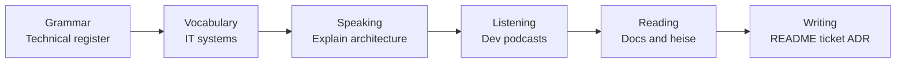

# Phase 3 · Overview — German for Software Engineers

> **Level:** B2 (→ C1) · **Focus:** the technical & written register for coding, architecture and the dev workflow · **Time:** ~4 weeks · ~6–8 h/week
> _After this phase you can explain your architecture in German, follow a dev podcast, read German docs, and write a README, a ticket and an ADR._

Phases 1 and 2 gave you the grammatical backbone and everyday B2 fluency. **Phase 3 is where German turns into a professional tool.** This is the deepest phase of the handbook, because it maps *your* world — Spring Boot, microservices, Docker, Kubernetes, PostgreSQL, CI/CD — onto German as it is actually spoken and written in engineering teams at companies like **SAP, Zalando, N26 or Trade Republic**. You already know how to say "Ich habe den Bug behoben." Now you learn to *design out loud*, *read a dense doc*, and *write an ADR* — in German.

## Objectives / Lernziele

- Switch from spoken B2 into the **technical written register** German engineers use in docs, tickets and specs.
- Command the core **IT vocabulary systems** (Java, Spring, microservices, cloud, Docker, K8s, CI/CD, DB, security, testing).
- **Explain your architecture** and reason at a whiteboard, thinking aloud in German.
- **Follow fast technical German** in dev podcasts and talks.
- **Read dense German documentation** and decode long Komposita.
- Produce real artifacts: a **commit message, a Jira ticket, a README and a short ADR** in German.

## 1. What actually changes at this level — the register shift

Spoken B2 and *Fachsprache* (technical language) describe the same reality very differently. Technical German **compresses**: verbs become nouns (Nominalstil), the actor disappears (Passiv & „man"), and detail is packed in front of the noun. The same fact, two registers:

| Everyday B2 (spoken) | Technical register (Phase 3) |
|---|---|
| Ich habe den Server neu gestartet. | Ein **Neustart** des Servers **wurde durchgeführt**. |
| Wir stellen dem Team die API bereit. | Dem Team **wird** eine dokumentierte API **zur Verfügung gestellt**. |
| Die Anfrage, die der Client geschickt hat … | die **vom Client gesendete** Anfrage … |

You will not talk like a spec in a standup — but you must **read and write** in this register. That shift is the whole point of [Phase 3 · Grammar](#/phase-3/grammar).

## 2. The seven working modules at a glance



Work them roughly in this order, but keep vocabulary and grammar running in parallel every day. The [weekly plan](#/phase-3/plan) turns this into a Mon–Sun schedule, and the [monthly assessment](#/phase-3/assessment) checks you are really at B2+ before Phase 4.

## 3. How to study this phase

Technical vocabulary is huge, so **do not try to memorize it linearly**. Instead:

- **Anchor everything to code you already write.** Describe *your* service in German, not a textbook's.
- **1 system per day** from [Vocabulary](#/phase-3/vocabulary); drill it in [Flashcards](#/@flashcards) (the exhaustive 2000-word deck lives there).
- **Input before output:** read one German doc paragraph and hear five minutes of a dev podcast *before* you try to produce.
- **Ship one artifact per week** (a real README, ticket or ADR) — output forces precision.

```audio
In dieser Phase lerne ich, meine Architektur auf Deutsch zu erklären. Ich beschreibe den Datenfluss vom Client über das API-Gateway bis zur Datenbank und begründe meine Entscheidungen.
```

---

## 🧾 Zusammenfassung · Summary

Phase 3 is the bridge from "I can talk about work" to "I can **work** in German". The core shift is **register**: from spoken B2 to a compressed, written *Fachsprache* built on Nominalstil, Passiv and dense attributes. You will drive seven modules — grammar, vocabulary, speaking, listening, reading, writing — anchored to your own backend stack, ending with one shippable artifact per week. Study by system, input before output, always in the context of code you actually write.

## 📇 Vokabel-Checkliste · Vocabulary checklist

| Deutsch | Artikel | Plural | English | VI (if hard) |
|---|---|---|---|---|
| Fachsprache | die | Fachsprachen | technical language / jargon | ngôn ngữ chuyên ngành |
| Register | das | Register | (language) register | văn phong |
| Nominalstil | der | — | nominal style (verbs as nouns) | |
| Datenfluss | der | Datenflüsse | data flow | |
| Architektur | die | Architekturen | architecture | |
| Fachbegriff | der | Fachbegriffe | technical term | thuật ngữ |

→ Drill the full IT deck in [Flashcards](#/@flashcards).

## 🗣️ Sprechübung · Speaking practice

1. In two sentences, say **what you want to be able to do** after this phase: *"Am Ende dieser Phase kann ich …"*.
2. Describe your current stack in one breath: *"Ich arbeite mit Spring Boot, PostgreSQL und Docker …"*.
3. Read the passage below aloud, then record yourself and compare with the 🔊.

```audio
Mein Ziel ist es, in einem deutschen Team als Softwareentwickler zu arbeiten. Dafür muss ich technische Texte lesen, Meetings verstehen und meine Architektur klar erklären können.
```

## ❓ Mini-Quiz

1. Name the three grammatical "moves" that define the technical register.
2. Where does the exhaustive IT vocabulary deck live in this app?
3. In which order do the seven modules run?

> **Lösungen:** 1) **Nominalstil**, **Passiv/„man"**, and dense **Partizipialattribute** (verbs→nouns, actor removed, detail before the noun). · 2) In [Flashcards](#/@flashcards). · 3) Grammar → Vocabulary → Speaking → Listening → Reading → Writing (with grammar + vocab running daily in parallel).

## 📝 Hausaufgabe · Homework

- [ ] Write **3 sentences** about your goal for this phase using *"Ich kann … / Ich möchte …"*.
- [ ] Rewrite one spoken sentence about your work into the **technical register** (see the table in §1).
- [ ] Skim [Phase 3 · Grammar](#/phase-3/grammar) and [Vocabulary](#/phase-3/vocabulary); bookmark one section to start tomorrow.
- [ ] Set up your personal IT Anki deck (or open [Flashcards](#/@flashcards)) and add your first 10 terms.

## 📚 Empfohlene Ressourcen · Recommended resources

- **This phase, next steps:** [Grammar](#/phase-3/grammar) · [Vocabulary](#/phase-3/vocabulary) · [Plan](#/phase-3/plan).
- **Tech media (reading):** heise Developer (heise.de), Golem.de, t3n.de, Informatik Aktuell, entwickler.de.
- **Tech podcasts (listening):** programmier.bar, Working Draft, Engineering Kiosk.
- **Dictionaries:** DWDS.de, dict.leo.org for confirming article + plural of every new term.
