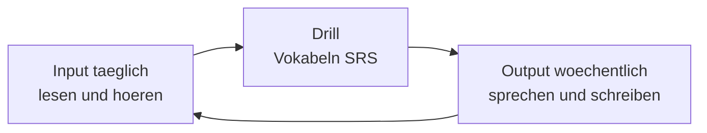

# Phase 3 · Plan — Weekly Milestones & Daily Plan

> **Level:** B2 · **Focus:** turning Phase 3 into a 4-week, Mon–Sun routine · **Time:** ~6–8 h/week
> _After reading this you know exactly what to do each day for four weeks to reach a working technical-German level._

Phase 3 is broad, so it needs a rhythm. The principle: **input daily, output weekly**. Every day you take in German (read + listen) and drill vocabulary; every week you *ship* one real artifact. Grammar and vocabulary run in the background all four weeks; the skills modules rotate into focus one per week.

## Objectives / Lernziele

- Follow **four weekly milestones**, each ending in a concrete deliverable.
- Keep a **sustainable Mon–Sun** routine of ~1 h on weekdays, lighter weekends.
- Balance **input (read/listen), drill (vocab), and output (speak/write)** every week.

## Weekly milestones

| Week | Focus module | Milestone / deliverable |
|---|---|---|
| **1** | [Grammar](#/phase-3/grammar) + [Vocabulary](#/phase-3/vocabulary) | Rewrite 10 spoken sentences into technical register; learn 4 vocab systems. |
| **2** | [Speaking](#/phase-3/speaking) | Record a 2-min architecture walkthrough of your service. |
| **3** | [Listening](#/phase-3/listening) + [Reading](#/phase-3/reading) | Summarize 1 dev-podcast episode + 1 heise article in German. |
| **4** | [Writing](#/phase-3/writing) | Ship a German README **and** a short ADR for a real project. |



## The typical week (Mon–Sun)

Weekdays ~1 h, weekends lighter/consolidation. Adjust to your energy — consistency beats intensity.

| Tag | Plan (~60 min weekdays) |
|---|---|
| **Montag** | 20' grammar (one register move) · 20' vocab system + [Flashcards](#/@flashcards) · 20' read one Golem/t3n article. |
| **Dienstag** | 30' listening (extensive podcast) · 30' speaking (architecture frames aloud). |
| **Mittwoch** | 20' grammar drill · 20' vocab · 20' intensive read (one hard paragraph, mine 10 terms). |
| **Donnerstag** | 30' listening (intensive 5-min + shadowing) · 30' writing (commit messages / ticket). |
| **Freitag** | 40' output: the week's deliverable · 20' review the week's flashcards. |
| **Samstag** | 45' extensive input for fun (one podcast episode **or** one heise article). |
| **Sonntag** | 30' consolidation: [Quizzes](#/@quiz) + tidy your personal IT deck · plan next week. |

```audio
Diese Woche konzentriere ich mich auf das Hörverstehen. Jeden Tag höre ich eine Folge und schreibe danach fünf Sätze auf Deutsch zusammen.
```

---

## 🧾 Zusammenfassung · Summary

Run Phase 3 over **four weeks**, one skill module in focus per week, with grammar and vocabulary always in the background. The rule is **input daily, output weekly**: read and listen every day, drill vocab in SRS, and ship one real artifact each week (architecture recording → summaries → README + ADR). Weekdays ~1 h, weekends lighter. Consistency beats intensity.

## 📇 Vokabel-Checkliste · Vocabulary checklist

| Deutsch | Artikel | Plural | English | VI (if hard) |
|---|---|---|---|---|
| Wochenziel | das | Wochenziele | weekly goal | mục tiêu tuần |
| Gewohnheit | die | Gewohnheiten | habit | thói quen |
| Wiederholung | die | Wiederholungen | review / repetition | ôn tập |
| Zusammenfassung | die | Zusammenfassungen | summary | tóm tắt |
| Fortschritt | der | Fortschritte | progress | tiến bộ |

→ Drill in [Flashcards](#/@flashcards).

## 🗣️ Sprechübung · Speaking practice

1. Say **this week's plan** aloud: *"Diese Woche konzentriere ich mich auf …"*.
2. At week's end, describe your **Fortschritt** in 3 sentences (*Diese Woche habe ich … gelernt*).

```audio
Am Montag mache ich Grammatik und Vokabeln, am Dienstag höre ich einen Podcast, und am Freitag schreibe ich mein Wochenergebnis auf Deutsch.
```

## ❓ Mini-Quiz

1. What is the core rhythm principle of this plan?
2. Which module is the Week 4 focus, and what do you ship?
3. What runs in the background all four weeks?

> **Lösungen:** 1) **Input daily, output weekly.** · 2) **[Writing](#/phase-3/writing)** — you ship a German **README + ADR**. · 3) **Grammar + Vocabulary** (daily). More: [Quizzes](#/@quiz).

## 📝 Hausaufgabe · Homework

- [ ] Copy the **Mon–Sun table** into your calendar as recurring blocks.
- [ ] Pick your **Week 1** four vocab systems now.
- [ ] Decide **which real project** you will write the README + ADR for in Week 4.
- [ ] Set a Sunday reminder to run [Quizzes](#/@quiz) + tidy your deck.

## 📚 Empfohlene Ressourcen · Recommended resources

- **Track it:** the [Weekly Study Checklist](#/@checklist) in this app.
- **Daily input:** Engineering Kiosk / programmier.bar (listen) · heise.de / Golem.de (read).
- **Drill:** [Flashcards](#/@flashcards) + [Quizzes](#/@quiz).
- **Check yourself:** [Phase 3 · Assessment](#/phase-3/assessment) at the end of the four weeks.
