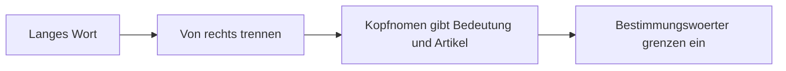

# Phase 3 · Reading — German Technical Documentation

> **Level:** B2 → C1 · **Focus:** reading docs, heise Developer & Informatik Aktuell; decoding dense Komposita and packed sentences · **Time:** ~3–4 h + daily reading
> _After this module you can read a German technical article or doc, break down monster compound nouns, and untangle the packed sentences that scared you off before._

Reading is where the **written register** from [Phase 3 · Grammar](#/phase-3/grammar) meets you head-on: Nominalstil, Passiv and long Partizipialattribute, all built out of **Komposita** — nouns glued from nouns. The good news: German technical prose is *systematic*. Once you know how the machinery works, dense text becomes decodable rather than intimidating. This module gives you the text types, the Komposita algorithm, and a sentence-attack strategy.

## Objectives / Lernziele

- Choose the **right German source** for your level and topic.
- **Decompose Komposita** of any length with a repeatable rule.
- **Attack a packed sentence**: find the main verb, then the frame, then the attributes.
- Read **extensively for gist** and **intensively for precision**.

## 1. German technical text types

| Source | What it is | Register / difficulty |
|---|---|---|
| **heise Developer** (heise.de) | news + deep-dive dev articles | journalistic, B2–C1 |
| **Informatik Aktuell** | practitioner articles, architecture, methods | dense, C1 |
| **Golem.de** | tech + IT news, hands-on | journalistic, B2 |
| **t3n.de** | digital/dev culture, tutorials | accessible, B2 |
| **entwickler.de** | developer magazine articles | technical, B2–C1 |
| **Tool docs (DE)** | official German documentation when available | terse, imperative, B2 |

> **Start where you have context.** Read a German article about a tool you already use (Docker, Spring). Your domain knowledge does half the decoding for you.

## 2. Decoding Komposita — the algorithm

German glues nouns into one long word. The **last** noun is the **head**: it carries the core meaning *and* the article. Everything before it just narrows the meaning. Read **right to left**.



| Kompositum | Split (right→left) | Head → article | English |
|---|---|---|---|
| die **Zugriffs·berechtigung** | Berechtigung ← Zugriff | die Berechtigung | access permission |
| das **Datenbank·verbindungs·problem** | Problem ← Verbindung ← Datenbank | das Problem | database-connection problem |
| die **Benutzer·authentifizierung** | Authentifizierung ← Benutzer | die Authentifizierung | user authentication |
| das **Ausfall·sicherheits·konzept** | Konzept ← Sicherheit ← Ausfall | das Konzept | fault-tolerance concept |

The little **-s-** or **-en-** between parts (*Zugriff**s**konzept*, *Benutzer**n***) is just a *Fugenelement* (a joining letter) — ignore it for meaning. More term-building is in [Phase 3 · Vocabulary](#/phase-3/vocabulary).

## 3. Attacking a packed sentence

German lets a sentence pack a lot in front of the noun and hold the verb to the end. Read it in **three passes**:

1. **Find the finite verb** (position 2 in a main clause; last in a Nebensatz — recall [Phase 1 · Grammar](#/phase-1/grammar)). That gives you the spine: *who does what*.
2. **Handle the Partizipialattribut**: when an article is followed by a long chunk before the noun, jump to the **noun**, then read the attribute backwards (the technique from [Grammar §4](#/phase-3/grammar)).
3. **Unfold Nominalstil**: turn *nach der Bereitstellung* back into *nachdem … bereitgestellt wurde* in your head.

**Worked example** (heise-style prose):

🇩🇪 **Die zur Reduzierung der Latenz eingeführte, im RAM gehaltene Zwischenspeicherung entlastet die Datenbank erheblich.**

- Main verb: **entlastet** (*relieves*). Subject: **die … Zwischenspeicherung** (*the caching*). Object: **die Datenbank**.
- The two attributes before *Zwischenspeicherung*: *zur Reduzierung der Latenz eingeführte* (introduced to reduce latency) and *im RAM gehaltene* (held in RAM).
- Plain reading: *The in-memory caching, introduced to reduce latency, significantly relieves the database.*

```audio
Die vom Team nach langer Diskussion getroffene Entscheidung, auf eine ereignisgesteuerte Architektur umzusteigen, hat die Kopplung zwischen den Diensten deutlich reduziert.
```

## 4. Extensive vs. intensive reading

| Mode | Goal | How |
|---|---|---|
| **Extensiv** | speed, exposure, gist | One heise/Golem article/day; do **not** look up every word. |
| **Intensiv** | grammar + vocabulary | Pick **one hard paragraph**; parse every Kompositum, attribute and Passiv; mine 10 terms into [Flashcards](#/@flashcards). |

Guessing from context is a skill — force yourself to **predict a Kompositum's meaning before splitting it**, then verify on DWDS.de. That habit is what turns C1 reading from slow to fluent.

---

## 🧾 Zusammenfassung · Summary

German technical reading is systematic. Pick sources by level — **t3n/Golem** (B2), **heise Developer/entwickler.de** (B2–C1), **Informatik Aktuell** (C1) — and start where you have domain context. Decode **Komposita right-to-left**: the last noun gives meaning and article; ignore the *Fugen-s*. Attack packed sentences in three passes — **find the verb**, **unpack the Partizipialattribut backwards**, **unfold the Nominalstil**. Read **extensively for gist** daily and **intensively** on one paragraph to mine vocabulary.

## 📇 Vokabel-Checkliste · Vocabulary checklist

| Deutsch | Artikel | Plural | English | VI (if hard) |
|---|---|---|---|---|
| Dokumentation | die | Dokumentationen | documentation | tài liệu |
| Kompositum | das | Komposita | compound noun | từ ghép |
| Fugenelement | das | Fugenelemente | linking letter (in compounds) | chữ nối |
| Kopfnomen | das | Kopfnomen | head noun | danh từ chính |
| Zwischenspeicherung | die | Zwischenspeicherungen | caching | bộ nhớ đệm |
| Absatz | der | Absätze | paragraph | đoạn văn |
| erschließen | — | — | to work out / infer | suy luận nghĩa |

→ Mine article vocabulary into [Flashcards](#/@flashcards).

## 🗣️ Sprechübung · Speaking practice

1. Read the audio sentence below aloud, then **explain it in simpler German** in your own words.
2. Split three Komposita from a real article out loud, naming the **head noun** each time.
3. Summarize one heise/Golem article in **4 German sentences**.

```audio
Die zur Reduzierung der Latenz eingeführte Zwischenspeicherung entlastet die Datenbank und verbessert die Antwortzeiten unter hoher Last erheblich.
```

## ❓ Mini-Quiz

1. In *das Ausfallsicherheitskonzept*, what is the head noun and its article?
2. What is the *Fugen-s* in *Zugriffskonzept* and does it change the meaning?
3. What is the **first** thing to locate when attacking a packed sentence?

> **Lösungen:** 1) Head = **Konzept** → **das** Ausfallsicherheitskonzept. · 2) A **Fugenelement** (joining letter); it carries **no meaning** — ignore it. · 3) The **finite verb** (the spine: who does what). More: [Quizzes](#/@quiz).

## 📝 Hausaufgabe · Homework

- [ ] Read **one German tech article/day** for a week (start with t3n or Golem).
- [ ] Do **one intensive read**: fully parse a hard paragraph from heise Developer.
- [ ] Decompose **10 Komposita** and mark each head noun + article.
- [ ] Rewrite **2 Nominalstil sentences** from an article back into spoken German.

## 📚 Empfohlene Ressourcen · Recommended resources

- **Read:** heise Developer (heise.de), Informatik Aktuell, Golem.de, t3n.de, entwickler.de.
- **Dictionaries:** DWDS.de (great for compounds), Linguee, Reverso Context (terms in context).
- **Grammar backup:** the register rules in [Phase 3 · Grammar](#/phase-3/grammar).
- **Next:** produce this register yourself in [Phase 3 · Writing](#/phase-3/writing).
