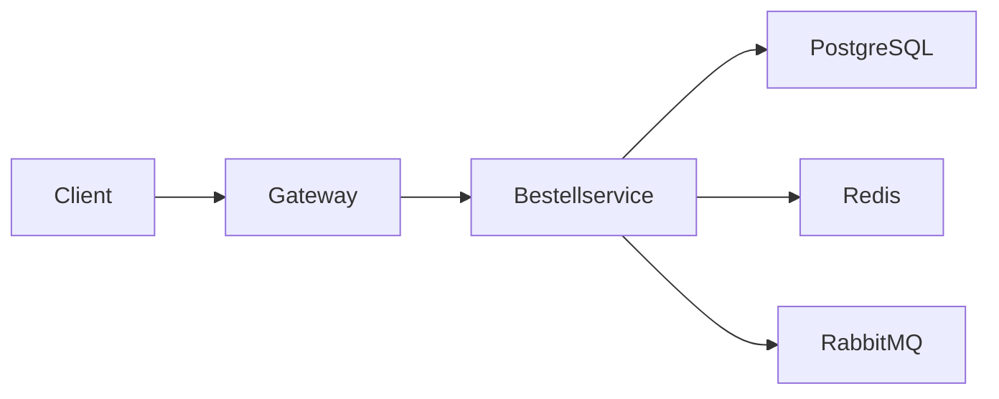

# Phase 3 · Speaking — Explaining Architecture Out Loud

> **Level:** B2 → C1 · **Focus:** describing systems, whiteboard talk, pair programming, thinking aloud · **Time:** ~3–4 h + daily reps
> _After this module you can walk a colleague through your architecture in German, reason at a whiteboard, and think out loud during pairing without freezing._

The hardest German you will speak is not small talk — it is **explaining a system in real time** while also solving the problem. This module gives you **Redemittel** (ready-made sentence frames) for the four situations you actually face: describing an architecture, drawing on a whiteboard, pair programming, and thinking aloud. Frames free your brain to focus on the *content*. Keep speech simpler than the written register from [Phase 3 · Grammar](#/phase-3/grammar) — clarity beats density when you talk.

## Objectives / Lernziele

- Describe a **data flow** end to end using structuring connectors.
- Run a **whiteboard/system-design** explanation with positioning and drawing verbs.
- Handle **pair-programming** talk: proposing, agreeing, disagreeing gently.
- **Think aloud** with hedges and Konjunktiv II so you never go silent.

## 1. Describe your architecture — the data flow

Structure first, detail second. Sequence your explanation with **zuerst / dann / anschließend / schließlich**, and mark cause with **dadurch / deshalb**.

| Function | Redemittel |
|---|---|
| Big picture | **Im Großen und Ganzen** besteht das System aus drei Diensten. |
| Entry point | **Die Anfrage kommt zuerst** beim API-Gateway **an**. |
| Next step | **Anschließend wird sie** an den Bestellservice **weitergeleitet**. |
| Data | **Der Dienst speichert die Daten in** PostgreSQL **und cached** in Redis. |
| Reason | **Der Grund dafür ist**, dass wir die Datenbank entlasten wollen. |
| Result | **Dadurch** sinkt die Latenz. |



🇩🇪 **Der Client schickt die Bestellung an das Gateway. Das Gateway prüft das Token und leitet die Anfrage an den Bestellservice weiter. Der Bestellservice schreibt in PostgreSQL und veröffentlicht ein Ereignis über RabbitMQ.**
*The client sends the order to the gateway; it validates the token and forwards the request to the order service, which writes to PostgreSQL and publishes an event via RabbitMQ.*

```audio
Im Großen und Ganzen besteht unser System aus drei Microservices. Die Anfrage kommt zuerst beim Gateway an, wird dort authentifiziert und anschließend an den zuständigen Dienst weitergeleitet.
```

## 2. Whiteboard & system-design talk

At a whiteboard you narrate what you draw. You need **positioning** and **drawing** verbs.

| Need | Redemittel |
|---|---|
| Start drawing | **Ich zeichne hier oben** den Client. |
| Position | **links** / **rechts** / **darüber** / **darunter** / **in der Mitte** |
| Arrow / link | **Ein Pfeil geht von** A **nach** B. / A **zeigt auf** B. |
| Box it | **Diese drei Dienste fassen wir in einem Cluster zusammen.** |
| Zoom in | **Schauen wir uns den Bestellservice genauer an.** |
| Trade-off | **Der Vorteil ist … , der Nachteil ist …** |
| Hand over | **Wie würdest du das lösen?** |

🇩🇪 **Ich zeichne hier oben den Client, darunter das Gateway. Von hier geht ein Pfeil zur Datenbank. Der Vorteil dieser Lösung ist die einfache Skalierung; der Nachteil ist die höhere Komplexität.**

> **Sie or du?** In an interview or with a customer, default to **Sie**. Inside a dev team almost everyone is **per du** — *"Wir sind hier alle per du"*. See the workplace register notes in the style guide; the [Standup dialogue](#/dialogues/standup) shows the *du* form in action.

## 3. Pair-programming talk

Pairing is a fast exchange of **proposals** and **reactions**. Keep it collaborative — soften with Konjunktiv II (recall [Phase 2 · Grammar](#/phase-2/grammar)).

| Move | Redemittel |
|---|---|
| Propose | **Lass uns hier einen Breakpoint setzen.** / **Wir könnten das in eine Methode auslagern.** |
| Agree | **Genau, das ergibt Sinn.** / **Ja, das würde ich auch so machen.** |
| Disagree gently | **Hm, ich bin mir nicht sicher — wäre es nicht besser, …?** |
| Ask to drive | **Darf ich kurz übernehmen?** / **Kannst du deinen Bildschirm teilen?** |
| Check understanding | **Verstehe ich das richtig, dass …?** |
| Not sure | **Das müsste ich kurz nachschlagen.** |

🇩🇪 **Wäre es nicht besser, die Validierung in einen eigenen Service auszulagern? Dann bleibt der Controller schlank.**

## 4. Thinking aloud — never go silent

German teams value that you **make your reasoning visible**. When you are stuck, keep talking with hedges instead of freezing.

| Function | Redemittel |
|---|---|
| Buy time | **Lass mich kurz überlegen …** / **Moment, ich denke laut …** |
| Hypothesize | **Es könnte sein, dass der Cache veraltet ist.** |
| Weigh options | **Einerseits … , andererseits …** |
| Hedge | **So wie ich das sehe, …** / **Vermutlich liegt es an …** |
| Conclude | **Also, mein Vorschlag wäre, zuerst die Logs zu prüfen.** |

🇩🇪 **Moment, ich denke laut: Der Fehler tritt nur unter Last auf, also könnte es an den Datenbankverbindungen liegen. So wie ich das sehe, sollten wir zuerst den Connection-Pool prüfen.**

---

## 🧾 Zusammenfassung · Summary

Speaking about systems is manageable when you rely on **Redemittel**. Structure a data-flow explanation with *zuerst / anschließend / dadurch*; narrate a whiteboard with **positioning** and **drawing** verbs plus a clear *Vorteil/Nachteil*; pair-program by **proposing** and **reacting** with softened Konjunktiv II; and think aloud with **hedges** so you never go silent. Keep spoken German simpler than the written register — clarity first. Default to **Sie**, switch to **du** inside the team.

## 📇 Vokabel-Checkliste · Vocabulary checklist

| Deutsch | Artikel | Plural | English | VI (if hard) |
|---|---|---|---|---|
| Datenfluss | der | Datenflüsse | data flow | luồng dữ liệu |
| Pfeil | der | Pfeile | arrow | mũi tên |
| Vorteil / Nachteil | der | Vor-/Nachteile | advantage / disadvantage | |
| auslagern | — | — | to extract / outsource | tách ra |
| weiterleiten | — | — | to forward / route | |
| zusammenfassen | — | — | to group / summarize | gộp lại |
| übernehmen | — | — | to take over | |

→ Drill in [Flashcards](#/@flashcards).

## 🗣️ Sprechübung · Speaking practice

1. **90-second architecture talk:** explain your current service end to end, using §1 frames.
2. **Whiteboard drill:** sketch the §2 diagram and narrate every box and arrow aloud.
3. **Disagree kindly:** turn *"Nein, das ist falsch"* into a soft *"Wäre es nicht besser, …?"* three times.

```audio
Schauen wir uns den Bestellservice genauer an. Ich zeichne ihn hier in die Mitte. Von links kommt die Anfrage, nach rechts geht ein Pfeil zur Datenbank. Der Vorteil ist die klare Trennung, der Nachteil ist die zusätzliche Komplexität.
```

## ❓ Mini-Quiz

1. Give a frame to **forward** a request to another service.
2. Soften this: *"Das ist falsch. Mach es anders."*
3. Which connector chain **structures** a data-flow explanation?

> **Lösungen:** 1) e.g. *"Die Anfrage **wird an** den Dienst **weitergeleitet**."* · 2) e.g. *"Hm, **wäre es nicht besser**, es anders zu machen?"* (Konjunktiv II). · 3) **zuerst → dann/anschließend → schließlich**, marking results with *dadurch*. More: [Quizzes](#/@quiz).

## 📝 Hausaufgabe · Homework

- [ ] Record a **2-minute architecture walkthrough** of your project; check structure connectors.
- [ ] Do a **solo whiteboard** of one system and narrate it; film your hand + voice.
- [ ] Learn **8 pair-programming frames** by heart and use them in your next real session.
- [ ] Practice **thinking aloud** on one debugging task entirely in German.

## 📚 Empfohlene Ressourcen · Recommended resources

- **Model spoken tech German:** programmier.bar, Engineering Kiosk (how developers actually phrase things) — see [Listening](#/phase-3/listening).
- **Pronunciation:** forvo.com, YouGlish (German), the 🔊 TTS in this app.
- **In-app practice:** [Standup dialogue](#/dialogues/standup) · [Backend interview Q&A](#/interviews/backend).
- **General fluency:** Easy German (YouTube) for natural connectors and fillers.
