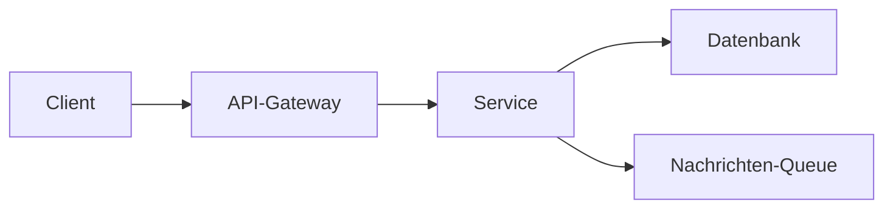

# Phase 3 · Vocabulary — The IT Vocabulary Systems

> **Level:** B2 · **Focus:** the big German IT word-systems — dev, Java, Spring, microservices, cloud, containers, CI/CD, data, security, testing · **Time:** ~5–6 h (spread over the phase)
> _After this module you can name every part of your backend stack in German — with the right article and plural — and read the Komposita that docs are built from._

This module organizes IT German into **systems** you can learn one per day. It is deliberately *broad, not exhaustive*: the full ~2000-word deck (with audio and spaced repetition) lives in [Flashcards](#/@flashcards). Here you get the backbone tables, the gender heuristics, and the Komposita logic that lets you *derive* words you were never taught. Every term uses the canonical glossary from the style guide, so it stays consistent across the whole handbook.

## Objectives / Lernziele

- Name the components of your stack (Java, Spring, DB, Docker, K8s, CI/CD) **with article + plural**.
- Apply **gender heuristics** to guess the article of new IT loanwords.
- **Decompose Komposita** to read words like *Zugriffsberechtigungskonzept* without a dictionary.
- Map each English term to its **German equivalent and its accepted anglicism**.

## Gender heuristics for IT loanwords

German borrows heavily from English tech. Genders are not random — use these defaults, then confirm on DWDS.de:

| Pattern | Gender | Examples |
|---|---|---|
| agent nouns in **-er** | **der** | der Server, der Container, der Cluster, der Broker |
| English **-ing** / gerunds | **das** | das Logging, das Caching, das Deployment |
| **-tion / -ung / -heit / -keit / -ität** | **die** | die Funktion, die Bereitstellung, die Sicherheit, die Latenz |
| short English tech nouns (verb-like) | **der** | der Commit, der Bug, der Request, der Pod |

## 1. Software development & the workflow

| Deutsch | Artikel | Plural | English |
|---|---|---|---|
| Entwickler / Entwicklerin | der / die | Entwickler / -nen | developer |
| Anforderung | die | Anforderungen | requirement |
| Funktion / Feature | die / das | Funktionen / Features | feature |
| Fehler / Bug | der / der | Fehler / Bugs | bug |
| Quellcode | der | Quellcodes | source code |
| Codebasis | die | Codebasen | codebase |
| Abhängigkeit | die | Abhängigkeiten | dependency |
| Bereitstellung / Deployment | die / das | Bereitstellungen / Deployments | deployment |
| Auslieferung / Release | die / das | Auslieferungen / Releases | release |
| Wartung | die | — | maintenance |

## 2. Java & Spring Boot

| Deutsch | Artikel | Plural | English |
|---|---|---|---|
| Klasse | die | Klassen | class |
| Methode | die | Methoden | method |
| Vererbung | die | — | inheritance |
| Schnittstelle | die | Schnittstellen | interface / API |
| Ausnahme | die | Ausnahmen | exception |
| Nebenläufigkeit | die | — | concurrency |
| Anmerkung / Annotation | die | Annotationen | annotation |
| Abhängigkeitsinjektion | die | — | dependency injection |
| Anwendungskontext | der | Anwendungskontexte | application context |
| Steuerungsumkehr | die | — | inversion of control |

> In dev speech you will hear the English words too: *der Service, das Repository, der Controller, die Bean, das Framework*. Know both — say the German in writing, the anglicism in the office.

## 3. Microservices, System Design & API

| Deutsch | Artikel | Plural | English |
|---|---|---|---|
| Microservice / Mikrodienst | der | Microservices / -dienste | microservice |
| verteilte Architektur | die | Architekturen | distributed architecture |
| Skalierbarkeit | die | — | scalability |
| Ausfallsicherheit | die | — | resilience / fault tolerance |
| Lastausgleich / Lastverteilung | der / die | — | load balancing |
| Nachrichtenwarteschlange | die | Warteschlangen | message queue |
| Entkopplung / lose Kopplung | die | — | decoupling / loose coupling |
| Engpass | der | Engpässe | bottleneck |
| Endpunkt | der | Endpunkte | endpoint |
| Nutzlast / Payload | die / der | Nutzlasten | payload |
| Statuscode | der | Statuscodes | status code |



🇩🇪 **Die Anfrage erreicht das API-Gateway, das sie an den zuständigen Dienst weiterleitet.**

## 4. Cloud, Docker & Kubernetes

| Deutsch | Artikel | Plural | English |
|---|---|---|---|
| Container | der | Container | container |
| Abbild / Image | das | Abbilder / Images | image |
| Registrierung / Registry | die | Registries | registry |
| Cluster | der | Cluster | cluster |
| Knoten | der | Knoten | node |
| Pod | der | Pods | pod |
| Replik / Replikat | das | Replikate | replica |
| Orchestrierung | die | — | orchestration |
| automatische Skalierung | die | — | autoscaling |
| Verfügbarkeit | die | — | availability |
| Ausfallzeit | die | Ausfallzeiten | downtime |

## 5. CI/CD, Git & DevOps

| Deutsch | Artikel | Plural | English |
|---|---|---|---|
| kontinuierliche Integration | die | — | continuous integration |
| Pipeline | die | Pipelines | pipeline |
| Build / Erstellung | der / die | Builds | build |
| Artefakt | das | Artefakte | artifact |
| Zurückrollen / Rollback | das | Rollbacks | rollback |
| Übergabe / Commit | die / der | Commits | commit |
| Zweig / Branch | der | Zweige / Branches | branch |
| Zusammenführung / Merge | die / der | Merges | merge |
| Konflikt | der | Konflikte | (merge) conflict |
| Überwachung / Monitoring | die | — | monitoring |
| Bereitschaftsdienst | der | -dienste | on-call |

🇩🇪 **Der Code wird gebaut, getestet und als Artefakt in die Registry hochgeladen.**

## 6. Data, Networking, Linux, Security & Testing

| Deutsch | Artikel | Plural | English |
|---|---|---|---|
| Datenbank | die | Datenbanken | database |
| Abfrage | die | Abfragen | query |
| Datensatz | der | Datensätze | record / row |
| Primärschlüssel / Fremdschlüssel | der | -schlüssel | primary / foreign key |
| Verbindung | die | Verbindungen | connection |
| Latenz | die | Latenzen | latency |
| Berechtigung | die | Berechtigungen | permission |
| Verschlüsselung | die | Verschlüsselungen | encryption |
| Authentifizierung / Autorisierung | die | -en | authentication / authorization |
| Schwachstelle | die | Schwachstellen | vulnerability |
| Komponententest / Unit-Test | der | -tests | unit test |
| Testabdeckung | die | — | test coverage |

```audio
Die Datenbankabfrage wird zwischengespeichert, um die Latenz zu senken und die Verbindungen zur Datenbank zu reduzieren.
```

## Reading Komposita — words made of words

German builds long nouns by gluing shorter ones together. The **last** noun is the head — it sets the meaning **and the article**; everything before it just narrows it. Split from the right:

| Kompositum | = pieces | Head (article) | English |
|---|---|---|---|
| die Datenbank**verbindung** | Daten · bank · Verbindung | die Verbindung | database connection |
| das Zugriffs**konzept** | Zugriff · s · Konzept | das Konzept | access concept |
| die Ausfall**sicherheit** | Ausfall · Sicherheit | die Sicherheit | fault tolerance |

More Komposita strategy — including monster words — is in [Phase 3 · Reading](#/phase-3/reading).

---

## 🧾 Zusammenfassung · Summary

IT German is best learned as **systems**, one per day, anchored to your own stack. Use the **gender heuristics** (-er→der, -ing→das, -ung/-tion→die) to guess articles, then confirm on DWDS. Every English term has a German equivalent *and* an accepted anglicism — write the German, speak either. Long words are just Komposita: **split from the right**, and the last noun gives both the meaning and the article. The exhaustive deck with SRS lives in [Flashcards](#/@flashcards).

## 📇 Vokabel-Checkliste · Vocabulary checklist

| Deutsch | Artikel | Plural | English | VI (if hard) |
|---|---|---|---|---|
| Schnittstelle | die | Schnittstellen | interface / API | giao diện / API |
| Abhängigkeit | die | Abhängigkeiten | dependency | phụ thuộc |
| Warteschlange | die | Warteschlangen | queue | hàng đợi |
| Engpass | der | Engpässe | bottleneck | điểm nghẽn |
| Berechtigung | die | Berechtigungen | permission | quyền |
| Schwachstelle | die | Schwachstellen | vulnerability | lỗ hổng |
| Kompositum | das | Komposita | compound noun | từ ghép |

→ Full ~2000-word IT deck: [Flashcards](#/@flashcards).

## 🗣️ Sprechübung · Speaking practice

1. Name **ten components of your stack** in German with article + plural, out loud.
2. Pick one term per system table and use it in a sentence about *your* project.
3. Read the audio line below, then describe your own request flow using the §3 diagram.

```audio
In unserem System nimmt das API-Gateway die Anfrage entgegen, prüft die Berechtigung und leitet sie an den zuständigen Microservice weiter.
```

## ❓ Mini-Quiz

1. Article + plural of *Schnittstelle*? And of *Container*?
2. Guess the article by heuristic: *Deployment*, *Server*, *Bereitstellung*.
3. Split and give the head article: *die Zugriffsberechtigung*.

> **Lösungen:** 1) **die** Schnittstelle, **die** Schnittstellen · **der** Container, **die** Container. · 2) **das** Deployment (-ment/-ing → das), **der** Server (-er → der), **die** Bereitstellung (-ung → die). · 3) Zugriff + Berechtigung → head *Berechtigung* → **die** Zugriffsberechtigung. More: [Quizzes](#/@quiz).

## 📝 Hausaufgabe · Homework

- [ ] Learn **one system table per day**; add each to [Flashcards](#/@flashcards) with article + plural.
- [ ] Write a **glossary of your own service**: 20 German terms you would actually use.
- [ ] Decompose **5 Komposita** from a real German doc and mark the head noun.
- [ ] Record yourself naming your stack (Sprechübung 1) and check every article.

## 📚 Empfohlene Ressourcen · Recommended resources

- **Confirm articles/plurals:** DWDS.de, dict.leo.org, Duden.de.
- **See terms in context:** heise Developer (heise.de), Golem.de, t3n.de, Informatik Aktuell.
- **SRS:** [Flashcards](#/@flashcards); Anki deck "Master German Vocabulary A1–C1" + a personal IT deck.
- **Next:** put the words to use in [Phase 3 · Speaking](#/phase-3/speaking).
