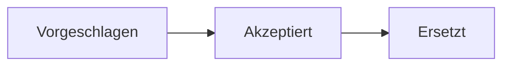

# Phase 3 · Writing — Technical Writing in German

> **Level:** B2 → C1 · **Focus:** commit messages, Jira tickets, README, ADR, inline doc comments · **Time:** ~4 h + one shipped artifact/week
> _After this module you can write the German artifacts a dev job actually requires — a clean commit, a clear ticket, a usable README, and a short ADR — in the correct register._

Writing is where you *produce* the register you learned to read. German engineering writing prizes **Struktur, Präzision und Klarheit** over long prose — the same values German teams prize in people. This module walks the five artifacts you write most, each with a reusable German template. Apply the register tools from [Phase 3 · Grammar](#/phase-3/grammar): Passiv and Nominalstil for neutral, factual text; short main clauses for instructions.

## Objectives / Lernziele

- Write **commit messages** in German using an imperative, conventional style.
- Structure a **Jira/ticket** description with reproduction steps and acceptance criteria.
- Produce a **README** with the standard German section headings.
- Draft a short **ADR** using the register from Grammar.
- Write **inline doc comments** (Javadoc) in clear German.

## 1. Commit messages

Convention: a short **imperative** subject line (≤ 50 chars), a blank line, then a body explaining **why** (in Passiv/Nominalstil). Many teams tag with *feat/fix/refactor* (Conventional Commits).

| Type | German subject (imperative) |
|---|---|
| feat | `feat(cache): Redis-Cache für Produktabfragen einführen` |
| fix | `fix(auth): Ablauf des JWT-Tokens korrekt behandeln` |
| refactor | `refactor(order): Bestellservice in kleinere Klassen aufteilen` |
| docs | `docs(readme): Installationsschritte aktualisieren` |

```
fix(auth): Ablauf des JWT-Tokens korrekt behandeln

Der Token wurde bisher nicht auf Ablauf geprüft, sodass abgelaufene
Tokens akzeptiert wurden. Die Prüfung wird nun im Sicherheitsfilter
durchgeführt und abgelaufene Tokens werden abgewiesen.
```

> Subject uses the **imperative** (*einführen, behandeln, aufteilen*) — think *"Was macht dieser Commit?"* → *"Er soll … "*. The body uses **Passiv** (*wird durchgeführt*) to stay factual and actor-neutral.

## 2. Jira / ticket description

A good ticket is **reproducible**. Use this skeleton (headings in German):

| Feld | Inhalt |
|---|---|
| **Titel** | one factual line: *Login schlägt bei abgelaufenem Token fehl* |
| **Beschreibung** | the problem/goal in 1–3 sentences |
| **Schritte zur Reproduktion** | numbered, deterministic |
| **Erwartetes / Tatsächliches Verhalten** | expected vs. actual |
| **Akzeptanzkriterien** | checkable `- [ ]` conditions |

```
Titel: Login schlägt bei abgelaufenem Token fehl

Beschreibung:
Nach Ablauf des JWT-Tokens erhält der Benutzer einen 500-Fehler statt
einer klaren 401-Antwort.

Schritte zur Reproduktion:
1. Mit gültigem Konto anmelden.
2. 60 Minuten warten, bis das Token abläuft.
3. Eine geschützte Ressource aufrufen.

Erwartetes Verhalten: Antwort 401 mit Hinweis „Token abgelaufen“.
Tatsächliches Verhalten: Antwort 500, Stacktrace im Log.

Akzeptanzkriterien:
- [ ] Abgelaufene Tokens liefern 401.
- [ ] Die Fehlermeldung ist verständlich.
- [ ] Ein Test deckt den Ablauf-Fall ab.
```

## 3. README

A README answers *what, how to run, how to configure*. Standard German headings:

```markdown
# Produkt-Service

Ein Microservice zur Verwaltung von Produktdaten (Spring Boot, PostgreSQL, Redis).

## Voraussetzungen
- Java 21, Maven, Docker

## Installation
...

## Konfiguration
...

## Nutzung
...
```

```bash
# Repository klonen und starten
git clone https://github.com/example/produkt-service.git
cd produkt-service
docker compose up -d
./mvnw spring-boot:run
```

```yaml
# application.yml — Auszug
spring:
  datasource:
    url: jdbc:postgresql://db:5432/produkte
  data:
    redis:
      host: cache
      port: 6379
```

Keep README prose **short and imperative** — *"Starte den Dienst mit …"*, *"Setze die Umgebungsvariable …"* — not Nominalstil. Docs are read while doing.

## 4. Architecture Decision Record (ADR)

An **ADR** records *one* decision and *why*, so future colleagues understand the reasoning. This is where the [Grammar](#/phase-3/grammar) register shines: Nominalstil, Passiv, precise connectors.



```markdown
# ADR 0007: Einführung eines Redis-Cache für Produktabfragen

Status: Akzeptiert · Datum: 2026-07-16

## Kontext
Die Produktdetailseite fragt bei jedem Aufruf die PostgreSQL-Datenbank ab.
Unter Last steigt die Latenz auf über 400 ms, wodurch das SLA von 200 ms
verletzt wird. Die Produktdaten ändern sich nur selten.

## Entscheidung
Es wird ein Redis-Cache eingeführt. Häufig gelesene, selten geänderte Daten
werden für 60 Sekunden zwischengespeichert; bei einer Änderung wird der
betroffene Eintrag invalidiert.

## Konsequenzen
Positiv: Die Datenbank wird entlastet, sodass die Latenz deutlich sinkt.
Negativ: Die Architektur wird komplexer, und es muss mit veralteten Daten
für bis zu 60 Sekunden gerechnet werden.
```

Notice the register: *Einführung* (Nominalstil), *wird eingeführt / zwischengespeichert / entlastet* (Passiv), *sodass / wodurch* (connectors), *häufig gelesene, selten geänderte Daten* (Partizipialattribut).

## 5. Inline doc comments (Javadoc)

Doc comments describe **what** a method does and its contract. Write them in clear German, verb-first.

```java
/**
 * Lädt ein Produkt anhand seiner ID.
 *
 * @param id die eindeutige Produkt-ID, darf nicht null sein
 * @return das gefundene Produkt
 * @throws ProduktNichtGefundenException wenn kein Produkt mit dieser ID existiert
 */
public Produkt findeProdukt(Long id) {
    // ...
}
```

```audio
In der Entscheidung wird festgehalten, warum ein Redis-Cache eingeführt wird, welche Vorteile dadurch entstehen und welche Nachteile in Kauf genommen werden müssen.
```

---

## 🧾 Zusammenfassung · Summary

German technical writing values **Struktur, Präzision, Klarheit**. Match register to purpose: **instructions** (README, commit subject) stay short and **imperative**; **explanations** (commit body, ADR) use **Passiv + Nominalstil**. Commits: imperative subject + why-body. Tickets: reproducible steps + `- [ ]` acceptance criteria. README: *Voraussetzungen / Installation / Konfiguration / Nutzung*. ADR: *Kontext / Entscheidung / Konsequenzen*. Javadoc: verb-first German with `@param/@return/@throws`. Ship **one real artifact per week**.

## 📇 Vokabel-Checkliste · Vocabulary checklist

| Deutsch | Artikel | Plural | English | VI (if hard) |
|---|---|---|---|---|
| Übergabe / Commit | die / der | Commits | commit | |
| Anforderung | die | Anforderungen | requirement | yêu cầu |
| Akzeptanzkriterium | das | Akzeptanzkriterien | acceptance criterion | tiêu chí chấp nhận |
| Voraussetzung | die | Voraussetzungen | prerequisite | điều kiện tiên quyết |
| Entscheidung | die | Entscheidungen | decision | |
| Konsequenz | die | Konsequenzen | consequence | hệ quả |
| Verhalten | das | (Verhalten) | behavior | hành vi |

→ Drill in [Flashcards](#/@flashcards).

## 🗣️ Sprechübung · Speaking practice

1. Read your ADR **Konsequenzen** section aloud; check the Passiv forms.
2. Explain a ticket verbally to a "colleague": *Titel, Problem, Akzeptanzkriterien*.
3. Read the audio line and paraphrase it in one simpler sentence.

```audio
Diese Entscheidung wurde getroffen, um die Latenz zu senken und die Datenbank zu entlasten. Als Nachteil müssen wir kurzzeitig veraltete Daten in Kauf nehmen.
```

## ❓ Mini-Quiz

1. Which mood does a **commit subject** use — imperative or Nominalstil?
2. Name the three core headings of an **ADR**.
3. Which register fits a **README instruction**: short imperative or dense Passiv?

> **Lösungen:** 1) **Imperative** (*einführen, beheben*) — the body may use Passiv. · 2) **Kontext / Entscheidung / Konsequenzen** (plus Status). · 3) **Short imperative** — READMEs are read while doing. More: [Quizzes](#/@quiz).

> 🏋️ **Jetzt schreiben.** [Phase 3 · Writing · Übungsteil](#/phase-3/writing-uebungen) übt die vier
> Textsorten: Commit, Ticket, README und ADR — jede in ihrem eigenen Register.

## 📝 Hausaufgabe · Homework

- [ ] Rewrite **5 of your real commit messages** into German (imperative subject + why-body).
- [ ] Write **one full German ticket** for a real bug, with reproduction steps + acceptance criteria.
- [ ] Draft a **German README** for one of your services (all four headings).
- [ ] Write **one short ADR** using Nominalstil, Passiv and *sodass/wodurch*.

## 📚 Empfohlene Ressourcen · Recommended resources

- **Register backup:** [Phase 3 · Grammar](#/phase-3/grammar) (Passiv, Nominalstil, connectors).
- **Model texts:** German docs and articles on heise Developer (heise.de), entwickler.de, Informatik Aktuell.
- **Word choice:** DWDS.de, Linguee, Reverso Context for phrasing in context.
- **Next:** check your level in the [Phase 3 · Assessment](#/phase-3/assessment).
