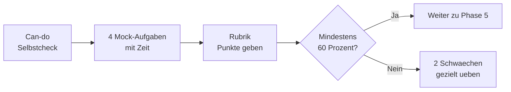

# Phase 4 · Assessment — Monthly Check

> **Level:** B2 → C1 · **Focus:** self-assessment, can-do checklist, and timed mock tasks aligned to telc B2 / Goethe C1 · **Time:** ~2–3 h (timed)
> _This is your end-of-phase checkpoint: prove you can communicate professionally, find the gaps, and decide what to re-drill before Phase 5._

An honest monthly assessment is what turns "I studied" into "I can do it." Phase 4 is measured against the **telc B2** and **Goethe C1** communicative tasks and, more importantly, against the real workplace bar: could you run a standup, write a Protokoll and send a clean email *today*? Do this timed and unaided, then use the rubric to grade yourself — the gaps you find become next month's priorities.

## Objectives / Lernziele

- **Self-rate** each Phase 4 skill against a can-do checklist.
- Complete **four timed mock tasks** mirroring exam formats.
- Score yourself with a simple **rubric** and pick two areas to re-drill.

## How the assessment works



## 1. Can-do self-check

Rate each honestly from 1 (not yet) to 4 (confidently):

| Can-do statement (Kann-Beschreibung) | 1–4 |
|---|---|
| Ich kann berichten, was jemand gesagt hat (indirekte Rede). | |
| Ich kann eine Besprechung eröffnen, moderieren und abschließen. | |
| Ich kann höflich unterbrechen und das Wort übergeben. | |
| Ich kann eine strukturierte Präsentation halten. | |
| Ich kann eine professionelle E-Mail mit korrekter Anrede schreiben. | |
| Ich kann ein Protokoll mit Beschlüssen und Maßnahmen schreiben. | |
| Ich kann ein schnelles Meeting verstehen und die Entscheidung mitschreiben. | |
| Ich kann eine Richtlinie überfliegen und die Pflichten erkennen. | |

Anything scored 1–2 is a **re-drill candidate** — link straight back to that module.

## 2. Timed mock tasks

Do all four in one sitting, with a timer, no dictionary.

| # | Task | Skill | Time |
|---|---|---|---|
| 1 | **Präsentation:** 3 min on "Unser Deployment-Prozess", stated 3-part structure | Speaking | 3 min + 5 prep |
| 2 | **Schreiben:** a formal email requesting a meeting (Anrede, Anliegen, Bitte, Gruß) | Writing | 20 min |
| 3 | **Hören:** listen to a meeting clip, write a mini-Protokoll (Entscheidung + Maßnahme + Frist) | Listening | 10 min |
| 4 | **Lesen:** skim a policy text, extract obligation + deadline + exception | Reading | 15 min |

🇩🇪 **Aufgabe 2 — Bewertung:** korrekte Anrede und Gruß, klares Anliegen im ersten Satz, höfliche Bitte im Konjunktiv II, keine Grammatikfehler in den Hauptsätzen.
*Task 2 scoring: correct salutation and sign-off, clear request up front, polite Konjunktiv II ask, no errors in main clauses.*

## 3. Rubric (score each task /25 → total /100)

| Band | /25 | Descriptor |
|---|---|---|
| C1 | 22–25 | accurate, well-structured, natural register; minor slips only |
| B2 | 18–21 | clear and appropriate; a few errors that don't block meaning |
| B1+ | 12–17 | understandable but register/structure wobbles |
| < B1 | 0–11 | frequent breakdowns; re-drill needed |

**≥60/100 total** mirrors the Goethe C1 pass line and means you're ready for [Phase 5](#/phase-5/overview). Below that, pick your **two lowest tasks** and repeat their module's Hausaufgabe before moving on.

```audio
Zeit für die Selbsteinschätzung. Nehmen Sie sich drei Aufgaben vor: eine Präsentation, eine E-Mail und ein Protokoll. Bewerten Sie sich ehrlich und wählen Sie danach zwei Bereiche zum gezielten Üben aus.
```

## Reflect & plan forward

Write three sentences in German: **was lief gut, was war schwer, was übe ich als Nächstes.** This tiny reflection habit — a Konjunktiv-free, honest retro on yourself — is the same *Rückmeldung* skill from [Phase 4 · Speaking](#/phase-4/speaking), turned inward.

---

## 🧾 Zusammenfassung · Summary

The Phase 4 assessment measures **professional communication** against telc B2 / Goethe C1: a **can-do self-check**, **four timed mock tasks** (presentation, email, listening-Protokoll, policy-reading), and a **/100 rubric**. Score **≥60** to advance to [Phase 5](#/phase-5/overview); otherwise re-drill your two weakest tasks via their module's Hausaufgabe. Close with a three-sentence German self-reflection so the next month starts with clear priorities.

## 📇 Vokabel-Checkliste · Vocabulary checklist

| Deutsch | Artikel | Plural | English | VI (if hard) |
|---|---|---|---|---|
| Selbsteinschätzung | die | -einschätzungen | self-assessment | tự đánh giá |
| Kann-Beschreibung | die | -beschreibungen | can-do statement | |
| Bewertung | die | Bewertungen | evaluation / grading | |
| Punktzahl | die | Punktzahlen | score | |
| Schwäche | die | Schwächen | weakness | điểm yếu |
| Fortschritt | der | Fortschritte | progress | |
| bestehen | — | — | to pass (an exam) | |

→ Drill these and more in [Flashcards](#/@flashcards).

## 🗣️ Sprechübung · Speaking practice

1. Do **mock task 1** (the 3-minute presentation) and record it.
2. State your **can-do scores** aloud: *„Beim Protokoll bin ich sicher, beim Moderieren noch nicht.“*
3. Read the audio below and then give your **three-sentence self-reflection**.

```audio
Insgesamt bin ich zufrieden. Das Schreiben von E-Mails fällt mir jetzt leicht. Schwierig bleibt das schnelle Verstehen in Besprechungen. Als Nächstes übe ich gezielt das Hören mit Podcasts.
```

## ❓ Mini-Quiz

1. What total score signals you're ready for Phase 5?
2. Name the **four** mock-task skills.
3. After scoring, what exactly do you do with your two weakest tasks?

> **Lösungen:** 1) **≥60/100** (the Goethe C1 pass line) · 2) **Speaking, Writing, Listening, Reading** (presentation, email, listening-Protokoll, policy-reading) · 3) repeat their **module's Hausaufgabe** before advancing. Full quiz: [Quizzes](#/@quiz).

## 📝 Hausaufgabe · Homework

- [ ] Complete all **four timed mock tasks** in one unaided sitting.
- [ ] Fill in the **can-do self-check** and total your **rubric score /100**.
- [ ] Write a **three-sentence German self-reflection** (gut / schwer / als Nächstes).
- [ ] Re-do the **Hausaufgabe** of your two lowest-scoring modules.
- [ ] If ≥60, start [Phase 5 · Overview](#/phase-5/overview); log the result in the [checklist](#/@checklist).

## 📚 Empfohlene Ressourcen · Recommended resources

- **Exam practice:** telc.net and goethe.de official sample papers; *So geht's noch besser* (telc trainer).
- **Coursebooks:** *Aspekte neu C1* (Klett), *Sicher! C1* (Hueber) for extra mock material.
- **Self-testing:** the app's [Quizzes](#/@quiz) and [Flashcards](#/@flashcards) for weak-area drilling.
- **Next:** [Phase 5 · Job Interview Preparation](#/phase-5/overview) — put professional communication to work.
